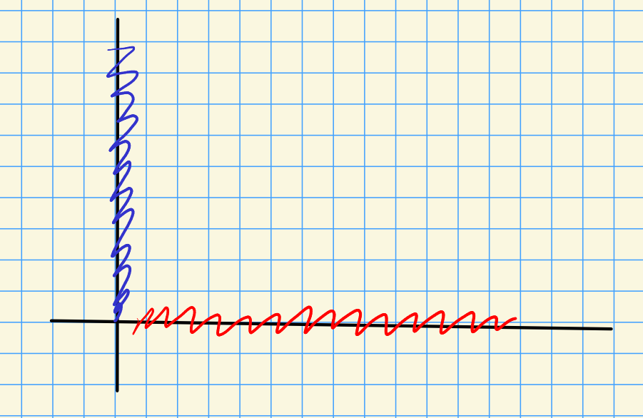

# Wednesday, March 17

## 5.2: Spectral Sequences

:::{.remark}
Recall that we had 

- \( \ts{ E_{p, q}^r  \st r\geq a, p,q\in \ZZ} \) for some $a$.
- \( d_{p, q}^r: E_{p, q}^r \to E_{p-r, q+r-1} \) with $d^2=0$.
- \( E_{p, q}^{r+1} \cong \ker d_{p, q}^r / \im d_{p+r,q-r+1}^r \).

:::

:::{.example title="First quadrant spectral sequences"}
A **first quadrant** (homology) spectral sequence is one with $E_{p, q}^r = 0$ for $p, q<0$.
Note that for a fixed $p, q$, there is an $r \gg 0$ such that the differential entering and leaving $E_{p, q}^r$ will be zero.
The domain will be in quadrant 2 and the codomain in quadrant 4.
In this case $E_{p, q}^r \cong E_{p, q}^{r+1}$ and we call this "stable" module $E_{p, q}^{\infty }$.
Note that $r=r(p, q)$ can generally depend on $p, q$.
:::

:::{.definition title="Bounded"}
We say a spectral sequence is **bounded** if there are only finitely many nonzero terms of total degree $n$.
If so, there exists some uniform $r_0$ such that for $r\geq r_0$, we have $E^{r}_{p, q} \cong E_{p, q}^{r+1} \cong E_{p, q}^{\infty }$.

\todo[inline]{See video for image.}

:::

:::{.remark}
For the rest of this course, we'll restrict our attention to bounded spectral sequences.
:::

:::{.definition title="Convergence of a homology spectral sequences"}
A bounded spectral sequences $E$ **converges** to $H_*$ if we are given

1. A family of objects \( \ts{ H_n }_{n\in \ZZ} \) 

2. For each $n$, a finite (here increasing) filtration
\[
0 = F_s H_n \subseteq \cdots \subseteq F_{p-1} H_n \subseteq F_p H_n \subseteq \cdots \subseteq F_t H_n = H_n
\]
where each $F_i H_n$ is a subobject of $H_n$

3. Isomorphisms 
\[
E_{p, q}^{\infty } \cong { F_p H_{p +q} \over F_{p-1} H_{p+q}}
,\] 
or equivalently 
\[
E_{p, n-p}^{\infty } \cong { F_p H_n \over F_{p-1} H_n}
,\] 
which are the $t-s$ **successive quotients** (or **sections**) of the filtration, which depend on $n$.
  We refer to $t-s$ as the **length** of the filtration

In this case we write
\[
E_{p, q}^a \abuts H_{p+q}
,\]
thinking of $a\to \infty$.
:::

:::{.remark}
We saw a case where the length of the filtration was 2, when we had $2$ columns.
Recall that this only yields information up to extensions, since this only computes quotients.
:::

:::{.remark}
We can form a similar definition for a cohomology spectral sequence.
The conditions change slightly:

(2') We have a *decreasing* filtration
\[
H^n = F^s H^n \supseteq \cdots \supseteq F^p H^n \supseteq F^{p+1} H^n \supseteq \cdots \supseteq F^t H^n = 0
.\]
In this case we have 
\[
E_{\infty }^{p, q} \cong {F^p H^{p+q} \over F^{p+1} H^{p+q} }
.\]
Then each $H_n$ will have a filtration of length $n+1$ by explicitly counting terms on the diagonal, so we obtain
\[
0 = F_{-1} H_n \subset F_0 H_n \subseteq \cdots \subseteq F_{n-1} H_n \subseteq F_n H_n = H_n
.\]

Then 
\[
E_{0, n} &\cong F_0 H_n \injects H_n\\
E_{p, n-p} &\cong {F_p H_n \over F_{p-1} H_n} \\
H_n \surjects E_{n, 0} &\cong {H_n \over F_{n-1} H_n} 
.\]

\todo[inline]{See video for remarks!}

:::

:::{.definition title="Edge maps"}
Assume that $a\geq 1$.
Provided $a\geq 1$, note that $E_{0, n}^r$ is a quotient of $E_{0, n}^a$ for all $r$, since the outgoing (?) differentials are all zero.
Similarly, $E_{n, 0}^r$ is a subobject of $E_{n, 0}^a$ for all $r$.
We thus have maps
\[
E_{0, n}^a \surjects E_{0, n}^{\infty } \injects H_n \\
H_n \surjects E_{n, 0}^{\infty } \injects E_{n, 0}^a
.\]
These compositions are referred to as the **edge maps**.

:::

:::{.remark}
For a first quadrant *cohomological* spectral sequence, the edge maps are 
\[
E_{a}^{n, 0} \surjects E_{\infty }^{n, 0} \injects H^n \\
H^n \surjects E_{\infty }^{0, n} \injects E_{a}^{0, n}
.\]
:::

:::{.definition title="Collapsing of a spectral sequence"}
A spectral sequence $E$ **collapses** at $E^r$ if there is exactly one nonzero row (or column) in $E_{*, *}^r$.
:::

:::{.remark}
This implies that $E_{p, q}^r = E_{p, q}^{\infty }$ at this point.
In this case, we can read off the single nonzero section:

Here we'll have 
\[
E^{\infty }_{p, q} \cong {F_p H_n \over F_{p-1} H_n} \cong {H_n \over 0}\cong H_n
.\]
:::

:::{.remark}
A more common definition of a spectral sequence **collapsing at $r$** is that for all $p, q$, the differentials $d_{p, q}^r = 0$.
Note that this implies stabilization at $r$, but doesn't allow for such a simple statement about the diagonals since they may intersect multiple nonzero objects.
:::

:::{.remark}
Some things we're skipping from the book, around the last part of 5.2:

- Definitions pertaining to unbounded spectral sequences.
- Weak convergence.
- Filtrations that are infinite in on or both filtrations.
- Filtrations that don't limit to a union equal to $H_n$ or intersection to 0.
- Abutment, which is convergence when the filtration is not finite.

We'll skip 5.3 on the Leray spectral sequence and jump to 5.4, constructing a spectral sequence.
:::

