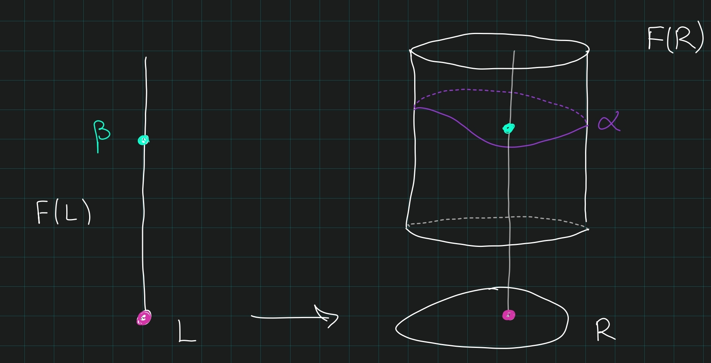

# Danny Krashen, Talk 1 (Monday, July 12)

## Intro

```{=tex}
\todo[inline]{Missed first 12m}
```
**Abstract**:

> A fundamental question in field arithmetic is how one can bound, in various senses, the complexity of algebraic objects such as algebras, quadratic forms, or cohomology classes. This question is intimately related to notions of essential dimension, symbol length, and also to the construction of generic splitting varieties. In these talks, I will describe some of the principal questions of this sort, and various methods by which they have been approached.

**References**:

-   <http://dkrashen.github.io/>

::: {.remark}
Fix a field \( k_0 \in \mathsf{Field} \), we'll consider extensions \( k\in\mathsf{Field}_{/ {k_0}}  \).
:::

## Galois Cohomology

::: {.definition title="Galois Cohomology"}
For \( M\in{\mathsf{G_k}{\hbox{-}}\mathsf{Mod}} \) for \( G_k \) the Galois group of \( k\in\mathsf{Field}_{/ {k_0}}  \), we can take invariants \( M^{G_k} \). The functor \( {-}^{G_k} \) is left-exact, so we define
\[
H^*_{ \operatorname{Gal}} (G_k; {-}) \coloneqq{\mathbb{R}}^*({-})^{G_k}
.\]
:::

::: {.remark}
Note that the tensor product on \( {\mathsf{G_k}{\hbox{-}}\mathsf{Mod}} \) induces a cup product on \( H^*_{ \mathsf{Gal}}  \). An important example of coefficients is \( M = \mu_\ell^{\otimes m} \), where \( \mu_\ell^{\otimes 0} \coloneqq{\mathbb{Z}}/n \). It is known that \( H_{ \mathsf{Gal}} ^*(G_k; \mu^{\otimes 0}) = {\mathbb{Z}}/n \).

We'll define *symbols*
\[
(a_1, \cdots, a_n) \coloneqq(a_1) \smile\cdots \smile(a_n) \in H_{ \mathsf{Gal}} ^*(k, \mu_\ell^{\otimes n})
,\]
which are in fact generators. To remember the \( \ell \), we write \( ({ {a}_1, {a}_2, \cdots, {a}_{n}})_\ell \).
:::

::: {.remark}
Galois cohomology is a special case of étale cohomology, where for \( M\in {\mathsf{G_k}{\hbox{-}}\mathsf{Mod}} \),
\[
H_{ \mathsf{Gal}} ^n(G_k; M) = H_\text{ét}^n(k; M) = H_\text{ét}^n(\operatorname{Spec}k; M)
.\]
Étale cohomology works for schemes other than just \( \operatorname{Spec}k \).
:::

## Milnor K-Theory

::: {.definition title="?"}
Given \( k\in \mathsf{Field} \), define
\[
 {\mathsf{K}}^{\scriptstyle\mathrm{M}} _*(k) \coloneqq\bigoplus _{i=1}^\infty  {\mathsf{K}}^{\scriptstyle\mathrm{M}} _i(k)
\]
where

-   \(  {\mathsf{K}}^{\scriptstyle\mathrm{M}} _0(k) = {\mathbb{Z}} \)
-   \(  {\mathsf{K}}^{\scriptstyle\mathrm{M}} _1(k) = k^m \), written additively as elements \( \left\{{a}\right\} \) on the left-hand side, so \( \left\{{a}\right\} + \left\{{b}\right\} \coloneqq\left\{{ab}\right\} \).
-   It's generated by \(  {\mathsf{K}}^{\scriptstyle\mathrm{M}} _1(k) \), with products written by concatenation:
    \[
    \left\{{a_1, \cdots, a_n}\right\} = \left\{{a_1}\right\} \left\{{a_2}\right\} \cdots \left\{{a_n}\right\}
    .\]
-   The only relations are \( \left\{{a, b}\right\} = 0 \) when \( a+b=1 \), motivated by
    \[
    (a, b)_\ell = 0 \in H^2_{ \operatorname{Gal}} (k; \mu_\ell^{\otimes 2})
    \iff a+b=1
    .\]
-   There is a map
    \[
     {\mathsf{K}}^{\scriptstyle\mathrm{M}} _0(k) &\to H_\text{ét}^*(k; \mu_\ell^{\otimes 0}) \\
    \left\{{a}\right\} &\mapsto (a)
    ,\]
    and the **Norm-Residue isomorphism** (formerly the **Bloch-Kato conjecture**) states that this is an isomorphism after modding out by \( \ell \), i.e. 
    \[
     {\mathsf{K}}^{\scriptstyle\mathrm{M}} _0(k)/\ell \xrightarrow{\sim} H_\text{ét}^*(k; \mu_\ell^{\otimes 0})
    .\]
:::

## Witt Ring

::: {.remark}
Assume \( \operatorname{ch}k \neq 2 \), so there is a correspondence between quadratic forms and symmetric bilinear forms given by polarization:
\[
\text{Quadratic forms} &\rightleftharpoons\text{Symmetric bilinear forms} \\
q_b(x) \coloneqq b(x,x) &\mapsfrom b(x, y) \\
q &\mapsto b_q(x,y) \coloneqq{1\over 2}\qty{q(x+y) - q(x) - q(y)}
.\]
So we'll identify these going forward and write \( q \) for an arbitrary symmetric bilinear form or a quadratic form. We say \( q \) is **nondegenerate** if there is an induced isomorphism:
\[
V &\xrightarrow{\sim} V {}^{ \vee }\\
v &\mapsto b_q(v, {-})
.\]

> Note that a symmetric bilinear form \( q \) on \( V \) can be regarded as an element of \( \operatorname{Sym}^2(V {}^{ \vee }) \).
:::

::: {.definition title="The Witt Ring"}
Let \( {\mathsf{QuadForm}}_{/ {k}}  \) be the category of **quadratic spaces**: pairs \( (V, q) \) with \( V\in \mathsf{VectSp}_{/ {k}}  \) a \( k{\hbox{-}} \)vector space and \( q\in \operatorname{Sym}^2(V {}^{ \vee }) \) representing a quadratic form on \( V \). The **Witt ring** is generated as a group by isomorphism representing a quadratic form on \( V \).
\[
W(k) = \frac{{\mathbb{Z}}\left\langle{\left\{{ [(V, q)] \in {\mathsf{QuadForm}}_{/ {k}}  }\right\} }\right\rangle}{
\left\langle{
q_{\operatorname{hyp}}, (q_1 + q_2) - (q_1 \perp q_2)
}\right\rangle 
}
\in {\mathsf{Ab}}{\mathsf{Grp}}
.\]
where the **hyperbolic form** is defined as \( q_{\operatorname{hyp}}(x, y) = xy \). The ring structure is given by the tensor product (a.k.a. Kronecker product of forms).
:::

::: {.remark}
Noting that Galois cohomology lives mod \( \ell \) for various \( \ell \), here \(  {\mathsf{K}}^{\scriptstyle\mathrm{M}} _0(k) \) lives over \( {\mathbb{Z}} \). So Milnor K-theory relates all of the various mod \( \ell \) Galois cohomologies together.
:::

::: {.definition title="Fundamental ideals and Pfister Forms"}
The **fundamental ideal** \( I(k) {~\trianglelefteq~}W(k) \) is the ideal of even dimensional forms, and set \( I^n(k) \coloneqq(I(k))^n \). There is a map
\[
 {\mathsf{K}}^{\scriptstyle\mathrm{M}} _n(k) &\to I^n(k) / I^{n+1}(k) \\
\left\{{{ {a}_1, {a}_2, \cdots, {a}_{n}}}\right\} &\mapsto \left\langle{\left\langle{ { {a}_1, {a}_2, \cdots, {a}_{n}} }\right\rangle}\right\rangle
,\]
which follows from Gram-Schmidt: any form can be diagonalized \( q \cong \sum a_i x_i^2 \), which we can write as \( \left\langle{{ {a}_1, {a}_2, \cdots, {a}_{n}}}\right\rangle \). We can define the **\( n{\hbox{-}} \)fold Pfister forms**
\[
\left\langle{\left\langle{ a }\right\rangle}\right\rangle &\coloneqq\left\langle{\left\langle{1, -a}\right\rangle}\right\rangle \\
\left\langle{\left\langle{{ {a}_1, {a}_2, \cdots, {a}_{n}}}\right\rangle}\right\rangle &\coloneqq\prod_{i=1}^n \left\langle{\left\langle{ a_i }\right\rangle}\right\rangle
.\]
:::

::: {.remark}
The **Milnor conjecture** (proved by Voevodsky et al) states that the above map is an isomorphism after modding out by 2, so
\[
 {\mathsf{K}}^{\scriptstyle\mathrm{M}} _n(k)/2 \xrightarrow{\sim} I^n(k) / I^{n+1}(k)
.\]
Moreover, the LHS is isomorphic to \( H^n(k, \mu_2) \). There are interesting maps going the other way
\[
I^n(k) \to I^n(k) / I^{n+1}(k) \xrightarrow{\sim} H^n(k, \mu_2)
\]

Upshot: this is surjective -- any mod \( 2 \) cohomology class comes from a quadratic form, and thus we can reason about cohomology by reasoning about quadratic forms.
:::

## Motivic Cohomology

::: {.remark}
**Motivic cohomology** relates the various mod \( \ell \) cohomologies together much like \(  {\mathsf{K}}^{\scriptstyle\mathrm{M}} _* \), but additionally relates different twists. In particular, it relates various \( H^i_\text{ét}(k; \mu_\ell^{\otimes j}) \), where Milnor K-theory interprets this "diagonally" when \( i=j \). This works by constructing **motivic complexes**
\[
{\mathbb{Z}}(m) \in \mathsf{Ch}( \underset{ \mathsf{pre} } {\mathsf{Sh} }{\mathsf{sm}}{\mathsf{Sch}}_{/ {k}} )
,\]
which are complexes of presheaves on smooth \( k{\hbox{-}} \)schemes, usually considered in the Zariski, étale, or Nisnevich topologies.
:::

::: {.remark}
**Zariski hypercohomology** is defined as
\[
{\mathbb{H}}^n(X; {\mathbb{Z}}(m)) = H^{n, m}(X; {\mathbb{Z}}) = H_{ \mathrm{mot}} ^n(X; {\mathbb{Z}}(m)) && \text{for } X\coloneqq\operatorname{Spec}k
.\]
These relate to Galois cohomology in the following ways:

-   There is a quasi-isomorphism \( \mu_\ell^{\otimes m} \xrightarrow{\sim_W} {\mathbb{Z}}/\ell(n) \) in the étale topology.
-   There is an isomorphism \( H^n_{\mathrm{zar}}(k, {\mathbb{Z}}(n)) \xrightarrow{\sim}  {\mathsf{K}}^{\scriptstyle\mathrm{M}} _n(k) \).
-   Bloch-Kato identifies \( H_{\mathrm{zar}}^*(X; {\mathbb{Z}}/\ell(n)) \xrightarrow{\sim} H_\text{ét}^n(X; {\mathbb{Z}}/\ell(n)) \).
:::

## Dimension

::: {.remark}
There are a number of competing notions for the "dimension" of a field.
:::

::: {.definition title="Dimension of a field"}
If \( k \) is finitely generated over either a prime field or an algebraically closed field, we say
\[
\dim(k) 
=
\begin{cases}
[k: k_0]_{\mathrm{tr}}& k_0 = \mkern 1.5mu\overline{\mkern-1.5muk\mkern-1.5mu}\mkern 1.5mu_0  
\\
[k: k_0]_{\mathrm{tr}}+1 & k_0 \text{ finite} \\
[k: k_0]_{\mathrm{tr}}+ 2 & k_0 = {\mathbb{Q}}.
\end{cases}
\]
:::

::: {.definition title="Cohomological dimension"}
We define its **cohomological dimension** \( \operatorname{cohdim}(k) \), which is at most \( n \) if \( H^n(G_k; M) = 0 \) for all \( m>n \) and \( M \) torsion,
\[
\operatorname{cohdim}(k) \coloneqq\min \left\{{n {~\mathrel{\Big|}~}\operatorname{cohdim}(k) \leq n}\right\}
.\]
Equivalently, \( \operatorname{cohdim}(k) = n \iff \) there exists a torsion \( M \) with \( H^n(G_k; M) \neq 0 \) and \( H^m(G_k; M) = 0 \) for all \( m>n \).
:::

::: {.remark}
\( \operatorname{cohdim}(k) = \dim(k) \) if \( k \) is finitely generated or a finite extension of \( k_0 = \mkern 1.5mu\overline{\mkern-1.5muk\mkern-1.5mu}\mkern 1.5mu_0 \), or if \( k \) is finitely generated over \( {\mathbb{Q}} \) and has no real orderings. So if \( k \) has orderings, \( \operatorname{cohdim}(k) = \infty \).
:::

::: {.definition title="Diophantine Dimension"}
We say \( k \) is \( C_n \) if for \( d>0 \) and \( m>d^n \), then every homogeneous polynomials of degree \( d \) in \( m \) variables has a nontrivial root.
\[
\operatorname{ddim}(k) \coloneqq\min\left\{{n{~\mathrel{\Big|}~}k \text{ is } C_n}\right\}
.\]
:::

::: {.example title="?"}
If \( k \) is finitely generated or finite over \( k_0 = \mkern 1.5mu\overline{\mkern-1.5muk\mkern-1.5mu}\mkern 1.5mu_0 \), then
\[
\operatorname{ddim}(k) = \dim(k) = \operatorname{cohdim}(k)
.\]
:::

::: {.definition title="$T_n\\dash$rank"}
We say \( k \) is \( T_n \) if for every \( { {d}_1, {d}_2, \cdots, {d}_{r}} > 0 \) and every system of polynomial equations \( f_1 = \cdots = f_r = 0 \) with \( \deg f_i = d_i \) in \( m \) variables, with \( m > \sum d_i^n \). Then the **\( T_n{\hbox{-}} \)rank** is defined as
\[
T_n{\hbox{-}}\operatorname{rank}(k) \coloneqq\min\left\{{n {~\mathrel{\Big|}~}k \text{ is } T_n}\right\}
.\]
:::

::: {.question}
Note that \( T_n\implies C_n \), so \( T_n{\hbox{-}}\operatorname{rank}(k) \geq \operatorname{ddim}(k) \), when are they equal? This is likely unknown.
:::

::: {.remark}
There is a famous example of a field \( k \) with \( \operatorname{cohdim}(k)=1 \) but \( \operatorname{ddim}(k) = \infty \).
:::

::: {.question}
Is it true that \( \operatorname{ddim}(k) \geq \operatorname{cohdim}(k) \)? Serre showed that this holds when \( \operatorname{cohdim} \) is replaced by \( \operatorname{cohdim}_2 \), the 2-primary part -- does this hold for all \( p \)? These are both open.

Why would one expect this to be true?
:::

::: {.remark}
A recent result: \( \operatorname{cohdim}_p \) grows at most linearly in \( \operatorname{ddim} \), with slope not 1 but rather \( \approx \log_2 p \). These questions say that if an equation has enough variables then there is a solution, but why should this be reflected in cohomology? To show this bound, one would want to show that given some \( \alpha \in H^*(k) \), there exists a polynomial \( f_\alpha \) where if \( f_\alpha \) has a root and \( \alpha = 0 \) in homology. In special cases, we were able to come up with such polynomials. When \( \alpha \) is a symbol, this is closely related to *norm varieties* which have a point iff \( \alpha \) is split. One might optimistically hope these are described as hypersurfaces, from which answers to the above would follow, but they turn out to not have such a concrete realization.
:::

## Structural Problems in Galois Cohomology

::: {.remark}
Here we'll describe the problems we need help with! Perhaps insight from motivic cohomology will lend insight to them. We'll write \( H^i(k) \coloneqq H^i(k; \mu_\ell^{\otimes j}) \).
:::

### Period-Index Problems

::: {.definition title="An extension splitting a cohomology class"}
If \( \alpha \in H^i(k) \), we say \( L_{/ {k}}  \) **splits** \( \alpha \) if
\[
{ \left.{{\alpha}} \right|_{{L}} } = 0\in H^i(L)
.\]
:::

::: {.definition title="?"}
We define the **index**
\[
\mathop{\mathrm{ind}}\alpha \coloneqq\gcd\left\{{[L:k] {~\mathrel{\Big|}~}L_{/ {k}}  \text{ finite and splits } \alpha}\right\}
.\]
and the **period** of \( \alpha \) as its (group-theoretic) order \( H^i(k) \). Note that \( \mathop{\mathrm{per}}\alpha \leq \ell \).
:::

::: {.remark}
One can show that \( \mathop{\mathrm{per}}\alpha \divides \mathop{\mathrm{ind}}\alpha \), and \( \mathop{\mathrm{ind}}\alpha \divides \qty{\mathop{\mathrm{per}}\alpha}^m \) for some \( m \).
:::

::: {.question}
For a fixed \( k \) and \( i, j, \ell \), which is the minimum \( m \) such that
\[
\mathop{\mathrm{ind}}\alpha \divides \qty{\mathop{\mathrm{per}}\alpha}^m
?\]
Alternatively, what is the minimum \( m \) such that \( \mathop{\mathrm{ind}}\alpha \divides \ell^m \)?
:::

::: {.conjecture}
If \( \operatorname{ddim}(k) = n \) (or \( \dim(k) = n \) since \( k \) is finitely generated) with \( \alpha \in H^2(k, \mu_\ell) \), then
\[
\mathop{\mathrm{ind}}\alpha \divides \qty{\mathop{\mathrm{per}}\alpha}^{n-1}
.\]
:::

::: {.remark}
Even in this case, no known bound is known for \( k = {\mathbb{Q}}(t) \), for any choice of \( \ell \). How complicated can the cohomology class be? The rough idea is that for \( H^i(k) \) with \( i \) near \( \dim k \), this should have a small index and if \( i=\dim k \) then \( \mathop{\mathrm{per}}k = \mathop{\mathrm{ind}}k \).
:::

::: {.remark}
We know \( \mathop{\mathrm{per}}= \mathop{\mathrm{ind}} \) for any number field for classes in \( H^2(\operatorname{Spec}k; \mu_N) \), with or without roots.
:::

### Symbol Length Problem

::: {.remark}
We know \( H^n(k, \mu_\ell^{\otimes n}) \) is generated by symbols \( ({ {a}_1, {a}_2, \cdots, {a}_{n}}) \). We can use symbol length to measure complexity, leading to the following:
:::

::: {.question}
Given \( k, n \), what is the minimal number \( m \) such that every \( \alpha\in H^n(k) \) is a sum of no more than \( m \) symbols. I.e. how easy is it to write \( \alpha \)?
:::

::: {.remark}
We'd like a bound in terms of \( \operatorname{ddim}(k) \) and \( \dim(k) \). One can construct fields needing arbitrarily long symbols, but perhaps for finite dimensional fields, one feels there should be a bound. Danny feels that there may not be such a bound once \( n\geq 4 \).
:::

::: {.remark}
What's known: for number fields (or global fields, i.e. a reasonable notion of dimension with \( \dim k = 2 \)) which lie over finitely generated or prime fields and have a primitive \( \ell \)th root of unity, we know every class in \( H^2 \) can be written as exactly one symbol.
:::

::: {.remark}
A result of Malgri (?): assuming we have roots of unity, if \( \ell = p^t \), then for \( H^2 \) one needs at most \( t(p^{\operatorname{ddim}(k)-1}-1) \) symbols. If \( \operatorname{ddim}(k)< \infty \) this yields a bound, and conjecturally this shouldn't depend on ???

For higher degree cohomology, we know almost nothing except for special cases of \( H^4 \) for "3-dimensional" \( p{\hbox{-}} \)adic curves.
:::

::: {.remark}
If one can bound the symbol length, one can uniformly write down a generic element in cohomology as a sum of at most \( n \) symbols. The inability to be able to write down a general form of a cohomology class for a given field is what makes this difficult -- they have "complexity" that isn't necessarily bounded in a known way.
:::

# Danny Krashen, Talk 2 (Tuesday, July 13)

## Setup

::: {.remark}
Fix a \( k_0\in\mathsf{Field} \).

**Outline**

-   Arithmetic problems: consider "complexity" of cohomology or algebraic structures (Witt group, symbol length, index of classes).

    -   Examples were \( \operatorname{ddim}, \operatorname{cohdim} \), the period-index problem, the period-symbol length problem, which we saw last time.

-   Algebraic structure problems: describe (algebraic) structural features of the class of all field extensions \( k \in\mathsf{Field}_{/ {k_0}}  \).

Today we'll describe a way to connect these using a notion of *essential dimension*. Computing this is difficult in general, but finding lower/upper bounds can be tractable. We'll get upper bounds from *canonical dimensions*, and lower bounds from cohomological invariants.
:::

## Symbol Length

::: {.remark}
For a particularly concrete problem, consider
\[
\alpha\in H^2(k; \mu_\ell) \subseteq H^2(k; {\mathbb{G}}_m)[\ell] \coloneqq\mathop{\mathrm{Br}}(k)[\ell]
,\]
i.e. this is a subgroup of the \( \ell{\hbox{-}} \)torsion of the **Brauer group**. Suppose we know
\[
\mathop{\mathrm{ind}}\alpha \coloneqq\gcd\left\{{[L:k] {~\mathrel{\Big|}~}\alpha_L = 0}\right\} = \min\left\{{[L:K] {~\mathrel{\Big|}~}\alpha_L = 0}\right\}
,\]
where the last equality holds in the special case of \( \mathop{\mathrm{Br}}(k) \). If \( k \) contains a primitive \( \ell \)th root of unity, we can identify \( \mu_\ell = {\mathbb{Z}}/\ell = \mu_\ell^{\otimes 2} \), and thus identify
\[
H^2(k; \mu_\ell) = H^2(k; \mu_\ell^{\otimes 2}) = K_2^M(k)/\ell
.\]
So we can write \( \alpha = \alpha_1 + \cdots + \alpha_r \) as a sum of symbols with \( \alpha_i = (b_i, c_i)_\ell \) with \( b_i, c_i\in k^{\times} \).
:::

::: {.question}
How big does \( n \) have to be?
:::

::: {.remark}
It follows from "the literature" (after stringing several results together) that there almost exists an absolute bounds depending only on \( \ell, n \) but not \( k \). However, we do not know what this bound actually is. There are some known cases:

-   \( \ell = n = 2, 3 \): \( r\leq 1 \), so only one symbol is needed.
-   \( \ell = n = 4 \): probably \( r\leq 4 \).
-   \( \ell = 2, n=4 \): \( r\leq 2 \), a classical results on central simple algebras.
-   \( \ell = 2, n=8: r\leq 4 \)
:::

::: {.remark}
It turns out that if \( k \) contains a field \( k_0 \) with \( \operatorname{ddim}k_0 < \infty \), one can produce an explicit bound. Given some \( \alpha \in H^2(k; \mu_\ell) \) we can find some \( k_0 \subseteq L \subseteq k \) with \( L \) finitely generated over \( k_0 \) and \( [L:k_0]_{\mathrm{tr}} \) depending only on the period \( \ell \) and index \( n \), such that \( \alpha \in \operatorname{im}\qty{H^2(L;\mu) \to H^2(k; \mu)} \).

::: {.slogan}
Central simple algebras of a given period and index have finite essential dimension.
:::

An important property is that
\[
\operatorname{ddim}L \leq \operatorname{ddim}k_0 + [L: k_0]_{\mathrm{tr}}
.\]
Recall that we can bound the symbol length in \( H^2(k; \mu_\ell) \) in terms of \( \operatorname{ddim}L \). The idea is that we can bound the transcendence degree in terms of \( \ell, n \). This bound can be made very explicit, although it's not tight: for \( \ell = 2, n=8 \), it's \( 2^{17 + \operatorname{ddim}k_0} -1 \). This is an improvement over \( k_0 = {\mathbb{Q}} \) though, where it's known there's a bound but it can't be written down. The lower bound is *very* low: it is hard to show a symbol can not be written with very few symbols.
:::

## Pfister Forms

::: {.remark}
Recall \( W(k) \), whose elements are isometry classes of nondegenerate quadratic forms with addition given by perpendicular sum and the Kronecker product. There is a hyperbolic form \( xy \), or \( x^2-y^2 \) in \( \operatorname{ch}k \neq 2 \), which we can write as \( \left\langle{1, -1}\right\rangle \), and a fundamental ideal of even-dimensional forms \( \left\langle{1, -a}\right\rangle = \left\langle{\left\langle{ a }\right\rangle}\right\rangle \). We write
\[
\left\langle{\left\langle{ { {a}_1, {a}_2, \cdots, {a}_{n}} }\right\rangle}\right\rangle \coloneqq\left\langle{\left\langle{ a_1 }\right\rangle}\right\rangle \left\langle{\left\langle{ a_2 }\right\rangle}\right\rangle\cdots \left\langle{\left\langle{ a_n }\right\rangle}\right\rangle\in I^n(k)
,\]
which in fact generate \( I^n(k) \).
:::

::: {.question}
Given \( q\in I^n(k) \) of dimension \( d \), we know we can write \( q \sim q_1 \perp \cdots \perp q_r \) where \( q_i \) are \( n{\hbox{-}} \)fold Pfister forms. How many are needed? Is this number even bounded?
:::

::: {.theorem title="(Vishik)"}
If \( d < 2^n + 2^{n-1} \) then \( r \) is bounded by some small number.
:::

::: {.remark}
For \( d\geq 2^n + 2^{n-1} \), it's not so clear, although it is bounded when \( n\geq 3 \). Why is \( n\leq 3 \) easy and \( n\geq 4 \) hard?
:::

::: {.remark}
Consider the following objects:

-   \( H^2(k; \mu) \)
-   \( \mathop{\mathrm{Br}}(k) \)
-   \( W(k) \)
-   \( I^n(k) \)
-   \( q\in I^n(k) \) with \( \dim q = d \)

These can all be viewed as functors \( \mathsf{Field}{_{/ {k_0}} }\to {\mathsf{Set}} \) taking field extensions to sets.
:::

::: {.definition title="Essential dimension of a functor"}
Given a functor \( f \) and \( \alpha \in F(k) \), define
\[
\operatorname{essdim}(\alpha) &= \min\left\{{[L:k_0]_{\mathrm{tr}}{~\mathrel{\Big|}~}\alpha\in \operatorname{im}(F(L) \to F(k)) }\right\}\\
\operatorname{essdim}(F) &= \min\left\{{\operatorname{essdim}(\alpha) {~\mathrel{\Big|}~}\alpha \in F(k) \,\,\forall k_{/ {k_0}} }\right\}
.\]
:::

::: {.definition title="Versal"}
Given a functor \( F: {\mathsf{Alg}}_{_{/ {k_0}} }\to {\mathsf{Set}} \), we say \( \alpha \in F(R) \) is **versal** if for every \( \beta \in F(K) \), for any \( k_{/ {k_0}}  \), there exists a morphism \( R\to k \) such that \( \beta \) is the image of \( \alpha \) under \( F(R)\to F(k) \).


:::

::: {.observation}
If there exists a versal \( \alpha \in F(R) \) then \( \operatorname{krulldim}R \geq \operatorname{essdim}(F) \), so the essential dimension is bounded above by the Krull dimension.
:::

::: {.example title="?"}
Let \( F(k) \) be the set of quadratic forms of dimension \( n \) over \( k \), then \( \operatorname{essdim}F = n \). Every such \( q \) can be diagonalized to yields \( q \simeq \left\langle{{ {a}_1, {a}_2, \cdots, {a}_{n}}}\right\rangle \) which is defined over \( L \coloneqq k_0({ {a}_1, {a}_2, \cdots, {a}_{n}}) \). Alternatively,
\[
q = \left\langle{{ {x}_1, {x}_2, \cdots, {x}_{n}}}\right\rangle / k_0[x_1^{\pm 1}, x_2^{\pm 1}, \cdots, x_n^{\pm 1} ]
\]
is versal. Thus every such quadratic form comes from "specializing".

Considering now the fundamental ideals, the Milnor conjectures yield an isomorphism \( I^n/I^{n+1} \cong H^n(k; \mu_2) \), so there is a SES
\[
1 \to I^{n+1} \to I^n \xrightarrow{e_n} H^n(k; \mu_2) \to 1
.\]
Thus a quadratic form \( q \) of dimension \( d \) in \( I^{n+1} \) is equivalent to \( q\in I^{n} \) such that \( e_n(q) = 0 \).
:::

## Canonical Dimension

::: {.definition title="Canonical Dimension"}
This is a generalization of \( \operatorname{essdim} \). Letting \( k_{/ {k_0}}  \), suppose \( F: \mathsf{Field}_{/ {k}}  \to {\mathsf{Set}}_+ \) is a functor now from extensions of \( k \) (not \( k_0 \)) into pointed sets. For \( \alpha\in F(k) \), define a new functor
\[
\check{F}_\alpha(L) \coloneqq
\begin{cases}
\emptyset & \alpha_L \neq {\operatorname{pt}}
\\
\left\{{{\operatorname{pt}}}\right\}  & \alpha_L = {\operatorname{pt}},
\end{cases}
\]
and define the **canonical dimension**
\[
\operatorname{candim}(\alpha) = \operatorname{essdim}(\check{F}(\alpha))
.\]
:::

::: {.remark}
This measures how many parameters are needed to trivialize/split \( \alpha \). To have \( \operatorname{candim}(\alpha) \leq r \) means that if \( \alpha = {\operatorname{pt}} \) means the following: if \( \alpha_L = {\operatorname{pt}} \) then there exists an \( E \) with \( k \subseteq E \subseteq L \) with \( [E:k]_{\mathrm{tr}}\leq r \) such that \( \alpha_E = {\operatorname{pt}} \).
:::

::: {.definition title="Generic splitting scheme"}
Given \( F \) as above and \( \alpha\in F(k) \), we say an \( X\in {\mathsf{Sch}}_{/k} \) is a **generic splitting scheme** for \( \alpha \) if
\[
\alpha_L = 0 \iff X(L) \neq \emptyset
.\]
:::

::: {.remark}
So this encodes triviality of \( \alpha \) into polynomial equations.
:::

::: {.example title="?"}
If \( X \) is a generic splitting scheme for \( \alpha \) finite type over \( L \) implies \( \operatorname{candim}(\alpha) \leq \dim X \).
:::

## Splitting Schemes

::: {.question}
Does there exists a finite type generic splitting scheme for cohomology classes in \( H^i(k; \mu_\ell^{\otimes j}) \)?
:::

::: {.remark}
We do know this in special cases:

-   \( i=1 \): Yes, these are etale algebras, so finite schemes over \( k \).
-   \( i=2 \): Yes, Danny shows these exist for all twists.
    -   \( j=1 \): Classical, these are Severi-Brauer varieties.
-   For symbols, \( i=3,j=2,\ell \) a prime: see Merkurjev-Suslin
-   For symbols, \( i=4, j=3, \ell =3 \): see Albert algebras
-   For symbols, \( \ell \) prime: this can be done up to prime-to-\( \ell \) extensions, see [Rost's "Norm Varieties"](https://arxiv.org/abs/math/0304208). Related to Bloch-Kato conjecture.
-   For symbols, \( \ell=2 \): see Pfister quadrics.
:::

::: {.remark}
Upshot: if there exists generic splitting schemes for classes in \( H^i(k; \mu_2) \) for \( i\geq 3 \), one could bound Pfister numbers and thus \( \operatorname{essdim} \). Write \( {\mathcal{I}}_d^n(k) \) to be the set of quadratic forms of dimension \( d \) in \( I^n \), then \( \operatorname{essdim}({\mathcal{I}}_d^n) < \infty \) would imply that if \( q\in {\mathcal{I}}_d^n(k) \) for \( k\supseteq k_0 \) then \( q \) would be defined over some \( L_{/ {k_0}}  \) with \( [L: k_0]_{\mathrm{tr}}< \infty \).

If we knew that \( \operatorname{ddim}k_0 < \infty \), e.g. if \( k_0 \) contains a finite field, this yields a bound on \( \operatorname{ddim}L \) and thus on \( \operatorname{cohdim}L \). If there is a versal element in \( \alpha\in {\mathcal{I}}^n_d \), then \( \alpha \) needs some finite number \( m \) of Pfister forms to be written. Everything else is a specialization of \( \alpha \), so the length \( m \) will almost give an upper bound.
:::

::: {.warnings}
This may seem like a correct argument, but it is not! A problem arises where you may have denominators -- specialization can get worse, but only a finite number of times, which is how the actual argument goes.
:::

::: {.remark}
If you knew the essential dimensions were finite with some given bound, and some general period-index conjecture were known, these would give bounds on symbol length in \( H^i(L; \mu_2) \). There's an argument pushing things into higher powers of the fundamental ideal, thus higher degree cohomology, which disappear at some point and yield a bound. Motives enter the picture in terms of the tools used to attack these problems.
:::
