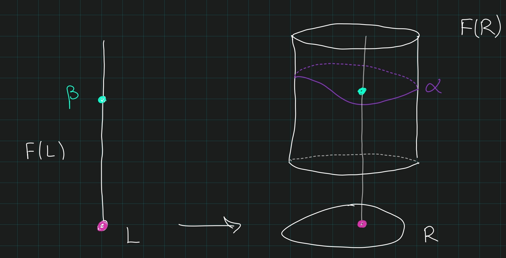

# Danny Krashen, Talk 2 (Tuesday, July 13)

## Setup

:::{.remark}
Fix a $k_0\in\Field$.

**Outline**

- Arithmetic problems: consider "complexity" of cohomology or algebraic structures (Witt group, symbol length, index of classes).
  
  - Examples were $\ddim, \cohdim$, the period-index problem, the period-symbol length problem, which we saw last time.

- Algebraic structure problems: describe (algebraic) structural features of the class of all field extensions $k \in\Field\slice{k_0}$.

Today we'll describe a way to connect these using a notion of *essential dimension*.
Computing this is difficult in general, but finding lower/upper bounds can be tractable.
We'll get upper bounds from *canonical dimensions*, and lower bounds from cohomological invariants.
:::

## Symbol Length

:::{.remark}
For a particularly concrete problem, consider 
\[
\alpha\in H^2(k; \mu_\ell) \subseteq H^2(k; \GG_m)[\ell] \da \Br(k)[\ell]
,\]
i.e. this is a subgroup of the $\ell\dash$torsion of the **Brauer group**.
Suppose we know 
\[
\ind \alpha \da \gcd\ts{[L:k] \st \alpha_L = 0} = \min\ts{[L:K] \st \alpha_L = 0}
,\]
where the last equality holds in the special case of $\Br(k)$.
If $k$ contains a primitive $\ell$th root of unity, we can identify $\mu_\ell = \ZZ/\ell = \mu_\ell^{\tensor 2}$, and thus identify
\[
H^2(k; \mu_\ell) = H^2(k; \mu_\ell^{\tensor 2}) = K_2^M(k)/\ell
.\]
So we can write $\alpha = \alpha_1 + \cdots + \alpha_r$ as a sum of symbols with $\alpha_i = (b_i, c_i)_\ell$ with $b_i, c_i\in k\units$.
:::

:::{.question}
How big does $n$ have to be?
:::

:::{.remark}
It follows from "the literature" (after stringing several results together) that there almost exists an absolute bounds depending only on $\ell, n$ but not $k$.
However, we do not know what this bound actually is.
There are some known cases:

- $\ell = n = 2, 3$: $r\leq 1$, so only one symbol is needed.
- $\ell = n = 4$: probably $r\leq 4$.
- $\ell = 2, n=4$: $r\leq 2$, a classical results on central simple algebras.
- $\ell = 2, n=8: r\leq 4$

:::

:::{.remark}
It turns out that if $k$ contains a field $k_0$ with $\ddim k_0 < \infty$, one can produce an explicit bound.
Given some $\alpha \in H^2(k; \mu_\ell)$ we can find some $k_0 \subseteq L \subseteq k$ with $L$ finitely generated over $k_0$ and $[L:k_0]_\tr$ depending only on the period $\ell$ and index $n$, such that $\alpha \in \im\qty{H^2(L;\mu) \to H^2(k; \mu)}$.

:::{.slogan}
Central simple algebras of a given period and index have finite essential dimension.
:::

An important property is that 
\[
\ddim L \leq \ddim k_0 + [L: k_0]_\tr
.\]
Recall that we can bound the symbol length in $H^2(k; \mu_\ell)$ in terms of $\ddim L$.
The idea is that we can bound the transcendence degree in terms of $\ell, n$.
This bound can be made very explicit, although it's not tight: for $\ell = 2, n=8$, it's $2^{17 + \ddim k_0} -1$.
This is an improvement over $k_0 = \QQ$ though, where it's known there's a bound but it can't be written down.
The lower bound is *very* low: it is hard to show a symbol can not be written with very few symbols.
:::

## Pfister Forms

:::{.remark}
Recall $W(k)$, whose elements are isometry classes of nondegenerate quadratic forms with addition given by perpendicular sum and the Kronecker product.
There is a hyperbolic form $xy$, or $x^2-y^2$ in $\ch k \neq 2$, which we can write as $\gens{1, -1}$, and a fundamental ideal of even-dimensional forms $\gens{1, -a} = \dgens{a}$.
We write 
\[
\dgens{\elts{a}{n}} \da \dgens{a_1} \dgens{a_2}\cdots \dgens{a_n}\in I^n(k)
,\]
which in fact generate $I^n(k)$.
:::

:::{.question}
Given $q\in I^n(k)$ of dimension $d$, we know we can write $q \sim q_1 \perp \cdots \perp q_r$ where $q_i$ are $n\dash$fold Pfister forms.
How many are needed? 
Is this number even bounded?
:::

:::{.theorem title="(Vishik)"}
If $d < 2^n + 2^{n-1}$ then $r$ is bounded by some small number.
:::

:::{.remark}
For $d\geq 2^n + 2^{n-1}$, it's not so clear, although it is bounded when $n\geq 3$.
Why is $n\leq 3$ easy and $n\geq 4$ hard?
:::

:::{.remark}
Consider the following objects:

- $H^2(k; \mu)$
- $\Br(k)$
- $W(k)$
- $I^n(k)$
- $q\in I^n(k)$ with $\dim q = d$

These can all be viewed as functors $\Field{\slice{k_0}}\to \Set$ taking field extensions to sets.
:::

:::{.definition title="Essential dimension of a functor"}
Given a functor $f$ and $\alpha \in F(k)$, define
\[
\essdim(\alpha) &= \min\ts{[L:k_0]_\tr \st \alpha\in \im(F(L) \to F(k)) }\\
\essdim(F) &= \min\ts{\essdim(\alpha) \st \alpha \in F(k) \,\,\forall k\slice{k_0}}
.\]
:::

:::{.definition title="Versal"}
Given a functor $F: \Alg_{\slice{k_0}}\to \Set$, we say $\alpha \in F(R)$ is **versal** if for every $\beta \in F(K)$, for any $k\slice{k_0}$, there exists a morphism $R\to k$ such that $\beta$ is the image of $\alpha$ under $F(R)\to F(k)$.

:::

:::{.observation}
If there exists a versal $\alpha \in F(R)$ then $\krulldim R \geq \essdim(F)$, so the essential dimension is bounded above by the Krull dimension.
:::

:::{.example title="?"}
Let $F(k)$ be the set of quadratic forms of dimension $n$ over $k$, then $\essdim F = n$.
Every such $q$ can be diagonalized to yields $q \simeq \gens{\elts{a}{n}}$ which is defined over $L \da k_0(\elts{a}{n})$.
Alternatively, 
\[
q = \gens{\elts{x}{n}} / k_0[x_1^{\pm 1}, x_2^{\pm 1}, \cdots, x_n^{\pm 1} ]
\]
is versal.
Thus every such quadratic form comes from "specializing".

Considering now the fundamental ideals, the Milnor conjectures yield an isomorphism $I^n/I^{n+1} \cong H^n(k; \mu_2)$, so there is a SES
\[
1 \to I^{n+1} \to I^n \mapsvia{e_n} H^n(k; \mu_2) \to 1
.\]
Thus a quadratic form $q$ of dimension $d$ in $I^{n+1}$ is equivalent to $q\in I^{n}$ such that $e_n(q) = 0$.
:::

## Canonical Dimension

:::{.definition title="Canonical Dimension"}
This is a generalization of $\essdim$.
Letting $k\slice{k_0}$, suppose $F: \Field\slice{k} \to \Sets_+$ is a functor now from extensions of $k$ (not $k_0$) into pointed sets.
For $\alpha\in F(k)$, define a new functor
\[
\check{F}_\alpha(L) \da
\begin{cases}
\emptyset & \alpha_L \neq \pt 
\\
\ts{\pt}  & \alpha_L = \pt,
\end{cases}
\]
and define the **canonical dimension**
\[
\candim(\alpha) = \essdim(\check{F}(\alpha))
.\]
:::

:::{.remark}
This measures how many parameters are needed to trivialize/split $\alpha$.
To have $\candim(\alpha) \leq r$ means that if $\alpha = \pt$ means the following: 
if $\alpha_L = \pt$ then there exists an $E$ with $k \subseteq E \subseteq L$ with $[E:k]_\tr \leq r$ such that $\alpha_E = \pt$.
:::

:::{.definition title="Generic splitting scheme"}
Given $F$ as above and $\alpha\in F(k)$, we say an $X\in \Sch_{/k}$ is a **generic splitting scheme** for $\alpha$ if
\[
\alpha_L = 0 \iff X(L) \neq \emptyset
.\]
:::

:::{.remark}
So this encodes triviality of $\alpha$ into polynomial equations.
:::

:::{.example title="?"}
If $X$ is a generic splitting scheme for $\alpha$ finite type over $L$ implies $\candim(\alpha) \leq \dim X$.
:::

## Splitting Schemes

:::{.question}
Does there exists a finite type generic splitting scheme for cohomology classes in $H^i(k; \mu_\ell^{\tensor j})$?
:::

:::{.remark}
We do know this in special cases:

- $i=1$: Yes, these are etale algebras, so finite schemes over $k$.
- $i=2$: Yes, Danny shows these exist for all twists.
  - $j=1$: Classical, these are Severi-Brauer varieties.
- For symbols, $i=3,j=2,\ell$ a prime: see Merkurjev-Suslin
- For symbols, $i=4, j=3, \ell =3$: see Albert algebras
- For symbols, $\ell$ prime: this can be done up to prime-to-$\ell$ extensions, see [Rost's "Norm Varieties"](https://arxiv.org/abs/math/0304208).
  Related to Bloch-Kato conjecture.
- For symbols, $\ell=2$: see Pfister quadrics.

:::

:::{.remark}
Upshot: if there exists generic splitting schemes for classes in $H^i(k; \mu_2)$ for $i\geq 3$, one could bound Pfister numbers and thus $\essdim$.
Write $\mci_d^n(k)$ to be the set of quadratic forms of dimension $d$ in $I^n$, then $\essdim(\mci_d^n) < \infty$ would imply that if $q\in \mci_d^n(k)$ for $k\supseteq k_0$ then $q$ would be defined over some $L\slice{k_0}$ with $[L: k_0]_\tr < \infty$.

If we knew that $\ddim k_0 < \infty$, e.g. if $k_0$ contains a finite field, this yields a bound on $\ddim L$ and thus on $\cohdim L$.
If there is a versal element in $\alpha\in \mci^n_d$, then $\alpha$ needs some finite number $m$ of Pfister forms to be written.
Everything else is a specialization of $\alpha$, so the length $m$ will almost give an upper bound.
:::

:::{.warnings}
This may seem like a correct argument, but it is not!
A problem arises where you may have denominators -- specialization can get worse, but only a finite number of times, which is how the actual argument goes.
:::

:::{.remark}
If you knew the essential dimensions were finite with some given bound, and some general period-index conjecture were known, these would give bounds on symbol length in $H^i(L; \mu_2)$.
There's an argument pushing things into higher powers of the fundamental ideal, thus higher degree cohomology, which disappear at some point and yield a bound.
Motives enter the picture in terms of the tools used to attack these problems.
:::

