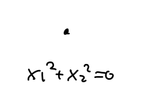
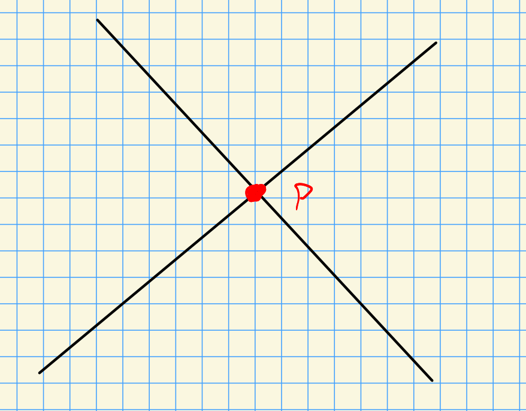
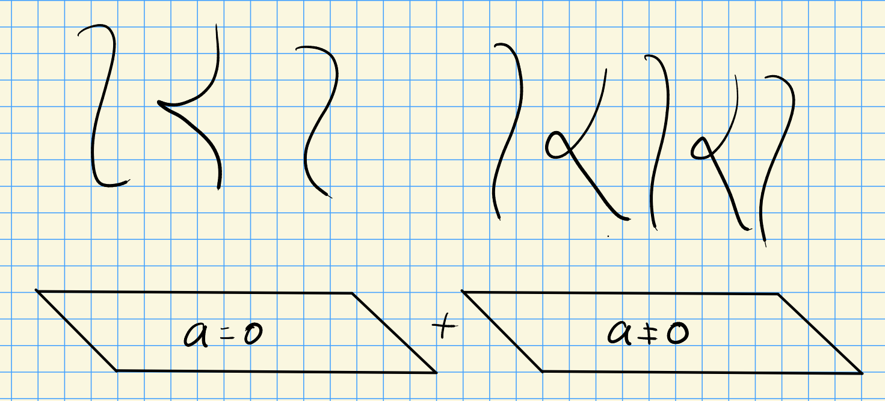
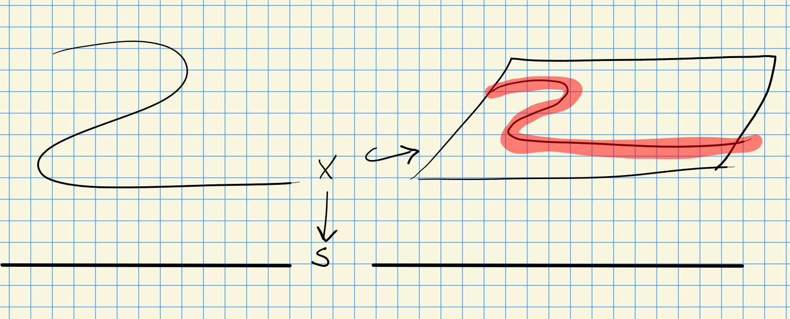
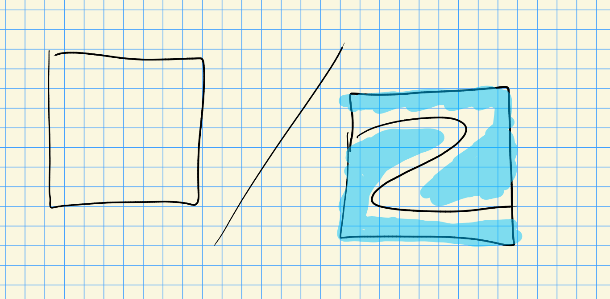
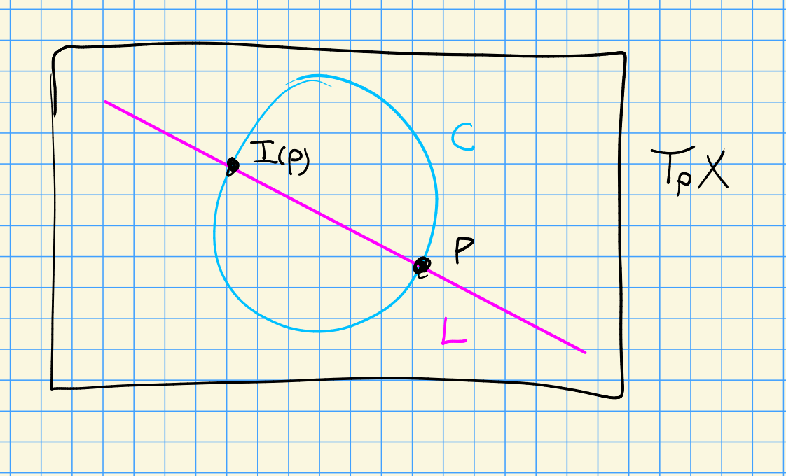

# Kirsten Wickelgren, Talk 2 (Friday, July 16)

## Intro

:::{.remark}
Recall that we have a classical degree map 
\[
\deg: [S^n, S^n] \to \ZZ
\]
which roughly counts preimages.
Given $f\in \Hom_\Top(S^n, S^n)$ and $p\in S^n$, we write $f\inv(p) = \ts{ \elts{q}{N} }$ and have a formula $\deg f = \sum \deg_{q_i} f$ where the local degrees $\deg_{q_i}f$ can be computed by picking orientation-compatible coordinates $\tselts{x}{n}$ near $q_i$ and $\tselts{y}{n}$ near $p$.
In these coordinates we can form the Jacobian $J_f \da \det \dd{f_i}{x_j}$ and write
\[
\deg_x f =
\begin{cases}
+1 & J(q_i) > 0 
\\
-1 & J(q_i) < 0.
\end{cases}
\]
:::

:::{.question}
What happens if the zeros of $f$ are not of multiplicity 1, so $J_f(q_i) = 0$?
:::

:::{.proposition title="Eisenbud–H.Levine–Khimshiashvili signature formula"}
Over $k\da \RR$, any quadratic form can be diagonalized to $\diag(1,\cdots,1, -1,\cdots,-1)$, and there is a formula
\[
\deg_x f = \signature \omega^{\EKL}
\]
where $\omega^{\EKL}$ is the isomorphism class of the bilinear form defined in the following way: for $f = (f_1, \cdots, f_n)$, set
\[
Q \da {\RR[x_1, \cdots, x_n]_0 \over \gens{\elts{f}{n} } }
\]
which is a finite dimensional local complete intersection.
Since $Q$ is Gorenstein[^Gorenstein_note], there is an isomorphism $\Hom_k(Q, k) \mapsvia{\sim} Q$, which we can take to be the bilinear form.[^scheja_storch]

[^Gorenstein_note]: 
The dualizing sheaf is locally free

[^scheja_storch]: 
Even better, there is a distinguished isomorphism coming from a distinguished socle element (Scheja-Storch).

:::

:::{.remark}

This form can be made very explicit: writing $J_f = \det \dd{f_i}{x_j} \in Q$, choose a $k\dash$linear map $\eta: Q\to k$ such that $\eta(J_f) = \dim_k Q$ and set
\[
\omega^{\EKL} &\da \qty{ Q\tensorpower{k}{2} \mapsvia{\mult} Q \mapsvia{\eta} k} \\ \\
\implies \omega^{\EKL}: Q\tensorpower{}{2} &\to k \\
(g, h) &\mapsto \eta(gh)
.\]
It turns out that the isomorphism class of $\omega^{\EKL}$ does not depend on the choice of $\eta$.

:::

:::{.example title="?"}
Let $f:\AA^1\to \AA^1$ and $f(z) = z^2$ with $q=0$.
Then 
\[
Q = {k[x]_0 \over \gens{x^1} } \mapsvia{\sim} {k[x]\over \gens{x^2}}
\]
and $J_f = 2x$.
We then get $\omega^{\EKL} = \matt{0}{1}{1}{0}$, which up to a change of basis is $h \da \matt 1 0 0 {-1}$.
:::

:::{.question}
Eisenbud notes that $\omega^\EKL$ is defined over fields of arbitrary characteristic not equal to 2, does it have a topological interpretation?
:::

:::{.remark}
Yes! 
It comes from the $\AA^1\dash$degree.
:::

:::{.theorem title="Kass-W."}
$\omega^{\EKL} = \deg_q^{\AA^1}f$ is the local degree in $\GW(k)$ when $\kappa(q) = k$.
[Brazelton, Burklund, Mckean, Montoro, Opie](https://arxiv.org/pdf/1912.04788.pdf) handle the case when $\kappa(q)/k$ is separable.
:::

## $\AA^1\dash$Milnor numbers

:::{.definition title="Node, hypersurface singularity"}
For $\ch k\neq 2$, the simplest type of singularity is a **node**, defined over $\bar k$ as a point $p\in X$ such that[^completion_note]
\[
\widehat{\OO_{X, p}}
\mapsvia{\sim} 
{ \bar k \powerseries{ \elts{x}{n} } \over \sum x_i^2 + \text{h.o.t.} }
,\]

[^completion_note]: 
Her $\OO_{X, p}$ is the stalk of the structure sheaf at $p$, which is a local ring with a unique maximal ideal $\mfm_p$, and the LHS is completion at that ideal, so
\[
\widehat{\OO_{X, p}} \da \qty{\OO_{X, p}}\complete{\mfm_p}
.\]

A **hypersurface singularity** is a point $p\in \ts{f=0} \subseteq X$.
:::

:::{.definition title="Milnor number"}
Let $k\da \CC$.
If you vary $X$ in a family 
\[
X_+ \da \ts{f(x_1,\cdots, x_n) + \sum a_i x_i = t}
,\]
then the singularity $p$ bifurcates into nodes.
The number of nodes is given by the **Milnor number**, defined as $M_p$, the number of nodes in the family $X_+$ for any sufficiently small $\ts{a_i}$.
For $R=\CC$, this is explicitly described as
\[
M_p \da \deg_p^{\Top}\grad f
.\]
:::

:::{.remark}
For other $k$ with $\ch k \neq 2$, nodes come in different types: given a residue field $L$ at a node $p$, the tangent directions defined over some extension $L[\sqrt a]$ for $a\in L\units / (L\units)\prodpower{2}$.
:::

:::{.example title="?"}
Over $k=\RR$, one has examples like

- $x_1^2 +x_2^2 = 0$, yielding a non-split node and non-rational tangent directions

  

- $x_1^2-x_2^2=0$, yielding a split node and rational tangent directions

  
:::

:::{.definition title="Type of a node"}
Let $p$ be a node with
\[
\widehat{\OO_{X, p}} \iso { L\formalseries{ \elts{x}{n} } \over \sum a_i x_i^2 }, 
&& L \da \kappa(p)
.\]
The **type** $p$ is defined as 
\[
\type(p) \da \Tr_{L\slice k} \gens{2^n \prod_{i=1}^n a_i} \in \GW(k)
.\]
:::

:::{.definition title="$\AA^1\dash$Milnor numbers"}
The **$\AA^1\dash$Milnor number** is defined as 
\[
M_p \da \deg_p^{\AA_1} \grad f = \sum_{p\in N} \type(p)
,\]
$N$ is the set of nodes of $f$ in a family for a generic $\ts{\elts a n }$.

> Note: the second equality is due to Kass-Wickelgren.

:::

:::{.example title="?"}
Let $f(x,y)\da x^3-y^2$ with $\ch k\neq 2,3$, then 

- $p=(0, 0) \in \ts{f=0}$, 
- $\gradient f = (3x^2, -2y)$, and
\[
\deg^{\AA^1} \gradient f 
&= \deg^{\AA^1} (x\mapsto 3x^2 ) \deg^{\AA^1} (y\mapsto -2y) \\
&= \matt{0}{1/3}{1/3}{0} \gens{-2} \\
&= \gens{1} + \gens{-1} \\
&= q_{\hyp}
,\]
which has rank 2 and thus $M = 2$.
This yields a cusp.

The family $y^2 = x^3 + ax + t$ for $a\neq 0$ yields a family:

- In the first term, the cusp bifurcates into 2 nodes, yields $\rank M^{\AA^1}(C) = M(C)$ for $C$ the cusp curve
- In the second, there are singular fibers when $x^3+ax+t$ has double roots, which happens when the discriminant is zero, so this occurs iff $-4a^3 -27b^2 =0$.

This yields a bifurcation into two nodes, and for example,

- Over $\FF_5$: $\gens{1} = \gens{-1}$, so this can not bifurcate into 1 split and 1 non-split rational node.
- Over $\FF_7$: $\gens{1} \neq \gens{-1}$, so this can not bifurcate into 2 split or 2 non-split nodes.
:::

:::{.remark}
The classical Milnor number appears in conductor formulas and are related to the Euler characteristic $\chi$ of the *Milnor fiber*.
M. Levine-Lehalleur-Srinivas and R. Azouri have subtle quadratic enrichments to $\GW(k)$.
:::

## $\AA^1\dash$Euler characteristic $\chi^{\AA^1}$

:::{.definition title="Relatively oriented bundles"}
For $X\in \smooth\Var^{\proj}\slice{k}$, we saw last time that a vector bundle $V\to X$ is **relatively oriented** by $(L, \phi)$ where $L\to X$ is a line bundle and 
\[
\phi: L\tensorpower{k}{2} \mapsvia{\sim} \Hom(\det \T X, \det V)
.\]
:::

:::{.remark}
The tangent bundle $\T X$ has a canonical relative orientation since 
\[
\Hom(\det \T X, \det \T X) \mapsvia{\sim} \OO \mapsvia{\sim} \OO\tensorpower{}{2}
\]
where $\OO$ is a trivial bundle of rank 1.
It follows that we may define the Euler number of tangent bundle:
\[
\chi^{\AA^1}(X) \da n(\T X) \in \GW(k)
,\]
where $n$ is the Euler number.
:::

:::{.theorem title="M. Levine"}
$\chi^{\AA^1}(X)$ is equal to the **categorical Euler characteristic**.
The definition is omitted here, see [Levine's "Enumerative geometry with quadratic forms"](https://arxiv.org/abs/1703.03049).
:::

:::{.example title="M. Levine-Lehalleur-Srinivas"}
\envlist

> See <https://arxiv.org/abs/2101.00482>.

Let $X \subseteq \PP^{n+1}$ for $n$ even, written $X \da \ts{F=0}$ for $f\in \RR[x_0, \cdots, x_n]_{e}$ homogeneous of degree $e$.
Take
\[
\omega^{\EKL}: Q\tensorpower{}{2}\to k && 
Q \da {k[x_0,\cdots, x_n] \over \gens{ \dd{f}{x_0}, \cdots, \dd{f}{x_n} } }
.\]

Define $B_{\Jac}$ to be the restriction of $\omega^\EKL$ to \( \bigoplus_{q=0}^n Q_{(q+1)e-n-2} \), then
\[
\chi^{\AA^1}(X) = \gens{e} + \gens{-e} B_{\Jac} + {n\over 2}q_{\hyp}
.\]
:::

:::{.example title="Clebsch surface"}
Take the Clebsch surface
\[
C \da \ts{ \tv{\elts x 3} \st \sum x_i^3 = \qty{\sum x_i}^3  } \subseteq \PP^3\slice{\QQ}
.\]
Then $\chi(C) = 9$, and 
\[
\chi^{\AA^1}(C) = 2q_{\hyp} + \gens{-10} + \gens{-6} + \gens{-21} + \gens{-14} + \gens{-2}
,\]
which can be computed with Macaulay2!
:::

## Cohomology and the Euler Class

:::{.remark}
Note that we have a stable $\AA^1\dash$homotopy category $\SH(k)$, so we can take cohomology theories on $X\in \smooth\Sch\slice{k}$:

- $H_\mot$ or $H\ZZ$: motivic cohomology
- $\tilde H_\mot$ or $H\tilde \ZZ$: extended motivic cohomology
- $\K$: \(\K\dash\)theory 
- $\KO$: Hermitian \(\K\dash\)theory 

It turns out that 
\[
H^n(X) = \pi_{-n}\Hom_{\SH(k)}(X, H) = [X, \Suspend^n H]
,\]
and it's useful to allow twisting the second term by shifts.
:::

:::{.definition title="Twisted suspension"}
Letting $V\to X$ be a vector bundle, we can define the **twisted suspension** 
\[
H^V(X) \da [X, \Th(V) \smashprod H]
&& \text{where } 
\Th(V) \da {V\dual \over V\dual\smz} = {\PP(V\dual \oplus \OO) \over \PP(V\dual)}
\]
where taking the dual is a condition needed for \(K\dash\)theory.
This reduces to a usual suspension for the trivial bundle. 
:::

:::{.example title="?"}
For $V\da (\OO_X)\sumpower{n}$ the trivial rank $n$ bundle on $X$, we have $H^V = H^n$.
:::

:::{.example title="?"}
\[
H\ZZ^n(X) \cong H_\mot^{2n}(X; \ZZ(n)) \cong H^{2n, n}_\mot(X) \cong \CH^n(X)
,\]
the Chow group of codimension $n$ cycles modulo rational equivalence.
These are the *geometric gradings*.
:::

:::{.example title="?"}
$\tilde{H\ZZ}^n(X) \cong \tilde{\CH}^n(X)$ the **Chow-Witt group**, also called the **oriented Chow group**.
Using the Gersten resolution, these can be expressed as formal sums of codimension $n$ subvarieties with coefficients in $\GW(k(Z))$, where $k(Z)$ are the rational functions of $Z$, subject to some conditions, modulo equivalence.
:::

:::{.example title="?"}
$\K^0(X)$ is the group completion of vector bundles on $X$, and $\KO^0(X)$ additionally remembers the data of a nondegenerate symmetric bilinear form.
These are "representable" in a sense because they are related to Thom spectra.
:::

:::{.definition title="Cohomology with support"}
Let $Z\embeds X$ be a closed subscheme, then define the **cohomology with support**
\[
H_Z^V(X) \da \htyclass{ { X \over X\sm Z}, \Th(V) \smashprod H}_{\SH(k)}
.\]
:::

:::{.definition title="Euler class"}
For $H$ a cohomology theory and $\SS|to H$ a ring? and a vector bundle $V\to X$ with a section $f$ (for example, the zero section), then the **Euler class** 
\[
e^H(V, f) \in H_{\ts{f=0}}^{V\dual}(X)
\]
is the class of the map
\[
{X\over X\sm\ts{f=0}} \mapsvia{f} {V\over V\smz} \smashprod H
.\]
:::

:::{.definition title="Euler Number"}
For $f:X\to S$ is a **local closed immersion** ($\lci$) if it locally factors as $U \mapsvia{i} P \mapsvia{p} S$ with $p$ smooth and $i$ a closed immersion determined by a *Koszul regular sequence* (so modding out doesn't yield a zero divisor, and the higher cohomology of the Koszul complex is zero).
:::

:::{.remark}
Some properties:

- This has a well-behaved **cotangent complex** $L_f$.
- For a regular embedding, $L_i \homotopic N_u\dual P[1]$ is **conormal bundle**.[^cornormal_note]

- $L_p \homotopic \Omega_{P/S} \homotopic \T_p\dual$.
- $L_{p_i}$ is determined by $i^* L_p\to L_{p_i} \to L_i$, 
- There is a coherent Serre duality related to $L_f$.

There is also a good notion of pushforward:
let $p:X\to S$ be proper 
[^proper_note]
and $\lci$.

[^proper_note]: 
Here **proper** means that the preimage of a compact set is compact.

[^cornormal_note]: 
I.e. the dual of the normal bundle.

Then there is a **Becker-Gottlieb transfer**
\[
\Tr^{\text{BG}}: \Suspend_+^\infty S\to \Th(L_p)
,\]
and the cartoon is the following:

Here we embed $X\to S$ into the trivial bundle over $S$ and take a neighborhood.
Letting $B$ be the trivial bundle over $S$, then $\Th(B) \cong \Sigma_+^\infty S$ and collapsing fiberwise quotients by the complement of the neighborhood:

This yields $p_*: H^{L_p}(X) \to H^0(S)$.
:::

## Oriented Cohomology Theories and Euler Numbers

:::{.remark}
\envlist

- $H$ is $\GL\dash$oriented if $H_Z^n(X) \mapsvia{\sim} H_Z^V(X)$ with $n\da \rank V$.
  
  An example is $H\ZZ, \K$, but non examples are ${H\tilde \ZZ}, \KO$.

- $H$ is $\SL\dash$oriented if 
  - $H_Z^V(X) \mapsvia{\sim} H_Z^{V'}(X)$,
  - $\rank V = \rank V'$ and 
  - $\det V \mapsvia{\sim} \det V' \tensor L\tensorpower{}{2}$ for $L\to X$ a line bundle.

  An example is $H\tilde{\ZZ}, \KO$.

:::

:::{.remark}
For $V\to X$ a relatively oriented vector bundle on $X \mapsvia{p} k$ with $p$ smooth and proper, and $H$ an $\SL_c\dash$oriented cohomology theory.
Then 
\[
H^{V\dual}(X) \mapsvia{\sim} H^{\T\dual X}(X)
.\]
Letting $f$ be any section of $V$, e.g. the zero section, then

\begin{tikzcd}
	{e^H(V, f) \in} & {H_{\ts{f=0}}^{V\dual}(X)} &&& {H^{V\dual}(X)} \\
	& {X\to {X\over X\smts{f=0}}} &&& {\Th(V) \smashprod H} \\
	& {}
	\arrow["{z: \text{ forget support}}", from=1-2, to=1-5]
	\arrow[maps to, from=2-2, to=2-5]
\end{tikzcd}

> [Link to Diagram](https://q.uiver.app/?q=WzAsNixbMSwwLCJIX3tcXHRze2Y9MH19XntWXFxkdWFsfShYKSJdLFs0LDAsIkhee1ZcXGR1YWx9KFgpIl0sWzEsMl0sWzAsMCwiZV5IKFYsIGYpIFxcaW4iXSxbMSwxLCJYXFx0byB7WFxcb3ZlciBYXFxzbXRze2Y9MH19Il0sWzQsMSwiXFxUaChWKSBcXHNtYXNocHJvZCBIIl0sWzAsMSwiejogXFx0ZXh0eyBmb3JnZXQgc3VwcG9ydH0iXSxbNCw1LCIiLDAseyJzdHlsZSI6eyJ0YWlsIjp7Im5hbWUiOiJtYXBzIHRvIn19fV1d)

Letting $f: X\to \Th(V) \smashprod H$, any two sections $f_1, f_2$ of $V$ are connected by copies of $\AA^1$ in $H^0(V)$, so
\[
e^H(V) \da z(e^H(V, f_1)) = z(e^H(V, f_2))
.\]
:::

:::{.definition title="Euler number"}
The **Euler number** $n^H(V)$ of $V$ in $H^0(S)$ is 
\[
n^H(V) \da p_* e^H(V)
.\]

:::

:::{.remark}
This agrees with 
\[
n(V, f) = \sum_{x\in \ts{f= 0 } \subseteq X} \deg_x f, && \deg_x f \in \GW(k)
,\]
for $H = H\tilde{\ZZ}, \KO$ over $S\da \spec k$.
Moreover, $n(V, f)$ is independent of the choice of section.

> See [Déglise-Jin-Khan](https://arxiv.org/abs/1805.05920), [Bachmann-Wickelgren](https://arxiv.org/abs/2002.01848).

:::

## Arithmetic count of lines on a smooth cubic surface (joint with Jesse Kass)

:::{.definition title="Cubic surface"}
A **cubic surface** is given by $X \subseteq \PP^3$ where $X = \ts{f=0}$ with $f\in k[w,x,y,z]_3$ homogeneous of degree 3.
:::

:::{.theorem title="Salmon-Cayley, 1849"}
Any smooth cubic surface over $\CC$ contains exactly 27 lines.
:::

:::{.example title="?"}
Consider the Fermat cubic:
\[
f(x,y,z,w) = x^2 + y^2 + z^2 + w^2
.\]
The lines are given by 
\[ 
\ts{ \tv{S, -S, T, -T}  \st [S, T] \in \PP^1(\CC) \subseteq X }
.\]
For $\omega^3,\lambda^3 = 1$, we can take 
\[ 
\ts{\tv{S, \lambda S, T, \omega T} \st [S, T]\in \PP^1(\CC) } 
.\]
Permuting the variables in ${4\choose 2}/2 =3$ ways, then there are $3\cdot 3 \cdot 3 = 27$ total lines.
:::

:::{.proof title="?"}
Let $\Gr(1, 3)$ be the Grassmannian parameterizing $W \subseteq \CC^4$ with $\dim W=2$, or equivalently copies of $\PP^1$ in $\PP^3$.
Take the tautological $S\to \Gr(1, 3)$ whose fiber over $[\PP W]$ is $W$ itself.
Then $\Sym^3 S\dual_{[\PP W]} = \Sym^3(W\dual)$ are cubic polynomials in $W$, and $f$ determines a section $\sigma_f$ of $\Sym^3 S\dual$ given by 
\[
\sigma_f([\PP W) = \ro{f}{W}
,\]
which is zero iff the line $\PP W$ is contained in $X$.
So we've reduced to counting zeros of a section:
\[
n(V) = \sum_{\text{lines } L \subseteq X} \deg_L \sigma_f
.\]

:::{.fact}
For a smooth cubic surface, all zeroes of $\sigma_f$ have multiplicity one.
:::

Over $\CC$, the classical differential topological degree is 1, so $n(V)$ is the number of lines, and $n(V) = 27$.

Consider now the situation over $\RR$:

- Schläfli (1861): 
  Over $\RR$, there can only be $3, 7, 15$, or $27$ lines.
- Segre (1942): 
  These lines break into two classes: hyperbolic, or elliptic.

For $L \subseteq X$ a real line, $L$ gives an involution $I:L\to L$ where $I(p)$ is defined by consider $T_p X$, which contains a line $L$ along with a curve $C$ of degree 2 since the total degree is 3:

In particular, there is another point in the intersection of $L \intersect C \intersect X$, so $I(p)$ is defined as that point where $T_{I(p)}X = T_pX$.
If $I$ yields a $\CC\dash$conjugate pair, say $L$ is elliptic, and otherwise if $I$ yields two $\RR\dash$point say $L$ is hyperbolic.
Taking a path $p\to I(p)$, if the tangent space undergoes a full twist, this is the elliptic situation.
:::

:::{.theorem title="Segre + many authors in the 2010s"}
The number of hyperbolic lines minus the number of elliptic lines is exactly 3.
:::

:::{.question}
What about other fields, like $k = \FF_p, \QQpadic, \QQ$?
:::

:::{.answer}
The above proof works in $\AA^1\dash$homotopy theory.
Letting $X \subseteq X \subseteq \PP^3\slice{k}$ a cubic surface.
:::

:::{.definition title="Type of a line"}
The **type** of a line $L$ is an element 
\[
\gens{D} \in \GW(k(L)),
&&
D \in k(L)\units / (k(L)\units)\prodpower{2}
\]
such that the fixed points $\Fix(I)$ form a conjugate pair of points defined over $k(L)\adjoin{\sqrt D}$.
:::

:::{.theorem title="Kass-Wickelgren"}
let $k\in \Field^{\ch \neq 2}$ and $X \subseteq \PP^3\slice{k}$, then 
\[
\sum_{\substack{\text{lines} \\ L \subseteq k(X) }} \Tr_{k(L) / k} \type(D) = 15\gens{1} + 12\gens{-1} \in \GW(k)
.\]
:::
