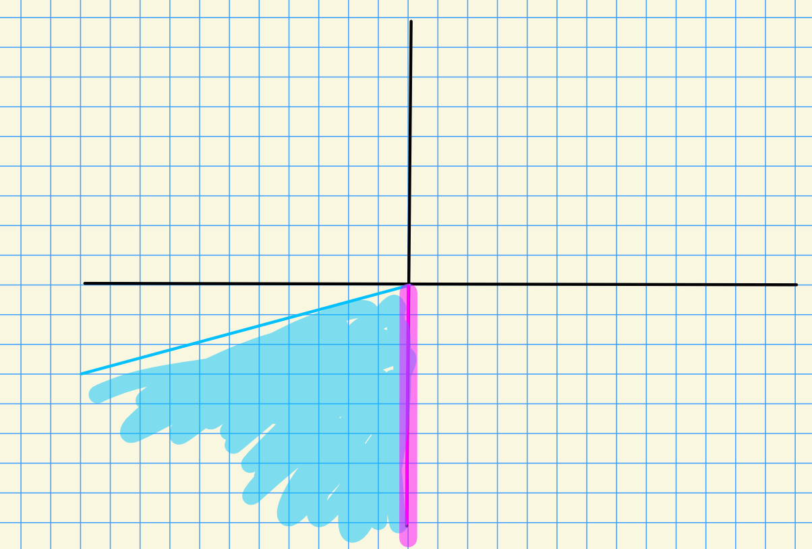

# Matthew Morrow, Talk 2 (Friday, July 16)

:::{.remark}
A review of yesterday:

- \(\K\dash\)theory can be refined by motivic cohomology, i.e. it breaks into pieces.
  More precisely we have the Atiyah-Hirzebruch spectral sequence, and even better, the spectrum $\K(X)$ has a motivic filtration with graded pieces $\ZZ_\mot(j)(X)[2j]$.

- The $\ZZ_\mot(j)(X)$ correspond to algebraic cycles and étale cohomology mod $m$, where $m$ is prime to $\ch k$, due to Beilinson-Lichtenbaum and Beilinson-Bloch.

Today we'll look at the classical mod $p$ theory, and variations on a theme: e.g. replacing \(\K\dash\)theory with similar invariants, or weakening the hypotheses on $X$.
We'll also discuss recent progress in the case of étale \(\K\dash\)theory, particularly \(p\dash \)adically.
:::

## Mod $p$ motivic cohomology in characteristic $p$

:::{.remark}
For $F\in\Field$ and $m\geq 1$ prime to $\ch F$, the Atiyah-Hirzebruch spectral sequence mod $m$ takes the following form:
\[
E_2^{i, j} = H_\mot^{i, j}(F, \ZZ/m(-j)) 
\equalsbecause{BL}
\begin{cases}
 H^{i-j}_\Gal(F; \mu_m^{\tensor j}) & i\leq 0  
\\
 0 & i>0 .
\end{cases}
.\]

Thus $E_2$ is supported in a quadrant four wedge:

We know the axis:
\[
H^j(F; \mu_m^{\tensor j}) \mapsvia{\sim} \KM_j(F)/m
.\]

What happens if $m>p = \ch F$ for $\ch F > 0$?
:::

:::{.theorem title="Izhbolidin (90), Bloch-Kato-Gabber (86), Geisser-Levine (2000)"}
Let $F\in \Field^{\ch = p}$, then

- $\KM_j(F)$ and $\K_j(F)$ are $p\dash$torsionfree.

- $\K_j(F)/p \injectsfromvia{} \KM_j(F)/p \injectsvia{\dlog} \Omega_F^j$

:::

:::{.definition title="$\dlog$"}
The $\dlog$ map is defined as
\[
\dlog: \KM_j(F) / p &\to \Omega_f^j \\
\bigotimes_{i} \alpha_i &\mapsto \Extprod_i  {d \alpha_i \over \alpha_i}
,\]
and we write $\Omega^j_{F, \log} \da \im \dlog$.
:::

:::{.remark}
So the above theorem is about showing the injectivity of $\dlog$.
What Geisser-Levine really prove is that 
\[
\ZZ_\mot(j)(F)/p \mapsvia{\sim} \Omega_{F, \log}^j[-j]
.\]
Thus the mod $p$ Atiyah-Hirzebruch spectral sequence, just motivic cohomology lives along the axis
\[
E_2^{i, j} = 
\begin{cases}
\Omega_{F, \log}^{-j}  &  i=0
\\
0 & \text{else }
\end{cases}
\abuts \K_{i-j}(F; \ZZ/p)
\]
and $\K_j(F)/p \mapsvia{\sim} \Omega_{F, \log}^j$.
:::

:::{.remark}
So life is much nicer in $p$ matching the characteristic!
Some remarks:

- The isomorphism remains true with $F$ replaced any $F\in \Alg\slice{\FF_p}^{\reg, \loc, \noeth}$:
\[
\K_j(F)/p \mapsvia{\sim} \Omega_{F, \log}^j
.\]
- The hard part of the theorem is showing that mod $p$, there is a surjection $\KM_j(F) \surjects \K_j(F)$.
  The proof goes through using $z^j(F, \bullet)$ and the Atiyah-Hirzebruch spectral sequence, and seems to necessarily go through motivic cohomology. 
:::

:::{.question}
Is there a direct proof?
Or can one even just show that
\[
\K_j(F)/p = 0 \text{ for } j> [F: \FF_p]_\tr
?\]

:::

:::{.conjecture title="Beilinson"}
This becomes an isomorphism after tensoring to $\QQ$, so
\[
\KM_j(F) \tensor_\ZZ \QQ \mapsvia{\sim}  \K_j(F)\tensor_\ZZ \QQ
.\] 
This is known to be true for finite fields.
:::

:::{.conjecture}
\[
H_\mot^i(F; Z(j)) \text{ is torsion unless }i=j
.\]
This is wide open, and would follow from the following:
:::
  
:::{.conjecture title="Parshin"} 
If $X\in \smooth\Var^{\proj}\slice{k}$ over $k$ a finite field, then 
\[
H_\mot^i(X; Z(j)) \text{ is torsion unless } i=2j
.\]
:::

## Variants on a theme

:::{.question}
What things (other than \(\K\dash\)theory) can be motivically refined?
:::

### $\G\dash$theory

:::{.remark}
Bloch's complex $z^j(X, \bullet)$ makes sense for any $X\in \Sch$, and for $X$ finite type over $R$ a field or a Dedekind domain.
Its homology yields an Atiyah-Hirzebruch spectral sequence
\[
E_2^{i, j} = \CH^{-j}(X, -i-j) \abuts \G_{-i-j}(X)
,\]
where $\G\dash$theory is the \(\K\dash\)theory of $\Coh(X)$.
See Levine's work.

Then $z^j(X, \bullet)$ defines **motivic Borel-Moore homology**[^it_is_homology]
which refines \(\G\dash\)theory.

[^it_is_homology]: 
Note that this is homology and not cohomology!

:::

### $\KH\dash$theory

:::{.remark}
This is Weibel's "homotopy invariant \(\K\dash\)theory", obtained by forcing homotopy invariance in a universal way, which satisfies
\[
\KH(R[T]) \mapsvia{\sim} \KH(R) && \forall R
.\]
One defines this as a simplicial spectrum
\[
\KH(R) \da \realize{
q \mapsto \K\qty{R[T_0, \cdots, T_q] \over 1 - \sum_{i=0}^q T_i}
}
.\]
:::

:::{.remark}
One hopes that for (reasonable) schemes $X$, there should exist an $\AA^1\dash$invariant motivic cohomology such that

- There is an Atiyah-Hirzebruch spectral sequence converging to $\KH_{i-j}(X)$.
- Some Beilinson-Lichtenbaum properties.
- Some relation to cycles.

For $X$ Noetherian with $\krulldim X<\infty$, the state-of-the-art is that stable homotopy machinery can produce an Atiyah-Hirzebruch spectral sequence using representability of $\KH$ in $\SH(X)$ along with the slice filtration.
:::

### Motivic cohomology with modulus

:::{.remark}
Let $X\in\smooth\Var$ and $D\injects X$ an effective (not necessarily reduced) Cartier divisor -- thought of where $X\sm D$ is an open which is compactified after adding $D$.
Then one constructs $z^j\qty{ {X\vert D }, \bullet}$ which are complexes of cycles in "good position" with respect to the boundary $D$.
:::

:::{.conjecture}
There is an Atiyah-Hirzebruch spectral sequence
\[
E_2^{i, j} = \CH^{j}\qty{ {X  \vert D }, (-i-j) } \abuts \K_{-i-j}(X, D)
,\]
where the limiting term involves *relative $K\dash$groups*.
So there is a motivic (i.e. cycle-theoretic) description of relative \(\K\dash\)theory.
:::

## Étale \(\K\dash\)theory 

:::{.remark}
\(\K\dash\)theory is simple étale-locally, at least away from the residue characteristic.
:::

:::{.theorem title="Gabber, Suslin"}
If  $A \in\loc\Ring$ is strictly Henselian with residue field $k$ and $m \geq 1$ is prime to $\ch k$, then
\[
\K_n(A; \ZZ/m) \mapsvia{\sim} \K_n(k; \ZZ/m)
\mapsvia{\sim} 
\begin{cases}
\mu_m(k)^{\tensor {n\over 2}} & n \text{ even}  
\\
0 & n \text{ odd}.
\end{cases}
\]

:::

:::{.remark}
The problem is that \(\K\dash\)theory does *not* satisfy étale descent!
\[
\text{For } B\in\Gal\Field\slice{A}^{\deg < \infty},
&&
K(B)^{h\Gal\qty{B\slice A}} \not\cong K(A)
.\]

View \(\K\dash\)theory as a presheaf of spectra (in the sense of infinity sheaves), and define **étale \(\K\dash\)theory** $K^\et$ to be the universal modification of \(\K\dash\)theory to satisfy étale descent.
This was considered by Thomason, Soulé, Friedlander.
:::

:::{.remark}
Even better than $\K^\et$ is Clausen's **Selmer \(\K\dash\)theory**, which does the right thing integrally.
Up to subtle convergence issues, for any $X\in \Sch$ and $m$ prime to $\ch X$ (the characteristic of the residue field) one gets an Atiyah-Hirzebruch spectral sequence
\[
E_2^{i, j} = H_\et^{i-j}(X; \mu_m^{\tensor -j}) \abuts \K_{i-j}^{\et}(X; \ZZ/m)
.\]

Letting $F$ be a field and $m$ prime to $\ch F$, the spectral sequence looks as follows:

\begin{tikzcd}
	&&&&&& {} \\
	\\
	\\
	\\
	\bullet &&&&&& \textcolor{rgb,255:red,92;green,92;blue,214}{H^0_\Gal(F; \ZZ/m)} & {H^1(F; \ZZ/m)} &&&&&&& \bullet \\
	&&&&& \textcolor{rgb,255:red,92;green,92;blue,214}{H^0(F; \mu_m^{\tensor 1})} & \textcolor{rgb,255:red,92;green,92;blue,214}{H^1_\Gal(F; \mu_m^{})} & {H^2(F; \mu_m^{})} \\
	&&&& \textcolor{rgb,255:red,92;green,92;blue,214}{H^0(F; \mu_m^{\tensor 2})} & \textcolor{rgb,255:red,92;green,92;blue,214}{H^1(F; \mu_m^{\tensor 2})} & \textcolor{rgb,255:red,92;green,92;blue,214}{H^2_\Gal(F; \mu_m^{\tensor 2})} & {H^3_\Gal(F; \mu_m^{\tensor 2})} \\
	&&& {} &&& \vdots \\
	&&&&&& {} \\
	&&&&&& {}
	\arrow[color={rgb,255:red,135;green,135;blue,135}, dotted, from=5-1, to=5-15]
	\arrow[color={rgb,255:red,135;green,135;blue,135}, dotted, from=1-7, to=10-7]
	\arrow[dashed, no head, from=5-7, to=8-4]
	\arrow[dashed, no head, from=5-7, to=9-7]
	\arrow[from=6-6, to=7-8]
\end{tikzcd}

> [Link to Diagram](https://q.uiver.app/?q=WzAsMTYsWzYsNCwiSF4wX1xcR2FsKEY7IFxcWlovbSkiLFsyNDAsNjAsNjAsMV1dLFswLDQsIlxcYnVsbGV0Il0sWzE0LDQsIlxcYnVsbGV0Il0sWzYsMF0sWzYsOV0sWzYsNSwiSF4xX1xcR2FsKEY7IFxcbXVfbV57fSkiLFsyNDAsNjAsNjAsMV1dLFs2LDYsIkheMl9cXEdhbChGOyBcXG11X21ee1xcdGVuc29yIDJ9KSIsWzI0MCw2MCw2MCwxXV0sWzcsNCwiSF4xKEY7IFxcWlovbSkiXSxbNyw1LCJIXjIoRjsgXFxtdV9tXnt9KSJdLFs3LDYsIkheM19cXEdhbChGOyBcXG11X21ee1xcdGVuc29yIDJ9KSJdLFs1LDYsIkheMShGOyBcXG11X21ee1xcdGVuc29yIDJ9KSIsWzI0MCw2MCw2MCwxXV0sWzQsNiwiSF4wKEY7IFxcbXVfbV57XFx0ZW5zb3IgMn0pIixbMjQwLDYwLDYwLDFdXSxbNSw1LCJIXjAoRjsgXFxtdV9tXntcXHRlbnNvciAxfSkiLFsyNDAsNjAsNjAsMV1dLFszLDddLFs2LDhdLFs2LDcsIlxcdmRvdHMiXSxbMSwyLCIiLDAseyJjb2xvdXIiOlswLDAsNTNdLCJzdHlsZSI6eyJib2R5Ijp7Im5hbWUiOiJkb3R0ZWQifX19XSxbMyw0LCIiLDAseyJjb2xvdXIiOlswLDAsNTNdLCJzdHlsZSI6eyJib2R5Ijp7Im5hbWUiOiJkb3R0ZWQifX19XSxbMCwxMywiIiwwLHsic3R5bGUiOnsiYm9keSI6eyJuYW1lIjoiZGFzaGVkIn0sImhlYWQiOnsibmFtZSI6Im5vbmUifX19XSxbMCwxNCwiIiwyLHsic3R5bGUiOnsiYm9keSI6eyJuYW1lIjoiZGFzaGVkIn0sImhlYWQiOnsibmFtZSI6Im5vbmUifX19XSxbMTIsOV1d)

The whole thing converges to $\K_{-i-j}^\et(F; \ZZ/m)$, and the sector conjecturally converges to $\K_{-i-j}(F; \ZZ/m)$ by the Beilinson-Lichtenbaum conjecture.
:::

## Recent Progress

:::{.remark}
We now focus on 

- Étale \(\K\dash\)theory, $\K^\et$
- mod $p$ coefficients, even period
- \(p\dash \)adically complete rings

The last is not a major restriction, since there is an arithmetic gluing square

\begin{tikzcd}
	R && {R\invert{p}} \\
	\\
	{\hat{R}} && {\hat{R}\invert{p}}
	\arrow[from=1-1, to=3-1]
	\arrow[from=3-1, to=3-3]
	\arrow[from=1-3, to=3-3]
	\arrow[from=1-1, to=1-3]
\end{tikzcd}

> [Link to Diagram](https://q.uiver.app/?q=WzAsNCxbMCwwLCJSIl0sWzIsMCwiUlxcaW52ZXJ0e3B9Il0sWzIsMiwiXFxoYXR7Un1cXGludmVydHtwfSJdLFswLDIsIlxcaGF0e1J9Il0sWzAsM10sWzMsMl0sWzEsMl0sWzAsMV1d)

Here the bottom-left is the \(p\dash \)adic completion, and the right-hand side uses classical results when $p$ is prime to all residue characteristic classes.

:::

:::{.theorem title="Bhatt-M-Scholze, Antieau-Matthew-M-Nikolaus, Lüders–M, Kelly-M"}
For any \(p\dash \)adically complete ring $R$ (or in more generality, derived $p\dash$complete simplicial rings) one can associate a theory of **$p\dash$adic étale motivic cohomology** -- $p\dash$complete complexes $\ZZ_p(j)(R)$ for $j\geq 0$ satisfying an analog of the Beilinson-Lichtenbaum conjectures:

1. An Atiyah-Hirzebruch spectral sequence:
\[
E_2^{i, j} = H^{i-j}(\ZZ_p(j)(R)) \abuts \K_{-i-j}^\et(R; \ZZ)\complete{p}
.\]

2. Known low weights: 
\[
\ZZ_p(0)(R) &\mapsvia{\sim} \RR \Gamma_\et(R; \ZZ_p) \\
\ZZ_p(1)(R) &\mapsvia{\sim} \takecompletion{\RR \Gamma_\et(R; \GG_m)}  [-1] 
.\]

3. Range of support: 
  $\ZZ_p(j)(R)$ is supported in degrees $d\leq j+1$, and even in degrees $d\leq n+1$ if the $R\dash$module $\Omega_{R/pR}^1$ is generated by $n'<n$ elements.
  It is supported in non-negative degrees if $R$ is **quasisyntomic**, which is a mild smoothness condition that holds in particular if $R$ is regular.

4. An analog of Nesterenko-Suslin: 
  for $R \in \loc\Ring$,
\[
{\KMimp_j(R)} \mapsvia{\sim} H^j(\ZZ_p(j)(R))
,\]
  where $\KMimp$ is the "improved Milnor \(\K\dash\)theory" of Gabber-Kerz.

5. Comparison to Geisser-Levine: if $R$ is smooth over a perfect characteristic $p$ field, then
\[
\ZZ_p(j)(R)/p \mapsvia{\sim} \RR \Gamma_\et(\spec R; \Omega_{\log}^j)[-j]
,\]
where $[-j]$ is a right-shift.
:::

:::{.remark}
For simplicity, we'll write $H^i(j) \da H^i( \ZZ_p(j)(R))$.
The spectral sequence looks like the following:

It converges to $K^\et_{-i-j}(R;\ZZ/p)$.
The 0-column is $\takecompletion{\KM_{-j}(R)}$, and we understand the 1-column: we have
\[
H^{j+1} \mapsvia{\sim} \inverselim_{r} \tilde v_r(j)(R)
.\]
where $\tilde v_r(j)(R)$ are the mod $p^r$ weight $j$ Artin-Schreier obstruction.
For example, 
\[
\tilde v_1(j)(R) \da 
\coker\qty{ 
1- C\inv: \Omega^j_{R/pR} \to {\Omega^j_{R/pR} \over \bd \Omega^{j-1}_{R/pR}}
}
= { R \over pR + \ts{ a^p-a \st a\in R } } 
.\]
These are weird terms that capture some class field theory and are related to the Tate and Kato conjectures.
:::

:::{.theorem title="(continued)"}
If $R$ is local, then the 3rd quadrant of the above spectral sequence gives an Atiyah-Hirzebruch spectral sequence converging to $\K_{-i-j}(R; \ZZ_p)$.
:::

:::{.remark}
So we get things describing étale \(\K\dash\)theory, and after discarding a little bit we get something describing usual \(\K\dash\)theory.
Moreover, for any local \(p\dash \)adically complete ring $R$, we have broken $\K_*(R; \ZZpadic)$ into motivic pieces.
:::

:::{.example title="?"}
We same that for number fields, $\cohdim \leq 2$ yields a simple spectral sequence relating $K$ groups to Galois cohomology.
Consider now a truncated polynomial algebra $A = k[T]/T^r$ for $k\in\Perf\Field^{\ch = p}$ and let $r\geq 1$.
Then by the general bounds given in the theorem, $H^i(j) = 0$ unless $0\leq i \leq 2$, using that $\Omega$ can be generated by one element.
Slightly more work will show $H^0, H^2$ vanish unless $i=j=0$ (so higher weights vanish), since they're $p\dash$torsionfree and are killed by $p$.

So the spectral sequence collapses:

\begin{tikzcd}
	&&&&& {} & {} \\
	\\
	{} &&&&& \textcolor{rgb,255:red,214;green,92;blue,92}{H^0(0)} & {H^1(0)} & 0 & 0 &&& {} \\
	&&&& {H^0(1)} & \textcolor{rgb,255:red,214;green,92;blue,92}{H^1(1)} & {H^2(1)} & 0 & 0 \\
	&&& {H^0(2)} & \textcolor{rgb,255:red,214;green,92;blue,92}{H^1(2)} & {H^2(2)} & {H^3(2)} & 0 & 0 \\
	&& \ddots & {H^1(3)} & {H^2(3)} & {H^3(3)} & {H^4(3)} & 0 & 0 \\
	&&& \vdots & \vdots & \vdots & \vdots \\
	&&&&& {} & {}
	\arrow[draw={rgb,255:red,214;green,92;blue,92}, dashed, from=4-5, to=5-7]
	\arrow[draw={rgb,255:red,153;green,153;blue,153}, dotted, no head, from=1-6, to=8-6]
	\arrow[draw={rgb,255:red,153;green,153;blue,153}, dotted, no head, from=3-1, to=3-12]
\end{tikzcd}

> [Link to Diagram](https://q.uiver.app/?q=WzAsMzIsWzUsMiwiSF4wKDApIixbMCw2MCw2MCwxXV0sWzUsMywiSF4xKDEpIixbMCw2MCw2MCwxXV0sWzUsNCwiSF4yKDIpIl0sWzUsNSwiSF4zKDMpIl0sWzQsMywiSF4wKDEpIl0sWzQsNCwiSF4xKDIpIixbMCw2MCw2MCwxXV0sWzQsNSwiSF4yKDMpIl0sWzMsNCwiSF4wKDIpIl0sWzYsMiwiSF4xKDApIl0sWzcsMiwiMCJdLFs2LDMsIkheMigxKSJdLFs2LDQsIkheMygyKSJdLFs2LDUsIkheNCgzKSJdLFs3LDMsIjAiXSxbNyw0LCIwIl0sWzcsNSwiMCJdLFs4LDUsIjAiXSxbOCw0LCIwIl0sWzgsMywiMCJdLFs4LDIsIjAiXSxbNiwwXSxbNiw3XSxbMiw1LCJcXGRkb3RzIl0sWzMsNSwiSF4xKDMpIl0sWzMsNiwiXFx2ZG90cyJdLFs0LDYsIlxcdmRvdHMiXSxbNSw2LCJcXHZkb3RzIl0sWzYsNiwiXFx2ZG90cyJdLFs1LDBdLFs1LDddLFswLDJdLFsxMSwyXSxbNCwxMSwiIiwwLHsiY29sb3VyIjpbMCw2MCw2MF0sInN0eWxlIjp7ImJvZHkiOnsibmFtZSI6ImRhc2hlZCJ9fX1dLFsyOCwyOSwiIiwwLHsiY29sb3VyIjpbMCwwLDYwXSwic3R5bGUiOnsiYm9keSI6eyJuYW1lIjoiZG90dGVkIn0sImhlYWQiOnsibmFtZSI6Im5vbmUifX19XSxbMzAsMzEsIiIsMCx7ImNvbG91ciI6WzAsMCw2MF0sInN0eWxlIjp7ImJvZHkiOnsibmFtZSI6ImRvdHRlZCJ9LCJoZWFkIjp7Im5hbWUiOiJub25lIn19fV1d)

So the Atiyah-Hirzebruch spectral sequence collapses to 

\[
\K_n\qty{ { K[T] \over  \gens{T^r} }, \gens{T}}
=
\begin{cases}
 H^1\qty{\ZZ_p\qty{n+1\over 2}} (R) & n \text{ odd}  
\\
0 & n \text{ even}.
\end{cases}
.\]

When $r=2$, one can even valuation these nontrivial terms.
:::

:::{.question}
What is the motivic cohomology for regular schemes not over a field?
We'd like to understand this in general.
:::
