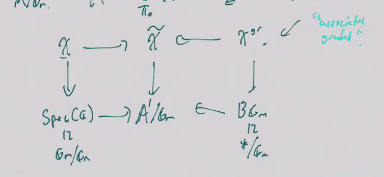
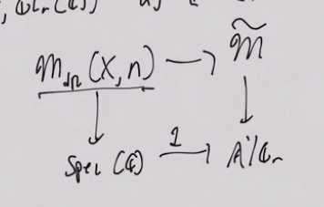
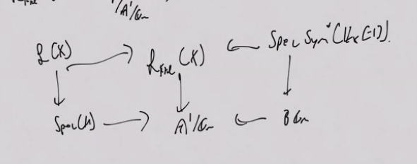

# Saturday, June 05: Perspectives on nonabelian Hodge theory

:::{.remark}
Abstract:  The nonabelian Hodge correspondence provides a rich interplay of structures from topology, analysis and algebraic geometry which has spurred the curiosities of specialists and non-specialists alike. In the first part of this talk I will outline the celebrated nonabelian Hodge correspondence, due to Carlos Simpson, identifying certain representations of the fundamental group of a smooth projective complex variety with semistable "Higgs" bundles. I will discuss the consequences of this identification at the level of moduli spaces parametrizing these objects. Time permitting, I will survey more recent extensions to the characteristic p or p-adic settings.

I will begin the second half of the lecture with a discussion of the Hodge filtration on nonabelian cohomology. Understanding the framework of filtrations set forth allows for us to view the nonabelian Hodge correspondence in a general light. Indeed, it becomes a manifestation of the following general question: when is a graded object canonically the associated graded of a filtered object? I will conclude this talk with a discussion of some work of mine bringing this perspective into the setting of higher algebra and higher categories, along with joint work with Robalo and Toën applying this perspective towards an understanding of the HKR filtration on Hochschild homology.
:::

## Part 1

> Tasos Mouliunos: Perspectives on Nonabelian Hodge Theory (Talbot 2011)

For $(X, g)$ a Riemannian manifold, construct the de Rham complex \( \omega^*_X = C^\infty(X) \mapsvia{d} \Omega^1_X \mapsvia{d} \cdots \).
Using a metric we can define an adjoint operator $\delta: \Omega^* \to \Omega^*[-1]$.
Defining the Laplacian as $\laplacian \da \delta d + d\delta$, and a differential $n\dash$form is harmonic of $\laplacian \omega= 0$.
Recall that Hodge theorem: there is an isomorphism

??

So there are harmonic representatives for de Rham cohomology classes.

Assume $X$ is a smooth projective complex variety, or more generally a Kähler.
There is a decomposition \( \Omega_X^n \tensor_\RR \CC = \bigoplus _{p+q=n} \Omega^{p, q}_X \) which is $p$ exterior powers of \( \Omega^{1, 0} \) wedge with $q$ exterior powers of \( \Omega^{0, 1} \).
There is also a decomposition $d = \del + \delbar$ with $\del$ raises degree $p$ by 1 and $\delbar$ raises degree $q$ by 1.
There are formal adjoints to $\del, \delbar$, and one defines $\laplacian_d, \laplacian_{\del}, \laplacian_{\delbar}$ analogously.
There are Kahler identities:
\[
\laplacian_d = 2 \laplacian_{\del} = 2\laplacian_{\delbar}
.\]

> Todo: check

:::{.theorem title="?"}
There is a decomposition 
\[
H^n(X; \CC) \cong \bigoplus _{p+q = n} H^{p, q}(X)
.\]
where 
\[
H^{p, q} = D^p_{\Dolbeaut}(X; \Omega_X^q) = \mathcal{H}^{p, q}(X)
,\]
and the latter is the vector space of harmonic forms of degree $p, q$.
:::

:::{.remark}
This data yields a finite decreasining filtration $F$ together with a conjugate filtration $\bar F$ on $H^{p, q}$ where $F_p(H) \intersect \bar{F}_p(H) = H^n$ and yields a notion of *pure Hodge structure of weight $n$*.
:::

:::{.remark}
By GAGA, there is a correspondence between holomorphic and complex algebro-geometric data for nice enough sheaves.
This mixes 

- Topological data: $H^n(X; \CC)$
- Smooth data: $H^n_{\dR}(X)$ 
- Holomorphic/complex algebro-geometric data: the decomposition into harmonic forms.

Nonabelian Hodge theory is an attempt to categorify this fact.
:::

:::{.theorem title="?"}
There is an equivalence of categories
\[
\correspond{
  \text{Local systems of } \Vect_\CC \\ \text{on }X
}
&\mapstofrom
\correspond{
  \text{Complex vector bundles on } X \\ \text{with a flat connection}
}
\]
:::

:::{.remark}
The right-hand side can be identified with monodromy representations $\rho: \pi_1(X) \to \GL_n(\CC)$.

> Missed some stuff.

We'll want $H^1(X; \GL_n(\CC))$ to be the space of such representations.
How do we make sense of the Hodge decomposition here?
The answer: a vector bundle with a Higgs field, i.e. a Higgs bundle: a pair $(E, \theta)$ where $E$ is a complex bundle.
There are also *harmonic bundles* which interpolates between Higgs bundles and flat bundles.
Harmonic bundles: bundle with $\del, \delhar$ with algebraic operators $\theta, \bar\theta \in \Gamma(X, \Endo(E) \tensor \Omega^1)$.
One can fix a Hermitian metric so that $\del + \delbar$ is a unitary connection and $\theta + \bar\theta$ is self-adjoint.
:::

:::{.remark}
$\delbar$ defines a holomorphic structure on $E$ by the Koszul-Malgrange theorem, yielding a holomorphic bundle.
Given a bundle with flat connection and a Hermitian metric, one can define the data $D_K''$ needed for a Higgs structure, but then one needs to solve the system of PDEs $(D_K'')^2=0$.
Conversely, given a Higgs bundle $E$, namely $\theta'' = \theta + \delbar$, one can define a connection $D_K$ and if $(D_K)^2=0$ then this is a flat connection.
:::

:::{.theorem title="Nonabelian Hodge theorem"}
Let $X$ be a smooth complex projective variety.

- There is an equivalence of categories: harmonic bundles on $X$ and semisimple flat bundles (or equivalently $\pi_1(X)$ representations)
- There is an equivalence of categories:
  harmonic bundles and direct sums of stable Higgs bundles with vanishing Chern classes $c_1(E) = c_2(E) = 0$.

> Something else?

:::

:::{.remark}
Semi-stability is a condition on coherent subsheaves.
:::

:::{.remark}
Consider the degree 1 case of the Hodge correspondence.
$H^1(X; \GL_n(\CC))$ should be a moduli stack.
LEt $F: \CAlg_k^0 \to \Gpd$ be a functor, then it's representable by a stack, which is typically required to satisfy descent with respect to a topology on $\CAlg_k$ (a gluing condition, e.g. etale descent).
Can realize quotient stacks as a simplicial object in groupoids?
Can also take GIT quotients, $\spec R^G$ of the invariants.
:::

:::{.remark}
Use the functor of points to define the Betti moduli space.
Higgs moduli space: semistable Higgs bundles with vanishing Chern classes and a frame at $x$, i.e. $E \cong \CC^n$.
:::

:::{.remark}
There is an equivalence between $R_\dR$ and $R_B$, the de Rham and Betti moduli stacks?
Can get an equivalence of categories without underling topological spaces being homeomorphic?
:::

:::{.remark}
Semisimple flat bundles fixed by a $\GG_m$ action are those which underlie complex variations of Hodge structure.
These show up in relative de Rham cohomology.
See Riemann-Hilbert correspondence?
:::

## Part 2

:::{.remark}
We want to consider an analog of the Hodge filtration for nonabelian cohomology.
In the classical case, Hodge decompositions correspond to descreasing filtrations on $H^*(X; \CC)$.
Think of $H^1(X, \GL_n(\CC))$ as a complex linear mapping stack $\mcm_B(X, n) \da \Map(\pi_1(X), \GL_n) / \GL$, we'll want a filtration on this.
:::

:::{.remark}
Recalling the Rees construction, we have 
\[
F^*(V) = \qty{\cdots \to F^{p+1} V \to F^p V \to \cdots } && V\da \colim F^*(V) 
.\]
We'll map $F^*(V)$ to $\xi(V, F)$, which will be a submodule of $V \tensor \CC[t, t\inv]$ generated by $t^{-p} F^p(V)$, which is like a $\CC[t]\dash$lattice in $V\tensor \CC[t, t\inv]$ and thus a module over $\CC[t]$.
Equip it with a Galois action to get a free sheaf over $\AA^1 = \spec \CC[t]$ with a $\GG_m\dash$action.
:::

:::{.remark}
Upshot: we'll get an equivalence of categories between $\GG_m\dash$equivariant vector bundles over $\AA^1$ with filtered vector spaces.
We realize $\AA_1/\GG_m$ as the realization of a simplicial object:
\[
\AA_1/\GG_m = \realize{ \AA^1 \simplicialone A^1 \cross \GG_m \simplicialtwo \cdots }
.\]
:::

:::{.remark}
Diagram:

This endows $R \gamma(X, \OO_X)$ with a filtration
:::

### Hodge Filtration on Nonabelian Cohomology

:::{.remark}
We realize $H^1(X, \GL_n(\CC))$ as a stack and take the de Rham stack $\mcm_{\dR}(X, n)$ over $\spec \CC$.
A filtration will be an $\tilde \mcm$ fitting into a pullback:

Similarly, to obtain $\mcm_{\Dolbeaut}$ (the moduli stack of Higgs bundles) as $\mcm_{\Dolbeaut}(X, n) \simeq \mcm \fiberprod_{\AA^1/\GG_m} \B \GG_m$.
The idea (going back to Deligne): construct a 1-parameter family.
:::

:::{.definition title="?"}
Fix $E$ a complex vector bundle, then a **$\lambda\dash$connection** is an operator
\[
\nabla_{\lambda}: E\to \E\tensor \Omega_X^1
&&
\nabla_{\lambda}(rf) = \lambda d(r) f + r\nabla(f), \nabla_{\lambda}^2 = 0
\]
where $r$ is a coefficient and $f$ is a section of $E$ and $d$ is the de Rham differential.
:::

:::{.remark}
If $\lambda=0$ this reduces to $\nablda(rf) = r\nabla(f)$.
Setting $\theta \da \nabla_0$ yields precisely the data of the Higgs field.
For $\lambda=1$ this recovers the notion of a flat connection.
:::

:::{.proposition title="Key"}
A harmonic bundle $(E, D, D'')$, where $D, D''$ are operators, gives rise to a family of flat $\lambda\dash$connections with 

- A flat part $(E_1, D_1) = (E, 0)$?
- A Higgs part $(E_0, \nabla_0) = (E,\ theta)$
:::

:::{.theorem title="Simpson"}
Let $S$ be a scheme over $\AA^1$, then there is a functor
\[
(\lambda:S\to \AA^1) \to (E, \nabla, \alpha)
\]
where

- $E$ is a bundle over $X\cross S$,
- $\nabla$ is a $\lambda\dash$connection, and
- $\alpha: E \ro{x} \cong \CC^n$ is a frame

is representable by $R^{\Hodge}(X, n) \to \AA^1$ which yields a map
\[
\mcm^{\Hodge}(X, n) / \GL_n \to \AA^1
.\]
Setting $\mcm \da \mcm^\Hodge(X, n)$, $\mcm$ admits a $\CC^*$ action and since $\CC^* \cong \GG_m$ we get 
\[
\mcm/\GG_m \to \AA^1/\GG_m
.\]
When $\lambda$ is invertible we recover flat connections, and so there is a pullback:

\begin{tikzcd}
	{\mcm_\dR \cross \GG_m} && \mcm \\
	\\
	{\GG_m} && {\AA^1}
	\arrow[from=1-3, to=3-3]
	\arrow[from=3-1, to=3-3]
	\arrow[from=1-1, to=1-3]
	\arrow[from=1-1, to=3-1]
	\arrow["\lrcorner"{anchor=center, pos=0.125}, draw=none, from=1-1, to=3-3]
\end{tikzcd}

> [Link to Diagram](https://q.uiver.app/?q=WzAsNCxbMCwwLCJcXG1jbV9cXGRSIFxcY3Jvc3MgXFxHR19tIl0sWzAsMiwiXFxHR19tIl0sWzIsMCwiXFxtY20iXSxbMiwyLCJcXEFBXjEiXSxbMiwzXSxbMSwzXSxbMCwyXSxbMCwxXSxbMCwzLCIiLDEseyJzdHlsZSI6eyJuYW1lIjoiY29ybmVyIn19XV0=)

Using that $\spec k \mapsvia{0} \AA^1$, pulling back recovers $\mcm^{\Hodge}$.
:::

:::{.remark}
The conditions of semistability and vanishing Chern classes together allow us to lift a category of objects with an intrinsic notion of grading, e.g. $\mcm^\Dolbeaut \to \B \GG_m$, to a category with an intrinsic notion of a filtration, e.g. over $\AA^1/\GG_m$.
:::

### Higher Algebra

:::{.remark}
Given a stable infinity category $\cat{C}$ we can make sense of filtered objects in $\cat{C}$, so filtered spectra make sense:
\[
\Sp^{\fil}: E(1) \to E(0) \to E(-1) \to \cdots
.\]
By spectral algebraic geometry, affines are connective $E_\infty\dash$rings.
We have

- $\spec \SS$
- $\spec \SS[\NN] \cong \AA^1$[^two_affine_lines]
- $\spec \SS[\ZZ] = \GG_m$

So we can define $\AA^1/\GG_m$, and we can defined an infinity category of quasicoherent sheaves

\[
\Tot\qty{ \modsleft{\SS[\NN]} \simplicialone \modsleft{\SS[\NN \cross \ZZ]} \simplicialtwo \cdots } 
\simeq \QCoh(\AA^1/\GG_m)
.\]

[^two_affine_lines]: 
Note that there are two notions of affine line here, but this is the more commonly used one.

:::

:::{.theorem title="?"}
There is a symmetric monoidal equivalence of categories
\[
\QCoh(\AA^1/\GG_m) \simseq \Sp^{\fil}
,\]
where the right-hand side is equipped with the Day convolution product.
:::

:::{.remark}
Pulling back a qcoh sheave from $\AA^1/\GG_m$ is taking a colimit of underlying objects, whereas pulling back from $\B \GG_m$ amounts to taking the associated graded?

As a consequence, we can import nonabelian Hodge theory into the setting of higher categories.
:::

:::{.question}
Suppose $\cat{C}^0 \subseteq \cat{C}$ is a "graded infinity category", when does $\cat{C}^0$ lift to a category ??? over $\QCoh(\AA^1/\GG_m)$.
:::

:::{.remark}
On Hochschild homology: there is the HKR filtration of $\HH(R/k)$ we have 
\[
\HH(R/k) &= S^1 \tensor_k R \\
\Spec (S^1 \tensor_k R) &= \Map(S^1, \Spec R)
\]
where the second line comes from derived geometry.
:::

:::{.theorem title="MRT"}
Construct a stack $S^1_\fil \to\AA^1/\GG_m$ and define a loop stack
\[
\mcl_\fil(k) = \Map_{\AA^1/\GG_m} (S^1_\fil, X)
.\]

We get a diagram where the left recovers Hochschild homology and the right recovers the de Rham algebra:

:::

:::{.remark}
The top-right corner is a "mixed complex".
Note that there is an $S^1$ action on $\mcl(X)$ and an $S^1_\fil$ action on $\mcl_\fil(X)$?
We have a lift of the mixed complex to a filtered object whose underlying complex is HH?
:::

:::{.remark}
There is a map $\mcl(X) \to \mcl_\Fil(X)\to \mcl_X[-1]$ which gives a 2-fold bar construction which relates to the degeneration of de Rham to Dolbeault moduli spaces.
:::

