-   [General Reading](#general-reading)

General Reading
===============

-   Slogan, infinite loop spaces are connective spectra: why this falls short
    -   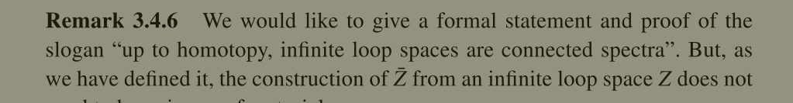
-   List of desired (unobtainable?) properties of SHC
    -   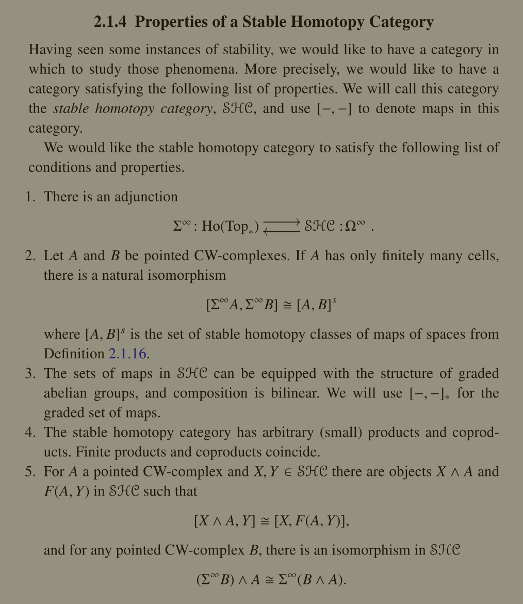
    -   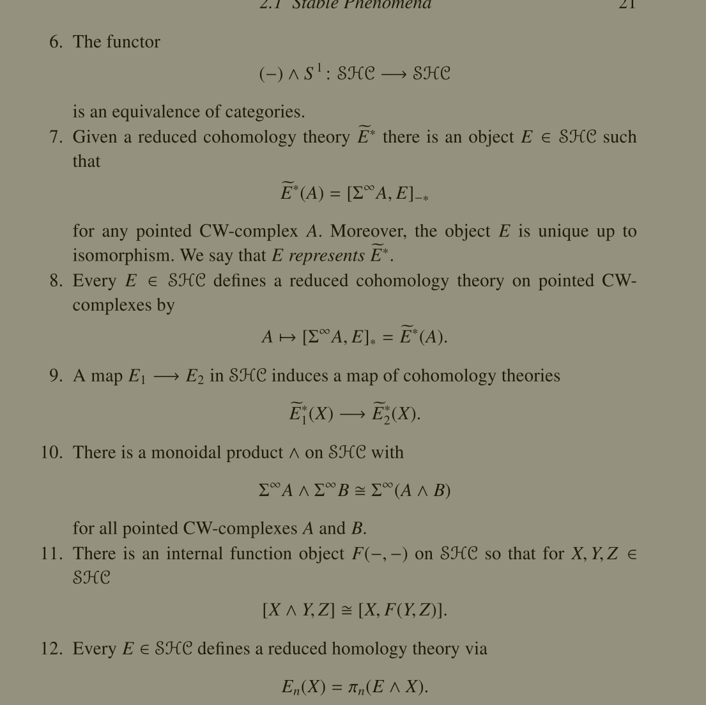
-   Homology as modules over the Steenrod algebra
    -   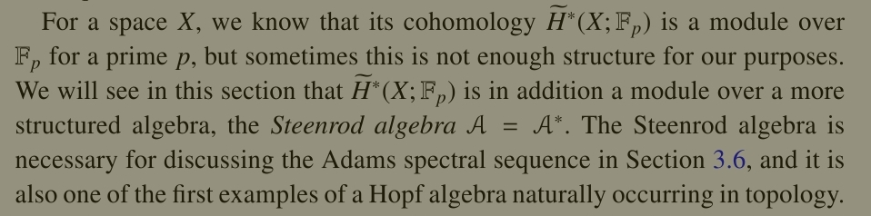
    -   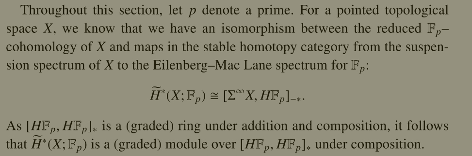
-   Definition of mod $p$ Steenrod Algebra
    -   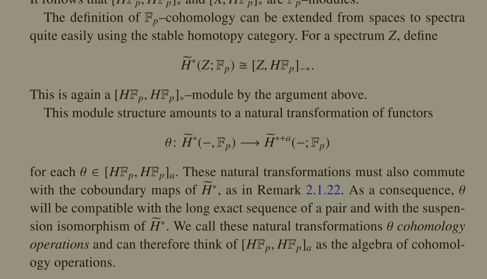
-   Theorem: generated by squares:
    -   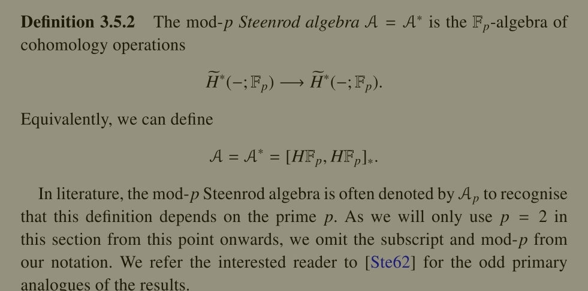
-   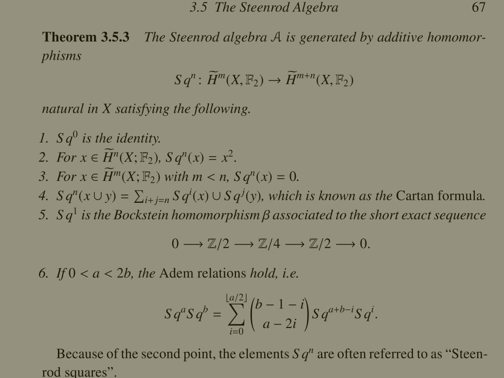
-   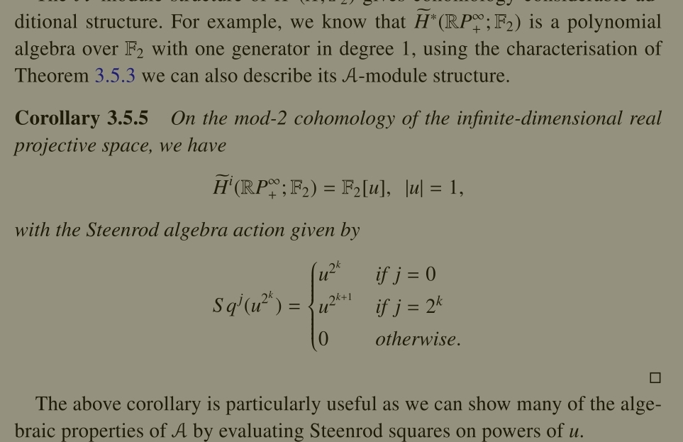
-   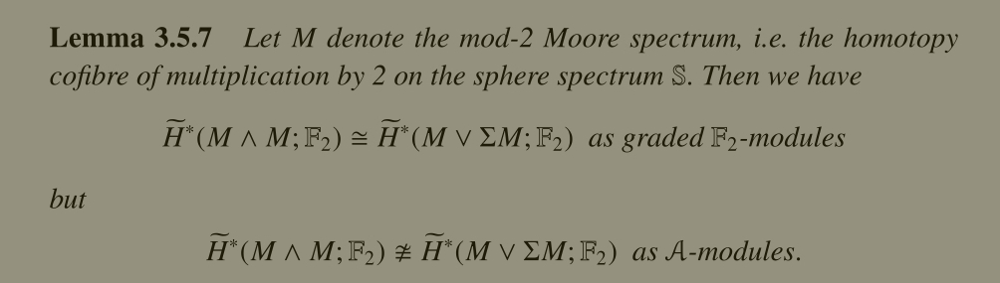
-   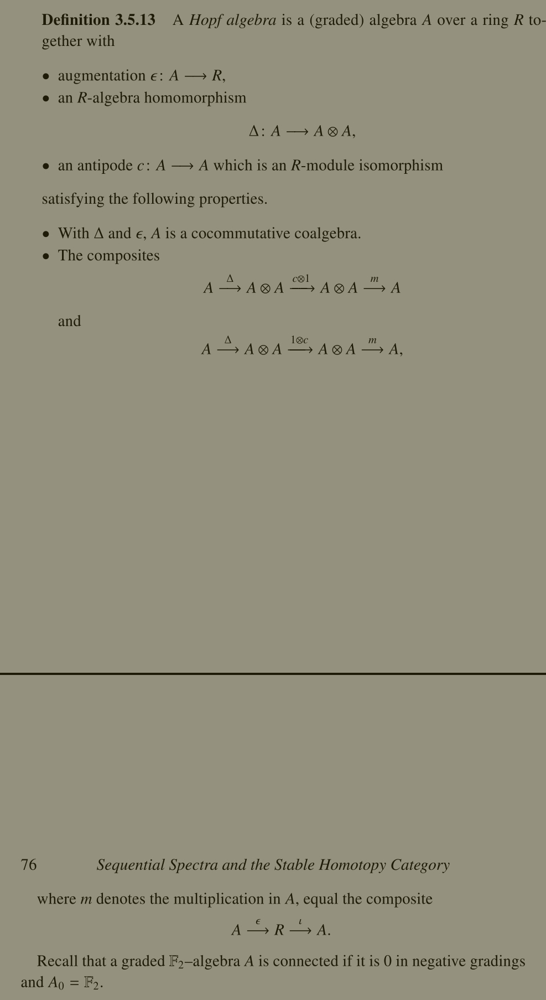
-   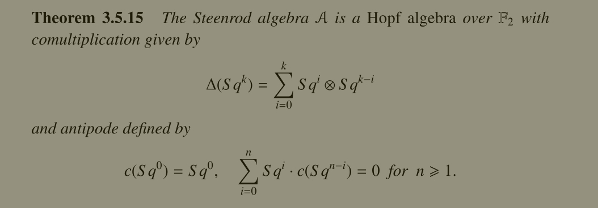
