-   [Barnes and Roitzheim](#barnes-and-roitzheim)
    -   [Setup and Motivation](#setup-and-motivation)
    -   [Construction](#construction)

# Barnes and Roitzheim

Useful extr reference: <http://user.math.uzh.ch/mantovani/research/papers/locandcomp_paperversion.pdf>

## Setup and Motivation

-   To define:

    -   $[X, Y]_*$
    -   $X{ {}^{ \widehat{p} } }$
        -   ${\mathbb{Z}}_{(p)}$: $p{\hbox{-}}$local integers, $\left\{{ {a\over b}, p\notdivides b}\right\} \subseteq {\mathbb{Q}}$.
        -   ${\mathbb{Z}}{ {}^{ \widehat{p} } }$: the $p{\hbox{-}}$adic integers, $\lim_{n\geq 0}{\mathbb{Z}}/p^n$
    -   $E^* E$
    -   $L_E X$
    -   $H^* X$ for $X\in {\mathsf{Sp}}$
        -   $H^* {\mathbb{S}}= {\mathbb{F}}_2$?
    -   ${\mathcal{A}}$ the mod $p$ Steenrod algebra, usually $p=2$.
        -   Defined as ${\mathcal{A}}= [H{\mathbb{F}}_p, H{\mathbb{F}}_p]_*$.
        -   The dual is defined as ${\mathcal{A}} {}^{ \vee }\coloneqq\displaystyle\mathop{\mathrm{Hom}}_{\mathsf{{\mathbb{F}}_p}{\hbox{-}}\mathsf{Mod}}({\mathcal{A}}, {\mathbb{F}}_p)$, with grading ${\mathsf{gr}\,}_n {\mathcal{A}} {}^{ \vee }= \mathop{\mathrm{Hom}}({\mathsf{gr}\,}_n {\mathcal{A}}, {\mathbb{F}}_p)$.
    -   $\pi_n X \coloneqq\colim_k \pi_{n+k} X_k =_? [{\Sigma}^n {\mathbb{S}}, X] =_? [{\mathbb{S}}, X]_{n}$
    -   Generalized homology: $E_nX = \pi_n \qty{E \wedge X} = [{\Sigma}^n {\mathbb{S}}, E\wedge X] =_? [{\mathbb{S}}, E\wedge X]_{n}$
    -   Generalized cohomology: $E^n X \coloneqq[X, E]_{-n} =_? [{\Sigma}^{-n}X, E]$.

-   Spectrum of finite type: finitely generated cohomology in every degree, homotopy groups bounded below in degree.

-   Strategy: 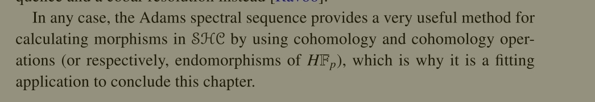

-   General AdSS for usual homology: 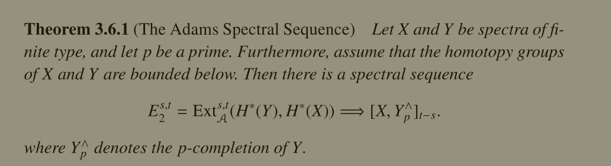

-   Homological version: 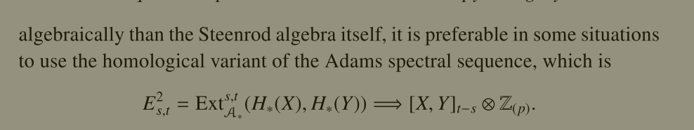

-   Special case for spheres: 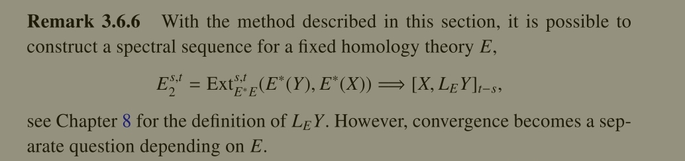

    -   Special case for $FF_2$

-   Product structure on pages: 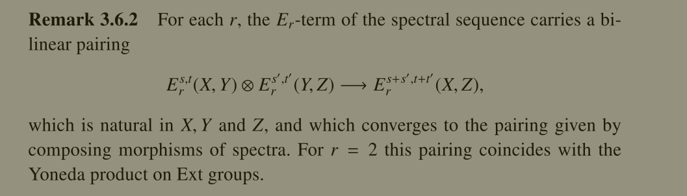

## Construction

-   Definition of Adams tower: 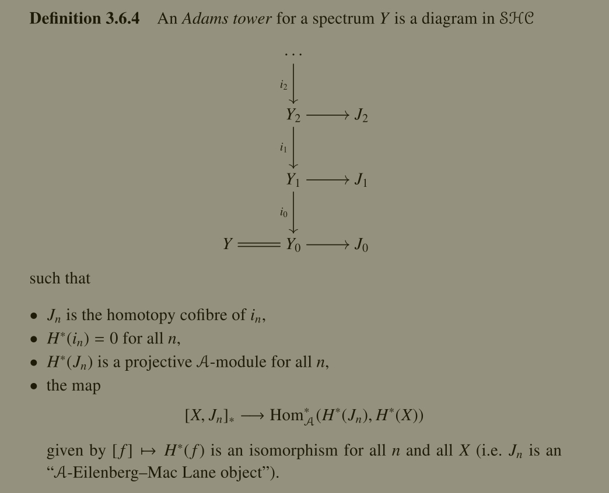
    -   Dual is simpler
-   Construction of Adams tower: 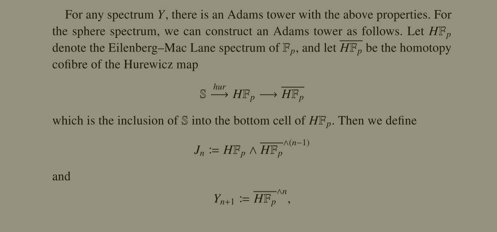
    -   Here $({-})^{\wedge n}$ is the $n{\hbox{-}}$fold smash product. This constructs the "standard Adams tower".
-   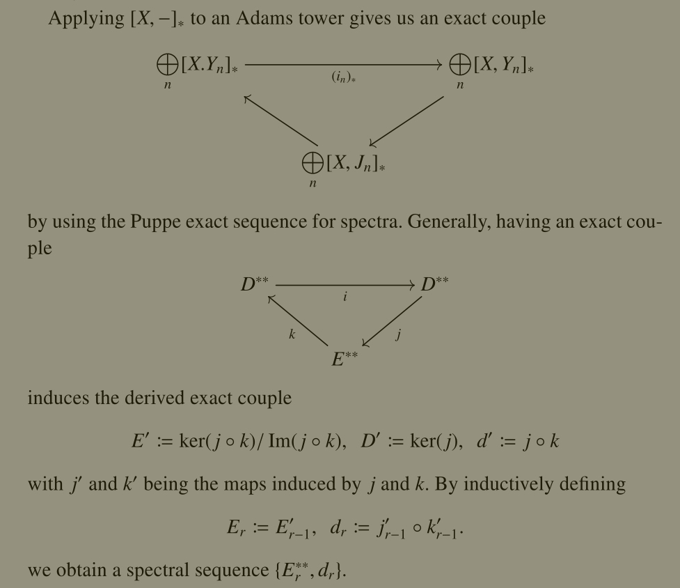
-   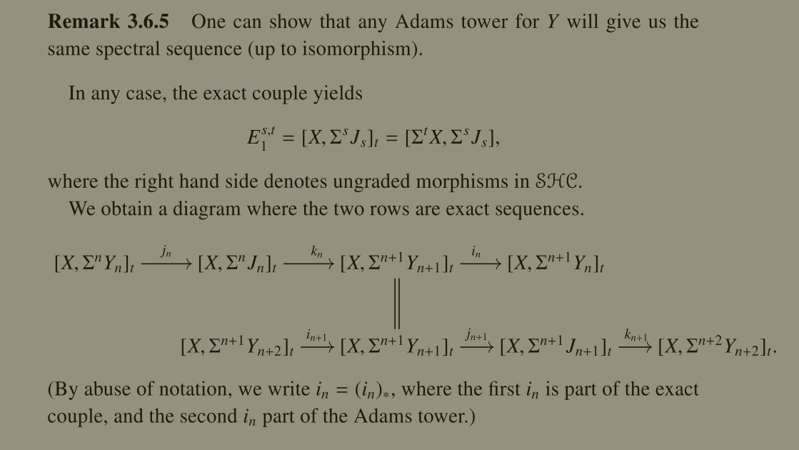
-   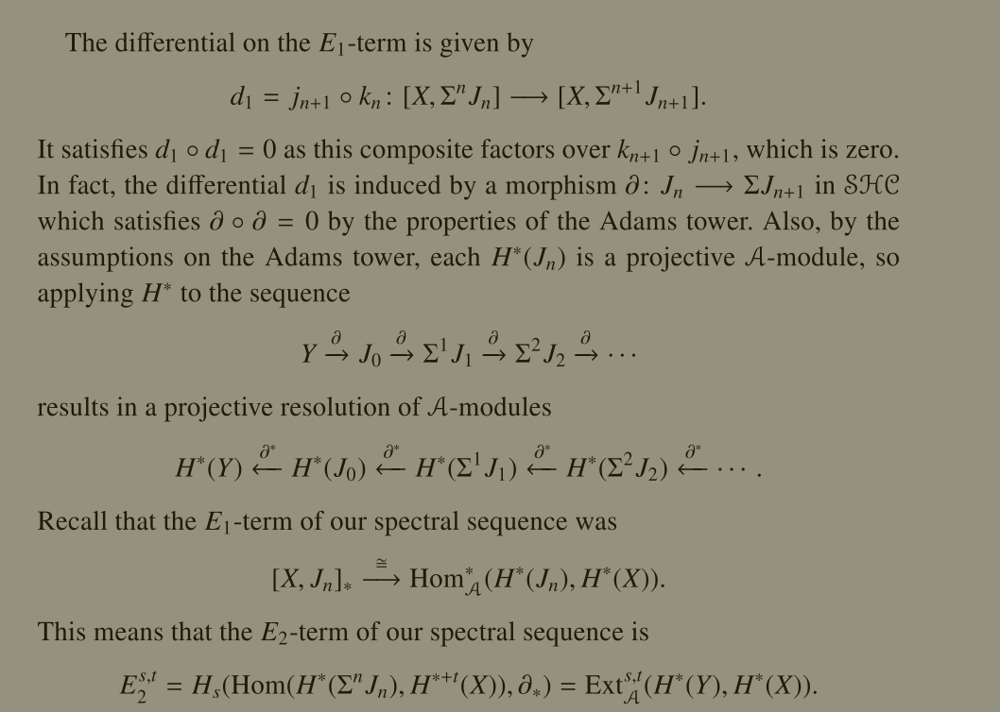
-   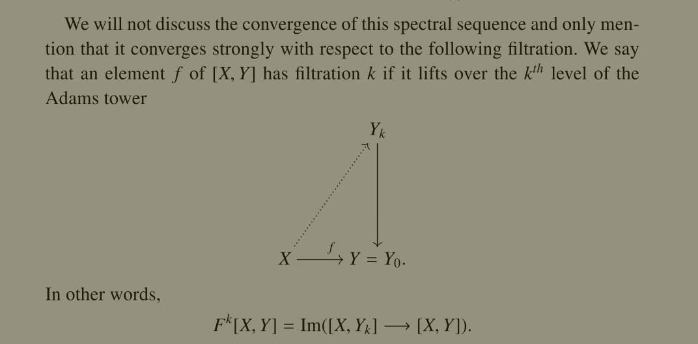
-   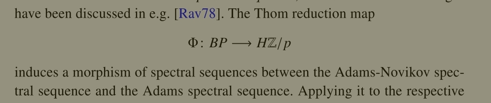
-   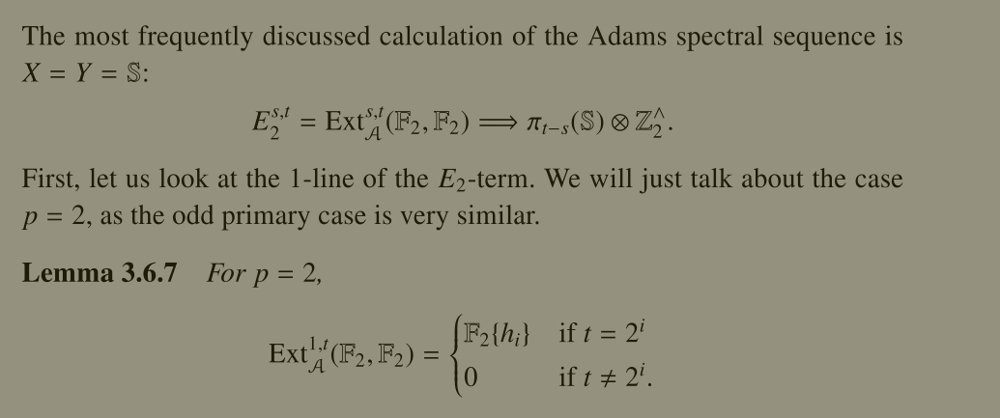
-   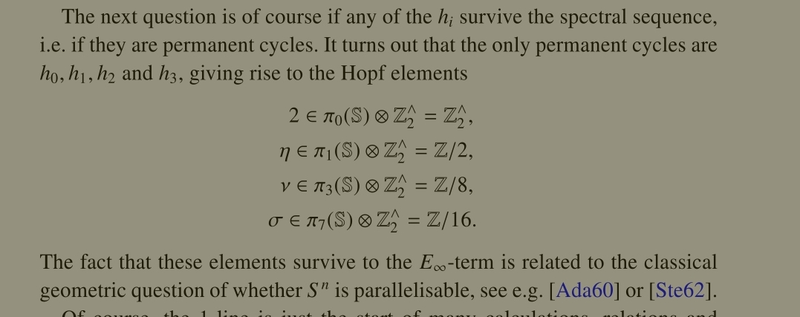
-   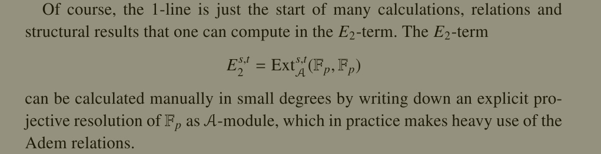
-   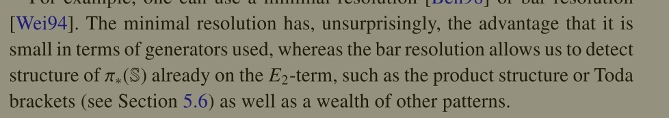
