-   [References](#references)
-   [Intro/Overview](#introoverview)
-   [Definitions](#definitions)
    -   [Algorithm Overview](#algorithm-overview)
    -   [Step 1: Killing Non-disk Regions](#step-1-killing-non-disk-regions)
    -   [Step 2: Converting Regions to Bigons or Squares](#step-2-converting-regions-to-bigons-or-squares)
    -   [Case 1: Reach a Bigon](#case-1-reach-a-bigon)
    -   [Case 2: Smaller Distance](#case-2-smaller-distance)

# References

Tags: \#topology

[Paper: Sarkar-Wang, An algorithm for computing some Heegaard-Floer homologies](https://arxiv.org/pdf/math/0607777.pdf)

[Annals version of the paper](https://annals.math.princeton.edu/wp-content/uploads/annals-v171-n2-p11-s.pdf)

Links: [[../../Unsorted/Floer homology | ../../Unsorted/Floer%20homology.html]]

# Intro/Overview

-   Goals:
    -   Given $Y$ a closed oriented smooth 3-manifold, compute the Heegaard-Floer homology $\widehat{\operatorname{HF}}(Y; {\mathbb{F}}_2) \in {\mathsf{gr}\,}{\mathsf{Ab}}$.
    -   Given $K \hookrightarrow Y$ a knot, compute the knot Floer homology $\widehat{\operatorname{HFK}}(Y, K; {\mathbb{F}}_2)$
-   Strategy: turn **admissible diagrams** into **nice diagrams** using isotopies and handleslides
    -   Note: stabilization not used in this paper.
-   Main theorem:

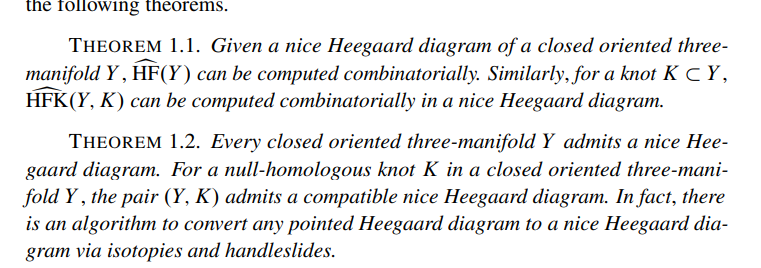

# Definitions

::: {.remark .proofenv}
Use a cylindrical reformulation of $\widehat{\operatorname{HF}}$ due to Lipshitz.
:::

::: {.definition .proofenv title="Floer chain complex"}
Given a pointed Heegaard diagram `

\begin{align*}
( \Sigma, \vec \alpha, \vec \beta, w)
,\end{align*}
`{=html} the generators of $\operatorname{CF}$ are formal sums of points $\mathbf{x} = \sum_{i=1}^{g-k-1} x_i$ where each $\alpha$ curve contains some $x_i$ and each $\beta$ curve contains some $x_j$, and $k$ is the number of basepoints in $\vec w$.
:::

::: {.definition .proofenv title="Region"}
A **region** is a connected component of the complement of the curves, so `

\begin{align*}
R_i \in \pi_0 \Sigma \setminus\left\{{\vec \alpha, \vec \beta}\right\}
.\end{align*}
`{=html} A formal sum of regions is a **2-chain**.
:::

::: {.definition .proofenv title="Positive regions"}
Given 2 generators $\mathbf{x}, \mathbf{y}$ define $\pi_2(\mathbf{x}, \mathbf{y})$ to be the set of all 2-chains $\phi$ satisfying ${{\partial}}^2 \phi = \mathbf{y} - \mathbf{x}$. Call such 2-chains **domains**.

Define $n_p(\phi)$ to be the coefficient of the region $R_i \ni p$, then $\phi$ is a **positive domain** if $n_p(\geq 0)$ for all $p \in \Sigma\setminus\left\{{ \vec \alpha, \vec \beta }\right\}$.
:::

::: {.definition .proofenv title="Admissible diagram"}
Define $\pi_2^0(\mathbf{x}, \mathbf{y})$ to be all domains $\phi$ such that $n_{\vec w} = 0$. A Heegaard diagram $\mathcal{H}$ is **admissible** if for every generator $\mathbf{x} \in \operatorname{CF}$, every positive domain $\varphi\in \pi_2^0(\mathbf{x}, \mathbf{x})$ is trivial.
:::

::: {.definition .proofenv title="Good and bad regions"}
A region is **good** if it is an $n{{\hbox{-}}\mathrm{gon}}$ with $n\leq 4$, and **bad** if $n\geq 5$.
:::

::: {.definition .proofenv title="Badness"}
For a disc region $D$, define the **badness** `

\begin{align*}
b(D) \coloneqq\max\left\{{n-2, 0}\right\}
.\end{align*}
`{=html}

Note

-   $D\in 2{{\hbox{-}}\mathrm{gon}}\implies b(D) = 0$
-   $D\in 4{{\hbox{-}}\mathrm{gon}}\implies b(D) = 0$
-   $D\in 6{{\hbox{-}}\mathrm{gon}}\implies b(D) = 1$
-   $D\in 8{{\hbox{-}}\mathrm{gon}}\implies b(D) = 2$
:::

::: {.remark .proofenv}
Goal: do moves where

-   $d(\mathcal{H}' ) \leq d( \mathcal{H} )$, so total distance doesn't increase.
-   $b( \mathcal{H}' ) \leq b( \mathcal{H} ) -1$, so badness decreases.
:::

## Algorithm Overview

-   Start from an admissible pointed Heegaard diagram, end up with an admissible *nice* pointed Heegaard diagram using isotopies and handleslides on the $\beta$ curves.

-   Overview of strategy:

    -   Isotope all regions to disks
    -   Define a **complexity** for the diagram
    -   Show it's minimized iff all regions *not* containing basepoints are good
    -   Do an isotopy or handleslide that strictly decreases the complexity.

-   Recipe:

    1.  Kill non-disk regions (easier)
    2.  Make all but one region bigons or squares (harder)

## Step 1: Killing Non-disk Regions

::: {.proposition .proofenv title="?"}
Short procedure: ensure every $\alpha$ curve intersects some $\beta$ curve and vice-versa

-   Fix $j$, what is in between $\alpha_j$ and the nearest $\beta$ curve? 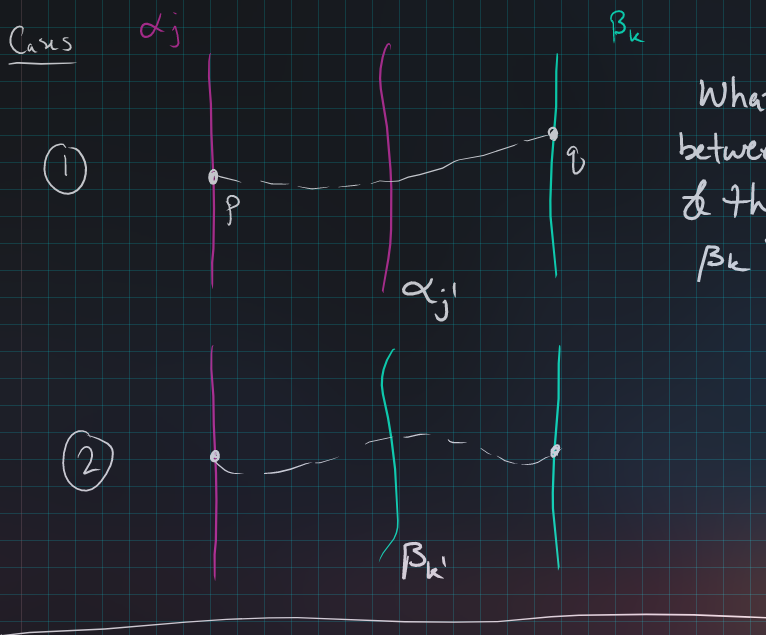
-   Case 1: $\alpha, \alpha, \beta$.
    -   Connect $p$ to $q$, do a finger move of $\beta$ curve to introduce 2 intersections with chosen $\alpha$ 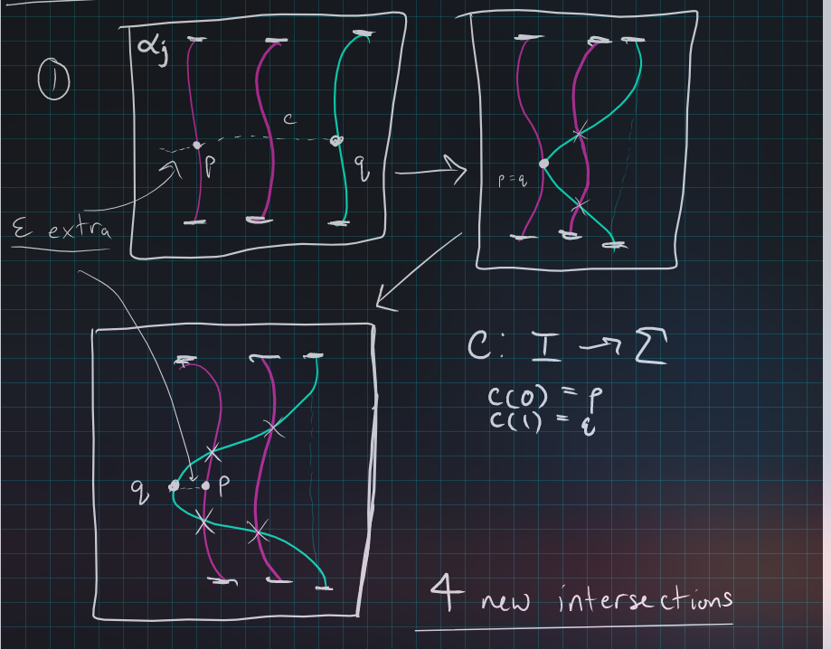

    -   Yields 4 new intersections.
-   Case 2: $\alpha, \beta, \beta$.
    -   Finger move on $\beta$ curve, pulling all other $\beta$ curves with it. 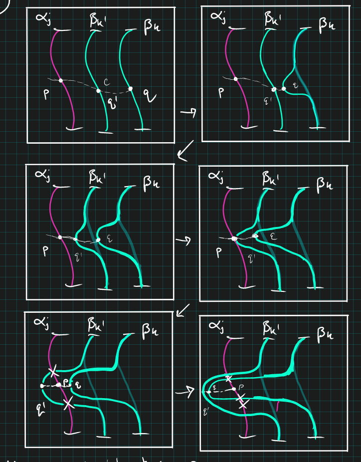
:::

::: {.remark .proofenv}
Now every $\alpha_j$ intersects some $\beta_k$ All non-disk regions have $\geq 2$ boundary components, so we'll try to reduce the number of boundary components to one. Problem: poly-annuli regions

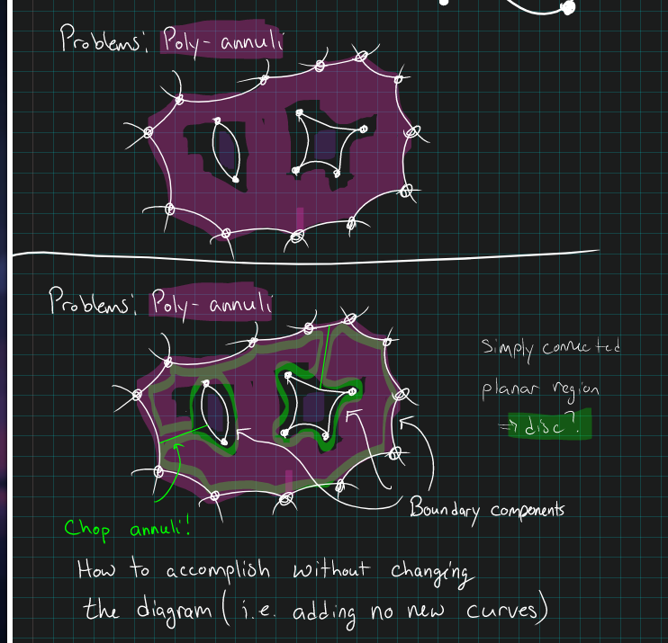

How to fix: 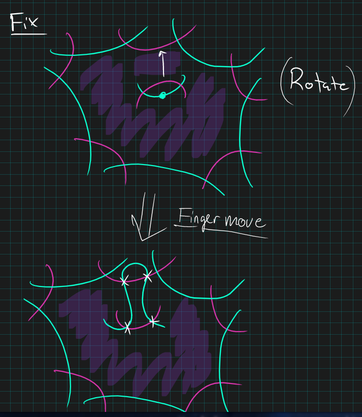

-   Creates no new non-disks
-   Decreases number of boundary components by 1.
-   Repeat until equal to 1.
:::

## Step 2: Converting Regions to Bigons or Squares

Now all regions are discs.

::: {.warnings .proofenv}
$\alpha$ curves should be red, $\beta$ should be blue!
:::

::: {.definition .proofenv title="Total Distance"}
For a Heegaard diagram $\mathcal{H}$ define the **distance** of $D$ as `

\begin{align*}
d(D) \coloneqq\min \left\{{ \# (\gamma\cap\vec\beta) {~\mathrel{\Big|}~}w'\in D, w \xrightarrow{\gamma} w', \gamma\in \vec\alpha^c }\right\} \in {\mathbb{Z}}_{\geq 0}
.\end{align*}
`{=html}

This is the smallest number of intersection points on any arc connecting the basepoint $w$ to $w'\in D$. Define the **total distance** `

\begin{align*}
d( \mathcal{H}  ) \coloneqq\max\left\{{ d(D)}\right\} \in {\mathbb{Z}}_{\geq 0}
.\end{align*}
`{=html}
:::

::: {.example .proofenv title="?"}
Computing the distance via a path.

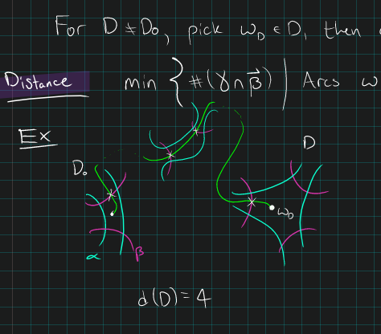

Can only cross $\beta$ curves, need to stay in $\vec \alpha^c$.
:::

::: {.definition .proofenv title="Distance $d$ complexity"}
For a fixed distance $d$ define the **distance $d$ complexity** as `

\begin{align*}
c_d \coloneqq{\left[ { \sum b(D_i), -b(D_1), -b(D_2), \cdots} \right]}
&&
b(D_1) \geq b(D_2) \geq \cdots
\end{align*}
`{=html} For a fixed $d$, order various $c_d( \mathcal{H}' )$ lexicographically.
:::

::: {.theorem .proofenv title="?"}
Main theorem

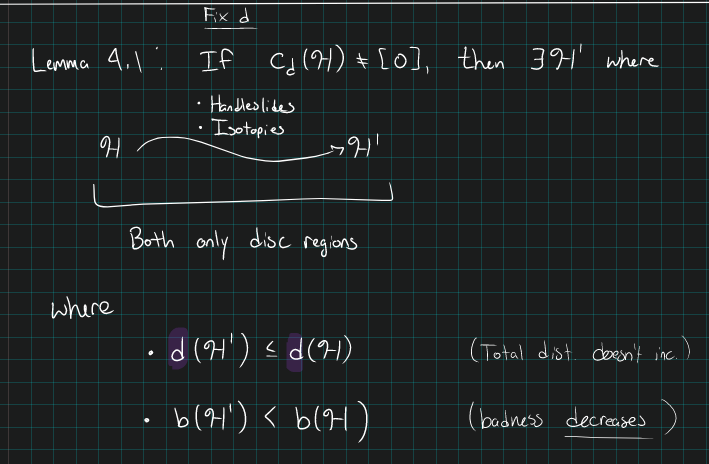
:::

::: {.proposition .proofenv title="?"}
Setup: fix $D_0$ to be the region containing the basepoint, $D_m$ to be the least bad region. Find an adjacent region $D_*$ with 1 smaller distance:

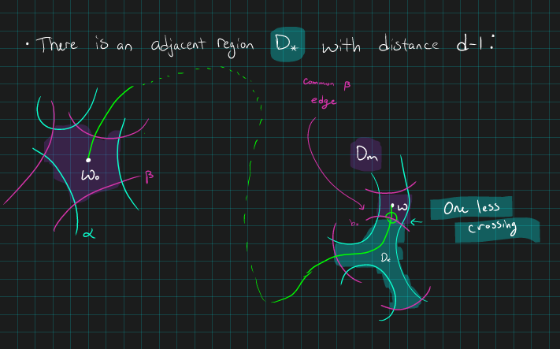

Idea: we will finger move $b_*$ through $D_m$ to reduce the badness of $D_m$:

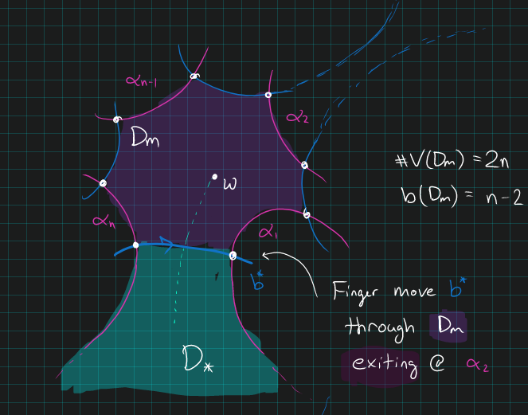

Look at what happens locally: we introduce some new regions, usually less bad:

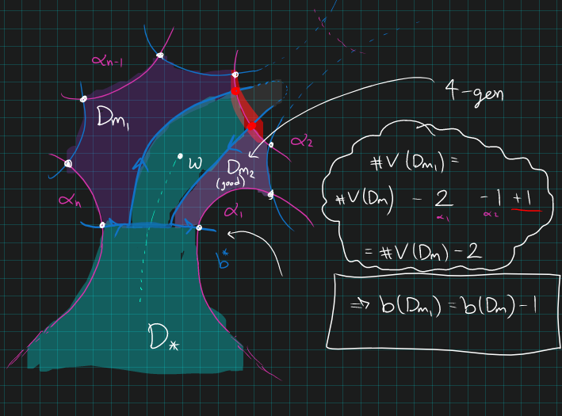
:::

::: {.proposition .proofenv title="?"}
We can push through $4{{\hbox{-}}\mathrm{gon}}$ regions:

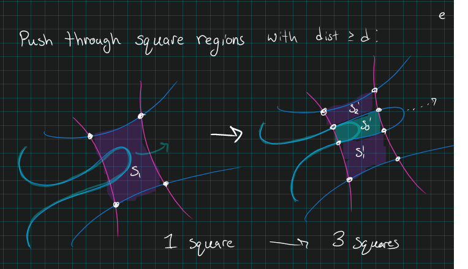

So continue, then do some casework:

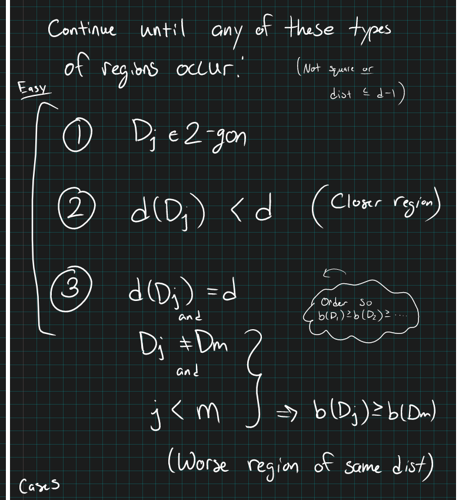
:::

## Case 1: Reach a Bigon

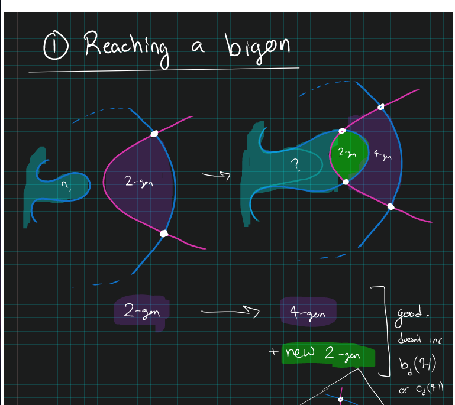

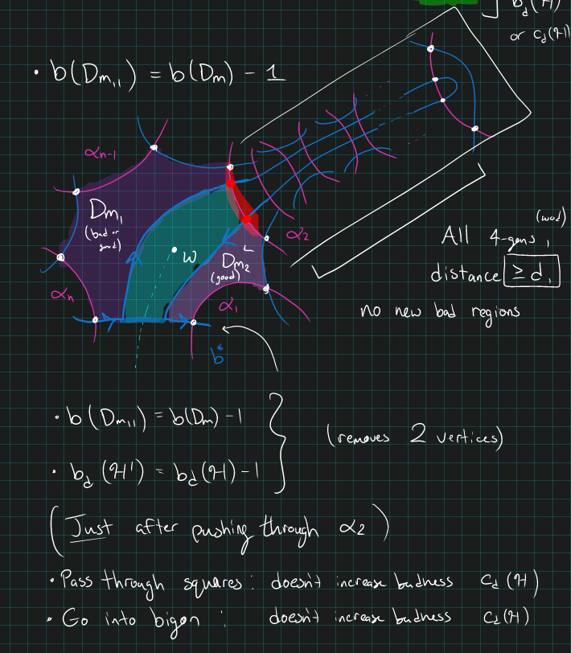

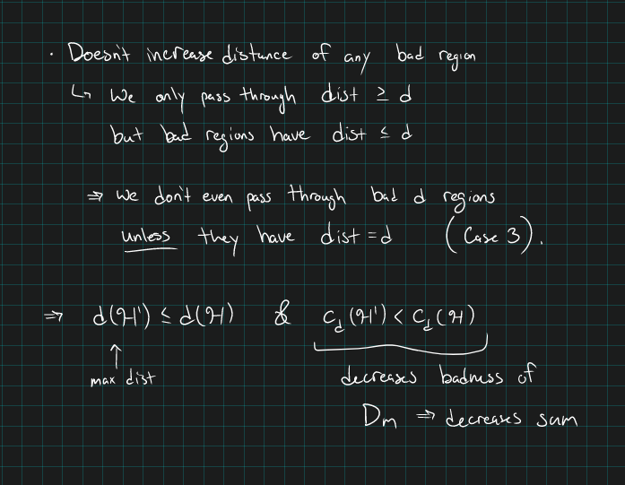

## Case 2: Smaller Distance

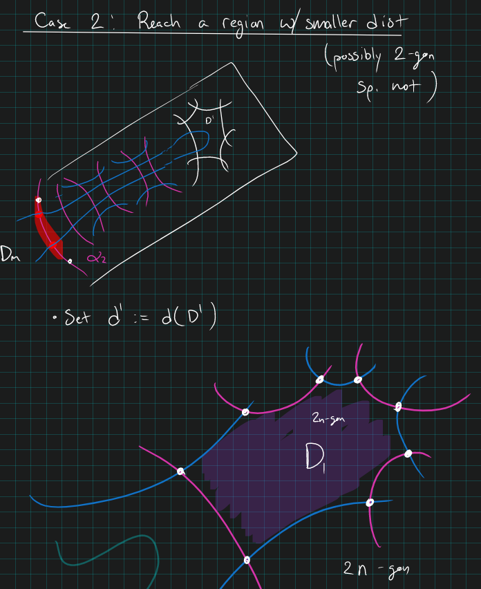

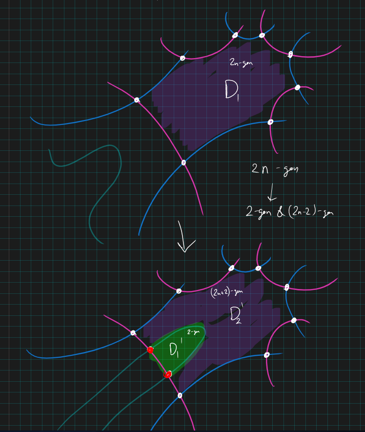

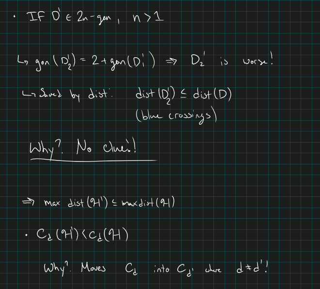
