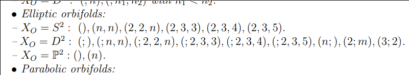

Error on 1

{ ["2"] = exit,["3"] = 1,} 
\documentclass{standalone}
\input{/home/zack/.pandoc/custom/preamble_common}
\begin{document}
\nopagecolor
\begin{tikzcd}
{\mathbb{C}}
  \ar[r] 
& 
\bigwedge\nolimits^p T {}^{ \vee }X
  \ar[d] 
\\
& 
X 
\end{tikzcd}
\end{document}
-   [References](#references)
-   [Basics](#basics)
-   [Elliptic Orbifolds](#elliptic-orbifolds)

References
==========

-   Survey Paper: Anton Zorich, [Flat Surfaces](https://arxiv.org/abs/math/0609392)

-   Alex Eskin, Andrei Okounkov, [Asymptotics of numbers of branched coverings of a torus and volumes of moduli spaces of holomorphic differentials](https://arxiv.org/abs/math/0006171)

-   Alex Eskin, Howard Masur, Anton Zorich, [Moduli Spaces of Abelian Differentials: The Principal Boundary, Counting Problems and the Siegel--Veech Constants](https://arxiv.org/abs/math/0202134)

-   Alex Eskin, Andrei Okounkov, [Pillowcases and quasimodular forms](https://arxiv.org/abs/math/0505545)

-   Vincent Delecroix, Elise Goujard, Peter Zograf, Anton Zorich, [Contribution of one-cylinder square-tiled surfaces to Masur-Veech volumes](https://arxiv.org/abs/1903.10904)

    -   See Phil for appendix!

-   Engel, [Hurwitz Theory of Elliptic Orbifolds, I](https://arxiv.org/abs/1706.06738)

-   Engel, [Hurwitz Theory of Elliptic Orbifolds, II](https://arxiv.org/abs/1809.07434)

-   A. Eskin

-   G. Forni

-   P. Hubert and T. Schmidt

-   H. Masur

-   H. Masur and S. Tabachnikov

-   J. Smillie

Basics
======

::: {.fact .proofenv}
For $\Sigma_g$ a genus $g$ surface, the Poincaré polynomial and the Euler characteristic are given by `

\begin{align*}
p(z) = 1 + (2g)z + z^2 && \chi(\Sigma_g) = 2-2g
.\end{align*}
`{=html}
:::

::: {.definition .proofenv title="Ramified, branch points, ramification index"}
A map $Y \xrightarrow{f} X$ of Riemann surfaces is said to be **ramified** at a point $p\in Y$ iff in local charts $f$ has the form $z\mapsto z^n$ for some $n\geq 2$. Note that in this case, in charts $q\coloneqq f(p)$ has exactly one preimage and $\# f^{-1}(q') = n$ for all $q'$ in a punctured neighborhood of $q$. The number $e_p \coloneqq n$ referred to as the **ramification index** of $f$ at $p$.

The set of points where $f$ is ramified, sometimes denoted $R_f \subseteq Y$, is referred to as the **ramification locus**. Its image $B_f \coloneqq f(R_f) \subseteq X$ is referred to as the **branch locus**.
:::

::: {.theorem .proofenv title="Well-definedness of degree"}
If $Y \xrightarrow{f} X$ is a (possibly ramified) covering, then `

\begin{align*}
x_1, x_2, \in B_f^c \implies
\# f^{-1}(x_1) = \# f^{-1}(x_2)
.\end{align*}
`{=html} This common number $d$ is referred to as the **degree** of $f$.
:::

::: {.proposition .proofenv title="Euler characteristic is multiplicative in unramified covers"}
If $Y\xrightarrow{f} X$ is an unramified covering map of degree $d$, then `

\begin{align*}
\chi(Y) = d\cdot \chi(X)
.\end{align*}
`{=html}
:::

::: {.theorem .proofenv title="Riemann-Hurwitz"}
If $Y\xrightarrow{f}X$ is a ramified covering map of degree $d$, define the correction term `

\begin{align*}
\delta_f \coloneqq\sum_{p\in R_f} \qty{e_p - 1}
.\end{align*}
`{=html} Then `

\begin{align*}
\chi(Y) = d\cdot  \chi(X) - \delta_f
.\end{align*}
`{=html}
:::

::: {.remark .proofenv title="Other useful forms"}
There are several other useful forms: `

\begin{align*}
2g(Y) - 2 &=  d\cdot (2g(X) - 2)  - \delta_f\\
2- 2g(Y) &=  d\cdot (2-2g(X))  + \delta_f \\
\chi(Y) - \# R_f &= d \cdot (\chi(X) - \# B_f)
.\end{align*}
`{=html}
:::

::: {.remark .proofenv}
In everything that follows, we take $TX, T {}^{ \vee }X$ to be *holomorphic* tangent/cotangent bundles.
:::

::: {.definition .proofenv title="Holomorphic forms"}
A holomorphic $p{\hbox{-}}$form on $X$ is a section of the sheaf $\Lambda^p T {}^{ \vee }X$, the $p$th exterior power of the holomorphic cotangent bundle of $X$: `

\begin{align*}
\Omega^p_X \coloneqq\Omega_{\mathop{\mathrm{Hol}}}^p(X) &\coloneqq\bigwedge\nolimits^p T {}^{ \vee }X && \in{\mathsf{Sh}}_{/X}\\
\Omega^p_X(X) &\coloneqq{{\Gamma}\qty{\bigwedge\nolimits^p T {}^{ \vee }X} }
.\end{align*}
`{=html}

$0{\hbox{-}}$forms are global holomorphic functions on $X$. For general $p$, in coordinates we have `

\begin{align*}
\omega \in \Omega^p_X \implies \omega = 
\sum f_I(\mathbf{z}) \bigwedge dz_I
\end{align*}
`{=html} for some holomorphic functions $f_I: {\mathbb{C}}^n \to {\mathbb{C}}$.
:::

::: {.definition .proofenv title="Canonical Bundle"}
It is a theorem that taking the top exterior power yields a line bundle:

`
 
`{=html}

The **canonical bundle** is defined by as this top exterior power. Letting $n\coloneqq\dim_{\mathbb{C}}X$, `

\begin{align*}
K_X = \omega = \Omega^{n}_X &&\in {\mathsf{Sh}}_{/X}
.\end{align*}
`{=html}
:::

::: {.remark .proofenv}
For vector bundles, the top exterior power is referred to as the **determinant bundle**.
:::

::: {.remark .proofenv}
A holomorphic $n{\hbox{-}}$form is precisely a section of the canonical bundle.
:::

::: {.fact .proofenv}
If $M$ is a smooth manifold, then $\omega$ has a global section.
:::

::: {.theorem .proofenv title="Riemann-Roch"}
![[Projects/Current%20Projects/0100_Reading%20with%20Phil%20Summer%202021/Tilings/sections/figures/2021-06-14_01-49-30.png]]
:::

::: {.exercise .proofenv title="?"}
For $\Sigma_g$ a compact Riemann surface of genus $g$, the dimension of the space of holomorphic sections of the canonical bundle, i.e. the space of holomorphic differentials on $\Sigma_G$, is given by $\dim H^0(X; \Omega) = g$ (the genus of the surface).

> Hint: use Riemann-Roch.
:::

::: {.definition .proofenv title="Hurwitz Space"}
?
:::

::: {.definition .proofenv title="Hurwitz Number"}
?
:::

::: {.definition .proofenv title="Abelian differential"}
:::

::: {.definition .proofenv title="Orbifold"}
:::

::: {.definition .proofenv title="Moduli spaces of complex structures on a genus $g$ surface"}
:::

::: {.fact .proofenv}
Conformal (or equivalently complex) structures on a genus $g$ surface form a moduli space ${\mathcal{M}}_g$ of dimension $3g-3$ for $g > 1$.
:::

::: {.definition .proofenv title="Moduli space of abelian differentials"}
:::

::: {.fact .proofenv}
Let $\alpha$ be any partition of $2g-2$, and ${\mathcal{H}}(\alpha)$ the moduli space of pairs $(\Sigma_g, \omega)$ where $\Sigma_g$ is a Riemann surface of genus $g$ and $\omega$ is a holomorphic 1-form (Abelian differential) on $M$ with the orders of its zeros given by $\alpha$.

Letting ${\mathcal{H}}$ be the moduli space of all abelian differentials on Riemann surfaces of genus $g$ is stratified by ${\mathcal{H}}(\alpha)$ as $\alpha$ ranges over all partitions.
:::

::: {.example .proofenv title="?"}
For flat tori, ${\mathcal{H}}= \operatorname{GL}_+(2, {\mathbb{R}})/{\operatorname{SL}}(2, {\mathbb{Z}})$.
:::

::: {.definition .proofenv title="Moduli space of quartic differentials"}
:::

Fact: - $K_{{\mathbb{P}}^n} = {\mathcal{O}}(-n-1)$

Elliptic Orbifolds
==================

::: {.remark .proofenv}
Classification of elliptic orbifolds of dimension 2:

Define $(n_1, \cdots; m_1, \cdots)$ as the *profile*, where $n_i$ are *elliptic* points (locally look like quotient by ${\mathbb{Z}}/n{\mathbb{Z}}$), and $m_i$ are *corner reflectors* (locally look like quotient by a dihedral group):

\
:::

::: {.fact .proofenv}
For $\Sigma_g$ a Riemann surface, there is a formula (Gauss-Bonnet in the flat metric) relating the degrees of the zeros of a holomorphic 1-form to the genus: `

\begin{align*}
\sum d_j = 2g-2
.\end{align*}
`{=html}
:::
