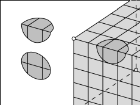

# Notes on Paper

## Background, Definitions, References

Reference: <https://arxiv.org/abs/math/0609392](https://arxiv.org/abs/math/0609392>

:::{.definition title="Geodesic"}
?
:::

:::{.definition title="Ergodic"}

:::

:::{.definition title="Holonomy"}
Holonomy and Holonomy group (todo)
:::

:::{.definition title="Translation Surface"}
A translation surface is closed orientable surface with a flat metric, a finite number of conical singularities, and trivial linear holonomy.
:::

:::{.definition title="Half-translation surface"}
A half-translation surface is a surface with a flat metric and holonomy group $\ZZ/(2)$.
:::

## Section  1

Flat surfaces are characterized as surfaces with a flat metric and (finitely many?) cone-like singularities.
These surfaces appear to be isomorphic to moduli spaces of holomorphic 1-forms.
It is profitable to study the orbit of the surface under the Teichmüller geodesic flow, as well as a $\GL_n$ action.

We usually associate

- Constant positive curvature = $S^2$
- Constant zero curvature = $S^1 \cross S^1 \definedas T^1 = \Sigma_1$
- Constant negative curvature = $\Sigma_g$ for $g\geq 2$, a surface of higher genus

**Proposition:**
Any surface can be given a flat metric, possibly introducing singular points.

> Idea: Push all of the curvature into a cone point.

:::{.example title="?"}
The standard cube embedded in $\RR^3$.

This is a flat surface with 8 cone points located at the vertices.
Note that the metric is non-degenerate on the edges, since any neighborhood of a point on an edge is still homeomorphic to $\RR^2$:

Any neighborhood of a vertex is isometric to the vertex of the usual notion of a cone.
The cone angle can be measured by cutting a cone from the base to the vertex, yielding a flat pattern that sits in $\RR_2$, and measuring the "missing" angle in the resulting circle:

This shows that the cone angle of the cube is $3\pi/2$, which coincides with the fact that there are 3 square (and thus 3 right angles) adjacent to any cone point.

:::

> Here this means that a typical geodesic will visit any region in phase space and time spent in a region is proportional to volume.

:::{.problem title="?"}
General (wildly open) problems:

- Describe the behavior of a generic geodesic on a surface
- Prove that the geodesic flow is ergodic on a typical flat surface
- Does almost every surface have a closed geodesic that does not pass through singular points?
  - If so, how many?
  - Find the (asymptotic) number of such closed geodesics of length shorter than $L$

This remains unsolved for $S^2$ with 3 singularities (equivalent to a certain billiards problem). 
It is not even known if any flat sphere admits a single closed geodesic.

:::

:::{.remark}
Flat surfaces have nontrivial holonomy, which makes them resemble Riemannian manifolds more than flat tori.

If we take the surface and puncture the conical points, it is locally isometric to the punctured Euclidean plane.
This allows a notion of parallel transport of tangent vectors.

- Parallel transports along homotopically trivial loops are always the identity; otherwise, for homotopically nontrivial loops this rotates the vector by some angle.
- Parallel transport around a cone point rotates by exactly the cone angle.
- Nontrivial holonomy forces geodesics to self-intersect many times.

> Exercise: parallel transport a vector around the cone point of a cube.

The flat torus has trivial linear holonomy -- all geodesics either close up, or never self-intersect and produce a dense winding path.

:::

:::{.remark}
Note that trivial linear holonomy implies that cone angles are all integer multiples of $2\pi$.

Convention: we assume all flat surfaces come with a distinguished direction.
:::

:::{.remark}
Billiards gives rise to a flat surface with nontrivial linear holonomy. 
In this case, a vector $\vector v$ may come back as $-\vector v$ after parallel transport.
:::

:::{.remark}
We'll often consider families of flat surface sharing the same genus and number/type of conical singularities.
These will correspond to strata of moduli spaces of one-forms.

It will often be useful to let $\SL(2, \RR)$ act on these families, consider the orbits, and take its closure.

:::

:::{.conjecture}
Central problem / conjecture:

Taking the closure of an orbit under the action of $\GL^+(2, \RR)$ is a complex subvariety, so both the moduli space of holomorphic one-forms and the moduli space of quadratic differentials resemble homogeneous spaces under the action of a unipotent group.
:::

:::{.remark}
The there is a projection from these orbits (Teichmüller discs)  to the moduli space of complex structures (?), which will be denoted $\MM_g$.
It is well-known that moduli spaces are not homogeneous spaces, but the conjecture here is that they behave as if they were.
:::

## Section 2: Motivations

:::{.problem title="?"}
Open problems in rectangular billiards:

1. Describe the behavior of a billiard trajectory in a generic triangle, and prove that the billiard flow is ergodic.
2. Does (almost) any table have at least one regular periodic trajectory? Is it preserved under deformations?
3. Asymptotically in length, how many periodic trajectories are there? 
4. Does any obtuse triangle have a single periodic trajectory?

:::

:::{.example title="?"}
Known example:
acute triangles have at least 1, see Fagnano trajectory 
:::

- Fox-Kershner construction
  - Yields a way to go from billiard trajectories to geodesics on a flat surface.
  - General idea: glue two copies of the billiard table along the edge to get a flat sphere; then paths lift to geodesics.
  - Such surfaces are not "very flat", i.e. they have nontrivial linear holonomy.
