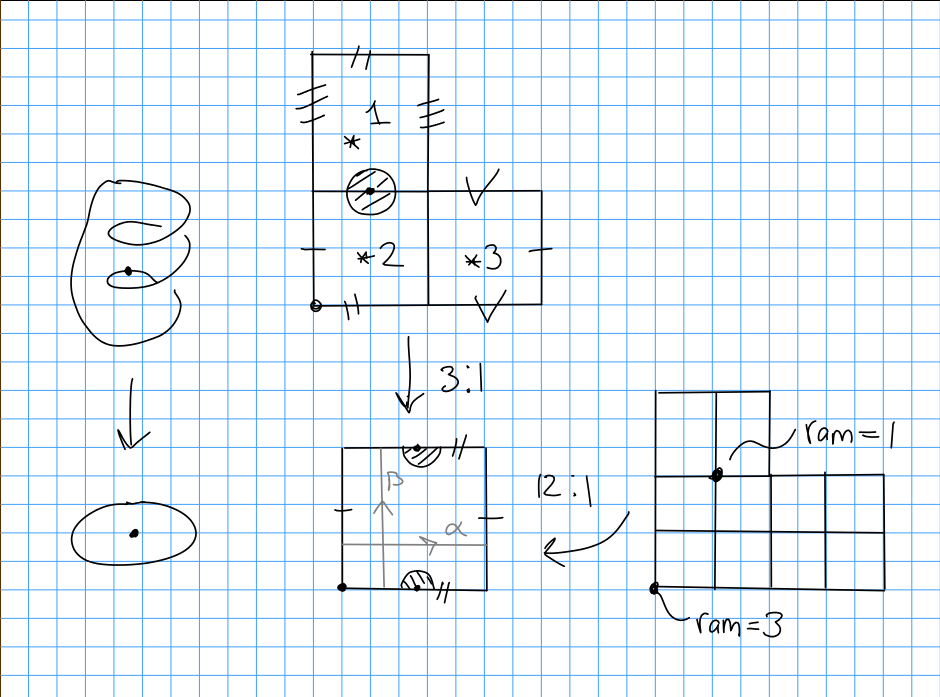
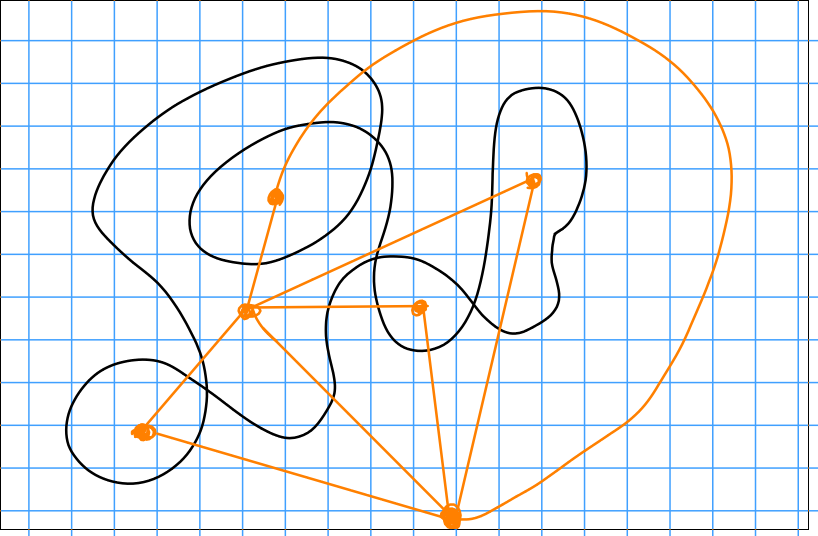
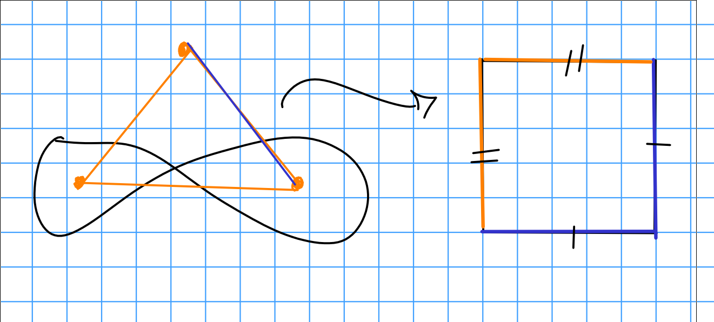
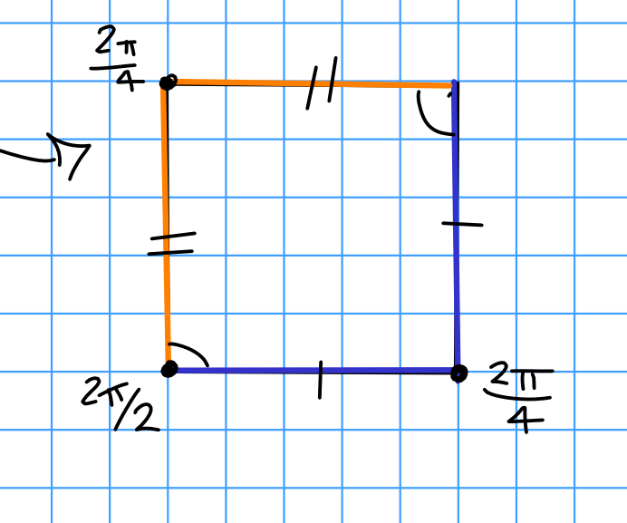
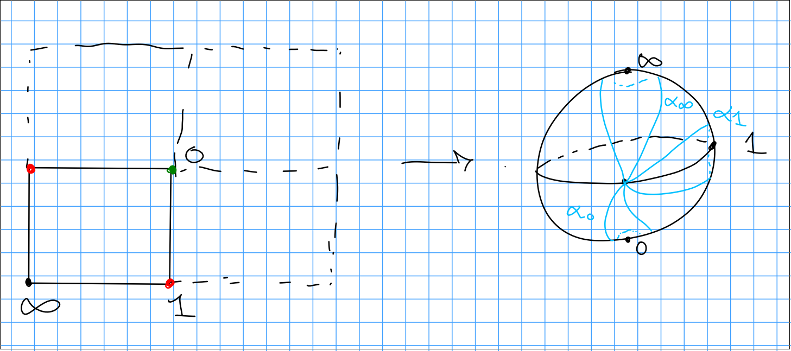

-   [Thursday January 23rd](#thursday-january-23rd)
    -   [Counting Square Tiled Surfaces](#counting-square-tiled-surfaces)
    -   [Open Questions](#open-questions)

[[Tilings | ../Tilings%20VRG.html]]

# Thursday January 23rd

## Counting Square Tiled Surfaces

Square tiled surfaces in ${\mathcal{H}}(k)$ with $d$ squares correspond to degree $d$ branched covers of the identification square, branched over the origin, with profile (?).

To count square-tiled surfaces: label squares, look at inverse images of $\ast$ by $\left\{{1 ,\cdots, d}\right\}$. Consider the monodromy [[representation | ../../../../../Unsorted/Representation%20theory.html]] $\rho: \pi_1( {\mathbb{T}}\setminus \left\{{0}\right\}, \ast ) \to S_d$ where $\sigma = \rho(\alpha) = (1)(23)$ and $\tau = \rho(\beta) = (12)(3)$. We compute ramification orders by considering the commutators $[\alpha, \beta]$. Then $\rho([\alpha, \beta] )$ has cycle type $(1, 1, \cdots 1, 1+k, \cdots, 1+ k_n)$. Note that $[(23), (12)]$ is a 3 cycle.

\

**Conclusion:** The number of square-tiled surfaces in ${\mathcal{H}}(k)$ with $d$ squares is exactly `

\begin{align*}
\frac{1}{d!} {\left\lvert {\left\{{\sigma, \tau \in S_d {~\mathrel{\Big|}~}[\sigma, \tau] \in C_{1, \cdots, 1, 1+k, \cdots, 1+ k_n}}\right\}} \right\rvert}
.\end{align*}
`{=html}

Note that the division is due to the artificial labeling of squares.

**Main theorem from "Branched Covers of Torus" Paper:** The generating function `

\begin{align*}
f_\kappa(q)\coloneqq\sum_{d\geq 1} \#\left\{{\text{Square tiled, $d$ squares in ${\mathcal{H}}(k)$}}\right\} q^d
\end{align*}
`{=html} is a **modular form**.

Follows from taking $q = e^{2\pi i \tau}$ which is holomorphic on ${\mathbb{H}}$ the upper half-plane, satisfying a transformation rule with respect to $\tau \mapsto -1/\tau$, which is a finite-dimensional space.

> Actual: quasimodular mixed form.

The weights are bounded by ${\left\lvert {\kappa } \right\rvert}+ \ell(\kappa)$.

Concretely, $f_\kappa \in {\mathbb{Q}}[E_2, E_4, E_8]$ where $E_k(q) = \text{const} + \sum_{d \geq 1} \sigma_{k-1}(d) q^d$, where $\sigma_{k-1}(d) = \sum_{e\mathrel{\Big|}d} e^{k-1}$. This is the ring of quasimodular forms.

-   $1$ is weight 0,
-   $E_2$ is weight 2,
-   $E_2^2, E_4$ are weight 4,
-   $E_2^3, E_2 E_4, E_6$ are weight 6, etc

*Example:* Take $\kappa = \left\{{2}\right\} \iff {\mathcal{H}}(2)$, then ${\left\lvert {\kappa } \right\rvert}+ \ell(\kappa) = 3$ and $f_{\left\{{z}\right\}}(q) = c_1 + c_2 E_2(q)$. In this case $[q^1] = [q^2] = 0$.

Note that surfaces in ${\mathcal{H}}(2)$ have 1 vertex of cone angle $6\pi$ and all others of angle $2\pi$, corresponding to an abelian differential with a single zero of order 2.

A special type of square-tiled surfaces: 1 cylinder surfaces, where $\rho(\alpha)$ is a full length cycle.

This is in ${\mathcal{H}}(3, 1)$, and corresponding surface $(\Sigma, \omega)$, which is a holomorphic 1-form with a triple zero and a single zero. By Riemann-Hurwitz, $2g-2 = \deg \omega = 3+1 \implies g = 3$.

> Note: the genus here difficult to compute otherwise!

**Main Result of 1-Cylinder Surface Paper:** 1-cylinder surfaces have roughly a $1/d$ proportion in all square tiled surfaces, where $d = \dim {\mathcal{H}}(\kappa)$.

Recall that we can get a square tiled surface from any unicursal curve:

\

Note that these aren't always translation surfaces:

\

This has transition maps that looks like $z \mapsto i^k z + z_0 = w$ and thus $dz = i^k dw$, so $dz^k$ is the well-defined object here.

Recall

-   $(\Sigma, dz) \iff$ translation surfaces
-   $(\Sigma, (dz)^2) \iff \frac 1 2 {\hbox{-}}$translation surfaces
-   $(\Sigma, (dz)^4) \iff \frac 1 4{\hbox{-}}$translation surfaces
    -   I.e. a Riemann surface with a section of $K_{\varepsilon}^{\otimes 4}$.

Can consider a *tricursal* curve instead (a curve that requires lifting the pen 3 times). Taking the dual complex yields a cube.

\

This has charts $w = z^{4/3}$ and thus $(dz)^4 = w^{-1}(dw)^4$. Let ${\mathcal{H}}(\kappa)$ be the quartic differentials with $dv \omega = \sigma \kappa_i p_i$. Then the cube is in ${\mathcal{H}}_4(-1, \cdots -1)$ with $8$ copies of $-1$.

This gives cone angles $n \frac{2\pi}{4}$ and the order of the zero/pole is $n-4$.

This example is in ${\mathcal{H}}_4(-3, -3, -2)$.

**Proposition:** The generating functions for square-tiled surfaces ${\mathcal{H}}_4(\kappa)$ is now a quasimodular form for $\Gamma_1(4)$.

## Open Questions

**Question (can find numerical evidence?):** How can we count these in terms of the symmetric group? Analogous result to proportion result earlier? Can try to lift square example, but admits no map from a torus -- instead, quotient square by ${\mathbb{Z}}/4{\mathbb{Z}}$ and take fundamental domain. What kind of branching do these covers have?

Every center of a square is branched of order 4. Every center of an edge is branched of order 2. The ramification order of a vertex is its valence, divided by the number of squares meeting at that vertex. The degree of the covering map is $4n$ where $n$ is the number of squares.

Identify the fundamental domain with ${\mathbb{P}}^1$, We get a monodromy representation:

`\begin{align*}
\rho: \pi_1({\mathbb{P}}^1 \setminus(0, 1,\infty), \ast) \to S_{4d} \\
\gamma_0 \mapsto \rho(\gamma_0)
.\end{align*}`{=tex}

Note that $\gamma_0 \gamma_1 \gamma_\infty = 1$.

\

It then follows that this has cycle type $(4, \cdots ,4)$.

So the number of square tiled surfaces in ${\mathcal{H}}_4(\kappa)$ is given by

`\begin{align*}
\frac{1}{(4d)!} = \# \left\{{ (\sigma_0, \sigma_1, \sigma_\infty) {~\mathrel{\Big|}~}\sigma_0 \in C_{4, \cdots, 4} (d), \sigma_1 \in C_{2, \cdots ,2} (2d), \sigma_{\infty} \in C_{4, \cdots ,4, 4+k, \cdots, 4 + k_n}, \sigma_0 \sigma_1 \sigma_\infty = 1}\right\}
.\end{align*}`{=tex}

Would be nice to figure out what the proportionality constant here is.
