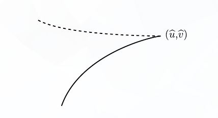
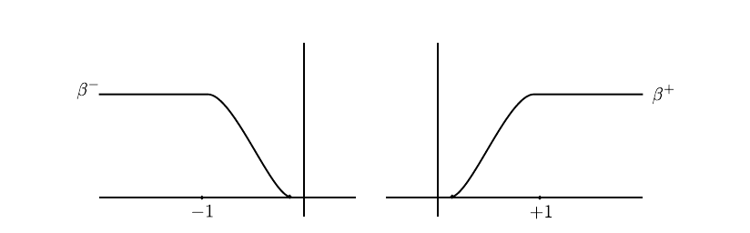
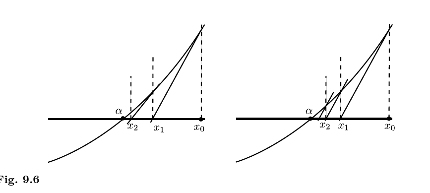
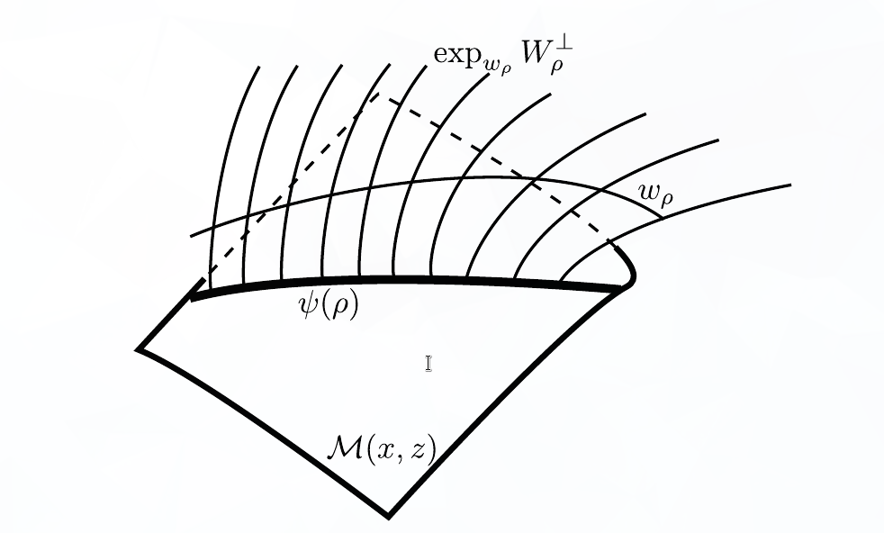

-   [Background, Notation, Setup](#background-notation-setup)
-   [Reminder of Goals](#reminder-of-goals)
-   [9.1 and Review](#and-review)
-   [Three Important Theorems](#three-important-theorems)
    -   [First Theorem: Convergence to Broken Trajectories](#first-theorem-convergence-to-broken-trajectories)
    -   [Second Theorem: Compactness of $\mkern 1.5mu\overline{\mkern-1.5mu\mathcal{L}\mkern-1.5mu}\mkern 1.5mu(x, z)$](#second-theorem-compactness-of-mkern-1.5muoverlinemkern-1.5mumathcallmkern-1.5mumkern-1.5mux-z)
    -   [Third Theorem: Gluing](#third-theorem-gluing)
-   [Gluing Theorem](#gluing-theorem)
-   [9.3: Pre-gluing, Construction of $w_\rho$](#pre-gluing-construction-of-w_rho)
-   [9.4: Construction of $\psi$.](#construction-of-psi.)
    -   [Summary](#summary)


[[Audin-Damian Morse Theory and Floer Homology | ../../../Book%20Notes/Audin-Damian%20Morse%20Theory%20and%20Floer%20Homology/Audin-Damian%20Morse%20Theory%20and%20Floer%20Homology.html]] Tags: \#symplectic

# Background, Notation, Setup

**Goals**

::: {.theorem .proofenv title="Arnold Conjecture (Symplectic Morse Inequalities?)"}
Let $(W, \omega)$ be a compact symplectic manifold and `
<span class="math display">
\begin{align*}  
H: W\to {\mathbb{R}}
\end{align*}
<span>`{=html} a time-dependent Hamiltonian with nondegenerate 1-periodic solutions. Then `
<span class="math display">
\begin{align*}  
\# \left\{{\text{1-Periodic trajectories of }X_H}\right\} \geq \sum_{k\in {\mathbb{Z}}} \dim_{?} HM_k(W; \, {\mathbb{Z}}/2{\mathbb{Z}})
.\end{align*}
<span>`{=html}

> Here $HM_*(W)$ is the Morse homology, and *nondegenerate* means the differential of the flow at time 1 has no fixed vectors.
:::

**Important Ideas for This Chapter**:

::: {.theorem .proofenv title="Use Broken Trajectories to Compactify"}
$\mathcal{L}(x, y)$ is compact, where the compactification is given by adding in `
<span class="math display">
\begin{align*}
{{\partial}}\mathcal{L}(x, y) = \left\{{\text{"Broken Trajectories"}}\right\}
\end{align*}
<span>`{=html}
:::

::: {.theorem .proofenv title="Gluing Yields a Chain Complex"}
`
<span class="math display">
\begin{align*}
{\partial}^2 = 0
\end{align*}
<span>`{=html}
:::

```{=tex}
\newpage
```
**Strategy**:

> In the background, have a Hamiltonian $H: W\to {\mathbb{R}}$. Basic idea: cook up a gradient flow.

1.  Define the action functional $\mathcal{A}_H$

> On an infinite-dimensional space, critical points are periodic solutions of $H$

2.  Construct the chain complex (graded vector space) $CF_*$.

> Uses analog of the *index* of a critical point.

3.  Define the vector field $X_H$ using $-\operatorname{grad}\mathcal{A}_H$.

> This will be used to define ${\partial}$ later.

4.  Count the trajectories of $X_H$

5.  Show finite-energy trajectories connect critical points of $\mathcal{A}_H$.

6.  Show *Gromov Compactness* for space of trajectories of finite energy

7.  Define ${\partial}$

> Uses another compactness property

8.  Show space of trajectories is a manifold, plus analog of "Smale property"

9.  `\textbf{Show that}`{=tex} ${\partial}^2 = 0$ using a gluing property

10. Show that $HF_*$ doesn't depend on $\mathcal{A}_H$ or $X_H$

11. Show $HF_* \cong HM_*$, and compare dimensions of the vector spaces $CM_*$ and $CF_*$.

```{=tex}
\newpage
```
**Ingredients**:

-   $(W, \omega, J)$ with $\omega \in \Omega^2(W)$ is a symplectic manifold

    -   With $J: T_p W \to T_p W$ an almost complex structure, so $J^2 = -\operatorname{id}$.

-   $H \in C^\infty(W; {\mathbb{R}})$ a Hamiltonian

    -   $X_H$ the corresponding symplectic gradient.
    -   Defined by how it acts on tangent vectors in $T_x M$: `
        <span class="math display">
        \begin{align*}  
        \omega_x({-}, X_H(x)) = (dH)_x({-}) 
        .\end{align*}
        <span>`{=html}
    -   Zeros of vector field $X_H$ correspond to critical points of $H$: `
        <span class="math display">
        \begin{align*}  
        X_H(x) = 0 \iff (dH)_x = 0
        .\end{align*}
        <span>`{=html}
    -   Take the associated flow, assumed 1-periodic: `
        <span class="math display">
        \begin{align*}
        \psi^t \in C^\infty(W, W) \qquad \psi^1 = \operatorname{id}
        ,\end{align*}
        <span>`{=html}
    -   Critical points of $H$ are periodic trajectories.

-   $u \in C^\infty({\mathbb{R}}\times S^1; W)$ is a solution to the Floer equation.

-   The Floer equation and its linearization: `\begin{align*}
    {\mathcal{F}}(u) &= {\frac{\partial u}{\partial s}\,} + J {\frac{\partial u}{\partial t}\,} + \operatorname{grad}_u(H) = 0 \\
    \qty{d{\mathcal{F}}}_u(Y) &= {\frac{\partial Y}{\partial s}\,} + J_0 {\frac{\partial Y}{\partial t}\,} + S\cdot Y \\ \\ \\
    &Y\in u^* TW,~ S \in C^\infty({\mathbb{R}}\times S^1; \endo({\mathbb{R}}^{2n}))
    .\end{align*}`{=tex}

```{=tex}
\newpage
```
-   ${\mathcal{L}}W$ is the *free loop space* on $W$, i.e. space of contractible loops on $W$, i.e. $C^\infty(S^1; W)$ with the $C^\infty$ topology

    -   Elements $x\in {\mathcal{L}}W$ can be viewed as maps $S^1\to W$.
    -   Can extend to maps from a closed disc, $u: \mkern 1.5mu\overline{\mkern-1.5mu{\mathbb{D}}\mkern-1.5mu}\mkern 1.5mu^2 \to M$.
    -   Loops in ${\mathcal{L}}W$ can be viewed as maps $S^2\to W$, since they're maps $I\times S^1\to W$ with the boundaries pinched:

    

-   The action functional is given by `\begin{align*}
    {\mathcal{A}}_H: {\mathcal{L}}W &\to {\mathbb{R}}\\
    x &\mapsto -\int_{{\mathbb{D}}} u^* \omega + \int_0^1 H_t(x(t)) ~dt
    \end{align*}`{=tex}

    -   Example: $W = {\mathbb{R}}^{2n} \implies A_H(x) = \int_0^1 \qty{H_t ~dt - p~dq}$.

    -   A correspondence `
        <span class="math display">
        \begin{align*}  
        \left\{{\substack{\text{Solutions to the } \\\text{Floer equation}}}\right\}
        \iff
        \left\{{\substack{\text{Trajectories} \\ \text{of } \operatorname{grad}\mathcal{A}_H}}\right\}
        .\end{align*}
        <span>`{=html}

-   $x, y$ periodic orbits of $H$ (nondegenerate, contractible), equivalently critical points of $\mathcal{A}_H$.

```{=tex}
\newpage
```
-   Assumption of *symplectic asphericity*, i.e. the symplectic form is zero on spheres. Statement: for every $u\in C^\infty(S^2, W)$, `
    <span class="math display">
    \begin{align*}  
    \int_{S^2} u^* \omega = 0 {\quad \operatorname{or equivalently} \quad} {\left\langle {\omega},~{\pi_2 W} \right\rangle} = 0
    .\end{align*}
    <span>`{=html}

-   Assumption of *symplectic trivialization*: for every $u\in C^\infty(S^2; M)$ there exists a symplectic trivialization of the fiber bundle $u^* TM$, equivalently `
    <span class="math display">
    \begin{align*}  
    {\left\langle {c_1 TW},~{\pi_2 W} \right\rangle} = 0
    .\end{align*}
    <span>`{=html}

    > Locally a product of base and fiber, transition functions are symplectomorphisms.

-   Maslov index: used the fact that

    -   Every path in $\gamma: I\to {\mathsf{Sp}}(2n, {\mathbb{R}})$ can be assigned an integer coming from a map $\tilde \gamma: I \to S^1$ and taking (approximately) its winding number.

-   $\mathcal{M}(x, y)$, the moduli space of contractible finite-energy solutions to the Floer equation connecting $x, y$.

    -   After perturbing $H$ to get transversality, get a manifold

        -   Dimension: `
            <span class="math display">
            \begin{align*}  
            \dim {\mathcal{M}}(x, y) = \mu(x) - \mu(y)
            .\end{align*}
            <span>`{=html}

    -   How we did it:

        -   Describe as zeros of a section of a vector bundle over $\mathcal{P}^{1, p}(x, y)$

            (Banach manifold modeled on the Sobolev spaces $W^{1, p}$),

        -   Apply Sard-Smale to show $\mathcal{M}(x, y)$ is the inverse image of a regular value of some map.

    -   Needed tangent maps to be Fredholm operators, proved in Ch. 8 and used to show transversality.

        -   Showed $(d\mathcal{F})_u$ is a Fredholm operator of index $\mu(x) - \mu(y)$.

$\hfill\blacksquare$

```{=tex}
\newpage
```
# Reminder of Goals

**Overall Goal**:

::: {.theorem .proofenv title="Symplectic Morse Inequalities"}
`
<span class="math display">
\begin{align*}  
\# \left\{{\text{1-Periodic trajectories of }X_H}\right\} \geq \sum_{k\in {\mathbb{Z}}} HM_k(W; \, {\mathbb{Z}}/2{\mathbb{Z}})
.\end{align*}
<span>`{=html}
:::

------------------------------------------------------------------------

**Important Ideas for This Chapter**:

::: {.theorem .proofenv title="Using Broken Trajectories to Compactify"}
$\mathcal{L}(x, y)$ is compact, `
<span class="math display">
\begin{align*}
{{\partial}}\mathcal{L}(x, y) = \left\{{\text{"Broken Trajectories"}}\right\}
\end{align*}
<span>`{=html}
:::

::: {.theorem .proofenv title="Using Gluing to Get a Chain Complex"}
`
<span class="math display">
\begin{align*}
{\partial}^2 = 0
\end{align*}
<span>`{=html}
:::

```{=tex}
\newpage
```
# 9.1 and Review

-   Defined moduli space of (parameterized) **solutions**: `
    <span class="math display">
    \begin{align*}  
    \mathcal{M}(x, y) &= \left\{{\text{Contractible finite-energy solutions connecting }x, y }\right\} 
    \\ \\
    {\mathcal{M}}&= \left\{{\text{\textbf{All} contractible finite-energy solutions to the Floer equation}}\right\} \\
    &= \bigcup_{x, y} \mathcal{M}(x, y)
    .\end{align*}
    <span>`{=html}

-   The moduli space of (unparameterized) **trajectories** connecting $x, y$: `
    <span class="math display">
    \begin{align*}  
    \mathcal{L}(x, y) \coloneqq\mathcal{M}(x, y) / {\mathbb{R}}
    .\end{align*}
    <span>`{=html}

    -   Use the quotient topology, define sequentially: `
        <span class="math display">
        \begin{align*}  
        \tilde u_n \overset{n\to\infty}\longrightarrow\tilde u 
        \quad\iff\quad 
        \exists \left\{{s_n}\right\}\subset {\mathbb{R}}\text{ such that } u_n(s_n + s, {-}) \overset{n\to\infty}\longrightarrow u(s, {-})
        .\end{align*}
        <span>`{=html}

    -   When ${\left\lvert {\mu(x) - \mu(y)} \right\rvert} = 1$, get a compact 0-manifold, so the number of trajectories `
        <span class="math display">
        \begin{align*}n(x, y) \coloneqq\# \mathcal{L}(x, y)\end{align*}
        <span>`{=html} is well-defined.

-   $C_k(H) \coloneqq{\mathbb{Z}}/2{\mathbb{Z}}[\left\{{\text{Periodic orbits of } X_H \text{ of Maslov index } k }\right\}]$.

    -   Finitely many since they are nondegeneracy implies they are isolated.

::: {.remark .proofenv}
Some notation:
```{=tex}
\begin{center}
\begin{tikzcd}
{\mathbb{R}}\ar[r] & \mathcal{M}(x, z)\ar[d, "\pi"] \\
 & \mathcal{L}(x, z) \\
\end{tikzcd}
\end{center}
```
Hats will generally denote maps induced on quotient.
:::

-   Defined a differential `
    <span class="math display">
    \begin{align*}  
    {\partial}: C_k(H) &\to C_{k-1}(H) \\
    x &\mapsto \sum_{\mu(y) = k-1} n(x, y) y \\ \\
    n(x, y) &\coloneqq\# \left\{{\text{Trajectories of } \operatorname{grad}\mathcal{A}_H \text{ connecting } x, y}\right\} \operatorname{mod}2 \\
    &= \# \mathcal{L}(x, y) \operatorname{mod}2
    .\end{align*}
    <span>`{=html}

-   Examined ${\partial}^2$:

`
<span class="math display">
\begin{align*}  
{\partial}^2: C_{k}(H) &\to C_{k-2}(H) \\
x &\mapsto {\partial}({\partial}(x)) \\
&= {\partial}\qty{\sum_{\mu(y) = \mu(x)-1} n(x, y) y} \\ \\
&= \sum_{\mu(y) = \mu(x) - 1} n(x, y) {\partial}(y) \\ \\
&= \sum_{\mu(y) = \mu(x) - 1} n(x, y) \qty{\sum_{\mu(z) = \mu(y)-1} n(y, z) z} \\ \\
&= \sum_{\mu(y) = \mu(x) - 1} \,\,\sum_{\mu(z) = \mu(y)-1} n(x, y)  n(y, z) \,z \\
&= \sum_{\mu(z) = \mu(y) - 1} \qty{\sum_{\mu(y) = \mu(x)-1} n(x, y)  n(y, z)}\,z \hspace{4em} \text{(finite sums, swap order)}
,\end{align*}
<span>`{=html} so it suffices to show `
<span class="math display">
\begin{align*}  
\sum_{\mu(y) = \mu(x)-1} n(x, y)  n(y, z) = 0 {\quad \operatorname{when} \quad} \mu(z) = \mu(x) - 2 
.\end{align*}
<span>`{=html}

> Easier to examine parity, so we'll show it's zero mod 2.

```{=tex}
\newpage
```
-   When $\mu(z) = \mu(x) - 2$, $\mathcal{L}(x, z)$ is a non-compact 1-manifold, so we compactify by adding in *broken trajectories* to get $\mkern 1.5mu\overline{\mkern-1.5mu\mathcal{L}\mkern-1.5mu}\mkern 1.5mu(x, y)$.

-   We'll then have `
    <span class="math display">
    \begin{align*}  
      \mkern 1.5mu\overline{\mkern-1.5mu\mathcal{L}\mkern-1.5mu}\mkern 1.5mu(x, z) = \mathcal{L}(x, z) \cup{{\partial}}\mkern 1.5mu\overline{\mkern-1.5mu\mathcal{L}\mkern-1.5mu}\mkern 1.5mu(x, z), \qquad {{\partial}}\mkern 1.5mu\overline{\mkern-1.5muL\mkern-1.5mu}\mkern 1.5mu(x, z) = \bigcup_{\mu(y) = \mu(x) - 1} \mathcal{L}(x, y) \times\mathcal{L}(y, z)
      ,\end{align*}
    <span>`{=html} which "space-ifies" the equation we want.

-   We'll show ${{\partial}}\mkern 1.5mu\overline{\mkern-1.5mu\mathcal{L}\mkern-1.5mu}\mkern 1.5mu(x, z)$ is a 1-manifold, which must have an even number of points, and thus `
    <span class="math display">
    \begin{align*}  
      \sum_{\mu(y) = \mu(x)-1} n(x, y)  n(y, z) = 
      \# \qty{{{\partial}}\mkern 1.5mu\overline{\mkern-1.5mu\mathcal{L}\mkern-1.5mu}\mkern 1.5mu(x, z)} \equiv 0 \operatorname{mod}2
      .\end{align*}
    <span>`{=html}

> Image here of relations between spaces!

$\hfill\blacksquare$

```{=tex}
\newpage
```
# Three Important Theorems

## First Theorem: Convergence to Broken Trajectories

-   Recall: *broken trajectories* are unions of intermediate trajectories connecting intermediate critical points.

-   Shown last time: a sequence of trajectories can converge to a broken trajectory, i.e. there are broken trajectories in the closure of $\mathcal{L}(x, z)$.

-   This theorem describes their behavior:

::: {.theorem .proofenv title="9.1.7: Convergence to Broken Trajectories"}
Let $\left\{{u_n}\right\}$ be a sequence in $\mathcal{M}(x, z)$, then there exist\

-   A subsequence $\left\{{u_{n_j}}\right\}$\
-   Critical points $\left\{{x_0, x_1, \cdots, x_{\ell+1}}\right\}$ with $x_0=x$ and $x_{\ell+1} = z$\
-   Sequences $\left\{{s_n^1}\right\}, \left\{{s_n^2}\right\}, \cdots, \left\{{s_n^\ell}\right\}$.\
-   Elements $u^k \in \mathcal{M}(x_k, x_{k+1})$ such that for every $0\leq k \leq \ell$, `
    <span class="math display">
    \begin{align*}  
    u_{n_j} \cdot s_n^k \overset{n\to\infty}\longrightarrow u^k
    .\end{align*}
    <span>`{=html}
:::

-   Upshots:
    -   Every sequence upstairs has a subsequence which (after reparameterizing) converges
    -   This descends to actual convergence after quotienting by ${\mathbb{R}}$?
    -   Yields uniqueness of limits in $\mathcal{L}(x, z)$, thus a separated topology
    -   Sequentially compact $\iff$ compact since $\mathcal{L}(x, z)$ is a metric space?

::: {.corollary .proofenv title="Compactness"}
$\mkern 1.5mu\overline{\mkern-1.5mu\mathcal{L}\mkern-1.5mu}\mkern 1.5mu(x, z)$ is compact.
:::

```{=tex}
\newpage
```
## Second Theorem: Compactness of $\mkern 1.5mu\overline{\mkern-1.5mu\mathcal{L}\mkern-1.5mu}\mkern 1.5mu(x, z)$ {#second-theorem-compactness-of-mkern-1.5muoverlinemkern-1.5mumathcallmkern-1.5mumkern-1.5mux-z}

::: {.definition .proofenv title="Regular Pair"}
For an almost complex structure $J$ and a Hamiltonian $H$, the pair $(H, J)$ is **regular** if the Floer map $\mathcal{F}$ is transverse to the zero section in the following vector bundle:\

```{=tex}
\begin{center}
\begin{tikzcd}
E_u \coloneqq\left\{{\text{Vector fields tangent to $M$ along $u$}}\right\} \ar[r] & C^\infty({\mathbb{R}}\times S^1; TM)\ar[dd] \\ 
 & \\
 &  C^\infty({\mathbb{R}}\times S^1; M) \ar[uu, bend left, "\mathcal{F}", dotted] \ar[uu, bend right, "\mathbf{0}"', dotted]\\
\end{tikzcd}
\end{center}
```
:::

Most of chapter 9 is spent proving this theorem:

::: {.theorem .proofenv title="9.2.1"}
Let $(H, J)$ be a regular pair with $H$ nondegenerate and $x, z$ be two periodic trajectories of $H$ such that `
<span class="math display">
\begin{align*}  
\mu(x) = \mu(z) + 2
.\end{align*}
<span>`{=html}

Then $\mkern 1.5mu\overline{\mkern-1.5mu\mathcal{L}\mkern-1.5mu}\mkern 1.5mu(x, z)$ is a compact 1-manifold with boundary with `
<span class="math display">
\begin{align*}  
{{\partial}}\mkern 1.5mu\overline{\mkern-1.5mu\mathcal{L}\mkern-1.5mu}\mkern 1.5mu(x, z) = \bigcup_{y\in \mathcal{I}(x, z)} \mathcal{L}(x ,y) \times\mathcal{L}(y, z)  \\ 
\text{where}\qquad \mathcal{I}(x, z) = 
\left\{{
y {~\mathrel{\Big|}~}\mu(x) < \mu(y) < \mu(z)
}\right\}
.\end{align*}
<span>`{=html}

> Note: possibly a typo in the book? Has $x, y$ on the LHS.
:::

::: {.corollary .proofenv}
`
<span class="math display">
\begin{align*}{{\partial}}^2 = 0.\end{align*}
<span>`{=html}
:::

```{=tex}
\newpage
```
## Third Theorem: Gluing

::: {.theorem .proofenv title="9.2.3: Gluing"}
Let $x,y,z$ be three critical points of $\mathcal{A}_H$ with three consecutive indices `
<span class="math display">
\begin{align*}  
\mu(x) = \mu(y)+1 = \mu(z) + 2
.\end{align*}
<span>`{=html}

and let `
<span class="math display">
\begin{align*}  
(u, v) \in \mathcal{M}(x, y) \times\mathcal{M}(y, z) \quad\leadsto\quad (\widehat{u}, \widehat{v})\in \mathcal{L}(x, y) \times\mathcal{L}(y, z)
.\end{align*}
<span>`{=html}

Then

1.  There exists a $\rho_0 > 0$ and a differentiable map `
    <span class="math display">
    \begin{align*}  
      \psi: [\rho_0, \infty) &\to \mathcal{M}(x, z) 
      \end{align*}
    <span>`{=html} such that $\widehat{\psi}$, the induced map on the quotient
    ```{=tex}
    \begin{center}
      \begin{tikzcd}
      {[\rho_0, \infty)} \ar[r, "\psi"] \ar[rd, "\widehat{\psi}"', dotted] & \mathcal{M}(x, z)\ar[d, "\pi"] \\
      & \mathcal{L}(x, z) \\
      \end{tikzcd}
      \end{center}
    ```
    is an embedding that satisfies `
    <span class="math display">
    \begin{align*}  
      \widehat{\psi}(\rho) \overset{\rho\to\infty}\longrightarrow(\widehat{u}, \widehat{v}) \in \mkern 1.5mu\overline{\mkern-1.5mu\mathcal{L}\mkern-1.5mu}\mkern 1.5mu(x, z)
      .\end{align*}
    <span>`{=html}

```{=tex}
\newpage
```
2.  ("Uniqueness") For any sequence $\left\{{\ell_n}\right\}\subseteq \mathcal{L}(x, z)$, `
    <span class="math display">
    \begin{align*}  
    \ell_n \overset{n\to\infty}\longrightarrow(\widehat{u}, \widehat{v}) \quad\implies\quad \ell_n \in \operatorname{im}(\widehat{\psi}) \text{ for } n \gg 0
    .\end{align*}
    <span>`{=html}
:::

-   We already know that $\mkern 1.5mu\overline{\mkern-1.5mu\mathcal{L}\mkern-1.5mu}\mkern 1.5mu(x, z)$ is compact and $\mathcal{L}(x, z)$ is a 1-manifold, so we look at neighborhoods of boundary points.

-   Why unique: will show that the broken trajectory $(\widehat{u}, \widehat{v})$ is the endpoint of an embedded interval in $\mkern 1.5mu\overline{\mkern-1.5mu\mathcal{L}\mkern-1.5mu}\mkern 1.5mu(x, z)$.

    -   Then show that any other sequence converging to $(\widehat{u}, \widehat{v})$ must approach via this interval, otherwise could have cuspidal points:



$\hfill\blacksquare$ `\newpage`{=tex}

# Gluing Theorem

Broken into three steps:

1.  **Pre-gluing**:

-   Get a function $w_\rho$ which interpolates between $u$ and $v$ in the parameter $\rho$.

    -   Not exactly a solution itself, just an "approximation".

2.  **Newton's Method**:

-   Apply the Newton-Picard method to $w_p$ to construct a true solution `
    <span class="math display">
    \begin{align*}  
      \psi: [-\rho, \infty) &\to \mathcal{M}(x, z) \\
      \rho &\mapsto  \oldexp_{w_p}\qty{\gamma(p)}  \\ \\
      \text{for some } \gamma(p) &\in W^{1, p}(w_p^*\, TW) = T_{w_p} \mathcal{P}(x, z)
      \end{align*}
    <span>`{=html}
-   [GIF of Newton's Method](https://www.maplesoft.com/support/help/content/4702/plot552.gif)

3.  **Project and Verify Properties**:

-   Check that the projection $\widehat{\psi }= \pi \circ \psi$ satisfies the conditions from the theorem.

$\hfill\blacksquare$ `\newpage`{=tex}

# 9.3: Pre-gluing, Construction of $w_\rho$ {#pre-gluing-construction-of-w_rho}

-   Choose (once and for all) a bump function $\beta$ on $B_{{\varepsilon}}(0)^c \subset {\mathbb{R}}\to [0, 1]$ which is 1 on ${\left\lvert {x} \right\rvert} \geq 1$ and $0$ on ${\left\lvert {x} \right\rvert} < {\varepsilon}$
-   Split into positive and negative parts $\beta^\pm(s)$:



-   Define an interpolation $w_\rho$ from $u$ to $v$ in the following way: let

    -   $\oldexp \left[ {-}\right] \coloneqq\oldexp_{y(t)}({-})$ and
    -   $\ln({-}) \coloneqq\oldexp^{-1}_{y(t)}({-})$,

    then `
    <span class="math display">
    \begin{align*}  
    w_\rho: x &\to z \\
    w_\rho(s,t) &\coloneqq
    \begin{cases}
    {\color{blue} u(s+\rho, t)} & s\in (-\infty, -1] \\ \\
    \oldexp\left[ \beta^-(s)\ln({\color{blue} u(s+\rho, t) }) + \beta^+(s)\ln({\color{purple} u(s-\rho, t)} )\right] & s\in [-1, 1] \\ \\
    {\color{purple} u(s-\rho, t)} & s\in [1, \infty)
    \end{cases}
    .\end{align*}
    <span>`{=html}

-   Why does this make sense? `
    <span class="math display">
    \begin{align*}  
    {\left\lvert {s} \right\rvert}\leq 1 \implies u(s\pm \rho, t) \in 
    \left\{{\oldexp_{y(t)} Y(t) {~\mathrel{\Big|}~}\sup_{t\in S^1} {\left\lVert {Y(t)} \right\rVert}\leq r_0 }\right\} \subseteq \operatorname{im}\oldexp_{y(t)} ({-})
    ,\end{align*}
    <span>`{=html} so we can apply $\oldexp_{y(t)}^{-1}({-})$.

-   Can make ${\left\lvert {s} \right\rvert}\leq 1$ for large $\rho$, since `
    <span class="math display">
    \begin{align*}  
    u(s, t) \overset{s\to\infty}\longrightarrow\quad &y(t) \\
    v(s, t) \overset{s\to-\infty}\longrightarrow\quad &y(t)
    .\end{align*}
    <span>`{=html}

    -   So pick a $\rho_0$ such that this holds for $\rho > \rho_0$.

    -   Might have to increase $\rho_0$ later in the proof, so $\rho > \rho_0$ just means $\rho \gg 0$.

-   Some properties:

    -   $w_\rho \in C^\infty(x, z)$ and is differentiable in $\rho$.
    -   $s\in [-{\varepsilon}, {\varepsilon}] \implies w_\rho(s, t) = y(t)$. `
        <span class="math display">
        \begin{align*}  
        w_\rho(s-\rho, t) &\overset{\rho\to\infty}\longrightarrow u(s, t){\quad \operatorname{in} \quad} C^\infty_{\mathsf{loc}}\\ \\
        w_\rho(s, t) &\overset{\rho\to\infty}\longrightarrow y(t) {\quad \operatorname{in} \quad} C^\infty_{\mathsf{loc}}
        .\end{align*}
        <span>`{=html}

-   Now carry out the linearized version on tangent vectors, to which we will apply Newton-Picard:

    -   Let $Y\in T_u \mathcal{P}(x, y)$
    -   Let $Z\in T_v \mathcal{P}(x, y)$
    -   Replace $w_\rho$ with the interpolation `
        <span class="math display">
        \begin{align*}  
        Y\#_\rho Z \in T_{w_\rho} \mathcal{P}(x, y) = W^{1, p}(w_\rho^* TW)
        .\end{align*}
        <span>`{=html} defined by `
        <span class="math display">
        \begin{align*}  
        (Y\#_\rho Z) (s, t) = 
        \begin{cases}
        {\color{blue} Y(s+\rho, t)} & s\in (-\infty, -1] \\ \\
        \oldexp_T\left[ \beta^-(s) \ln_T({\color{blue} Y(s+\rho, t) }) \, + \beta^+(s) \ln_T({\color{purple} Z(s-\rho, t)} )\right] & s\in [-1, 1] \\ \\
        {\color{purple} Z(s-\rho, t)} & s\in [1, \infty)
        \end{cases}
        ,\end{align*}
        <span>`{=html} where the subscript $T$ indicates taking tangents of the exponential maps at appropriate points.

$\hfill\blacksquare$ `\newpage`{=tex}

# 9.4: Construction of $\psi$. {#construction-of-psi.}

## Summary

-   Newton-Picard method, general idea:

    -   Allows finding zeros of $f$ given an approximate zero $x_0$, using the extra information of the 1st derivative $f'$.

    -   Original method and variant: find the limit of a sequence `
        <span class="math display">
        \begin{align*}  
        x_{n+1} = x_n - {f(x_n) \over f'(x_n)}
        ,\qquad x_{n+1} = x_n - {f(x_n) \over f'({\color{red} x_0} )}
        .\end{align*}
        <span>`{=html}

    -   Second variant more useful: only need derivative at one point:



```{=tex}
\newpage
```
-   Pregluing function $w_\rho \in C^\infty_{\searrow}(x, z)$ from previous section

    -   Exponential decay

-   Want to construct true solution $\psi_\rho \in \mathcal{M}(x, z)$, so $\mathcal{F}(\psi_p) = 0$.

    -   Suffices to get a weak solution
    -   Automatic continuity + elliptic regularity $\implies$ strong solution

-   Define $\mathcal{F}_\rho$ as $\mathcal{F} \circ \oldexp_{w_\rho}$ expanded bases $Z_i$ from trivialization of $TW$.

-   $L_\rho = (d\mathcal{F}_\rho)_0$ will be the linearization of the Floer operator at zero.

```{=tex}
\vspace{5em}
```
-   Adapting Newton-Picard to operators:
    -   $L_\rho$ won't be invertible on entire space, but `
        <span class="math display">
        \begin{align*} {1\over f'(x_0)} \iff L_\rho^{-1}, \end{align*}
        <span>`{=html}

    -   Decompose `
        <span class="math display">
        \begin{align*}
        T_{w_\rho} \mathcal{P}(x, z) 
        = W^{1, p}(w_\rho^* TW) 
        = W^{1, p}({\mathbb{R}}\times S^1; {\mathbb{R}}^{2n}) 
        = \ker(L_{\rho}) \oplus W_{\rho}\perp,
        \end{align*}
        <span>`{=html} where $L_\rho$ will have a right inverse on $W_\rho\perp$.

        -   Where does $W_\rho\perp$ come from? Essentially the kernel of some linear functional given by an integral: `
            <span class="math display">
            \begin{align*}  
            W_\rho\perp \coloneqq\left\{{Y\in W^{1, p} {~\mathrel{\Big|}~}\int_{{\mathbb{R}}\times S^1} {\left\langle {Y},~{\cdots} \right\rangle}\,ds\,dt = 0,\, \text{ plus conditions}}\right\}
            .\end{align*}
            <span>`{=html}

    -   Run Newton-Picard in $W_{\rho}\perp$
-   Will obtain for every $\rho \geq \rho_0$ an element $\gamma(\rho) \in W_\rho\perp$ with `
    <span class="math display">
    \begin{align*}  
    \mathcal{F}_\rho(\gamma(\rho)) = 0
    .\end{align*}
    <span>`{=html}

```{=tex}
\newpage
```
-   Where does $\gamma$ come from? Intersection-theoretic interpretation on page 320: `
    <span class="math display">
    \begin{align*}  
      \qty{\oldexp_{w_\rho}}^{-1}\mathcal{M}(x, z) \cap W_{\rho}\perp &\subseteq T_{w_\rho}\mathcal{P}(x, z) &\leadsto \gamma
      \\ 
      \mathcal{M}(x, z) \cap \left\{{\oldexp_{w_\rho} W_\rho\perp {~\mathrel{\Big|}~}\rho\geq \rho_0}\right\}&\subseteq \mathcal{P}(x, z) &\leadsto \psi(\rho)
      ,\end{align*}
    <span>`{=html} which we get by exponentiating.

-   This gives a codimension 1 subspace in $\mathcal{M}(x, z)$, which we take to be $\psi(\rho)$:



```{=tex}
\newpage
```
> Schematic picture here for $\gamma, \psi(\rho)$.

```{=tex}
\newpage
```
-   Apply the implicit function theorem to show differentiability of $\gamma$ in $\rho$.

-   Use a trivialization $Z_i^\rho$ of $TW$ to get a vector field along $w_\rho$

    -   This is exactly an element of $T_{w_\rho}\mathcal{P}(x, z)$

-   Exponentiate to get an element of $\mathcal{M}(x, z)$:

`
<span class="math display">
\begin{align*}  
\psi(\rho) \coloneqq\oldexp_{w_\rho}\qty{\gamma(\rho)}
.\end{align*}
<span>`{=html}

-   **Final Result**: project onto $\mathcal{L}(x, z)$ to get $\widehat{\psi}$.

```{=tex}
\vspace{4em}
```
**Checking Properties**:

-   Existence: show $\widehat{\psi}$ is a proper injective immersion $\implies$ embedding.

-   Uniqueness: show the broken trajectory $(\widehat{u}, \widehat{v})$ is the endpoint of an embedded interval in $\mkern 1.5mu\overline{\mkern-1.5mu\mathcal{L}\mkern-1.5mu}\mkern 1.5mu(x, z)$.

    -   Show that any other sequence converging to $(\widehat{u}, \widehat{v})$ must approach via this interval, otherwise could have cuspidal points:


> Probably not worth going farther than this! Extremely detailed analysis.

$\hfill\blacksquare$ `\newpage`{=tex}
