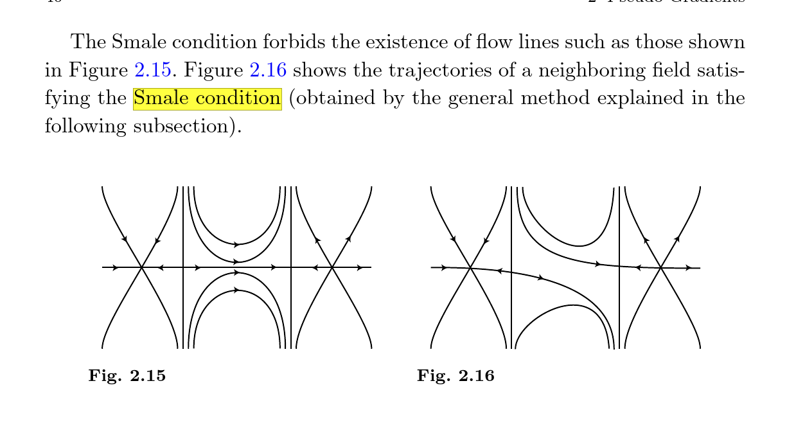

-   [Monday, October 12: Audin Chapter 10 (From Floer to Morse)](#monday-october-12-audin-chapter-10-from-floer-to-morse)
    -   [Notation and Setup](#notation-and-setup)
    -   [Strategy](#strategy)
        -   [Equality of Complexes](#equality-of-complexes)
        -   [Equality of Differentials](#equality-of-differentials)
        -   [Define Morse Differentials](#define-morse-differentials)
        -   [Compare solutions to Floer equation and trajectories of $X$](#compare-solutions-to-floer-equation-and-trajectories-of-x)
    -   [Summary](#summary)
    -   [Linearizing the Morse Equation](#linearizing-the-morse-equation)
        -   [Showing $L_u$ is Fredholm](#showing-l_u-is-fredholm)
        -   [Computing $\mathop{\mathrm{ind}}L_u$](#computing-mathopmathrmindl_u)
        -   [Smale Condition](#smale-condition)
    -   [10.4: Morse and Floer Trajectories Coincide](#morse-and-floer-trajectories-coincide)
        -   [Comparing Kernels](#comparing-kernels)
        -   [Trajectories are Independent of $t$](#trajectories-are-independent-of-t)


[[Audin-Damian Morse Theory and Floer Homology | ../../../Book%20Notes/Audin-Damian%20Morse%20Theory%20and%20Floer%20Homology/Audin-Damian%20Morse%20Theory%20and%20Floer%20Homology.html]]

Tags: \#symplectic \#topology \#geometry \#floer

Monday, October 12: Audin Chapter 10 (From Floer to Morse)
==========================================================

Notation and Setup
------------------

-   $(W, \omega, J)$ a symplectic manifold with an almost complex structure

-   $H\in C^\infty(W, {\mathbb{R}})$ will be either a Morse function or a Hamiltonian

-   $X$ will be a vector field, potentially $X_H$, the symplectic gradient of $H$: `
    <span class="math display">
    \begin{align*}  
    \omega_x({-}, X_H(x)) = (dH)_x({-}) 
    .\end{align*}
    <span>`{=html}

-   $DH$ will denote differentials, $D^2 H$ will denote Hessians (where they're defined)

-   $CM_*(H, J)$ will be the Morse complex associated with a Morse function $H$, its vector field $\operatorname{grad}H$ the gradient for the metric defined by $J, \omega$.

-   $CF_*(H, J)$ will be the Floer complex

::: {.theorem .proofenv title="Main Goal"}
There exists a nondegenerate Hamiltonian that is sufficiently small in the $C^2$ topology for which both the Floer and Morse complexes are well-defined, and `
<span class="math display">
\begin{align*}  
CF_*(H, J) \cong CM_{*+n}(H, J) = CM_*(H, J)[n]
.\end{align*}
<span>`{=html}
:::

Strategy
--------

Need to show two things:

1.  $CF_* = CM_*[n]$, and
2.  ${{\partial}}_F = {{\partial}}_M$.

### Equality of Complexes

::: {.definition .proofenv title="Nondegenerate 1: Critical Points of a Function"}
For a function $f \in C^\infty(W, {\mathbb{R}})$, define a bilinear form `
<span class="math display">
\begin{align*}
  (D^2 f)_p: T_p W \otimes T_p W &\to {\mathbb{R}}\\
  (\mathbf{v}, \mathbf{w}) &\mapsto {\left\langle { \mathbf{x}},~{(Y\cdot f)(p)} \right\rangle}
  \end{align*}
<span>`{=html} for some vector field $Y$ extending $\mathbf{y}$.

A critical point $p$ is **nondegenerate** iff $(D^2 f)_p$ is a nondegenerate quadratic form.
:::

::: {.definition .proofenv title="Nondegenerate 2: Critical Points of Periodic Trajectories"}
For a Hamiltonian system $H$, a periodic solution $x$ is **nondegenerate** iff $1 \not\in \operatorname{Spec}(d\psi_1)$, i.e. 1 is not an eigenvalue of the differential, i.e.  `
<span class="math display">
\begin{align*}
\operatorname{det}\qty{\operatorname{id}- \qty{D\psi^1}_{x(0)} } \neq 0
.\end{align*}
<span>`{=html}
:::

::: {.example .proofenv}
Motivation: `
<span class="math display">
\begin{align*}  
  H=\frac{1}{2} \sum a_{i j} p_{i} p_{j}+\sum b_{i j} p_{i} q_{j}+\frac{1}{2} \sum c_{i j} q_{i} q_{j} \implies X_H \mathbf{p} = A \mathbf{p}, A \approx D^2 H(0)
  .\end{align*}
<span>`{=html}

Yields a flow $\psi_t = e^{tA}$, then if $\psi_1 = e^A$ doesn't have eigenvalue 1, $A$ doesn't have eigenvalue zero, and the quadratic form $H$ is nondegenerate, so the critical point of $H$ at zero is nondegenerate.
:::

::: {.proposition .proofenv title="5.4.5"}
Definition 2 implies definition 1: if $x$ is a critical point of $H$ which is nondegenerate as a periodic solution of the Hamiltonian system, then $a \in \operatorname{crit}(H)$ is nondegenerate as a critical point of the *function* $H$.
:::

-   Can start with an $H_0$ and rescale to define $H \coloneqq H_0/k$
-   When $H$ sufficiently small in the $C^2$ sense (close sups of 1st and 2nd derivatives), the only periodic trajectories are constant
    -   Use prop: def 2 implies def 1, conclude that $H$ is Morse.
    -   As a result, `
        <span class="math display">
        \begin{align*}  
        \operatorname{crit}(\mathcal{A}_H) \iff \operatorname{crit}(H) \iff \left\{{\text{Constant trajectories}}\right\}
        .\end{align*}
        <span>`{=html}
    -   Use remark 5.4.6: for the Hessian of $H$, $\operatorname{Spec}(D^2 H) \cap 2\pi {\mathbb{Z}}= \emptyset$
    -   Yields *Index Comparison Formula*: `
        <span class="math display">
        \begin{align*}  
        \mathop{\mathrm{ind}}_H(x) = \mu(x) + n
        .\end{align*}
        <span>`{=html}

**Goal by end of Ch. 10**:

-   Show that all Floer solutions connecting two consecutive critical points are *also* Morse trajectories,
-   Regularity: $d\mathcal{F}_u$ is surjective along these trajectories
    -   Implies $\mathcal{M}^{(H, J)}(x, y)$ is a manifold, allows defining Floer complex
-   Index Comparison Formula **yields equality of vector spaces**, up to a dimension shift.

```{=tex}
\newpage
```
### Equality of Differentials

-   Next need to show both differentials ${{\partial}}_M, {{\partial}}_F$ can be defined, and they coincide

-   Defining ${{\partial}}_M$:

    -   Need a vector field $X$ adapted to $H$
    -   $X$ needs to satisfy Smale condition (genericness)

-   Recall the **Smale Condition**: all stable and unstable manifolds of critical points meet transversely, `
    <span class="math display">
    \begin{align*}  
    W^{\text{u}}(a) \pitchfork W^{\text{v}}(b) \qquad\forall a, b\in \operatorname{crit}(H)
    .\end{align*}
    <span>`{=html}



-   Goal: given fixed data for the Floer theory, relate it to Morse data (define the Morse complex).

-   Strategy: running ideas backwards, getting theorems for Morse functions similar to what we did when linearizing the Floer operator

### Define Morse Differentials

-   To define ${{\partial}}_M$: need to relate trajectories of $X$ to solutions of Floer equation: `\LARGE`{=tex} `
    <span class="math display">
    \begin{align*}  
    \left\{{\substack{ \text{Solutions to } \\ \\ {\frac{\partial u}{\partial s}\,} + X(u) = 0  }}\right\}
    \iff
    \left\{{\substack{ \text{Solutions to } \\ \\ {\frac{\partial u}{\partial s}\,} + J(u) {\frac{\partial u}{\partial t}\,} + \operatorname{grad}H(u) = 0 }}\right\}
    .\end{align*}
    <span>`{=html} `\normalsize`{=tex}

    To do this: need $X = \operatorname{grad}H$ for the metric induced by $J, \omega$.

::: {.definition .proofenv title="Pseudo-Gradient"}
For $f:W\to {\mathbb{R}}$ a Morse function, a vector field $X$ is a **pseudo-gradient** for $f$ iff

1.  $(Df)_p(X_p) \leq 0$ with equality iff $p\in \operatorname{crit}(f)$
2.  In a Morse chart about $p\in \operatorname{crit}(f)$, we have $X = -\operatorname{grad}_g f$ for the canonical metric $g$ on ${\mathbb{R}}^n$.
:::

::: {.definition .proofenv title="Morse-Smale Pair"}
A pair $(f, X)$ of a function and a vector field is a **Morse-Smale pair** iff $f$ is Morse and $X$ is a pseudo-gradient for $f$ satisfying the Smale condition.
:::

::: {.theorem .proofenv title="Theorem to Prove"}
Let $H$ be Morse on $(W, \omega)$. Then there exists a dense subset $\mathcal{J}_{\text{reg}}(H)$ of almost complex structures $J$ calibrated by $\omega$ such that $(H, -JX_H)$ is Morse-Smale.

> Note: transversality result analogous to ones in 8.5
:::

::: {.proof .proofenv}
```{=tex}
\hfill
```
-   Proof in two steps:

    -   Step 1: Morse Side, arbitrary morse functions
        -   Linearize the Morse equation ${\frac{\partial u}{\partial s}\,} + X(u) = 0$ of the flow of $-X$ along one of its solutions $L_u Y = 0$.
        -   Show that whenever $H$ is Morse and $u$ is a trajectory connecting critical points, $L_u$ is Fredholm and `
            <span class="math display">
            \begin{align*}\mathop{\mathrm{ind}}(L_u) = \mathop{\mathrm{ind}}_H(y) - \mathop{\mathrm{ind}}_H(x).\end{align*}
            <span>`{=html}
        -   Show that for $H$ a nondegenerate Hamiltonian and $u$ a trajectory of $JX_H$, the operators $(d\mathcal{F})_u$ and $L_u$ are Fredholm of equal index.
        -   Show that $X$ is Smale $\iff$ $L_u$ is surjective.
    -   Step 2: Floer Side, specific case of Hamiltonian
        -   Prove the actual result.
:::

-   Now fix an almost complex structure to obtain a Smale vector field $X$

```{=tex}
\newpage
```
### Compare solutions to Floer equation and trajectories of $X$ {#compare-solutions-to-floer-equation-and-trajectories-of-x}

-   Goal: for $\mathop{\mathrm{ind}}(x) - \mathop{\mathrm{ind}}(y)\leq 2$, get an equality `
    <span class="math display">
    \begin{align*}  
    \left\{{\substack{\text{Trajectories of Floer equation} \\ \text{associated to }(H, J) \text{ connecting }x, y}}\right\} 
    \iff
    \left\{{\substack{\text{Trajectories of the Smale } \\ \text{vector field } -JX_H}}\right\}
    .\end{align*}
    <span>`{=html}

-   Solutions to Floer equation that *do not* depend on $t$ are precisely trajectories of $X = - \operatorname{grad}H$.

-   Next show that elements in $\ker (d\mathcal{F}_u)$ do not depend on $t$.

-   Corollary: $d\mathcal{F}_u$ is surjective along every trajectory of $\operatorname{grad}H$.

-   Then show that replacing $H_k \coloneqq H/k$ for $k\gg 0$ preserves all critical points and all indices

-   Punch line: all the solutions of the Floer equation that we need are time-independent.

    -   Statement: For $k\gg 0$, solutions to the Floer equation for $H_k$ connecting $x\to y$ with $\mathop{\mathrm{ind}}(x) - \mathop{\mathrm{ind}}(y) \leq 2$ are independent of $t$.

Summary
-------

-   Take $H_k$ for $k\gg 0$ and $J\in \mathcal{J}_{\text{reg}}$ (dense)
-   Then when $\mathop{\mathrm{ind}}(x) - \mathop{\mathrm{ind}}(y) \leq 2$, trajectories of Floer equation for $(H, J)$ connecting critical points $x, y$ are trajectories of the Smale vector field $X = - JX_H$.
    -   $x, y$ will be critical points for both $H$ and $\mathcal{A}_H$
-   Regularity? The linearized Floer operator is surjective along these trajectories
-   Implies that $\mathcal{M}^{(H, J)}(x, y)$ is a manifold, so $CF_*$ can be defined.
-   Claim: this shows the differentials coincide, and we're done.

```{=tex}
\newpage
```
Linearizing the Morse Equation
------------------------------

-   Let $f$ be morse on $V \hookrightarrow{\mathbb{R}}^m$ ($m\gg 0$) with adapted pseudo-gradient field $X$, then

```{=tex}
\LARGE
```
`
<span class="math display">
\begin{align*}  
\left\{{\substack{
\text{Trajectories} \\
\text{of } X
}}\right\}
\iff
\left\{{\substack{
\text{Solutions of} \\
{\frac{\partial u}{\partial s}\,} + X(u(s)) = 0
}}\right\}
.\end{align*}
<span>`{=html} `\normalsize`{=tex}

-   Fix a metric $g$ on $V$ such that $X = \operatorname{grad}_g f$.

-   Define the space of solutions of finite energy: `
    <span class="math display">
    \begin{align*}  
    E(u) &\coloneqq
    \int_{\mathbb{R}}{\left\lVert {{\frac{\partial u}{\partial s}\,}} \right\rVert}^2 \,ds \\
    \mathcal{M} &\coloneqq\left\{{
    u \in C^\infty({\mathbb{R}}, V) {~\mathrel{\Big|}~}{\frac{\partial u}{\partial s}\,} + \operatorname{grad}f = 0, \quad E(u) < \infty
    }\right\}
    .\end{align*}
    <span>`{=html}

-   Then $\mathcal{M}$ is compact and equal to $\cup_{x, y} \mathcal{M}(x, y)$, using the fact that if $V$ is compact, *all* trajectories are of finite energy

-   Now go to coordinates and linearize the equation of the flow along the solution $u$ to get a linear differential equation

-   Yields an equation `
    <span class="math display">
    \begin{align*}  
    L_u: W^{1, 2}({\mathbb{R}}, {\mathbb{R}}^{n}) &\to L^2({\mathbb{R}}, {\mathbb{R}}^{n}) \\
    Y &\mapsto {\frac{\partial Y}{\partial s}\,} + A(s) Y \coloneqq L_u Y
    ,\end{align*}
    <span>`{=html} where $A$ is a matrix limiting to $\operatorname{grad}_y^2 f$ and $\operatorname{grad}_x^2 f$ at $s= \pm \infty$

    -   Limiting to Hessians of nondegenerate critical points will yield symmetric invertible matrices

    -   We then consider $\ker L_u \subseteq \ker(d\mathcal{F}_u)$. Note: we have exponential decay.

-   Note: the space of solutions to equation linearized at $u$ is $T_u \mathcal{M}(x, y)$.

### Showing $L_u$ is Fredholm {#showing-l_u-is-fredholm}

-   Bootstrapping: $Y\in \ker(L_u)$ in $W^{1, 2}$ is continuous, thus $C^1$, this $C^\infty$ and form a finite-dimensional vector space.

-   Behavior at infinity: reduces to `
    <span class="math display">
    \begin{align*}L_uY = 0 \iff {\frac{\partial Y}{\partial s}\,} = -AY\end{align*}
    <span>`{=html} where $A$ is a constant diagonal matrix

    -   This is a linear system, so solutions are `
        <span class="math display">
        \begin{align*}
        Y(s) = e^{-As}Y(0)
        \quad\text{i.e.}\quad
        y_i(s) = y_i e^{- \lambda_i s}
        .\end{align*}
        <span>`{=html}

-   Will prove that if $u$ is a trajectory of $\operatorname{grad}f$ connecting $x\to y$ then $L_u$ is Fredholm

    -   Proof: involves bounding $W^{1, 2}$ norm of $Y$ by $L^2$ norms of $Y, L_u Y$.

    -   Lots of integral estimates: Fourier transform, Plancherel, Cauchy-Schwarz

-   Integral bound yields: $\dim \ker L_u < \infty$ and $\operatorname{im}L_u$ is closed.

-   Lemma: $\dim \operatorname{coker}< \infty$.

    -   Proof: computer kernel of adjoint `
        <span class="math display">
        \begin{align*}L_u^* = -{\frac{\partial }{\partial s}\,} + A^*\end{align*}
        <span>`{=html} where the matrix is transposed.

    -   Use the fact that `
        <span class="math display">
        \begin{align*}Z\in \operatorname{coker}(L_u) \iff Z\in \ker(L_u^*),\end{align*}
        <span>`{=html} i.e. $L_u^* Z = 0$ in the sense of distributions

### Computing $\mathop{\mathrm{ind}}L_u$ {#computing-mathopmathrmindl_u}

-   Unsurprisingly, will show $\mathop{\mathrm{ind}}(L_u) = \mathop{\mathrm{ind}}_f(x) - \mathop{\mathrm{ind}}_f(y)$.

-   Ideas in proof:

    -   Will choose two real numbers $\sigma, s$ to plug into $u$, and consider *resolvent*: map between tangent spaces to $V$ at $u(\sigma), u(s)$.
    -   Look at the tangent spaces at $u(\sigma)$ of the stable and unstable manifolds will be the Floer complex `
        <span class="math display">
        \begin{align*}  
        E^\text{u}(\sigma) \coloneqq T_{u(\sigma)} W^\text{u}(x) \\
        E^\text{s}(\sigma) \coloneqq T_{u(\sigma)} W^\text{s}(x) \\
        .\end{align*}
        <span>`{=html}
    -   Then $\ker L_u$ is isomorphic to the intersection for all $\sigma$.

### Smale Condition

-   Recall $X= \operatorname{grad}_g f$ for $g$ a metric.

-   Statement: the vector field $X$ satisfies the Smale condition $\iff$ all $L_u$ are surjective.

::: {.proof .proofenv}
```{=tex}
\hfill
```
-   $L_u$ is surjective $\iff \operatorname{coker}(L_u) = 0 \iff \ker(L_u^*)$ is injective
-   This is equivalent to `
    <span class="math display">
    \begin{align*}  
    T_{u(\sigma)} W^\text{u}(x) +
    T_{u(\sigma)} W^\text{s}(x) = T_{u(\sigma)} V
    .\end{align*}
    <span>`{=html}
-   This is exactly the transversality condition for the stable and unstable manifolds
    -   We want this for all critical points
:::

10.4: Morse and Floer Trajectories Coincide
-------------------------------------------

### Comparing Kernels

-   Note $\ker(L_u) \subset \ker(d\mathcal{F}_u)$ since `
    <span class="math display">
    \begin{align*}  
    \qty{ {\frac{\partial }{\partial s}\,} + S(s) }Y = 0 \implies
    \qty{ {\frac{\partial }{\partial s}\,} + J{\frac{\partial }{\partial t}\,} + S(s) }Y = 0
    ,\end{align*}
    <span>`{=html} so just need to show reverse inclusion.

-   Use a lemma: for $f: [0, 1] \to {\mathbb{R}}$, `
    <span class="math display">
    \begin{align*}  
    {\left\lVert {f} \right\rVert}_{L^p([0, 1])} \leq
    {\left\lVert {{\frac{\partial f}{\partial t}\,}} \right\rVert}_{L^p([0, 1])}
    ,\end{align*}
    <span>`{=html} then apply this to $f(t) \coloneqq Y(s, t)$ and $p = 2$.

-   Yields an equation `
    <span class="math display">
    \begin{align*}  
    {\left\lVert {{\frac{\partial Y}{\partial s}\,} } \right\rVert}_{L^2}^2 + {\left\lVert {{\frac{\partial Y}{\partial t}\,} } \right\rVert}_{L^2}^2 \leq \sup_s {\left\lVert {S(s)} \right\rVert}_{\text{op}}^2 {\left\lVert {Y} \right\rVert}_{L^2}^2 
    \implies
    {\left\lVert {Y} \right\rVert}^2_{L^2} \leq \sup_s {\left\lVert {S(s)} \right\rVert}_{\text{op}} {\left\lVert {Y^2_{L^2}} \right\rVert}
    \end{align*}
    <span>`{=html} where the sup term being small forces $Y=0$.

### Trajectories are Independent of $t$ {#trajectories-are-independent-of-t}

**WTS**: Trajectories of $H_k$ appearing in the Floer complex are exactly those appearing in the Morse complex. I.e. proving 10.1.9

Idea of proof:

-   Contradiction: suppose there exists a sequence $n_k\to \infty$ with time-dependent solutions $u_{n_k}$ connecting $x\to y$ which solve the Floer equation

-   Consider case where indices differ by $1$: using broken trajectories theorem, extract a subsequence converging to some $v\in \mathcal{M}(x, y, H)$.

    -   Show $v$ doesn't depend on $t$

    -   Since $d\mathcal{F}_v$ is surjective, $v$ is in a 1-dim component, and thus an isolated point of $\mathcal{L}(x, y)$

    -   Get a contradiction from taking $k\gg 0$ and using `
        <span class="math display">
        \begin{align*}v_{n_k}(s, t) = v(s + \sigma_k, t) = v(s + \sigma_k),\end{align*}
        <span>`{=html} which does *not* depend on time

-   Consider case where indices differ by 2

    -   Use Smale property of the gradient $-J X_H$ of $H$: trajectories $x\to y$ form a 2-manifold

    -   Since trajectories are also in $\mathcal{M}(x, y, H)$, parameterizes a submanifold in a neighborhood of $v$.

-   Show that convergence toward broken orbits in Morse setting corresponds to converges toward broken trajectories in Floer setting

-   Use gluing from last chapter: $\widehat{v}_{n_k} \in \operatorname{im}{\widehat{\phi}}$ for $k\gg 0$, contradicting the fact that $v_{n_k}$ doesn't depend on $t$
