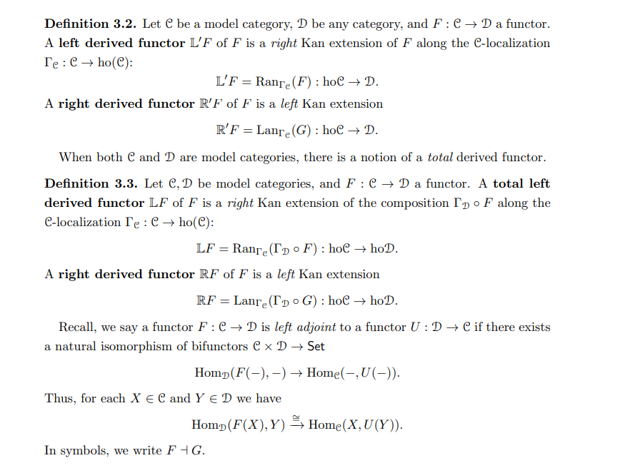
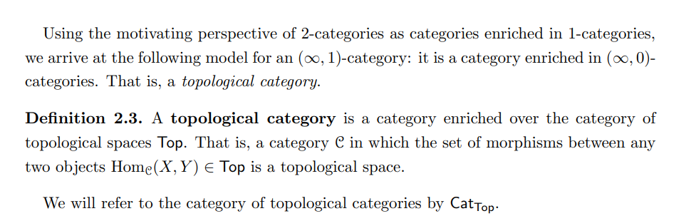
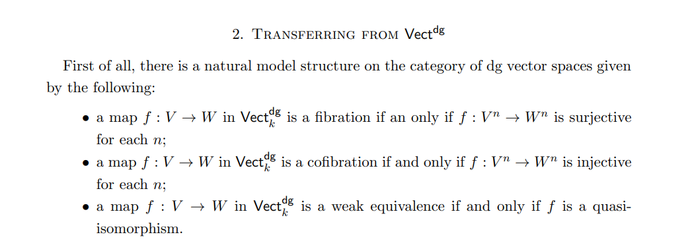

-   [2021-03-25](#section)
    -   [00:08](#section-1)
    -   [00:09](#section-2)

# 2021-03-25

## 00:08

What is a [[../Kan%20extension.md | ../Kan%20extension.html]]?

## 00:09

-   What are [[../Model%20category%20theory.md | ../Model%20category%20theory.html]]? 

-   What is a [[../Quillen%20adjunction.md | ../Quillen%20adjunction.html]]? 

-   What is a [[../Quillen%20equivalence.md | ../Quillen%20equivalence.html]]? 

-   What is an [[../infinity%20categories.md | ../infinity%20categories.html]]? 

-   What is a [topological%20category](topological%20category)? 

-   What does it mean for a category to be [[../Enriched%20category.md | ../Enriched%20category.html]]?

-   What is the [[../homotopy%20category.md | ../homotopy%20category.html]] of a model category? 

-   What is the model structure on (differential graded) vector spaces? What are the fibrations, cofibrations, and weak equivalences? 

-   What does an augmented algebra correspond to a pointed [[../affine%20scheme.md | ../affine%20scheme.html]]? 

-   How are initial and final objects defined in [[../infinity%20categories.md | ../infinity%20categories.html]]? 
