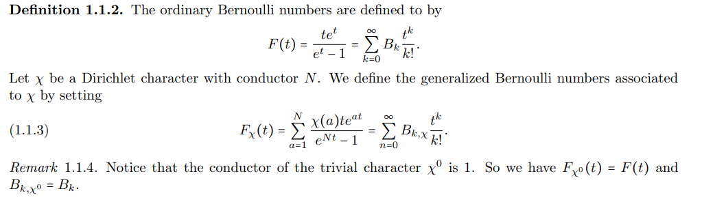
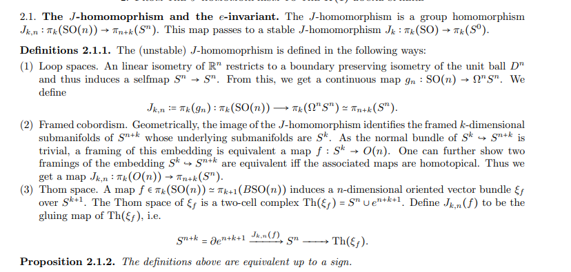
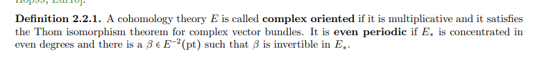

# 2021-03-26

## 20:00

- What is a [Dirichlet%20character](../Dirichlet%20character.md)?
	- A Dirichlet character is equivalent to a group homomorphism
\[
\chi:(\mathbb{Z} / N)^{\times} \rightarrow \mathbb{C}^{\times}
.\]

- What is a [Dirichlet%20L%20function](Dirichlet%20L%20function)?
  - Definition of a Dirichlet $L\dash$function:
  \[
  L(s ; \chi):=\sum_{n=1}^{\infty} \frac{\chi(n)}{n^{s}}
  =
  =\prod_{p}\left(1-\chi(p) p^{-s}\right)^{-1}
  .\]

- How are the [Bernoulii%20number](Bernoulii%20number) defined?

- What is the [Dirichlet%20character](../Dirichlet%20character.md)?
	

- What is the [../J-homomorphism.md](../J-homomorphism.md)?
	- How is it defined in terms of [loop%20space](../loop%20space.md)?
	- How is it defined in terms of [framed%20cobordism](framed%20cobordism)?
	  What is a [../framed.md](../framed.md)?
	- How is it defined in terms of[../Thom%20space.md](../Thom%20space.md)?
	  	What is a Thom space?
			

- What is a [../complex%20oriented%20cohomology%20theory.md](../complex%20oriented%20cohomology%20theory.md)?
	

- What is a [../uniformizer.md](../uniformizer.md)?
  - Uniformizer $\pi$: can think of this as a generator of a maximal ideal.
