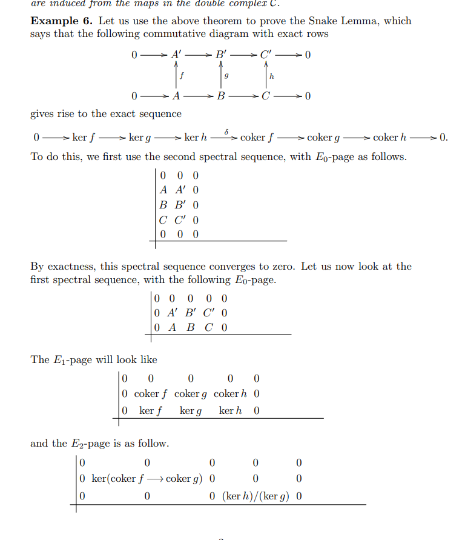
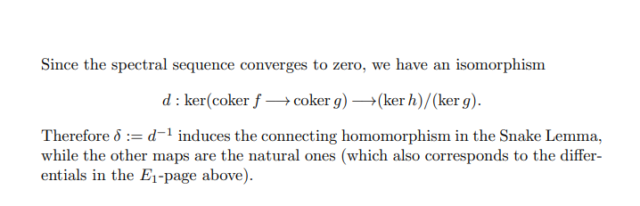
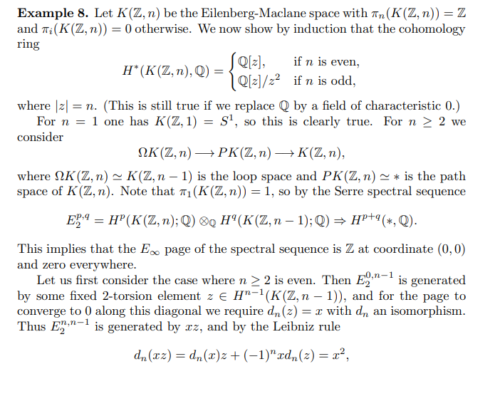
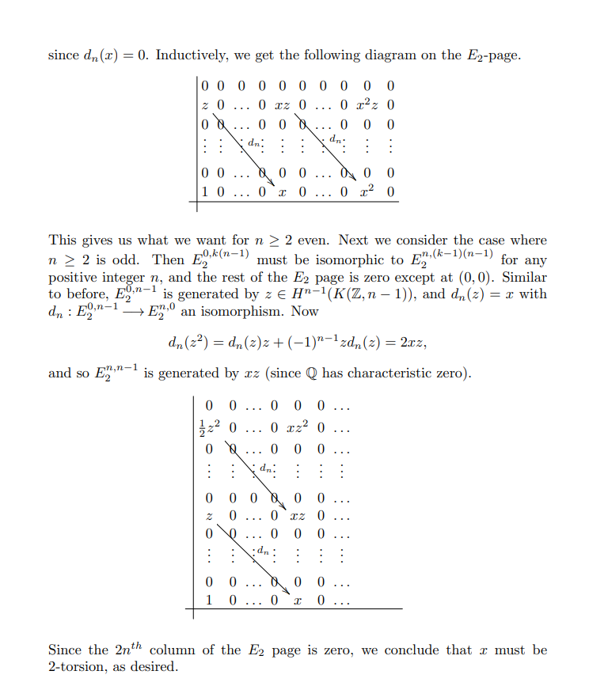
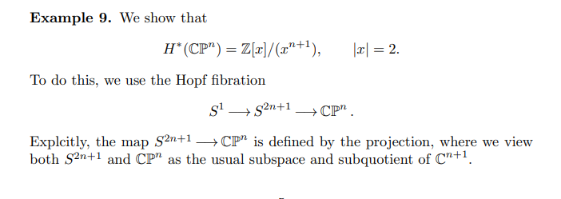
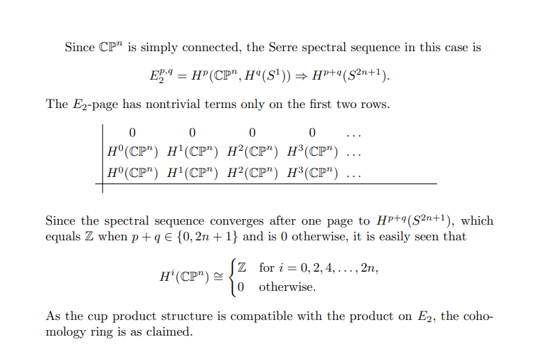
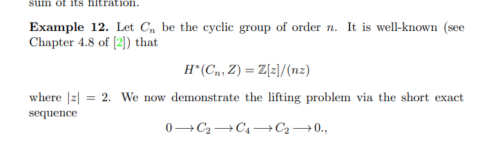
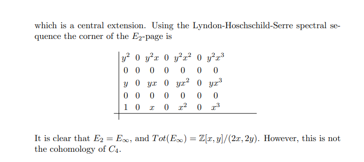
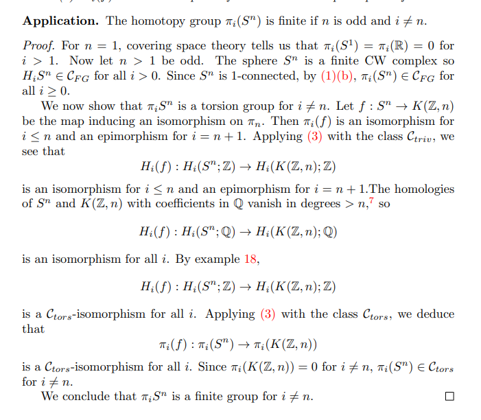

# 2021-04-03

## 16:28

> The connections between [../chromatic%20homotopy%20theory.md) are key. Read Quillen's paper, J.F. Adams' blue book, Ravenel, etc. Ravenel has some slides on Quillen's work (good entry pt](../chromatic%20homotopy%20theory.md)%20are%20key.%20Read%20Quillen's%20paper,%20J.F.%20Adams'%20blue%20book,%20Ravenel,%20etc.%20Ravenel%20has%20some%20slides%20on%20Quillen's%20work%20(good%20entry%20pt). If you really want to go in depth, I enjoyed learning from Hazewinkel's book "Formal Groups and Applications".

## 16:30

[../Advice.md](../Advice.md)

### Setting Goals

- Don't set goals to be outcome-dependent.
  Set input goals!
  E.g. "Write a book that I'm proud of and I like."

- Don't set goals that depend on factors outside of your control -- hitting some metric, getting a specific award, etc.

- Check in with your emotional state.
  It's not always healthy to push through not feeling like doing something.
  This can be useful if it's a matter of discipline, i.e. if pushing through is actually serving you well.
  But it can also serve you poorly in the long run by exacerbating poor mental state or leading to burnout.

- It's okay to take a break.
  Check in to ask yourself if it's coming from a place of self-care or instead procrastination.

- Choose to be satisfied!
  The story you tell yourself after the fact does not change the reality of the past.
  Does it serve you well to say "I didn't do enough?"
  It's okay to choose to be satisfied.

### Studying

- Have a mental model is the key priority, then go to rote memorization only when absolutely necessary.
  Remember because you understand the subject!

- Use active recall for the *learning* process -- actively test yourself **as** you're reading.

- See book: "Make It Stick"

- The evidence is that popular techniques have low utility: rereading, highlighting, summarizing, taking notes.

- Summarizing and taking notes: low utility in general.
  This has some marginal utility if you're particularly skilled or trained in summarizing effectively.
  So not very effective, but do it if it brings you joy!

- Active recall and practice testing: high utility!
  Not very time-intensive, doesn't require special skills/training.

- Do practice testing **during each study session**.
  Studies show 10-15% improvement.
  Try to ask yourself inference questions.

- Studies show that those doing retrieval practice actually predict the smallest improvements and achieve the highest improvements.
  Very counterintuitive, trust the process!
  
- Reading once and practice testing can be more effective than rereading 4 times, *and* takes less time.

- Make first draft of notes with the book closed, no references.

- Spaced repetition: also works on a micro scale!
  E.g. within a single study session.

  - Recalling within a single session leads to almost a 30% increase in retention.
    Multiple successive recalls leads to no incremental gain, but multiple *spaced* recalls boosts by an additional 50%.
    Note that the last two are the same amount of work -- letting yourself forget slightly forces retrieval.

- Practice a little bit each day over a long period of time.

- Extremely important: scope your subject.
  Know the broad outline of the course inside and out.
  Can scope based on actual exams.

- Start from topics you *don't* know as well.
  E.g. work backwards though lecture notes.

- Try interleaved practice: don't necessarily need to master a topic before moving on, realizing that you'll be reviewing it several times again before it's needed.

  - Getting through a large number of topics can be more useful than getting through a single topic in detail.

- Idea for tracking system:
  put course outline by topics into a spreadsheet, then record dates of review next to each topic.
  Color code cells based on quality of recall.

- Revision needs to be a fluid process, not worth timetabling down to each section due to different time requirements for each.
  Pick what makes your brain work the hardest.

## 19:04

### [../spectral%20sequence.md](../spectral%20sequence.md)

> [https://www2.math.upenn.edu/~yeya/spectral_sequence.pdf](https://www2.math.upenn.edu/~yeya/spectral_sequence.pdf)

- Snake Lemma

- Rational cohomology of $K(Z, n)$

- Cohomology ring of $\CP^n$

- The Lifting Problem

- [../Homotopy%20Groups%20of%20Spheres.md](../Homotopy%20Groups%20of%20Spheres.md)

