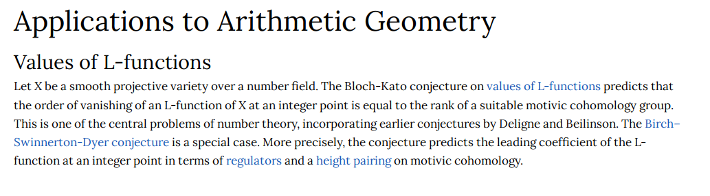

# 2021-04-14

## 21:22

- Why are functional analytic spectra related to algebraic geometry spectra?

## [L%20function](L%20function)

- What is the Bloch-Kato conjecture?
  What does it predict for $L\dash$functions?
	#unanswered_questions 
  - How does it relate to [motivic%20cohomology](motivic%20cohomology)?
	#unanswered_questions
 
- What are the [../Birch%20and%20Swinnerton-Dyer%20conjecture.md](../Birch%20and%20Swinnerton-Dyer%20conjecture.md) conjectures?
  What do they predict for $L\dash$functions?
	#unanswered_questions 
- What is a [regulator](regulator)?
- What is the [height%20pairing](height%20pairing)?

