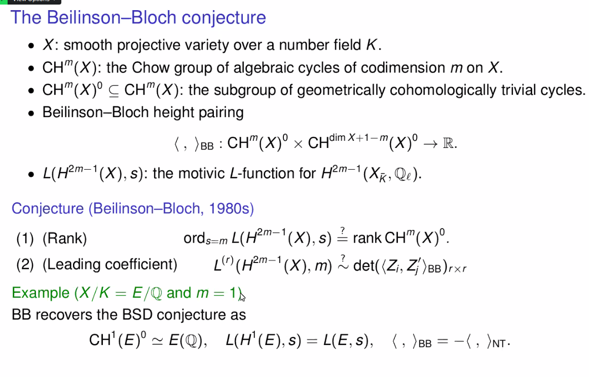
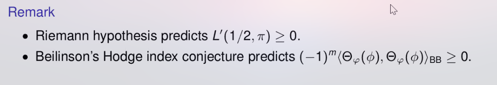
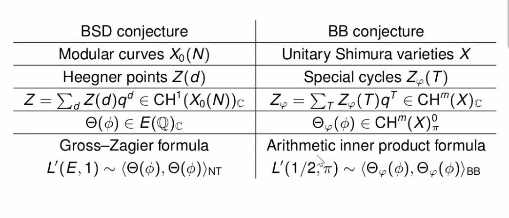

-   [2021-04-15](#section)
    -   [Beilinson-Bloch Conjecture](#beilinson-bloch-conjecture)
    -   [20:13](#section-1)

2021-04-15
==========

Beilinson-Bloch Conjecture
--------------------------

> Reference: Chao Li, "Beilinson-Bloch conjecture for unitary Shimura varieties". Priinceton/IAS NT Seminar

-   What is the [[../Beilinson-Bloch%20conjecture.md | ../Beilinson-Bloch%20conjecture.html]] conjecture?

-   Beilinson-Bloch conjecture: generalizes the [[../Birch%20and%20Swinnerton-Dyer%20conjecture.md | ../Birch%20and%20Swinnerton-Dyer%20conjecture.html]] conjecture.

-   What are higher [[../Chow%20ring.md | ../Chow%20ring.html]] ? What do they generalize?

    -   Higher Chow groups: generalize the [[../elliptic%20curve.md | ../elliptic%20curve.html]]

-   What is an [[../adele.md | ../adele.html]] point?

-   I should also review what a [[../place.md | ../place.html]]really is. Definitely what it means to be an [Archimedean%20place](Archimedean%20place). Also double-check the $v\divides \infty$ notation.

-   What is an [automorphic%20representation](automorphic%20representation)?

-   See [Gross-Zagier](Gross-Zagier) formula.

-   What is a [[../modular%20curve.md | ../modular%20curve.html]]?

-   What is a [[../complex%20multiplication.md | ../complex%20multiplication.html]] to get it defined over other fields?

-   Gotta learn [[../modular%20form.md | ../modular%20form.html]]. They can take values in the complexification of a Mordell-Weil group? Also need to know something about [Hecke%20operator](Hecke%20operator).

-   What is a [Shimura%20variety](Shimura%20variety)?

-   What is a theta series? Something here called an *arithmetic theta lift*, where some pairing form generalizes Gross-Zagier (?). See Beilinson-Bloch height maybe?

-   I should read a lot more about Chow groups.

-   What is [Betti%20cohomology](Betti%20cohomology)?

-   Why is proving that something is [[../modular%20form.md | ../modular%20form.html]] a *big deal*?

-   Look for the Kudla Program in arithmetic geometry, and [[Kudla-Rapoport%20conjecture | ../Kudla-Rapoport%20conjecture.html]].

-   Comment by Peter Sarnak: BSD was first checked numerically for CM elliptic curves!

-   What is the characteristic function of a lattice? What is a self-dual [lattice](lattice)?

-   What is a Siegel [Eisenstein%20series](Eisenstein%20series)? Or even just an Eisenstein series.

-   See [Néron-Tate%20height](Néron-Tate%20height) pairing? Seems like these BB heights can only really be computed locally, then you have to sum over places.

-   What are the [[Standard%20conjectures | ../Standard%20conjectures.html]]?

-   Main formula and big theorem:

    

    Seems that we know a lot about the LHS, the right-hand side is new. We don't know nondegeneracy of the RHS, for example, e.g. the pairing vanishing implying the cycle is zero.

    -   Proof technique: "doubling".

-   See [[Tate%20conjecture | ../Tate%20conjecture.html]].

-   Comment from Peter Sarnak: we know very little about where $L$ functions vanish, except for $1/2$.

-   Need to do [[../Resolution%20of%20singularities.md) when you don't have a "regular" (integral? | ../Resolution%20of%20singularities.html]]%20when%20you%20don't%20have%20a%20"regular"%20(integral?) model.

20:13
-----

-   Paper recommended by Juliette Bruce: <https://arxiv.org/pdf/2003.02494.pdf>

    -   Jonathan Love! Shows some cool consequences of the [[../elliptic%20curve.md) where the image \$`{\operatorname{CH}}`{=tex}\^1(E_1)\_0 `\otimes `{=tex}`{\operatorname{CH}}`{=tex}\^1(E_2)\_0 `\to `{=tex}`{\operatorname{CH}}`{=tex}\^2(E_1 `\times `{=tex}E_2 | ../elliptic%20curve.html]]%20%20where%20the%20image%20$/CH^1(E_1)_0%20/tensor%20/CH^1(E_2)_0%20/to%20/CH^2(E_1%20/cross%20E_2)$ is finite. BB predicts this is always finite when defined over $k$ a [number%20field](number%20field).

-   I should remind myself what [[../Global%20field.md | ../Global%20field.html]] are.
