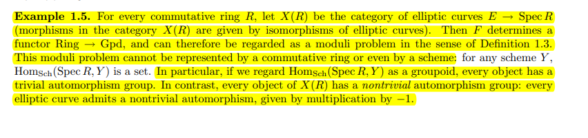
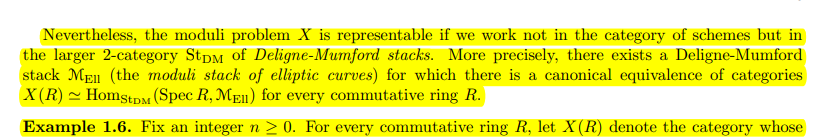
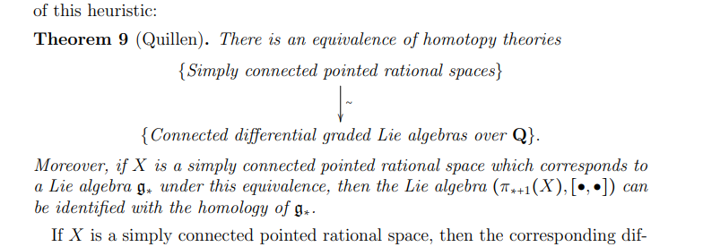
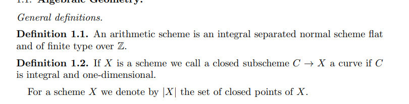
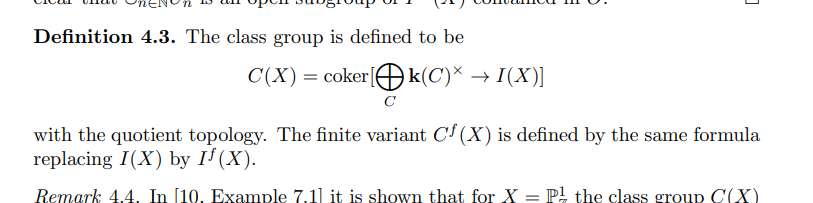

Error on 1

{ ["2"] = exit,["3"] = 1,} 
\documentclass{standalone}
\input{/home/zack/.pandoc/custom/preamble_common}
\begin{document}
\nopagecolor
\begin{tikzcd}
  \mathsf{WCart}&&& {\widehat{{\mathbb{A}}^1}/{\mathbb{G}}_m} \\
  \\
  \\
  {\mathsf{WCart}^{\mathrm{HT}}} &&& {B{\mathbb{G}}_m}
  \arrow[dashed, from=4-1, to=4-4]
  \arrow[from=1-1, to=1-4]
  \arrow[hook, from=4-4, to=1-4]
  \arrow[hook, from=4-1, to=1-1]
\end{tikzcd}
\end{document}
-   [2021-04-21](#section)
    -   [15:05](#section-1)
    -   [Why are ../derived%20category.md important?](#why-are-..derived20category.md-important)
    -   [[A Roadmap to ../Hill-Hopkins-Ravenel.md | #a-roadmap-to-..hill-hopkins-ravenel.html]]
    -   [Some ../Lurie.md Content](#some-..lurie.md-content)
        -   [[The Relationship Between ../K-Theory.md | #the-relationship-between-..k-theory.html]]
        -   [[../Eilenberg-MacLane%20space.md | #eilenberg-maclane20space.html]]
        -   [[Why Care About ../stack.md? | #why-care-about-..stack.html]]
    -   [Homotopy Theory is Connected to Lie%20Algebra%20Cohomology](#homotopy-theory-is-connected-to-lie20algebra20cohomology)
    -   [[../Class%20field%20theory.md | #class20field20theory.html]]

2021-04-21
==========

15:05
-----

Bhargav Bhatt (Harvard NT Seminar)

-   One can take [[etale%20cohomology | ../etale%20cohomology.html]] of varieties, and later refine to schemes, and thus take it for the base field even when it's not algebraically closed and extract arithmetically interesting information.

-   [[Prismatic%20cohomology | ../Prismatic%20cohomology.html]]: meant to relate a number of other cohomology theories

-   [Prism): a pair \$(A, I](Prism):%20a%20pair%20$(A,%20I)$ where $A$ is a commutative ring with a derived Frobenius lift $\phi:A\to A$, i.e. a $\delta{\hbox{-}}$structure.

    -   $I {~\trianglelefteq~}A$ is an ideal defining a [[Cartier%20divisor | ../Cartier%20divisor.html]].
    -   $A$ is $(P, I){\hbox{-}}$complete.
    -   Any ideal generator $d\in I$ satisfies $\phi(d) = d^p + p\cdot u, u\in A^{\times}$.

-   Fix a scheme and study prisms over it. Need these definitions to have stability under base-change.

-   Examples:

    -   $A \coloneqq{\mathbb{Z}}_p$ and $\phi = \operatorname{id}$ with $I = \left\langle{ p }\right\rangle$ yields [Crystalline%20cohomology](Crystalline%20cohomology).
    -   $A \coloneqq{\mathbb{Z}}_p{\left[\left[ u \right]\right]  }, \phi(u) = u^p$. Then $I = \left\langle{ E(u) }\right\rangle$ is generated by an [Eisenstein%20polynomial](Eisenstein%20polynomial). Here $A/I = {\mathcal{O}}_K$

-   Prismatic [Formal%20scheme](Formal%20scheme) over $A/I$. Define `
    
    \begin{align*}
    (X/A)_\prism = \left\{{ (A, I) \to (B, J) \in \mathop{\mathrm{Mor}}(\mathsf{Prism}), \operatorname{Spf}(B/J) \to X \text{ over } A/I }\right\} 
    ,\end{align*}
    `{=html} topologized via the [flat%20topology](flat%20topology) on $B/J$.

-   There is a [[../structure%20sheaf.md) ${\mathcal{O}}_\prism$ where \$(B, J | ../structure%20sheaf.html]]%20$/OO_/prism$%20where%20$(B,%20J) \to B$. Take $\mathop{\mathrm{{\mathbb{R} }}}\Gamma$, which receives a Frobenius action, to define a cohomology theory. Why is this a good idea?

-   Absolute prismatic sites: for $X\in {\mathsf{Sch}}(p{\hbox{-}}\text{adic})$, define `
    
    \begin{align*}
    X_\prism \coloneqq\left\{{ (B, J) \in \mathsf{Prism},\, \operatorname{Spf}(B/J) \to X }\right\} 
    .\end{align*}
    `{=html} Take \[\[sheaf%20cohomology) to obtain \$`\mathop{\mathrm{{\mathbb{R} }}}`{=tex}`\Gamma`{=tex}*`\prism`{=tex}(X) `\coloneqq `{=tex}`\mathop{\mathrm{{\mathbb{R} }}} `{=tex}`\Gamma`{=tex}(X*`\prism`{=tex}, `{\mathcal{O}}`{=tex}\_`\prism`{=tex}\]\] `{\circlearrowleft}`{=tex}\_`\phi`{=tex}\$.

-   The category $\mathsf{Prism}$ doesn't have a [final%20object](final%20object), so has interesting cohomology. Relates to algebraic $K{\hbox{-}}$theory of ${\mathbb{Z}}_p$?

-   Questions: let $X_{/{\mathbb{Z}}_p}$ be a smooth formal scheme.

    -   What is the [cohomological%20dimension) of \$`\mathop{\mathrm{{\mathbb{R} }}} `{=tex}`\Gamma`{=tex}\_`\prism`{=tex}(X](cohomological%20dimension)%20of%20$/Rd%20/Gamma_/prism(X)$?
    -   What are the $F{\hbox{-}}$[crystals](crystals) on $X_\prism$?
        -   Produce finite flat $B{\hbox{-}}$modules?

-   Bhatt and Lurie: found a stacky way to understand the absolute prismatic site of ${\mathbb{Z}}_p$. Drinfeld found independently.

-   Construction due to Simpson: take $X\in {\mathsf{Var}}({\mathsf{Alg}})$, define a de Rham presheaf `
    
    \begin{align*}
    X_{\mathrm{dR}}: {\mathsf{Alg}_{\mathbb{C}} }^{\operatorname{fp}} &\to {\mathsf{Set}}\\
    R &\mapsto X(R_{ \text{red} })
    .\end{align*}
    `{=html}

    -   Translates other cohomology theories into something about coherent sheaves..?
    -   Can reduce to studying e.g. a vector bundle on a more complicated object.

-   Def: Cartier-Witt stack, a.k.a. the prismatization of ${\mathbb{Z}}_p$

    -   Define $\mathsf{WCart}$ to be the [formal%20stack](formal%20stack) on $p{\hbox{-}}$complete rings.

-   Plug in a $p{\hbox{-}}$nilpotent ring $R$ to extract all (derived) prism structure on $W(R)$.

-   Prisms aren't base-change compatible without the derived part.

-   This is a [[../groupoid.md | ../groupoid.html]].

-   An explicit presentation: $\mathsf{WCart}_0(R)$ are distinguished [[../Witt%20Vectors.md) in \$W(R | ../Witt%20Vectors.html]]%20in%20$W(R)$. Given by $[a_0, a_1, \cdots ]$ where $a_0$ is nilpotent and $a_1$ is a unit. This is a formal affine scheme. $\mathsf{WCart}= \mathsf{WCart}_0 / W^*$ is a presentation as a [stack%20quotient](stack%20quotient).

    -   Receives a natural Frobenius action, which is a [derived%20Frobenius%20lift](derived%20Frobenius%20lift).

-   Start by understanding its points, suffices to evaluate on fields of characteristic $p$.

-   If $k\in \mathsf{Field}(\mathsf{Perf})_{\operatorname{ch. p}}$, $\mathsf{WCart}(k) = \left\{{ {\operatorname{pt}}}\right\}$, with the point represented by $(W(k), ?)$.

    -   Yields a (geometric?) point $x_{{\mathbb{F}_p}}: \operatorname{Spec}({\mathbb{F}_p}) \to \mathsf{WCart}$.

-   Analogy to understanding [[../Hodge-Tate%20cohomology.md | ../Hodge-Tate%20cohomology.html]]. Similar easy locus in this stack.

-   Take 0th component of distinguished [[../Witt%20Vectors.md | ../Witt%20Vectors.html]] to get a diagram

`
 
`{=html}

> <https://q.uiver.app/?q=WzAsNCxbMCwwLCJcXFdDYXJ0Il0sWzMsMCwiXFxoYXR7XFxBQV4xfS9cXEdHX20iXSxbMywzLCJCXFxHR19tIl0sWzAsMywiXFxXQ2FydF57XFxtYXRocm17SFR9fSJdLFszLDIsIiIsMCx7InN0eWxlIjp7ImJvZHkiOnsibmFtZSI6ImRhc2hlZCJ9fX1dLFswLDFdLFsyLDEsIiIsMSx7InN0eWxlIjp7InRhaWwiOnsibmFtZSI6Imhvb2siLCJzaWRlIjoidG9wIn19fV0sWzMsMCwiIiwxLHsic3R5bGUiOnsidGFpbCI6eyJuYW1lIjoiaG9vayIsInNpZGUiOiJ0b3AifX19XV0=>

-   The bottom-left is this [Hodge-Tate%20stack](Hodge-Tate%20stack).

-   Now has a better chance of being an [formal%20stack](formal%20stack). Bottom arrow kills the formal direction.

-   Will be [[../group%20scheme.md | ../group%20scheme.html]]: need to produce a point and take automorphisms.

-   Take the distinguished element $V(?) \in W({\mathbb{Z}}_p)$. Produces a map `
    
    \begin{align*}
    \operatorname{Spf}({\mathbb{Z}}_p) \xrightarrow{\pi_{\operatorname{HT}}} \mathsf{WCart}^{\operatorname{HT}}
    .\end{align*}
    `{=html}

    -   Fact: $\pi_{\operatorname{HT}}$ is a flat cover and $\mathop{\mathrm{Aut}}(\pi_{\operatorname{HT}}) = W^*[ F]$.

-   **Upshot**: $\mathsf{WCart}^{\operatorname{HT}}= {\mathbf{B}}W^* [F]$ is a classifying stack. \[quasicoherent%20sheaves) on the left and representations of the (classifying stack of the) group scheme on the right. I.e. ${ \mathsf{D} }_{\operatorname{qc}}(\mathsf{WCart}^{\operatorname{HT}}) = \mathop{\mathrm{{\mathbb{R} }}}(W^*[F](quasicoherent%20sheaves)%20on%20the%20left%20and%20representations%20of%20the%20(classifying%20stack%20of%20the)%20group%20scheme%20on%20the%20right.%20I.e.%20$/D\_/qc(/WCart^/HT)%20=%20/Rd%20(W^\*\[F)\]\$.

    -   Teichmüller lift yields a ${\mathbb{Z}}/p$ grading on the LHS.

    -   Something about Deligne-Illusie? [Hodge-to-deRham%20degeneration](Hodge-to-deRham%20degeneration)

    -   Upshot: a [[../divisor.md | ../divisor.html]] inside is easy to understand.

-   Fact: ${ \mathsf{D} }_{\operatorname{qc}}(\mathsf{WCart})$ are equivalent to `
    
    \begin{align*}
    \varprojlim_{(A, I)\in \mathsf{Prism}} { \mathsf{D} }_{(P, I)-?}(A)
    .\end{align*}
    `{=html}

-   Diffracted Hodge cohomology: let $X\in {\mathsf{Schf}}_{{\mathbb{Z}}_p}$. Get a prismatic structure sheaf using the assignment $(A, I) \to \mathop{\mathrm{{\mathbb{R} }}}\Gamma_\prism \qty{ (X\otimes A/I) / A}$.

-   Heuristic: $\operatorname{Spec}{\mathbb{Z}}_p$ should be 1-dimensional over something.

-   Get an absolute comparison: $\operatorname{cohdim}\mathop{\mathrm{{\mathbb{R} }}}\Gamma_\prism (X) \leq d+1$ where $d = \operatorname{reldim}X_{/{\mathbb{Z}}_p}$.

-   There is a deRham comparison: `
    
    \begin{align*}
    X_{{\mathbb{F}_p}}^* H_\prism(X) \cong \mathop{\mathrm{{\mathbb{R} }}}\Gamma_\mathrm{dR}(X_{{\mathbb{F}_p}})
    .\end{align*}
    `{=html}

-   There is a Hodge-Tate comparison: the object $H_\prism(X)$ restricted to $\mathsf{WCart}^{\operatorname{HT}}$ has an increasing filtration with ${\mathsf{gr}\,}_i = \mathop{\mathrm{{\mathbb{R} }}}\Gamma(X, \Omega^i_X)[-i]$.

    -   Use representation interpretation, then $\mu_p \curvearrowright{\mathsf{gr}\,}_i$ by weight $-i$.

-   Combine these comparisons to get Deligne-Illusie: if $\operatorname{reldim}X < p$, then `
    
    \begin{align*}
    \mathop{\mathrm{{\mathbb{R} }}}\Gamma_\mathrm{dR}(X_{{\mathbb{F}_p}}) \cong \bigoplus_{i} \mathop{\mathrm{{\mathbb{R} }}}\Gamma(X_{{\mathbb{F}_p}}, \Omega^i[-i])
    .\end{align*}
    `{=html} Get a lift to characteristic zero, yields Hodge-to-deRham degeneration there.

-   An $F{\hbox{-}}$crystal on $X_\prism$ is a vector bundle $\mathcal{E} \in { \mathsf{Vect} }(X_\prism, {\mathcal{O}}_\prism)$? Plus some extra data.

-   Infinite tensor product: `
    
    \begin{align*}
    I_\prism \otimes F^* I_\prism \otimes(F^2)^* I_\prism \otimes\cdots 
    .\end{align*}
    `{=html} Converges to some object ${\mathcal{O}}_\prism \left\{{ 1 }\right\} \in {\operatorname{Pic}}(X_\prism, {\mathcal{O}}_\prism )$, twisted? Yields isomorphism of sheaves after inverting $I_\prism$, `
    
    \begin{align*}
     F^* {\mathcal{O}}_\prism \left\{{ 1 }\right\} \cong I_\prism^{-1}\otimes{\mathcal{O}}_\prism \left\{{ 1 }\right\} 
     .\end{align*}
    `{=html}

    -   Convergence: this is a formal stack, any [thickening](thickening) are identified with something... On each finite approximation, most terms are ${\mathcal{O}}_X$.

-   Some analog of [Artin--Schreier](Artin–Schreier) here, taking fixed points?

-   There is a natural functor from $F{\hbox{-}}$crystals on $X$ to local ${\mathbb{Z}}_p$ systems on a geometric fiber $X_?$?

-   Main theorem: produces [[../descent.md) data, uses work on Beilinson fiber sequence (Benjamin Antieau, Morrow, others? | ../descent.html]]%20data,%20uses%20work%20on%20Beilinson%20fiber%20sequence%20(Benjamin%20Antieau,%20Morrow,%20others?)

-   Can say `
    
    \begin{align*}
    H^i(\Delta_{{\mathbb{Z}}_p}) =
    \begin{cases}
    {\mathbb{Z}}_p & i=0 
    \\
    \prod_{{\mathbb{N}}} {\mathbb{Z}}_p & i=1.
    \end{cases}
    \end{align*}
    `{=html} Can compute using [[../topological%20Hochschild%20homology.md | ../topological%20Hochschild%20homology.html]]? $\pi_{-1}( {\operatorname{TP}}({\mathbb{Z}}_p) )$ is where the $i=1$ part comes from.

    -   [[../Hodge-Tate%20cohomology.md | ../Hodge-Tate%20cohomology.html]].

-   Prismatic is filtered by things that look like Hodge-Tate

-   Absolute = arithmetic (take eigenspaces, related to [motivic%20cohomology)](motivic%20cohomology)), relative = geometric?

    -   Link to [[../K-Theory.md | ../K-Theory.html]] comes from eigenspaces somehow.

-   Similar to situation in [[../Étale%20cohomology.md | ../etale%20cohomology.html]]: need absolute and relative to compute either.

Why are [[../derived%20category.md | ../derived%20category.html]] important?
-----------------------------------------------------------------------

-   Homological algebra lives in the [[../derived%20category.md | ../derived%20category.html]]
-   In AG, tight link between [coherent%20sheaves](coherent%20sheaves)
-   See the [[Bondal-Orlov%20conjecture | ../Bondal-Orlov%20conjecture.html]].
    -   [[../birational.md | ../birational.html]] is a weakening of isomorphism between varieties
    -   Being derived equivalent is a weakening of having equivalent ${\mathsf{DCoh}}$
    -   Both recover actual isomorphisms in the case of smooth projective varieties
-   Rep theory: equivalent derived categories is called [Morita%20equivalence](Morita%20equivalence).
    -   Derived equivalence is a weakening of Morita equivalence
    -   Can replace an algebra by a much simpler derived-equivalent one
    -   Use to study [[group%20algebra | ../group%20algebra.html]]
    -   Lots of numerical consequences?

A Roadmap to [[../Hill-Hopkins-Ravenel.md | ../Hill-Hopkins-Ravenel.html]]
---------------------------------------------------------------------

<https://mathoverflow.net/questions/257885/roadmap-to-hill-hopkins-ravenel>

Some [[../Lurie.md | ../Lurie.html]] Content
---------------------------------------

<http://people.math.harvard.edu/~lurie/915.html>

<http://people.math.harvard.edu/~lurie/915list.pdf>

<http://people.math.harvard.edu/~lurie/937.html>

### The Relationship Between [[../K-Theory.md | ../K-Theory.html]]

> Some remarks on ${\operatorname{THH}}$ and $K{\hbox{-}}$Theory, no clue what the original source was:

-   [[../topological%20Hochschild%20homology.md | ../topological%20Hochschild%20homology.html]] somehow makes computations easier.

-   $K{\hbox{-}}$theory says something about [monodromy](monodromy) of vector bundles around infinitesimal loops

-   For $X$ a nice [derived%20stacks) \$`\mathop{\mathrm{Maps}}`{=tex}\_`{ \operatorname{DSt}}`{=tex}(S\^1, X](derived%20stacks)%20%20$/Map_/DSt(S^1,%20X)$.

    -   Points of $LX$: infinitesimal loops in $X$

-   Identify ${\operatorname{THH}}(X) \xrightarrow{\sim} {\mathcal{O}}(LX)$ (global functions)

    -   Corollary of a result in Ben-Zvi--Francis--Nadler "Integral Transforms and Drinfeld Centers in [[../derived%20algebraic%20geometry.md | ../derived%20algebraic%20geometry.html]]"?

-   [Dennis%20trace): a comparison \$K(X) `\to `{=tex}`{\operatorname{THH}}`{=tex}(X](Dennis%20trace):%20a%20comparison%20$K(X)%20/to%20/THoH(X)$, takes $E\in { {\mathsf{Bun}}\qty{\operatorname{GL}_r} }$ to the canonical monodromy automorphism of the pullback of $E$ to $LX$

    -   Use the map $LX\to X$ sending a loop to its basepoint

-   Traces are $S^1{\hbox{-}}$[[../equivariant.md | ../equivariant.html]] because loops! Just equip $K(X)$ with the trivial $S^1$ action.

-   Take [Homotopy%20fixed%20points](Homotopy%20fixed%20points) to get something smaller than ${\operatorname{THH}}$: ${\operatorname{THC}}^-$, topological negative cyclic homology

    -   See Connes' negative [cyclic%20homology](cyclic%20homology)

-   Dennis trace is invariant under *all* covering maps of circles, even multisheeted

    -   Encoded not in a group action by a [cyclotomic%20structure](cyclotomic%20structure).
    -   Take homotopy fixed points of the cyclotomic structure on ${\operatorname{THH}}$ to get ${\operatorname{TC}}$, [[../Topological%20cyclic%20homology.md | ../Topological%20cyclic%20homology.html]]
    -   There is a map $K\to {\operatorname{TC}}$

-   Theorem of Dundas-Goodwillie-McCarthy: whenever $A\to A'$ is a nilpotent extension of connective [[Ring%20Spectra), \$K(A') `\xrightarrow{\sim}`{=tex} K(A) `{ \underset{\scriptscriptstyle {{\operatorname{TC}}(A)} }{\times} }`{=tex} `{\operatorname{TC}}`{=tex}(A' | ../Ring%20Spectra.html]],%20$K(A')%20/mapsvia{/sim}%20K(A)%20/fiberprod{/TC(A)}%20/TC(A')$

### [[../Eilenberg-MacLane%20space.md | ../Eilenberg-MacLane%20space.html]]

-   Some good stuff from Akhil Mathew on EM spaces: <https://amathew.wordpress.com/2010/12/06/eilenberg-maclane-spaces/amp/>

### Why Care About [[../stack.md | ../stack.html]]?

-   Why should I care about stacks? \#unanswered_questions

 

-   Why should I care about [derived%20stacks](derived%20stacks)? \#unanswered_questions

-   Note from Arun: one can get [[../Obstruction%20Theory.md | ../Obstruction%20Theory.html]]

Homotopy Theory is Connected to [Lie%20Algebra%20Cohomology](Lie%20Algebra%20Cohomology)
----------------------------------------------------------------------------------------

[[../Class%20field%20theory.md | ../Class%20field%20theory.html]]
------------------------------------------------------------

-   [Arithmetic%20schemes](Arithmetic%20schemes) 

-   Wiesend's finiteness theorem is one of the strongest and most beautiful results in higher [Global%20class%20field%20theory](Global%20class%20field%20theory)?

-   The main aim of higher [class%20groups) \$C(X](class%20groups)%20$C(X)$.

