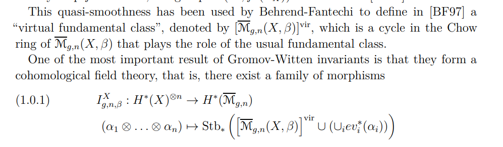
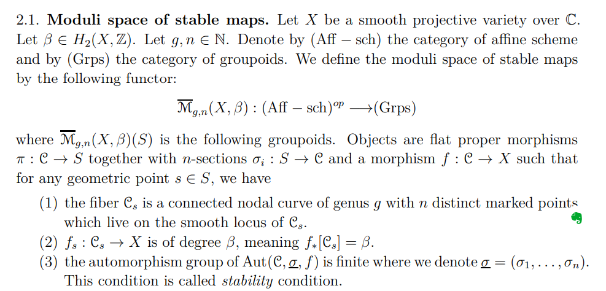
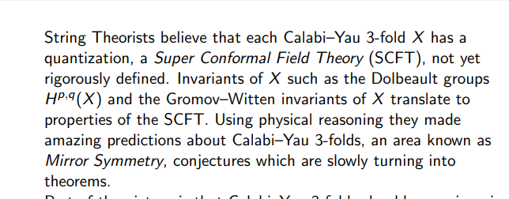
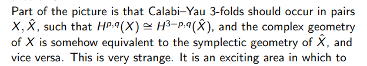
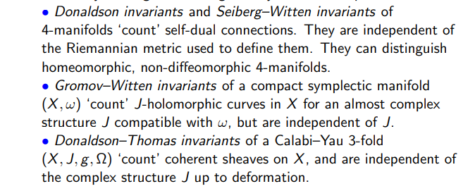
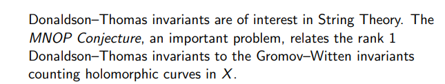
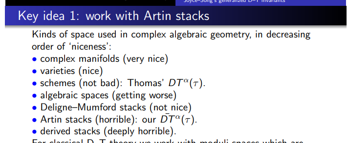

-   [2021-04-22](#section)
    -   [Gromov-Witten Invariants in Derived AG](#gromov-witten-invariants-in-derived-ag)
    -   [Derived Stacks](#derived-stacks)

# 2021-04-22

## Gromov-Witten Invariants in Derived AG

-   My main question: does introducing derived stacks somehow make *some* computation easier? \#unanswered_questions

    -   I haven't found any explicit computations of these, but sources alluded to actual counts (numbers) conjecturally coming from physics, where a few have been verified.

-   Integrating over a [fundamental%20class](fundamental%20class):

    

-   [stable%20maps](stable%20maps)

-   [Operads](Operads):

-   Appearance of [[../Physics.md | ../Physics.html]]

    -   Related: [[../Mirror%20Symmetry.md | ../Mirror%20Symmetry.html]]

    

-   Mirror symmetry of CYs:

    

-   The major types of "moduli" style invariants

    

    -   See [quantum%20invariants](quantum%20invariants)

-   Why care about [coherent%20sheaves](coherent%20sheaves)? \#unanswered_questions

-   [Gromov-Witten%20invariants](Gromov-Witten%20invariants):

    

-   Niceness of spaces:

    

## Derived Stacks

-   We can't prove the [[Tate%20conjecture](../Tate%20conjecture.md)? I guess this is an arithmetic analog of the [Hodge%20conjecture | ../Hodge%20conjecture.html]]. Serre's book calls some isomorphism the Tate conjecture and says it's proved though.

-   Pithy explanation of a [derived%20scheme](derived%20scheme): a space which can be covered by Zariski opens $Y\cong \operatorname{Spec}A^*$ where $A\in {\mathsf{cdga} }_{k}$.

    -   [[../stack.md | ../stack.html]] can be very singular.

    -   [derived%20stacks](derived%20stacks) act a bit like smooth, nonsingular objects.

        -   Morphisms behave like they are transverse?

-   Derived modular stacks of [[../deformation%20theory.md | ../deformation%20theory.html]] of sheaves on $X$.

    -   The homology of its "tangent space" at a point $[E]$ is $\operatorname{Ext} ^*(E, E)$, which only holds in restricted degrees if you only use a non-derived moduli scheme or stack.
