# 2021-04-23

## What is [../Equivariant%20cohomology.md](../Equivariant%20cohomology.md)?

- <https://arxiv.org/pdf/1305.4293.pdf>

- Some uses:

  - Calculate number of [threefold) (Kontsevich 1995](threefold)%20(Kontsevich%201995)

  - Calculate characteristic numbers of a compact [../homogeneous%20space.md) (Tu 2010](../homogeneous%20space.md)%20(Tu%202010)

  - Derive [../fiber%20bundle.md) whose fibers are homogeneous spaces (Tu 2011](../fiber%20bundle.md)%20whose%20fibers%20are%20homogeneous%20spaces%20(Tu%202011)

  - Calculate integrals over manifolds as sums over fixed points: [Hopf%20index%20theorem](Hopf%20index%20theorem).

    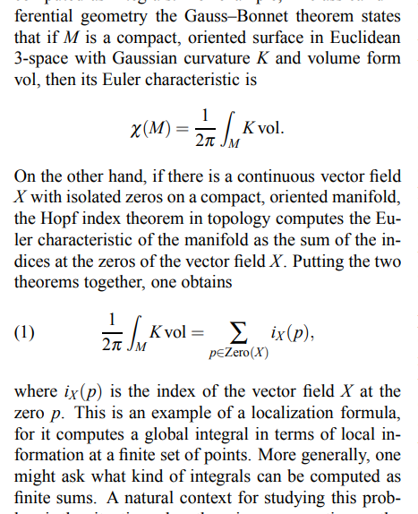

- What is the [Homotopy%20quotient](Homotopy%20quotient)?
	#unanswered_questions 
  
  - 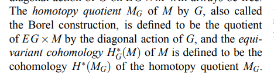

- If $G\actson M$ with $G$ a compact connected [../Lie%20group.md](../Lie%20group.md), Cartan constructs a chain complex from $M, \lieg$.

  - 

  - Is this not precisely the [Borel%20construction](Borel%20construction)?
	#unanswered_questions 

- [classifying%20spaces](classifying%20spaces): $\B S^1 = \CP^{\infty}$

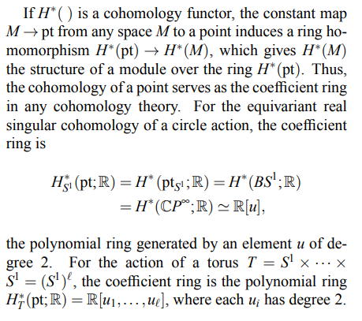

- Why are [maximal%20torii](maximal%20torii) useful?
  - 
	#unanswered_questions 

## What is a scheme?

- <https://www.ams.org/publications/journals/notices/201711/rnoti-p1300.pdf>

- Manifolds are the place to do differential calculus, [../scheme.md](../scheme.md) are the place to do algebra by finding zeros of functions.

- [Closed%20point): of the form $V(S](Closed%20point):%20of%20the%20form%20$V(S) \da \ts{ q\in \spec R \st q\contains S}$

## Notes on [Homotopy%20colimit](Homotopy%20colimit) via Diagrams

- <http://mathieu.anel.free.fr/mat/doc/Anel-Semiomaths-HomotopyColimit.pdf>

- 

- 

- 

- 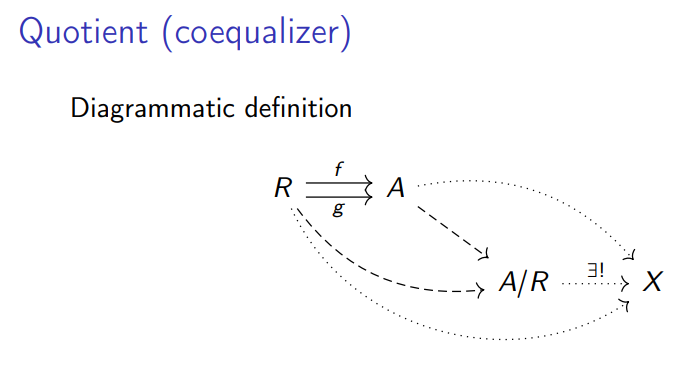

- 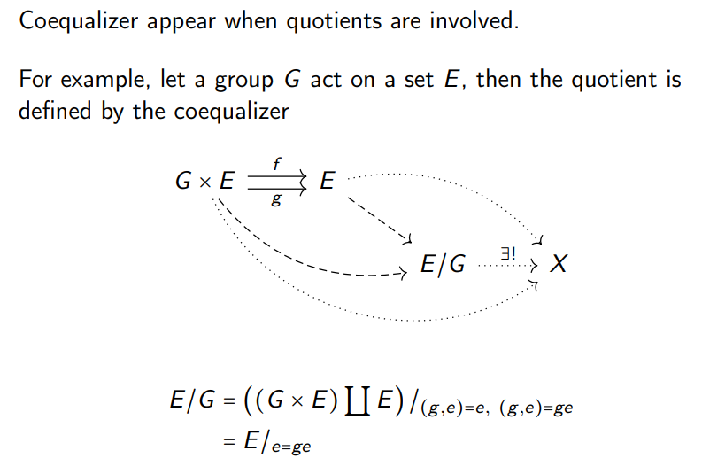

- 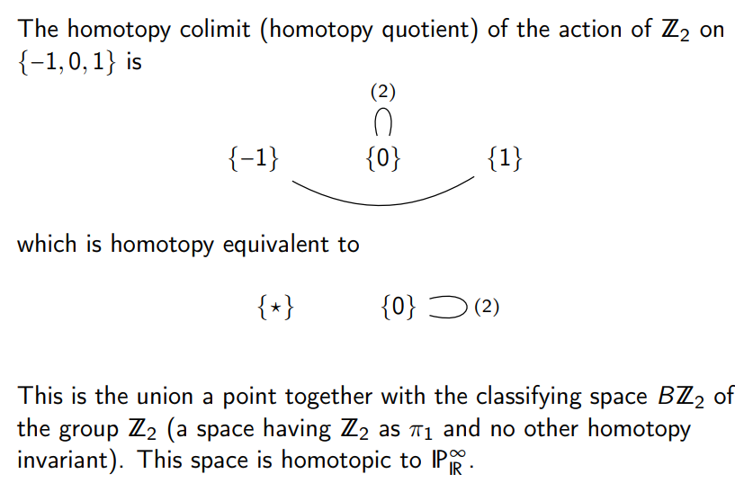

- 

- Hocolims are [../homotopy%20type.md](../homotopy%20type.md).
- There is a functor $\pi_0: \inftyGrpd\to \Set$.

## 15:07

- Hironaka: Fields for existence of [../Resolution%20of%20singularities.md) in every dimension in $\ch(k](../Resolution%20of%20singularities.md)%20in%20every%20dimension%20in%20$/ch(k) = 0$.

## [../Advice.md](../Advice.md)

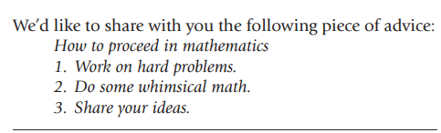

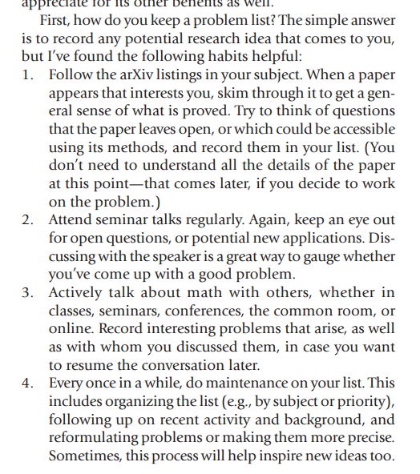

- Don't do now what can wait until tomorrow! 
	Make room for your research:

  

## Time Management

- Setting goals: SMART.
  Doesn't work for research though!

  

- Make lists, and habitually review/revise/plan.

  

- I really like the "keeping a problem list" idea.

- Don't be ashamed to ask people if they have problems you can work on.

## [../Subjects/homotopy%20theory.md](../../Subjects/homotopy%20theory.md)?

Tags: #idle_thoughts

- Thinking about the link between group cohomology and homotopy theory: if I have a SES 
\[
0\to A \to B \to C \to 0
,\]
  should one apply a functor like $K(\wait, 1)$?
  Is this actually a functor...?
  We definitely get spaces $K(A, 1)$ and $K(B, 1)$, for example, and there must be an induced map between them.
  Want to make precise what it means to get a SES like this:
  \[
  0 \to K(A, 1) \to K(B, 1) \to K(C, 1) \to 0
  .\]
  One would kind of want this to be part of a [fiber%20sequence](fiber%20sequence) I guess.
  But we're in $\Top$ anyway, so there's no real issue with just doing [../fibrant%20and%20cofibrant%20objects.md](../fibrant%20and%20cofibrant%20objects.md),.

  Maybe the "right" think to do here is to actually take a classifying [../groupoid.md) (?](../groupoid.md)%20(?), which must be some functor like $\B: \Grp \to \Grpd$.
  Surely this is some known thing.
  But then what is an "exact sequence of groupoids"...?
  \[
  0 \to \B A \to \B B \to \B C \to 0
  .\]

  Also, why should such a functor be an exact? 
  It'd kind of be more interesting if it *weren't*.
  Say it's right-exact, then how might you make sense of $\Ld \B(\wait)$?
  I think this just needs a model category structure on the *source*, although it seems reasonable to expect that $\Grpd$ would have some simple model structure.

## SeZoom

[../l-adic%20representations.md](../l-adic%20representations.md)

- Try computing things like $\Gal (\QQ( \zeta_3, \sqrt{3})$.

- There's some way to check orders of Galois groups using [../valuation.md](../valuation.md)..?

- See Néron-Ogg-Shafarevich criterion: [unipotently](unipotently).

- Always have quasi-unipotently, so eigenvalues roots of unity.
	- Easy for [../elliptic%20curve.md](../elliptic%20curve.md). 
	- For [Néron%20models](Néron%20models), see Silverman.

- [Galois%20representations](../Galois%20representations.md) at different primes are related, using local info at a few primes to get global info at all primes.

## 17:13

- Relation between [../quadratic%20form.md](../quadratic%20form.md) and unique factorization:

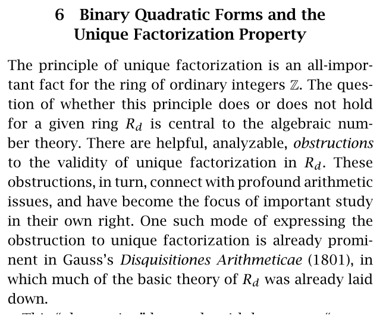

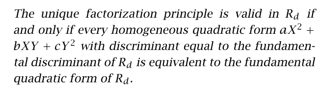

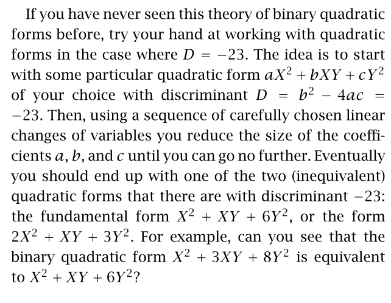

## 22:29

- See Marcus (?) for a nice proof of [quadratic%20fields](quadratic%20fields).
