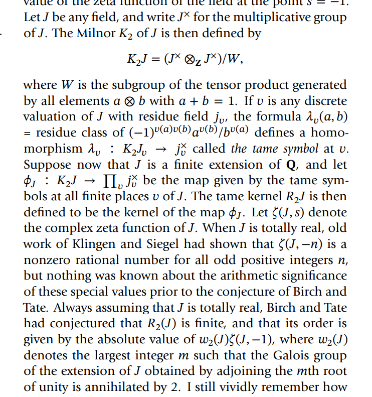

-   [2021-04-25](#section)
    -   [Fukaya Category](#fukaya-category)
    -   [Notes from Eisenbud](#notes-from-eisenbud)
    -   [Random](#random)
    -   [Milnor K Theory in the Wild](#milnor-k-theory-in-the-wild)
    -   [Modular forms and Deligne-Serre theorem](#modular-forms-and-deligne-serre-theorem)
    -   [The representation ring](#the-representation-ring)

# 2021-04-25

## Fukaya Category

Description of a certain wrapped [[../Fukaya%20category.md) ${\mathcal{O}}$: take the objects to be (Lagrangian | ../Fukaya%20category.html]]%20$/OO$:%20take%20the%20objects%20to%20be%20(Lagrangian) embedded curves, the morphisms are the graded abelian groups $\hom_{\mathcal{O}}\coloneqq\qty{\bigoplus_{L_0 \pitchfork L_1} {\mathbb{Z}}/2{\mathbb{Z}}, {{\partial}}}$ wher ${{\partial}}$ is given by counting holomorphic strips, localize along small isotopies.

## Notes from Eisenbud

Add to Algebra qual review doc \#todo

An ideal ${\mathfrak{p}}$ is prime iff $JK \subset {\mathfrak{p}}\implies J \subset {\mathfrak{p}}$ or $K\subset {\mathfrak{p}}$.

A ring is a domain iff the ideal $(0)$ is prime.

> Inductively, if ${\mathfrak{p}}$ contains a product of ideals then it contains one of them.

Maximal ideals are prime, since ${\mathfrak{m}}$ maximal implies that $R/{\mathfrak{m}}$ is a field.

A ring is *local* iff it has a unique maximal ideal ${\mathfrak{m}}$.

An element $e$ is idempotent iff $e^2 = e$.

An $R{\hbox{-}}$algebra $S$ is a ring $S$ and a homomorphism $\alpha:R \to S$.

Every ring is a ${\mathbb{Z}}{\hbox{-}}$algebra in a unique way.

The most interesting commutative algebras are $S/I$ where \$S = k[[../localization.md | ../localization.html]] of a ring at a prime ideal.

## Random

-   Steenbrink spectral sequence (Peters-Steenbrink for exposition)
-   Rapoport-Zink spectral sequence
-   Bounding ranks of curves over a [elliptic%20fibrations](elliptic%20fibrations)
-   [[../Burnside%20ring%20(algebraic%20geometry).md | ../Burnside%20ring%20(algebraic%20geometry).html]] in AG: Take the free abelian group on finitely generated field extensions over a base field.
-   Check statement of the Baez-Dolan [[The%20cobordism%20hypothesis | ../The%20cobordism%20hypothesis.html]]

## Milnor K Theory in the Wild

See [Milnor%20K%20theory](Milnor%20K%20theory)

-   An appearance of Milnor $K_2$ in the wild:

    

## Modular forms and Deligne-Serre theorem

-   [[Galois%20representations | ../Galois%20representations.html]], and there is a classification theorem:

    

## The representation ring

Tags: \#idle_thoughts

-   The [[../Representation%20theory.md | ../Representation%20theory.html]].

    -   How can we construct this using modern [[../groupoid.md](../groupoid.md) yoga? Take the category $\mathsf{G}{\hbox{-}}\mathsf{Mod}$, somehow restrict to just [irreducibles](irreducibles). Maybe there's a better thing to do here though, like "ignoring" reducibles the same way John Carlson "ignored" projectives. But okay, anyway, take that category. Take its [../geometric%20realization.md](../geometric%20realization.md) and then $\pi_0$ or something? And then take the free ${\mathbb{Z}}{\hbox{-}}$module. I definitely need to ask some homotopy theorists how this construction goes for usual [../K-Theory.md | ../K-Theory.html]] in modern terms. So like... `
        
        \begin{align*}
        {\mathbb{Z}}\left[ \pi_0 {\left\lvert { N \mathsf{C} } \right\rvert} \right]
        .\end{align*}
        `{=html} The $\pi_0$ should be taking isomorphism classes somehow, but maybe this only works for groupoids? But okay, whatever, I just need a functor that takes categories into spaces where two objects end up in the same path component iff they're isomorphic in $\mathsf{C}$. So maybe this needs to be something more [[../simplicial%20set.md | ../simplicial%20set.html]].
