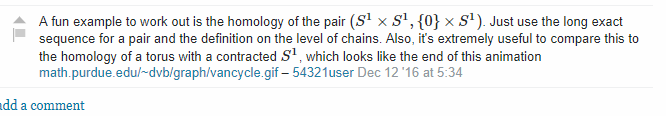
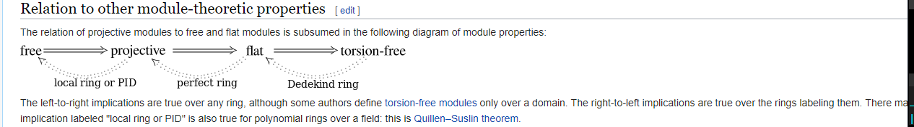
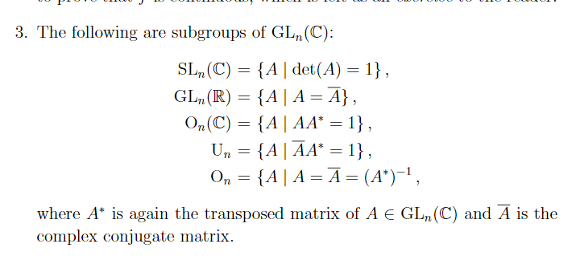
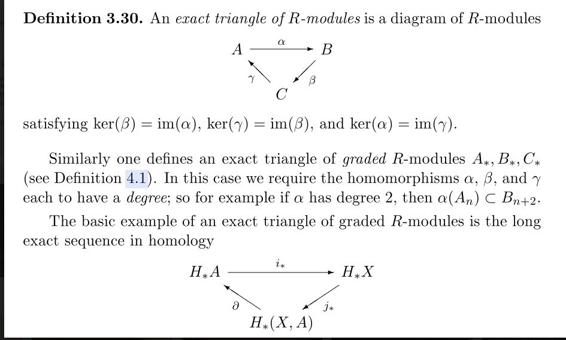

-   [2021-04-26](#section)
    -   [Random Notes](#random-notes)
    -   [Random Algebraic Topology](#random-algebraic-topology)
    -   [19:38](#section-1)

# 2021-04-26

## Random Notes

Some random notes: \#todo

    

## Random Algebraic Topology

> Reference: paper on "constructive" algebraic topology <https://www-fourier.ujf-grenoble.fr/~sergerar/Papers/Constructive-AT.pdf>

-   Many constructions in algebraic topology can be organized as solutions of fibration problems.

-   What are [[../Quillen%20equivalence.md | ../Quillen%20equivalence.html]]? \#unanswered_questions These need to preserve the [model%20structure](model%20structure) on each side presumably.

-   More fundamental: how *should* one prove an [[../equivalence%20of%20categories.md | ../equivalence%20of%20categories.html]] in general? \#unanswered_questions

-   Finding [[../adjunction.md | ../adjunction.html]] is usually easy, because checking isomorphisms on hom sets is concrete.

-   If you just have a random functor, does it even *have* right or left adjoints in general? There must be theorems about this. \#unanswered_questions

-   What is the [[../Stiefel%20manifold.md | ../Stiefel%20manifold.html]]? \#unanswered_questions

    -   I should write down an explicit set-theoretic description somewhere. This is definitely in Fomenko.

## 19:38

-   Is there a natural exact sequence associated to a [composition%20series](composition%20series)? \#unanswered_questions
    -   This seems like it should be super easy, we have quotients everywhere.
    -   Is there a precise relation to [iterated%20extensions](iterated%20extensions)..? \#unanswered_questions
