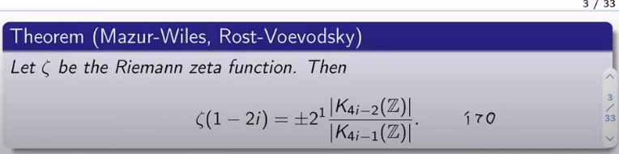
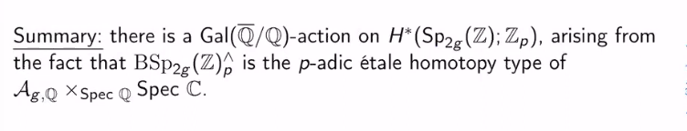
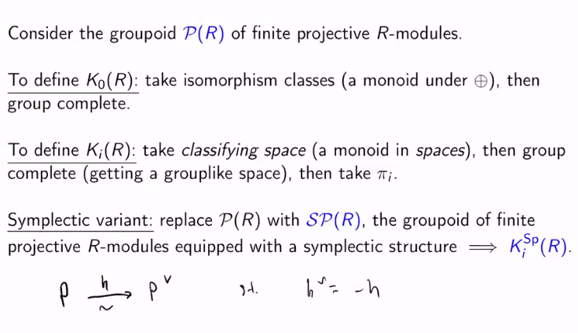
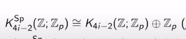
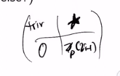
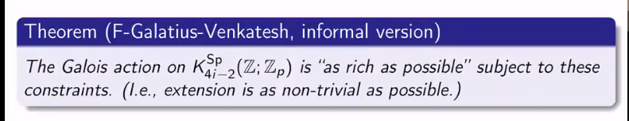
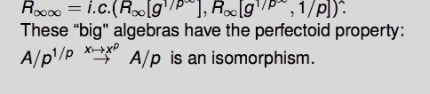

# 2021-04-29

## The Galois action on symplectic K-theory

> Reference: Tony Feng, "The Galois action on symplectic K-theory", EAKTS. <https://www.youtube.com/watch?v=Ulm8bCcuW2Q>
> Tags: #numbertheory #homotopy

- Significance of higher $K$ groups:

- Theorem and consequence of Quillen-Lichten: $K_{4i-2}(\ZZ) \tensor \ZZ_p \cong H^2_{\et}( \ZZ \invert{p}, \ZZ_p(2i))$.
  - Similar relationship between [Topological%20K%20theory](Topological%20K%20theory) and singular cohomology
  - Related to $\zeta(1-2i)$ by the [Iwasawa%20main%20conjecture) (Mazur-Wiles](../Iwasawa%20main%20conjecture.md)%20(Mazur-Wiles)
  - Isomorphism to $H^2_\sing(X, \ZZ_p(2i)$where $X$ is an etale $K(\pi, 1)$ for $\pi \da \pi_1(\ZZ\invert{p})$ which is a quotient of $\Gal( \Qbar / \QQ)$.
  - Interpretation of [../local%20system.md](../local%20system.md)  and etale sheaf 

- This sheaf: $\ZZ_p(1) \da \underset{n}{\directlim}\, \mu_{p^n}$ and $\ZZ_p(i) \da \ZZ_p(1)^{\tensor i}$.

- [../Global%20field.md](../Global%20field.md): a punctured 3-manifold
- Interpret $H^1(\ZZ\invert{p}) = H^1_{\Grp}(\pi_1 G)$ for $G \da \ZZ\invert{p})$, also isomorphic to $\Ext^1_G$: space of 2-dimensional [Galois%20representations](../Galois%20representations.md)

- For [Congruence%20subgroup) \( \Gamma\leq \GL_2(\ZZ) \), there is a natural Galois action on $H^*( \Gamma, \ZZ_p](Congruence%20subgroup)%20/(%20/Gamma/leq%20/GL_2(/ZZ)%20/),%20there%20is%20a%20natural%20Galois%20action%20on%20$H^*(%20/Gamma,%20/ZZ_p)$.

- [arithmetic%20groups](arithmetic%20groups)

- $\B \SP_{2g}(\ZZ)$ is the [etale%20homotopy%20type](etale%20homotopy%20type) of $\Ag$

- [symplectic%20form](symplectic%20form) on the lattice with a positivity condition.
  Principal: perfect pairing.

  - Can recover \( \Lambda = H_1(A; \ZZ) \) 
  - Quotient Siegel half-space (contractible) by $\Sp_{2g}(\ZZ)$ to forget choice of basis for \( \Lambda \).
  	Take [stack%20quotient](stack%20quotient).

  - Free quotient of contractible space: homotopy type of $\B \SP_{2g}(\ZZ)$.

- Some coincidences:
\[
H_{\Grp}(\Sp_{2g}(\ZZ)) \pcomplete
\cong
H_\Sing (\HH_g / \Sp_{2g}(\ZZ))\pcomplete
\cong
H_\Sing(\Ag(\CC); \ZZ_p)
\cong 
H_\et (\Ag_{g, \CC}; \ZZ_p)
.\]

- Can define an [Flat%20family](Flat%20family) of PPAVs.
  - Can write \( \mathcal{A}_{g, \CC} = \mathcal{A}_{g, \QQ} \fiberprod{\spec \QQ} \spec \CC    \) which has a natural action of $\Aut(\CC/\QQ)$ on the 2nd factor, which factors to $\Gal(\Qbar/\QQ)$.

  - Produces an action on $H_\et( \mathcal{A}_{g, \CC}; \ZZ_p)$. 

- 

- [../nerve.md](../nerve.md).

- Constructing [../K-Theory.md](../K-Theory.md):

  

- Can also do Quillen's [plus%20construction): $K_i(\ZZ) = \pi_i( \B\GL_{\infty}(\ZZ)^+](plus%20construction):%20$K_i(/ZZ)%20=%20/pi_i(%20/B/GL_{/infty}(/ZZ)^+)$, which is stable homology?

- Original paper title: Galois action on stable *cohomology* of $\Ag$.
  Need $p\gg i$, otherwise proof had many issues.
  Passing to stable homotopy theory made things easier!

- Question: where are $\B \Gamma$ [Shimura%20variety](Shimura%20variety)?

- Lie groups are homotopy equivalent to their maximal compact subgroups

- Hodge map: came from taking the [Hodge%20cohomology](Hodge%20cohomology)

- Galois action [unramified](unramified) except at $p$ implies it factors through $\pi_1 \ZZ\invert{p}$?

- Guessing the Galois action: trivial on the first factor, the [Cyclotomic%20character](Cyclotomic%20character) on the second.

  

- Room for extensions: the Galois action looks like the following, with a quotient in the bottom-right, a sub in the top-left, and a possible extension in the top-right:

  

- Informal statement of main theorem:

  

- Consider the category of extensions and find a universal object.

- $\spec \ZZ\invert{p}$: integers punctured at $p$

## Canonical, fpqc, finite topologies

> Reference: Yves André (CNRS), "On the canonical, fpqc and finite topologies: classical questions, new answers (and conversely)". Princeton/IAS NT seminar.

- What does it mean for an algebra to be [faithfully%20flat](faithfully%20flat) over another algebra?

- p-adic Hilbert functor: see Bhatt-Lurie.

  - Use this to get "almost" results, then use [Prismatic%20cohomology) techniques (where one has Frobenius](../Prismatic%20cohomology.md)%20techniques%20(where%20one%20has%20Frobenius) to remove the "almost".

- Extracting $p$th roots? 
  Passing from $k[g_1, \cdots, g_n]$ to $k[g_1^{1/p}, \cdots, g_n^{1/p}]$, I think...

- F-pure and strongly F-regular singularities are characteristic $p$ analogs of log-canonical and log-terminal singularities in the minimal model program.

- [../Tilting.md](../Tilting.md): pass from mixed characteristic to characteristic $p$.
  Try to use simpler proofs/theorems from characteristic $p$ situation.

  - Going forward: some limiting process after inverting $p$..?
    Going backward: take [../Witt%20Vectors.md](../Witt%20Vectors.md).

- What properties of schemes descend along [faithfully%20flat](faithfully%20flat) morphism? See EGA.
  However, what properties descend for the [fpqc](fpqc) topology?

  - What is a faithfully flat morphism?

- See Faltings' *almost purity* theorem.

- Commutative algebra: see excellent regular domains, integral vs algebraic closures.
	  - Cohen–Macaulay rings and modules

- Can have $\fpqc$ coverings that are not [fppf](fppf) coverings.

- What is a [regular%20scheme](regular%20scheme)?

  - Theorem: any finite covering of a regular scheme is an $\fpqc$ covering

  - Very nontrivial in characteristic zero.

  - [Noether%20normalization](Noether%20normalization) can show some finite coverings of $\AA^3_{/k}$ are not $\fppf$ coverings.

- Sometimes local or coherent cohomology classes

- Grothendieck's [faithfully%20flat](faithfully%20flat) implies something is an equivalence.

## Class groups and Galois representations

> Reference: Ribet, "Class Groups and Galois Representations". <https://math.berkeley.edu/~ribet/herbrand.pdf>

- Alternate definition of [ideal%20class%20group](../ideal%20class%20group.md): the group of fractional ideals.
 	- Defined as $\ZZ[fractional%20ideal](fractional%20ideal)

- What *is* the [Hilbert%20class%20field](../Hilbert%20class%20field.md)?

- The [../Class%20field%20theory.md): $\Cl(K) \mapsvia{\sim} \Gal(H/K](../Class%20field%20theory.md):%20$/Cl(K)%20/mapsvia{/sim}%20/Gal(H/K)$ where $\mfp \mapsto \Frob_{\mfp}$.

- Set $G_k \da \Gal(\Qbar/K)$, then $\Cl(K)$ is a quotient of $G_k^{\Ab}$.

  - Equivalently, $\Cl(K)\dual \leq G_k\dual$ where $(\wait)\dual \da \Hom_{\Top\Grp}(\wait, \CC\units)$.
  	I.e. take continuous [../characters.md](../characters.md).

- Open question: are there infinitely many [quadratic%20fields) $K$ for which $\Cl(K](quadratic%20fields)%20$K$%20for%20which%20$/Cl(K) = 0$

- [Dedekind%20zeta%20function](Dedekind%20zeta%20function):
\[
\zeta_K \da \prod_{\mfp \in \mspec \OO_K}(1 - N(\mfp)^{-s} )\inv
.\]
  - Note: guessing about the indexing set here.
  Original source just indexes over $\mfp$...

  - $\Res_{s=1} \zeta_K$ involves $h_k \da \# \Cl(K)$.

- Serre stresses: use functional equation to look at $s=0$ instead of $s=1$!
  Leads to cleaner/simpler formulas.

- [Kummer%20theory) proved FLT for exponent $p$ for **regular** primes, i.e. $\gcd(h_K, p](Kummer%20theory)%20proved%20FLT%20for%20exponent%20$p$%20for%20**regular**%20primes,%20i.e.%20$/gcd(h_K,%20p) = 1$.
  - Kummer's criterion: $p$ is regular iff $p$ divides none of the numerators of some [../Bernoulli%20numbers.md](../Bernoulli%20numbers.md).

- What is the [Teichmüller%20character](Teichmüller%20character)?

- [../elliptic%20curve.md](../elliptic%20curve.md), then
\[
\# \Sha(E/\QQ) \underset{?}{=} \qty{ L(E, 1) \over \Omega} \qty{ \#(E(\QQ))^2 \over \prod_\ell w_\ell}
,\]
  where \( \Omega \) is a [Tamagawa%20numbers](Tamagawa%20numbers).

- Need lower bounds of sizes of [class%20groups](class%20groups).
  Might be able to use elliptic curves, congruences between [Galois%20representations](../Galois%20representations.md) that lead to nontrivial elements of $\Sha$.

