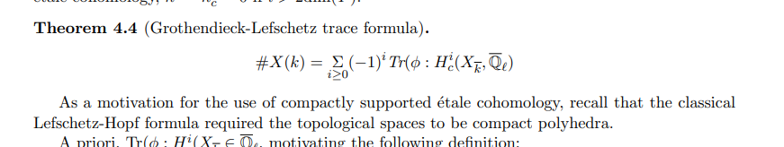
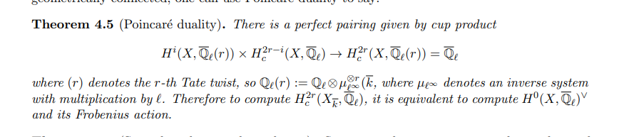
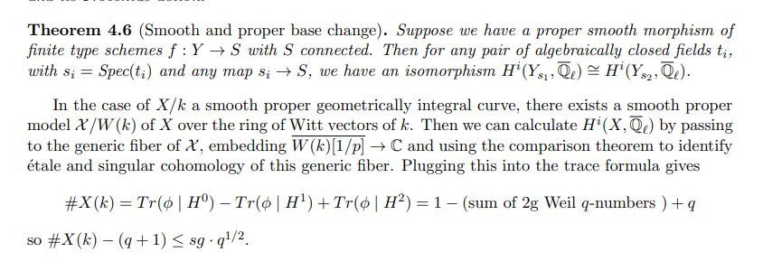
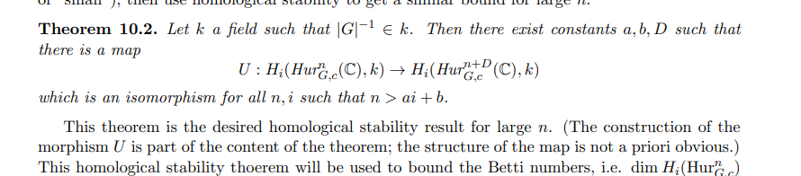
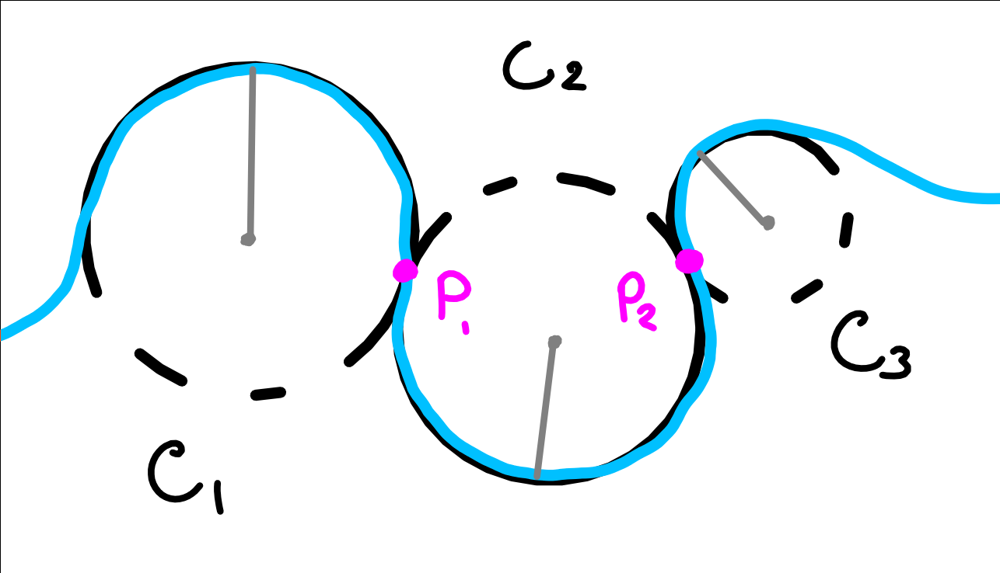

-   [2021-05-01](#section)
    -   [Notes on Arithmetic%20Statistics](#notes-on-arithmetic20statistics)
    -   [Old Notes: Erik Schreyer](#old-notes-erik-schreyer)
    -   [Dirichlet's Theorem](#dirichlets-theorem)
    -   [A SES isomorphic to a direct sum that does not split](#a-ses-isomorphic-to-a-direct-sum-that-does-not-split)
    -   [Cogroups](#cogroups)

# 2021-05-01

## Notes on [Arithmetic%20Statistics](Arithmetic%20Statistics)

-   Interesting question in arithmetic statistics: for $G \in {\mathsf{Grp}}$ finite, how many Galois extensions are there $K/{\mathbb{Q}}$ with $G = { \mathsf{Gal}} (K/{\mathbb{Q}})$ and $\Delta \leq N$ ([Discriminant)](Discriminant)) for some fixed $N$?

-   Example

    -   For $G={\mathbb{Z}}/2$, it is $O(N)$.
    -   For $G={\mathbb{Z}}/3$, it is $O(\sqrt N )$.

-   One can ask a similar question about ${ \operatorname{Cl}} (K)$ for $G\in {\mathsf{Ab}}$, or replacing ${\mathbb{Q}}$ with [inert%20primes](inert%20primes).

-   Cool fact: there is an [[../curves.md | ../curves.html]] $C_{/k}$.

    -   The (reverse) functor is the one sending a curve $C$ to its function field $k(C)$.

-   [Hurwitz%20spaces](Hurwitz%20spaces) come up here!

-   [[etale%20cohomology | ../etale%20cohomology.html]]:

-   ${\varepsilon}$ is a $q^i$ [Weil%20number) if \$\\abs{ `\iota`{=tex}(`{\varepsilon}`{=tex}](Weil%20number)%20if%20$/abs{%20/iota(/eps) } = q^{i/2}$ for any embedding $\iota: { \mkern 1.5mu\overline{\mkern-1.5mu \mathbb{Q} \mkern-1.5mu}\mkern 1.5mu }\hookrightarrow{\mathbb{C}}$.

    -   Examples: eigenvalues of geometric [Frobenius](Frobenius) acting on $H^i_c$.

-   As a general philosophy, one should expect that [[../scheme.md | ../scheme.html]].

-   [[../Subjects/Weil%20Conjectures.md | Subjects/Weil%20Conjectures.html]]

-   [Hurwitz%20spaces](Hurwitz%20spaces):

## Old Notes: Erik Schreyer

> Some old notes from March 10th, 2020

I talked to [http://www.jasoncantarella.com/wordpress/), including his dissertation work (which he spoke about in the Geometry seminar last week](http://www.jasoncantarella.com/wordpress/),%20including%20his%20dissertation%20work%20(which%20he%20spoke%20about%20in%20the%20Geometry%20seminar%20last%20week) and a few other papers.

His dissertation work involved a cool way to represent arbitrary planar curves by *piecewise circular* arcs:

From what I understand, this involves fixing a curve (blue), choosing a collection of circles $C_1, \cdots C_n$ (black) such that each $C_i$ intersects $C_{i+1}$ in at least one distinguished point $p_i$ (pink). The curve traced out by following an arc on $C_i$ and switching to circle $C_{i+1}$ at $p_i$ is intended to yield a good approximation to the original curve, with certain regularity conditions at the $p_i$ (such as the first derivatives along both arcs agreeing at the point).

Erik's work actually seems to go a bit farther -- he has an algorithm (a *curve-closing operator*) that actually takes an *open* curve and produces a closed curve that is nearby in the $C_1$ norm. He uses this to construct piecewise circular approximations that consist of circles of *equal* radii, along with some control over the $C^1$ distance between the original curve and the approximation.

We also talked a bit about another problem Jason was working on, discussed in the following papers:

-   <https://arxiv.org/abs/1310.5924>
-   <https://arxiv.org/abs/1510.02466>

## Dirichlet's Theorem

Dirichlet's Theorem: An arithmetic progress with $(a, p) = 1$ contains infinitely many primes. As a corollary, one can always find a *prime* $q$ that generates ${\mathbb{Z}}_p^{\times}$ for any prime $p$.

## A SES isomorphic to a direct sum that does not split

[http://math.stackexchange.com/questions/1082283/example-of-a-non-splitting-exact-sequence-0-%E2%86%92-m-%E2%86%92-m-oplus-n-%E2%86%92-n-%E2%86%92-0/1082313 \> 1082313](http://math.stackexchange.com/questions/1082283/example-of-a-non-splitting-exact-sequence-0-%E2%86%92-m-%E2%86%92-m-oplus-n-%E2%86%92-n-%E2%86%92-0/1082313#1082313) Not every sequence of the form $0\to A \to A \oplus C \to C \to 0$ splits; take `

\begin{align*}
0 \to {\mathbb{Z}}\to {\mathbb{Z}}\oplus \bigoplus_{\mathbb{N}}{\mathbb{Z}}/(2) \to \bigoplus_{\mathbb{N}}{\mathbb{Z}}/(2) \to 0
\end{align*}
`{=html} where the first map is multiplication by 2, the second is the quotient map and a right-shift. This can't split because $(1, 0, \cdots)$ has order 2 in the RHS but pulls back to $(1, 0) \oplus (2{\mathbb{Z}}\oplus 0)$ which has no element of order 2.

## Cogroups

> Reference: <https://qchu.wordpress.com/2011/01/21/structures-on-hom-sets/>

-   Group object: have structure maps `
    
    \begin{align*}
    m: G^{\times 2} &\to G \\
    {\varepsilon}: 1 &\to G \\
    i: G &\to G
    .\end{align*}
    `{=html} where 1 is a terminal (?) object.

-   Cogroup objects: have structure maps `
    
    \begin{align*}
    m: H &\to H^{\times 2} \\
    {\varepsilon}: H &\to 0 \\
    i: H &\to H
    \end{align*}
    `{=html} where $0$ is an initial object.

-   Example: $S^n \in {\mathsf{ho}}{\mathsf{Top}}$.

-   **Importance**: What structure does $H$ need to have such that $\hom(H,{-})$ has a group structure when applied? The answer is that $H$ is a group object in $\mathcal{C}^{\operatorname{op}}$, or equivalently that $H$ is a cogroup object in $\mathcal{C}$.

-   The forgetful functor $U: {\mathsf{Set}}\to{\mathsf{Grp}}$ is representable by $\hom_{{\mathsf{Grp}}}({\mathbb{Z}}, {-})$, and the coproduct in ${\mathsf{Grp}}$ is the free product.

-   Recall that $\mathsf{CRing}^{\operatorname{op}}\cong {\mathsf{Sch}}({\mathsf{Aff}})$, the category of affine schemes.

-   The adjoint to the forgetful functor $\mathsf{CRing}\to {\mathsf{Set}}$ is the free commutative ring on $X$, i.e. ${\mathbb{Z}}[X]$, and is thus representable. The forgetful functor $\mathsf{CRing}\to {\mathsf{Ab}}$ given by sending a ring to its underlying abelian group is also representable, namely by $\hom_{\mathsf{Ring}}({\mathbb{Z}}[x], {-})$. The coproduct in $\mathsf{Ring}$ is the tensor product over ${\mathbb{Z}}$, and the initial object is ${\mathbb{Z}}$.

-   ${\mathbb{Z}}[x]$ with its cogroup structure defines the structure of an affine group scheme on $\operatorname{Spec}{\mathbb{Z}}[x]$, which represents the "additive group" functor and is called the additive group scheme ${\mathbb{G}}_a$. Dualizing, an affine group scheme in the category $\mathsf{CRing}$ is precisely a Hopf algebra.

-   Similarly, the forgetful functor $\mathsf{CRing}\to {\mathsf{Ab}}$ given by sending $R$ to $R^{\times}$ is representable by `
    
    \begin{align*}
    \mathop{\mathrm{Hom}}_{\mathsf{Ring}}({\mathbb{Z}}[x, x^{-1}], {-})
    \end{align*}
    `{=html} and the corresponding affine group scheme $\operatorname{Spec}{\mathbb{Z}}[x, x ^{-1}]$ is the multiplicative group scheme ${\mathbb{G}}_m$.

-   Note: the functor ${\mathsf{Sch}}({\mathsf{Aff}}) \to {\mathsf{Set}}$ sending a ring to its set of prime ideals is not representable (and doesn't preserve products), but the functor `
    
    \begin{align*}
    \mathop{\mathrm{Hom}}_{{\mathsf{Sch}}({\mathsf{Aff}})}(\operatorname{Spec}k, {-})
    \end{align*}
    `{=html} sending a scheme to its $k{\hbox{-}}$points for any $k$ is representable (and preserves all limits).
