-   [2021-05-04](#section)
    -   [14:31](#section-1)
    -   [14:36](#section-2)
    -   [15:06](#section-3)
    -   [19:33](#section-4)

# 2021-05-04

## 14:31

> Reference: The reciprocity law for the twisted second moment of Dirichlet L-functions <https://arxiv.org/pdf/0708.2928.pdf>

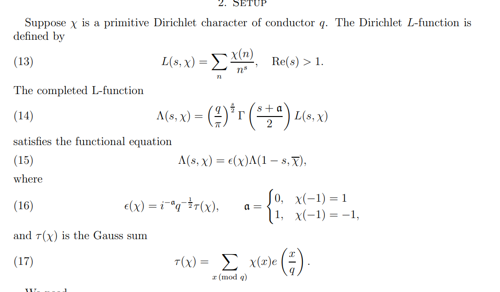

-   What is a [Dirichlet%20character](Dirichlet%20character)?

-   What is a [Gauss%20sum](Gauss%20sum)?

-   What is the *completion* of an [L%20function](L%20function)? Guessing this has to do with continuation.

-   What is Dirichlet's trick?

-   How can you break a sum up into [arithmetic%20progressions](arithmetic%20progressions)?

## 14:36

> Reference: The $K'$--theory of [monoid](monoid) sets <https://arxiv.org/pdf/1909.00297.pdf>

[[../K-Theory.md | ../K-Theory.html]]

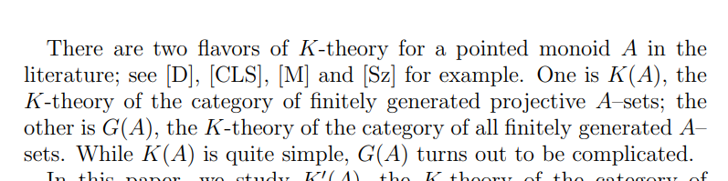

-   $K'(A)$ defined for partially cancellative $A{\hbox{-}}$sets.
    -   Important example: the pointed [monoid](monoid) ${\mathbb{N}}\coloneqq\left\{{{\operatorname{pt}}, 1, t, t^2, \cdots, }\right\}$.
-   Useful in [toric%20geometry](toric%20geometry).

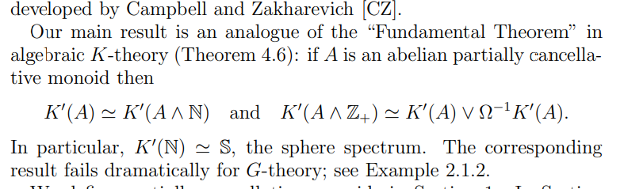

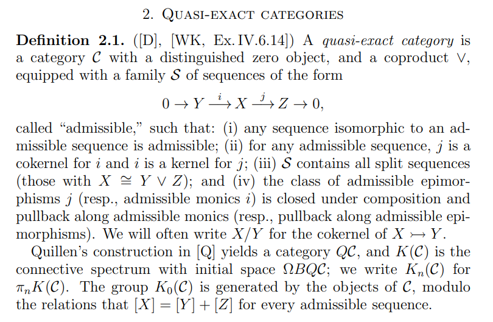

-   The category ${\mathsf{Set}}^{\mathrm{fin}}_{{\scriptstyle { * } }}$ of finite pointed sets is quasi-exact, and Barratt-Priddy-Quillen implies that $K({\mathsf{Set}}^{\mathrm{fin}}_{\scriptstyle { * } }) \simeq{\mathbb{S}}$.

    -   If $A$ has no idempotents or units then $K(A) \simeq{\mathbb{S}}$.

-   [Group%20completion](Group%20completion): comes from ${\Omega}^\infty {\Sigma}^\infty {\mathbf{B}}G_+$.

-   Big theorem: Devissage. But I have no clue what this means. Seems to say when ${\mathsf{K}}(A) \cong {\mathsf{K}}(B)$?

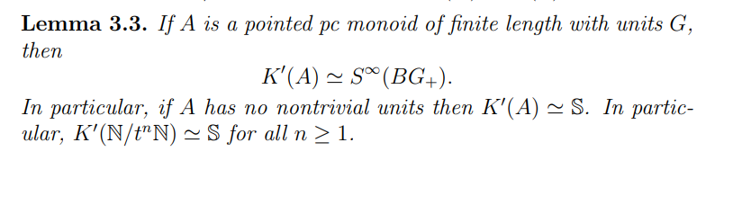

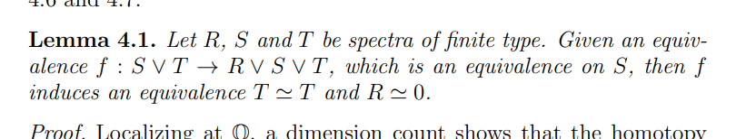

-   Apparently easy theorem: ${\mathsf{K}}'({\mathbb{N}}) \simeq{\mathbb{S}}$.

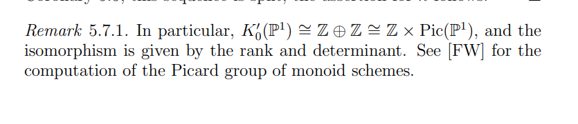

## 15:06

> Reference: Stefan Schreieder, Refined unramified cohomology. Harvard/MIT AG Seminar talk.

-   See the [[cycle%20class%20map](cycle%20class%20map). Understanding the image amounts to the [Hodge%20conjecture) and understanding torsion in the image \$Z\^i(X | ../Hodge%20conjecture.html]]%20and%20understanding%20torsion%20in%20the%20image%20$Z^i(X)$?

    -   See algebraic equivalence in the [[Chow%20group | ../Chow%20group.html]].

-   Gysin sequence yields a residue map ${\partial}_x: H^i( \kappa(X); A) \to H^{i-1}( \kappa(X); A)$.

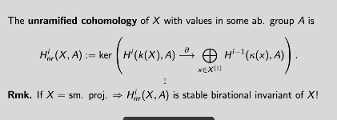

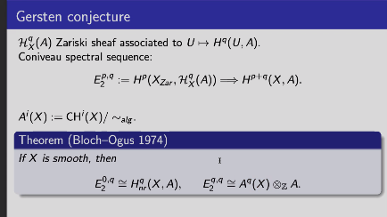 [Gersten%20conjecture | ../Gersten%20conjecture.html]]

-   Interesting parts of the Coniveau spectral sequence: something coming from unramified cohomology, and something coming from algebraic cycles mod algebraic equivalence.

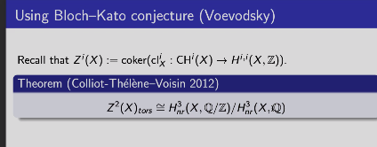

-   Uses [[../Bloch-Kato%20conjecture.md | ../Bloch-Kato%20conjecture.html]]

-   Allows detecting classes in $Z^2(X)$ using [[../K-Theory.md | ../K-Theory.html]] methods.

-   See [algebraic%20scheme](algebraic%20scheme), essentially singular homology with a degree shift?

-   See [ind-objects](ind-objects) in an arbitrary category.

    -   [[../scheme.md | ../scheme.html]].

-   Filter by codimension, then obstructions to extending over higher codimension things is measured by cohomology of the [[../Function%20field.md | ../Function%20field.html]]:

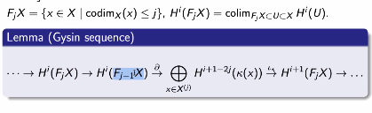

-   Here ${{\partial}}$ is a *residue map*.

-   See [[../finite%20type.md | ../finite%20type.html]].

**Main theorem**, works not just for smooth schemes, but in greater generality:

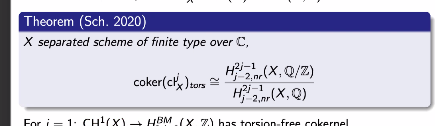 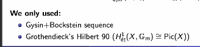

-   Torsion in the Griffiths group is generally not finitely generated.

    -   Use an Enriques surface to produce $({\mathbb{Z}}/2)^{\oplus \infty}$ in $\mathop{\mathrm{Griff}}^3$.

-   See [Abel-Jacobi%20invariants](Abel-Jacobi%20invariants)?

-   No Poincaré duality for Chow groups, at least not at the level of cycles. Need to pass to cohomology.

    -   Dual $\beta$ of \$\[\[../Brauer%20group.md) \$`\mathop{\mathrm{Br}}`{=tex}(S\]\]\$ of the surface. Note $\beta$ is not algebraic.

-   Theorem: there exists a [ruled%20surfaces), and \$`\mathop{\mathrm{Br}}`{=tex}(S) `\twoheadrightarrow `{=tex}`\mathop{\mathrm{Br}}`{=tex}(S\_`\eta`{=tex}](ruled%20surfaces),%20and%20$/Br(S)%20/surjects%20/Br(S_/eta)$.

    -   $\mathop{\mathrm{Br}}(X_\eta) \cong {\mathbb{Z}}/2$ is generated by an [unramified](unramified) conic bundle.
    -   Can extend conic smoothly over [[../central%20fiber.md | ../central%20fiber.html]]
    -   Need that the Poincaré dual [[../special%20fiber.md | ../special%20fiber.html]].

-   See [[étale%20locally | ../etale%20locally.html]].

-   [Milnor%20K%20theory](Milnor%20K%20theory).

## 19:33

> Reference: <https://www.youtube.com/watch?v=XTOwj1LvntM>

Clausen: baby topic in [[Springer%20correspondence](Springer%20correspondence). Need [../derived%20category.md | ../derived%20category.html]]... very difficult to define!
