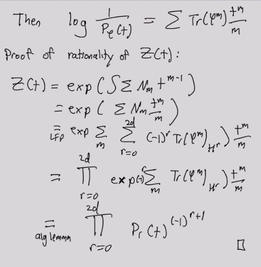
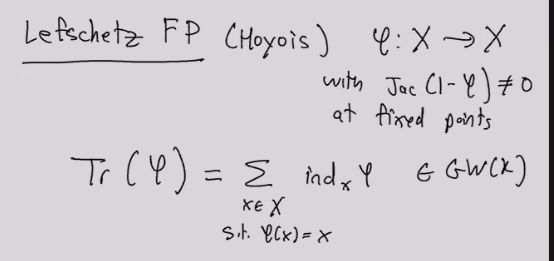
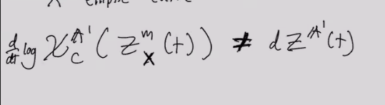
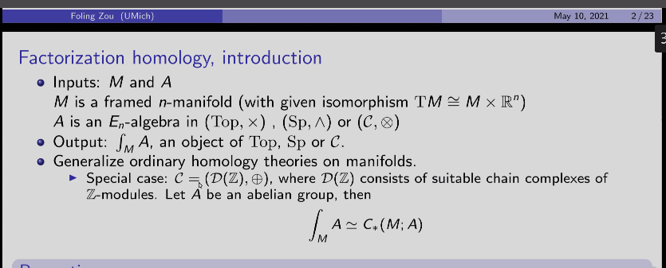
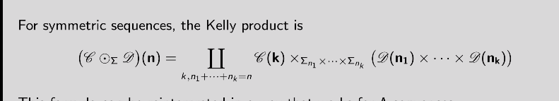
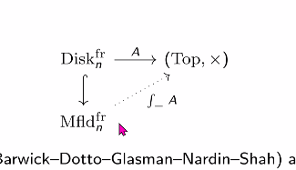
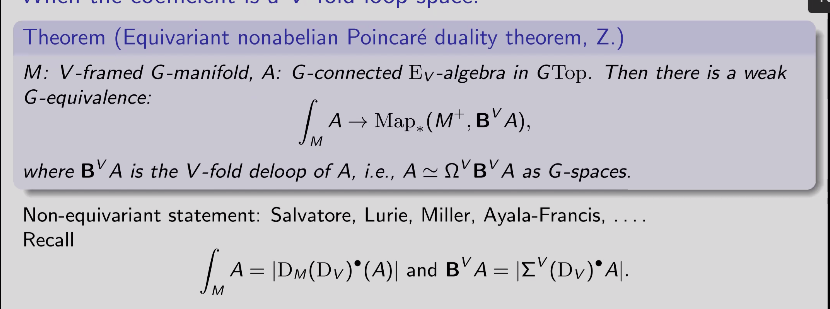
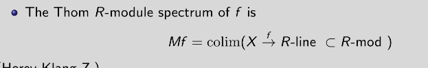
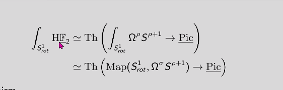

Error on 1

{ ["2"] = exit,["3"] = 1,} 
\documentclass{standalone}
\input{/home/zack/.pandoc/custom/preamble_common}
\begin{document}
\nopagecolor
\begin{tikzcd}
    R && {V\otimes V {}^{ \vee }} && {V\otimes V {}^{ \vee }} && R \\
    1 && {\sum e_i \otimes e_i {}^{ \vee }} && {v\otimes\alpha} && {\alpha(v)}
    \arrow[from=1-1, to=1-3]
    \arrow["{\phi\otimes 1}", from=1-3, to=1-5]
    \arrow["\operatorname{ev}", from=1-5, to=1-7]
    \arrow[from=2-1, to=2-3]
    \arrow[from=2-3, to=2-5]
    \arrow[from=2-5, to=2-7]
\end{tikzcd}
\end{document}
Error on 1

{ ["2"] = exit,["3"] = 1,} 
\documentclass{standalone}
\input{/home/zack/.pandoc/custom/preamble_common}
\begin{document}
\nopagecolor
\begin{tikzcd}
    A && {A\otimes B \otimes A} && A \\
    \\
    B && {B\otimes A \otimes B} && B
    \arrow["{m\otimes 1}", from=1-1, to=1-3]
    \arrow["{1\otimes{\varepsilon}}", from=1-3, to=1-5]
    \arrow["\operatorname{id}"', curve={height=-30pt}, from=1-1, to=1-5]
    \arrow["{1\otimes m}"', from=3-1, to=3-3]
    \arrow["{{\varepsilon}\otimes 1}"', from=3-3, to=3-5]
    \arrow[curve={height=30pt}, from=3-1, to=3-5]
\end{tikzcd}
\end{document}
Error on 1

{ ["2"] = exit,["3"] = 1,} 
\documentclass{standalone}
\input{/home/zack/.pandoc/custom/preamble_common}
\begin{document}
\nopagecolor
\begin{tikzcd}
    1 && {A\otimes{\mathbb{D}}A} && {A\otimes{\mathbb{D}}A} && {{\mathbb{D}}A \otimes A} && 1
    \arrow["{\varepsilon}", from=1-7, to=1-9]
    \arrow["{\tau \quad \sim}", from=1-5, to=1-7]
    \arrow["{\phi \otimes 1}", from=1-3, to=1-5]
    \arrow["m", from=1-1, to=1-3]
    \arrow["{\operatorname{Tr}(\phi)}"', curve={height=30pt}, from=1-1, to=1-9]
\end{tikzcd}
\end{document}
-   [2021-05-10](#section)
    -   [12:34](#section-1)
    -   [13:16](#section-2)
    -   [16:35](#section-3)

2021-05-10
==========

12:34
-----

We haven't been able to classify the rational points on \[\[modular curves\]\]!

13:16
-----

> Reference: Kirsten Wickelgren, Colloquium Presentation: zeta functions and a quadratic enrichment. <https://www.pitt.edu/~caw203/DioGal2021.html>

See \[\[../motivic homotopy\]\].

-   Dualizability?

`
 
`{=html}

> <https://q.uiver.app/?q=WzAsOCxbMCwwLCJSIl0sWzIsMCwiVlxcdGVuc29yIFZcXGR1YWwiXSxbNCwwLCJWXFx0ZW5zb3IgVlxcZHVhbCJdLFs2LDAsIlIiXSxbMCwxLCIxIl0sWzIsMSwiXFxzdW0gZV9pIFxcdGVuc29yIGVfaVxcZHVhbCJdLFs0LDEsInZcXHRlbnNvciBcXGFscGhhIl0sWzYsMSwiXFxhbHBoYSh2KSJdLFswLDFdLFsxLDIsIlxccGhpXFx0ZW5zb3IgMSJdLFsyLDMsIlxcZXYiXSxbNCw1XSxbNSw2XSxbNiw3XV0=>

-   Works in a symmetric monoidal category.
-   Finite dimensionality is replaced by objects being \[\[../dualizable\]\], so for `
    
    \begin{align*}
    \one & \xrightarrow{m} A\otimes B \\
    B\otimes A & \xrightarrow{{\varepsilon}} \one
    ,\end{align*}
    `{=html} require

`
 
`{=html}

> <https://q.uiver.app/?q=WzAsNixbMCwwLCJBIl0sWzIsMCwiQVxcdGVuc29yIEIgXFx0ZW5zb3IgQSJdLFs0LDAsIkEiXSxbMCwyLCJCIl0sWzIsMiwiQlxcdGVuc29yIEEgXFx0ZW5zb3IgQiJdLFs0LDIsIkIiXSxbMCwxLCJtXFx0ZW5zb3IgMSJdLFsxLDIsIjFcXHRlbnNvciBcXGVwcyJdLFswLDIsIlxcaWQiLDIseyJjdXJ2ZSI6LTV9XSxbMyw0LCIxXFx0ZW5zb3IgbSIsMl0sWzQsNSwiXFxlcHMgXFx0ZW5zb3IgMSIsMl0sWzMsNSwiIiwwLHsiY3VydmUiOjV9XV0=>

-   See \[\[Atiyah duality\]\]: define the dual of $M$ as $M^{-{\mathbf{T}}M}$, the \[\[../Thom space\]\] of (minus) the tangent bundle.

-   Define the trace:

`
 
`{=html}

> <https://q.uiver.app/?q=WzAsNSxbMCwwLCIxIl0sWzIsMCwiQVxcdGVuc29yIFxcREQgQSJdLFs0LDAsIkFcXHRlbnNvciBcXEREIEEiXSxbNiwwLCJcXEREIEEgXFx0ZW5zb3IgQSJdLFs4LDAsIjEiXSxbMyw0LCJcXGVwcyJdLFsyLDMsIlxcdGF1IFxccXVhZCBcXHNpbSJdLFsxLDIsIlxccGhpIFxcdGVuc29yIDEiXSxbMCwxLCJtIl0sWzAsNCwiXFxUcihcXHBoaSkiLDIseyJjdXJ2ZSI6NX1dXQ==>

-   Then $\operatorname{Tr}(\phi) \in \mathop{\mathrm{End}}_{\mathsf{C}}(\one, \one)$ is an endomorphism of the unit.

-   Example: Lefschetz fixed point theorem, `
    
    \begin{align*}
    \operatorname{Tr}(\phi) = \sum_{x\in M, \phi(x) = x} \mathop{\mathrm{ind}}_x \phi \in \mathop{\mathrm{End}}_{{\mathsf{ho}}{\mathsf{Sp}}}(\one) \xrightarrow{\deg \,\, \sim} {\mathbb{Z}}
    ,\end{align*}
    `{=html} where we take the degree of a map between spheres.

    -   ${\mathbb{S}}= \one \in {\mathsf{ho}}{\mathsf{Sp}}$.

    -   Use that $H^*({-}, {\mathbb{Q}})$ preserves tensor products, and apply the Kunneth formula: `
        
        \begin{align*}
        H^*(\operatorname{Tr}(\phi)) &= \operatorname{Tr}(H^*(\phi)) \\
        \implies 
        \sum (-1)^i \operatorname{Tr}( H^i(\phi); H^i(M) {\circlearrowleft})
        &= \sum_{x\in M, \phi(x) = x} \mathop{\mathrm{ind}}_x \varphi
        .\end{align*}
        `{=html}

-   Rationality of $\zeta$:

-   Use hocolims to glue spaces, but may not work in schemes.

    -   Example: take $X \coloneqq{\mathbb{P}}^n/{\mathbb{P}}^{n-1}$, then we'd want $X({\mathbb{C}}) \cong S^{2n}$ and $X({\mathbb{R}}) \cong S^n$

    -   Problem: this quotient isn't a \[\[../scheme\]\]. Can freely add these limits.

    -   We want ${\mathbb{P}}^i / {\mathbb{P}}^{i-1}$ to be the building blocks or cells

-   Morel and Voevodsky, ${\mathbb{A}}^1$ \[\[stable homotopy category\]\] over $k$, denoted ${\mathsf{SH}}(k)$.

-   Take an analog of degree, the Morel degree: `
    
    \begin{align*}
    \deg: [{\mathbb{P}}^n/{\mathbb{P}}^{n-1}, {\mathbb{P}}^n/{\mathbb{P}}^{n-1} ] \xrightarrow{} {\operatorname{GW}}(k)
    .\end{align*}
    `{=html}

    -   Recovers degree on $X({\mathbb{C}})$.

-   \[\[../Grothendieck-Witt\]\] group: formal differences of isomorphism classes of nondegenerate symmetric bilinear forms.

    -   Allow orthogonal direct sum and orthogonal direct *difference*.

-   Special form: the hyperbolic form `
    
    \begin{align*}
    \left\langle{1}\right\rangle + \left\langle{-1}\right\rangle = \left\langle{a}\right\rangle + \left\langle{-a}\right\rangle = 
    \begin{bmatrix}
    0 & 1 
    \\
    1 & 0
    \end{bmatrix}
    .\end{align*}
    `{=html}

-   See \[\[rank\]\], \[\[../signature\]\], \[\[discriminant\]\] of forms.

-   Trace here will take values in ${\operatorname{GW}}(k)$.

-   Lefschetz fixed point theorem due to Hoyois:

-   Notation: $dZ^{{\mathbb{A}}^1}(t) = {\frac{\partial }{\partial t}\,} \log \zeta^{{\mathbb{A}}^1}(t) = \sum_{m\geq 1} \operatorname{Tr}(\phi^m)t^{m-1}$.

-   Prop: `
    
    \begin{align*}
    \operatorname{rank}dZ^{{\mathbb{A}}^1}(t) = {\frac{\partial }{\partial t}\,} \log 
    .\end{align*}
    `{=html}

-   See Kapranov motivic zeta functions:

    -   Define $K_0({\mathsf{Var}}_k)$ to be the group completion of varieties under cut-and-paste
    -   Define `
        
        \begin{align*}
        Z_X^m(t) \coloneqq\sum_{m\geq 0} [\operatorname{Sym}^m X] t^m \in {\mathsf{K}}_0 ({\mathsf{Var}}_k) {\left[\left[ t \right]\right]  }
        .\end{align*}
        `{=html}
    -   Define an \[\[Euler characteristic\]\] `
        
        \begin{align*}
        \chi_C^{{\mathbb{A}}^1}: K_0({\mathsf{Var}}_k) \to {\operatorname{GW}}(k)
        .\end{align*}
        `{=html}

-   See \[\[Unsorted/Euler class\]\], \[\[Hopf map\]\]

-   Major point: this is genuinely something new, isn't just recovered by taking the compactly supported euler characteristic:

-   Defines a zeta function for any endomorphism of any variety. Doesn't need to be over ${\mathbb{F}}_p$, and doesn't need to have Frobenius!

16:35
-----

> Reference: Foling Zou, Nonabelian Poincare duality theorem and equivariant factorization homology of Thom spectra. MIT Topology Seminar. See <https://arxiv.org/pdf/2008.08234.pdf>

-   \[\[../Factorization homology\]\] setup:

-   Goal: want to formulate \[\[monads\]\] and \[\[operads\]\] categorically.

-   See \[\[lambda sequences\]\], something like a functor ${\mathsf{FinSet}}^{\operatorname{op}}\to \mathsf{C}$?

-   See \[\[../Day convolution\]\] as an example of a monoidal product.

    -   Another example: the \[\[Kelly product\]\]: 

-   Can define operads and reduced operads as monoids in certain categories: 

-   See \[\[monadic bar construction\]\] and monoidal \[\[../bar construction\]\].

-   Examples of factorization homology: `
    
    \begin{align*}
    \int_{S^1}A &&\simeq{\operatorname{THH}}(A) \\
    \int_{T^n}A &&\simeq{\operatorname{THH}}^n(A) && \text{iterated THH}
    .\end{align*}
    `{=html}

-   For $\sigma$ the \[\[sign representation\]\], $\int_{S^\sigma} A \simeq\operatorname{THR}(A)$ for $E_\sigma{\hbox{-}}C_2$ spectra. See Horev, Hessolholt-Madsen.

-   Axiomatic approach to factorization homology: take a left \[\[../Kan extension\]\] of the following: 

    -   Can compute \[\[../bar construction\]\].

-   Theorem: \[\[../nonabelian Poincare duality\]\]: 

-   What is the \[\[virtual dimension\]\] of a bundle?

-   ${\operatorname{Pic}}$: subcategory of invertible objects. Maybe related to \[\[Unsorted/Picard group\|Picard groupoid\]\]?

-   \[\[../Thom spectrum\]\] functor:

where $R{\hbox{-}}$line is the $\infty{\hbox{-}}$category of line bundles up to equivalence?

-   Preserves $G{\hbox{-}}$colimits, so formally the Thom spectrum functor commutes with factorization homology.

-   In proof of theorem, use nonabelian Poincaré duality to reduce a complicated gadget to a mapping space.

    -   Also appears as a step in a later proof identifying ${\operatorname{THH}}_{C_2} ({ \mathsf{H} }{\mathbb{F}}_2) \approx { \mathsf{H} }{\mathbb{F}}_2 \wedge({\Omega}S^3)_+$. 

-   For $\operatorname{THR}$ on the algebra side, see Teena Gerhardt's work? Haynes Miller suggests looking at the de Rham Witt complex.
