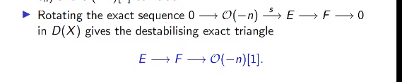

# 2021-05-18

## 13:17

> Reference: Kristen Hendricks, *Surgery formulas for involutive Heegaard Floer homology*. Stanford Topology Seminar.

- Want to study homology cobordism groups of 3-manifolds $\Theta_\ZZ^3$.
  - We don't understand the torsion in this group.
  - Reduce to study of a group of "$\iota$ complexes".
  - Theorem: it has a $\ZZ^{\infty}$ summand.

- See [[Seifert fibered spaces]].

- People like HF because there are a lot of computation tools!
  In particular, a surgery formula.

## 22:01

Check out [[ideal sheaves]], [[Birdgeland stability conditions]].

- - "Rotate" an exact sequence to get an exact triangle:
  

  - Interpretation of the triangle: $F = E \ominus \OO(-n) = E \oplus \OO(-n)[1]$.
  - Interpret $\OO(-n)[1] = -\OO(n)$.

## 22:21

