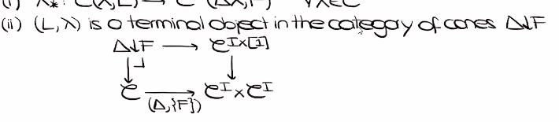
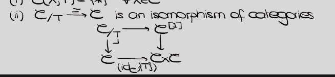
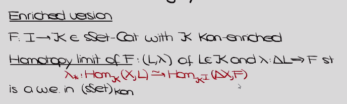
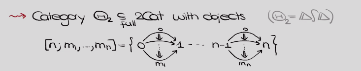
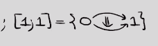
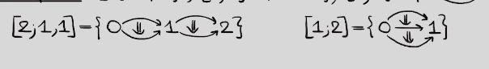

-   [2021-06-05](#section)
    -   [12:08](#section-1)
    -   [12:58](#section-2)
    -   [13:04](#section-3)

# 2021-06-05

## 12:08

> Talbot, Lyne Moser Part 1

-   ${ \underset{\infty}{ \mathsf{Cat}}  }{\infty, 2}$: discrete set of objects, enriched in categories, $2{\hbox{-}}$morphisms are strictly associative?

-   ${ \underset{\infty}{ \mathsf{Cat}}  }{\infty, n}$: all $n+k{\hbox{-}}$morphisms are invertible.

-   There is an embedding $n\mathsf{Cat}$ into $(\infty, n){\hbox{-}}\mathsf{Cat}$with a specific model structure.

-   Model structure on ${\mathsf{sSet}}$: fibrant objects are Kan complexes, there is a Quillen equivalence between ${\mathsf{Top}}$ and ${\mathsf{sSet}}$

-   ${ \underset{\infty}{ \mathsf{Cat}}  }{\infty, 1}$: enriched in $\inftygpd$

    -   Quasicategory: lifting property with lifting against inner horns online

    

    -   Joyal model structure: ${\mathsf{sSet}}$ with quasicategories as fibrant objects.
    -   Quillen equivalence to the Kan model structure by taking the homotopy coherent nerve?

-   **Exercise**: nerve is a Kan complex iff $\mathsf{C}$ is a groupoid.

-   Complete Segal space: a simplicial space $W \Delta^{\operatorname{op}}\to {\mathsf{sSet}}_{{\mathsf{Kan}}}$ with some conditions

-   ${\mathsf{sSet}}^{\Delta^{\operatorname{op}}}$ has a model structure where complete Segal spaces are the fibrant objects

-   **Exercise**: if $W$ is a complete Segal space then $i_1^* W$ is a quasicategory where $i_1: \Delta \to \Delta^{\times 2}$ sends $[n]$ to $([n], [0])$.

-   Limits: isomorphisms on hom sets, or terminal objects in the category of cones:

    

    -   Latter is more universal, only requires pullbacks and cotensors to define?

-   Terminal objects: isomorphisms from slice cats to $\mathsf{C}$:

    

-   Enriched definition of limits:

    

-   Terminal objects: $X_{/ {x}}  \xrightarrow{\sim} X$ is a weak equivalence in ${\mathsf{sSet}}_{\qcat}$.

-   All definitions of limits in ${ \underset{\infty}{ \mathsf{Cat}}  }{\infty, 1}$ recover the usual notions via the nerve.

-   **Exercise**: Show that the limit of $F: I\to \mathsf{C}$ is the limit of its nerve?

-   Theorem: limit of $F$ in ${\mathsf{sSet}}_{\qcat}$ is a homotopy limit of its adjoint in ${\mathsf{sSet}}{\hbox{-}}\mathsf{Cat}_{{\mathsf{Kan}}}$, and the limit of its adjoint in ${\mathsf{sSet}}^{\Delta^{\operatorname{op}}}_\CSS$.

-   Upshot: many different models, can move between different models.

## 12:58

Things to look up from written notes:

-   Picard bundle
-   Hasse invariant
-   Connection on a bundle
-   Frobenius lifting
-   $\lambda{\hbox{-}}$rings
-   Absolute Galois groups
-   Level, weight, and conductor of an elliptic curve
-   Local vs global class field theory
-   Theta functions

## 13:04

> Talbot, Lyne Moser Part 2

-   Next: models of ${ \underset{\infty}{ \mathsf{Cat}}  }{\infty, 2}$

    -   Can take enrichment over $\qcat$ or $\CSS$

-   Base change along functor??

-   2-categories: categories enriched in categories

-   Recall: $\CSS = {\mathsf{Fun}}(\Delta^{\operatorname{op}}, {\mathsf{sSet}})$. We have $\Delta \subseteq \mathsf{Cat}$ a full subcategory, we now want a version for $\ncat{2}$: $\Theta_2^{\operatorname{op}}$. Turns out to be wreath product $\Delta\wreath\Delta$. Idea: keep track of 2-morphisms, i.e. two-cells, can keep all of their possible compositions

      
