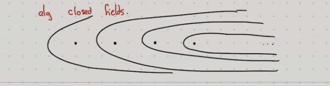
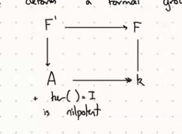
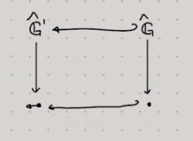
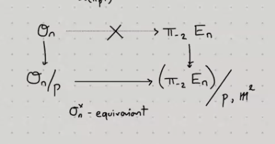

# 2021-06-06

## 12:12

- Context: the infinity category of spaces, i.e. homotopy types
- Take smooth manifolds, take the Yoneda embedding to $\Presh(\smooth\Mfd)$: these satisfy a Mayer-Vietoris gluing property, and homotopy invariance in the sense that
\[
\Hom(\wait, X) \cong \Hom(\wait \cross I, X)
.\]
  - Why the first argument: homotopy invariance *as a presheaf*

- AG setting: $\Presh(\smooth\Sch_{/k})$, send to presheaves to define **motivic spaces**.
  - Satisfies a Nisnevich gluing condition and $\AA^1$ invariance
  Similar homotopy invariance: $F(\AA^1 \cross X)\cong F(X)$.

- See Betti realization for $k=\CC$: $\smooth\Sch_{/\CC}\to \Spaces$ where $X\mapsto X(\CC)$.

- From topology: identify $\B \U_n(\CC) = \Gr_n(\CC)$ to get 
\[
\Vect_{/\CC}^{\rank = n}(U) \cong \pi_0 \Maps(U, \B \U_n(\CC))
.\]

- Problem in AG: there are two rank 2 vector bundles on $\PP^1 \cross \AA^1$ whose fibers over 0 and 1 are $\OO^2$ and $\OO(1) \oplus \OO(-1)$.

- Theorem: for $U$ smooth affine $\kSch$, there is an equivalence of rank $n$ vector bundles on $U$ mod equivalence to $\pi_0 \Maps_{\Spaces(k)}(U, \B \GL_n)$ where again $\B\GL_n \cong \Gr_n$.
  - Would like this for non-smooth non-affine schemes?

- Algebraic K theory: finitely generated projective \(R\dash\)modules mod equivalence with $\oplus$, then take group completion to get $K_0(R)$.
  - $K_0(k) \cong \NN^\gp \cong \ZZ$.
- To get a space: take $K(R) \da \Proj(\rmod)^\gp$ to get a space, set $K_i R \da \pi_i K(R)$

- Prop: the $K$ theory space here is a motivic space, $K: \smooth\Sch_{/k}\op \to \Spaces$.

- Interesting fact: $\Loop^\infty \SS \cong (\Finset, \disjoint)^\gp$.

- Note from Yuri Sulyma:
"B is (widespread but) really bad notation for geometric realization. You should think of B as part of an equivalence 
\[
\B: \ts{\text{monoidal categories}} \to \ts{\text{pointed connected (2-)categories}}
.\]
Up to the Quillen equivalence
\[
\Kan \mapsvia{\sim} \Spaces
\]
geometric realization takes a (quasi-)category (or simplicial set) and inverts all the morphisms.
So $M^\gp = \Omega\realize{\B M}$: you take $M$, deloop to turn the objects into morphisms, invert all the morphisms, then take loops to get your objects back."

- Theorem (Morel-Voevodsky): $X\in \smooth\kSch$
\[
K(X) \cong \Maps_{\Spaces(k)}(X, \ZZ \cross \Gr_\infty)
.\]

- Uses stratification of $\Gr$ by affines, thanks Schubert calculus!

- There is an $\AA^1$ homotopy equivalence on affines: $K \homotopic \ZZ \cross \Gr_\infty$.
  Also,
  \[
\Betti(k) \homotopic \ZZ \cross \BU = \Loopinf \KU
  .\]

- Theorem: Can replace $\Gr$ with $\Hilb_\infty(\AA^\infty)$.
Very singular!

- Definition: $\Hilb_d(\AA^n)(T)$ are maps $Z\injects \AA^n\cross T$ over $T$ which are finite flat of degree $d$ over $T$.
  Morally: $d\dash$tuples of points in $\AA^n$.
  - Representable! But $\Hilb_\infty$ is a colimit, thus an Ind scheme.
  - This says either the Hilbert scheme or K theory is hard.

  - In fact the theorem defines a map $\Gr_{d-1} \to \Hilb_d(\AA^\infty)$ sending a vector space to the tangent space at 0, and proves this is an $\AA^1\dash$homotopy equivalence on affines.
  - Sends subspace to thick point at zero.
    - Thick point: point with a tangent direction.

- Burt's proof worked!

- Grassmannian: parameterizes vector bundles with an embedding into $\infty$?
  - Cool fact for manifolds: $\Emb(M, \RR^\infty)$ is contractible!
  - Stacks: presheaves of groupoids?

:::{.proof title="?"}
First step in proof: forget embedding into $\AA^\infty$, send $\Vect_{d-1}$ to finite flat schemes of degree $d$ $\FFlat_d(R)$ over $\spec R$, which are stacks.

- Send $V\to R \oplus V$, a square zero extension, add trivial multiplication.
- Inverse: take an algebra $A\to A/R$ by killing the unit.
- Not an equivalence of stacks! Since $A\not\cong A/R \oplus R$, but the surprising fact is $A\to A/R \oplus R$ is $\AA^1$ homotopic to the identity on $\FFlat(R)$.
- Cook up an explicit homotopy: take the Rees algebra 
\[
\Rees(A) \da \ts{ a_0 + a_1 t + \cdots \st a_0\in R } \subseteq A[t]
.\]

  - $\Rees(A) / \gens{ t-1 }\homotopic A$
  - $\Rees(A) / \gens{ t }\homotopic R \oplus A/R$. 

:::

- Some analogs of these theorems for:
  - Hermitian K theory: 
    - Use orthogonal Grassmannian, take vector bundles with extra data of nondegenerate symmetric bilinear form.
    Need $\char k \neq 2$.
    Take Gorenstein closed subschemes, which is extra data of orientation.
- Twisted algebraic K theory (WIP)
  - Twisted with respect to an Azumaya algebra or Brauer class.

## 15:09

- Mike was thinking about computing $\tmf$ at the prime $p=3$, since for $p>3$ it breaks up as a wedge of copies $\BP \gens{ 2 }$. 
  Roughly twice as hard as computing K theory with $\ku$! (Wilson, Adams, Margalis)
- For $p=2$: an Adams spectral sequence (Mahowald, Davis-Mahowald) built out of 
\[
H^*(\tmf, \FF_2) \cong A \tensor_{A(2) } \FF_2
&&
\text{where } A(2) = \gens{ \Sq^1, \Sq^2, \Sq^4 }
\]
  - Cohomology of $H\FF_2$ is the Steenrod algebra?
  - Can compute $\Ext$, Brunner did this on a computer
- For $p=3$, heuristic: should be like $\ko$ at $p=2$ in terms of complexity.
- Also thinking about Hopkins-Miller higher real K theories.
- First Talbot: huge efforts by Norrah!!!
  - Important for Talbot to be a safe space to *not* necessarily be an expert

- Formal group laws over $R$: a power series $x +_F y \da F(x, y) \in R\powerseries{x, y}$ such that
  - $x +_F 0 = x$
  - $x +_F y = y +_F x$
  - $x+_F (y +_F z) = (x +_F y) +_F z$.

- A morphism of fgls: $f\in R\powerseries{x}$ with $f(x+_F y)= f(x) +_G f(y)$.

- The functor $R\to \FGL_{/R}$ is representable, as is the functor sending $R$ to formal group laws over $R$ along with an isomorphism $f$ such that $f'(0) = 1$.

- Theorem (Quillen): $\MU_*$ is the ring representing the first functor.
  - Milnor showed $\MU_* = \ZZ[x_1, \cdots]$.
  - How to prove representability: take representing object for power series, check what the conditions translate to.
  - $\MU_* \MU$ represents the second factor (i.e. the $\MU_*$ homology of $\MU$, given by $\pi_*(\MU \smashprod \MU))$.

- Example: if $n\in \NN$, then 
\[
[n]_F (x) = \overset{F}{\sum_{k\leq n}} x = nx + \cdots
\]
is an endomorphism of $F$.
- If $\char R = p$, then $[p]_F (x) = f(x^{p^n})$, if $f'(0) \in R\units$ then the $\height F=n$ and $f(x) = v_n x + \cdots$.
- For $R$ a field, it's a theorem that the height is a complete invariant for algebraically closed fields.
  - Having $\height \leq n$ is a closed condition, since asking for $v_{\leq n}$ to vanish is a Zariski closed condition.
- Picture of the moduli of fgls:

- How to glue: sheaf condition on opens? Extensions on closed sets?
But how do you talk about gluing an open to a closed set?
- Explained by the theory of deformations: can push not only in direction in the space, but also into the tangent space directions.
- Deformation: a ring map $A\to k$ with a nilpotent kernel:

  
  

- Here $\hat{G}$ sends a ring $R$ to the set of nilpotent elements of $R$, and $F$ gives that a group structure -- the algebraic geometry gadget corresponding to the formal group law $F$.
  - Can obtain $\hat{G}$ as a $\colim \spec k[x] / x^n$, i.e. a formal version of the group scheme whose group law is given by $F$, so if $F=x+y+xy$ then $\hat{G}$ is the formal completion of $\GG_m$ at the identity.

- Examples: 
  - $\ZZ/p^n\to \ZZ/p$
  - $\ZZ[\elts{u}{k} / \gens{ p, \elts{u}{k} }^m \to \ZZ/p$ 

- Theorem (Lubin-Tate): there is a universal deformation for $(k, F)$ given by 
\[
\Wittvectors(k)\powerseries{\elts{u}{n-1}} \da E(k, F)_0
.\]

- For $k = \FF_p$, we have $\Wittvectors(k) = \ZZpadic$, and there is an action of $\Aut(F)$ and $\Gal(k)$.

- Theorem (Goerss-Hopkins-Miller): there is a canonical functor $(k, F) \to E(k, F)$ such that
  - Even periodicity: $\pi_{2m+1} E(k, F) = 0$ and $\pi_{2m+2} E(k, F) \cong \pi_{2m} E(k, F)$
  - $\pi_0 E(k, F) = E(k, F)_0$.

- This lifts the AG problem to a problem in commutative ring spectra.

- Theorem (Devinats-Hopkin?): the map
\[
L_{K(n)} S^0 \mapsvia{\simeq} E_n^{h\GG_n}
\]
is an equivalence where 
\[
E_n &\da E(\FF_{p^n}, F_{\mathrm{Honda}})
\\
\GG_n &\da \Gal(\FF_{p^n}) \semidirect S_n \\
S_n &\da \Aut(F_{\mathrm{Honda}})
.\]

- Define Hopkins-Miller higher real K theories: for $G \subseteq S_n$ finite, $\EO_n(G) = E_n^{hG}$.

- Example: for $n=1, p=2$ we have $\EO_1(C_2) = \KO\complete{2}$, which is completely understood via the homotopy fixed point spectral sequence.

- Example: for $n=2$, we know 
\[
\EO_2(G) = L_{K(2)} \tmf
\]
or a summand thereof.

- Use Adams indexing, look at homotopy fixed point spectral sequence 
\[
H^s(G; \pi_t E_n)\abuts \pi_{t-s} \EO_n(G)
.\]

- We know a lot about the bottom row: $H^0(G; \pi_* E_n) = (\pi_* E_n)^G$, using that group cohomology is the derived functor of $G\dash$invariants.

- If $\# G$ is prime to $p$ then $H^{> 0}(G, \pi* E_n) = 0$.

- We don't know much else about anything in this spectral sequence!

- Consider 
\[
\OO_n \da \Wittvectors(\FFpn) \gens{ s } / \gens{ sa = a^{ \varphi} S }
\]
where \( \varphi \) is the Frobenius on $\FFpn$. 
  - It turns out that $\Aut_(F_{\Honda}) = \OO_n\units$
  This is the Dieudonne module for $F_\Honda$?
- Power series rings have a maximal ideal $\mfm$, so consider 
\[
\pi_{-2} E_n / \gens{ p, \mfm^2}
.\]
  There is an $\OO_n\units$ equivariant map from $\OO_n/p$ to this, and the question is how to lift:

  

- Devinats-Hopkins: up to associated graded, 
\[
\pi_* E_n \cong \Sym(\OO_n) \localize{\Delta}\complete{I}
.\]
  - Use the symmetric algebra is a free thing.
  - Warning: can't make this $S_n$ equivariant, so can't compute the whole thing using this approach.
  - "Up to associated graded" means there's a spectral sequence relating.
  - Mike thought about this a lot in grad school! 
  But wound up doing his these on the first topic about $H^*$ of $\tmf$.

- 2007 Talbot: Mike Hopkins was the faculty mentor.
  
- Theorem (Hill-Hopkins-Ravenel): there is a $G\dash$equivariant lift $\OO_n \to \pi_{-2} E_n$ for any *finite* $G$.
- Real K theories see a lot of $\pi_* \SS$.
- Theorem (Ravenel): for $p\geq 5$, some element $\beta_{p^i / p^i}$ does not survive the ANSS.
  Use a map
  \[
  S^0 &\to \EO_{p-1}^{hC_p} \\
  \beta_{p^i / p^i} &\mapsto \text{non-permanent cycles}
  .\]

- Exact same argument for Kervaire Invariant One: $p=2$ version of this argument?
