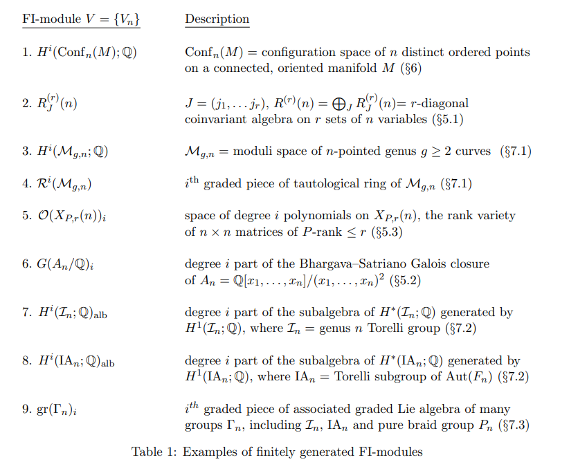

# 2021-09-12

## $\FI\dash$modules (23:45)

> Reference: [https://arxiv.org/pdf/1204.4533.pdf](https://arxiv.org/pdf/1204.4533.pdf)

- Open problem: what are the characters of representations for $S_n$ acting on certain vector spaces:
  - $H^*(\Conf_n(X))$
  - $H^*(\mg)$ and its tautological ring $R^*(\mg)$
    - Smallest subrings of Chow closed under pushforward by forgetful/gluing maps between various $\mgn$.
    Can push through the cycle class map, unknown these are isomorphic.
    Can get a surjection $\QQ[\kappa_i] \to H^*(\mgn)$ for degree high enough.

- Main result: dimensions of representation stabilize.
- Sequence of $S_n\dash$reps converted into a single $\FI\dash$module.

- $\mods{\FI} \da F\in \Fun(\FI, \mods{k})$.
  - Any $\FI\dash$module provides a linear action $\Endo_{\FI}(n) = S_n$.

- Gradings: functors from $\NN\to \mods{k}$.
