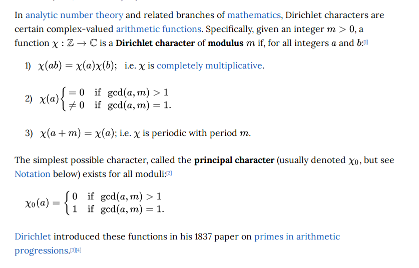
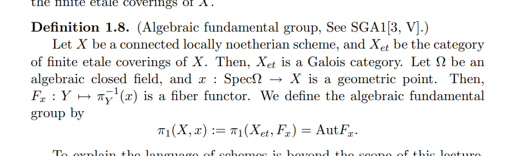

# 2021-09-14

## 14:45

Terms:

- Cartan subgroup
  - Centralizer of a maximal torus.
- Borel subgroup
  - Maximal connected solvable subgroup
  - Why care: critical to structure theory of simple reductive algebraic group.
    Uses pairs $(B, N)$ where $N = N_G(T)$ is the normalizer of a maximal torus.
- Parabolic subgroup
  - Literally any $P\leq G$ such that $B \subseteq P \subseteq G$
  - $G/P$ is a complete variety, so all projections $X\times (\wait) \to (\wait)$ are closed maps.
  - $G/B$ is the largest complete variety since $B \subseteq P$ for all $P$.
- Local field
  - Complete with respect to a topology induced by $v$ a discrete valuation with $\kappa$ finite.
- Valuation: $v: k \to G\union\ts{\infty}$, $G\in \Ab$ totally ordered.
  - Value group: $\im v$
  - Valuation ring: $R_v \da \ts{v(x) \geq 0}$
  - Prime/maximal ideal: $\mfm_v \da \ts{v(x)>0}$
  - Residue field $\kappa_v \da R_v/\mfm_v$
  - Places: $\ts{v}/\sim$ where $v_2\sim v_1 \iff v_2 = \phi \circ v_1$.
  - Uniformizer: for $R$ a DVR, a generator $\pi$ for the unique maximal ideal, so $R\units \gens{\pi} = R$ and $x\in R \implies x = u\pi^k$

- Global field: algebraic number fields, function fields of algebraic curves over finite fields (so finite extensions of $\FF_q\functionfield(t))$.
  - For a 1-dim variety: $\ff k[X]$, the fraction field of the coordinate ring.
- Note the closed point of $\spec \ZZpadic$ is $\FF_p$ and the generic point is $\QQpadic$.

- Nonarchimedean field
  - Existence of infinitesimals, i.e. for a $\ZZ\dash$module with a linear order, $x$ is infinitesimal with respect to $y$ if $nx < y$ for all $n$
  - E.g. $\RR\functionfield(x)$ or $\QQ\functionfield(x)$, $1/x$ is infinitesimal.
    Or $\QQpadic$.
  - Nonarchimedean local fields are totally disconnected.
- Proper morphism
  - Separated, finite type, universally closed (so for $X\to Y$, all projections $X\fiberprod{Y}Z\to Z)$ are closed maps).
  - For spaces: preimages of compact subspaces are compact.
  - For locally compact Hausdorff spaces: continuous and closed with compact fibers.
- Iwahori subgroup
  - Subgroup of an algebraic group over a nonarchimedean local field, analogous to a Borel.

- Fun fact: $p\dash$torsion in an ideal class group was the main obstruction to a direct proof of FLT.
  Observed by Kummer.

  - Motivates defining $K_\infty \da \colim_n L(\mu_{p^{n+1}})$, using $\Gal(K_n{}\slice K) = C_{p^n}$ so $G\da \Gal(K_\infty {}\slice K) = \ZZpadic$.
  Set $I_n = \cl(K_n)[p]$ to be the $p\dash$torsion in the ideal class group of $K_n$, form $I\da \colim_n I_n$ using norm maps to get module structure, recover info about $\cl(K)[p]$.

- Main conjecture of Iwasawa theory: two methods of defining $p\dash$adic $L\dash$functions should coincide.
  Proved by Mazur/Wiles for $\QQ$, all totally real number fields by Wiles.
  - One defining method: interpolate special values.

- Actual definition of Dirichlet characters:

- Fundamental lemma in Langlands
  - Relates orbital integrals on a reductive group over a local field, to "stable" orbital integrals on its endoscopic groups.
    - Endoscope: $H\leq G$ a quasi-split group whose Langlands dual $H\dual$ is the connected component of $C_{G\dual}(x)$ for $x\in G\dual$ some semisimple element.
  - Want to get at automorphic forms and the arithmetic of Shimura varieties
  - Some "stabilized" version of the Grothendieck-Lefschetz trace formula?

## 22:17

- Geometric fiber
- Reductive, semisimple, simply connected, etc for $G\in\Grp\Sch\slice S$: affine and smooth over $S$, where geometric fibers are reductive. s.s., etc algebraic groups.
- Etale morphisms
  - For $f \in \Mor_\Sch(X, Y)$ finite type and $X, Y$ locally Noetherian, $f$ is etale at $y\in Y$ if $f^*: \OO_{f(y)} \to \OO_y$ is flat and $\OO_{f(y)}/\mfm_{f(y)} \to \OO_{f(y)}/ f^*(\mfm_{f(y)} \OO_y)$ is a finite separable extension.
- Central extension
- Fiber functor

- Algebraic fundamental group

  

- Certain groups that become isomorphic after field extensions have related automorphic representations.
- Langlands dual: $\mcl(G)$ controls $\mods{G}$ somehow, arises as an extension $\Gal(k^s \slice k) \to \mcl(G) \to H$ where $H \in \Lie\Grp\slice \CC$.
- A connected reductive algebraic group over a separably closed field $k$ is uniquely determined by its root datum.
- Langlands dual: take root datum, dualize datum, take associated group.
- Langlands' strategy for proving local and global conjectures: Arthur-Selberg trace formula.
- Equivalence of orbital integrals can somehow be related to Springer fibers??
- Starting point for Langlands: Artin reciprocity, generalizing quadratic reciprocity.
- Chebotarev density theorem is a generalization of Dirichlet's theorem on arithmetic progressions.
- "The Langlands conjectures associate an automorphic representation of the adelic group $\GL_n(\AA\slice \QQ)$ to every $n\dash$dimensional irreducible representation of the Galois group, which is a cuspidal representation if the Galois representation is irreducible, such that the Artin $L$-function of the Galois representation is the same as the automorphic $L$-function of the automorphic representation"

- Serre's modularity conjecture: an odd, irreducible, two-dimensional Galois representation over a finite field arises from a modular form. A stronger version of this conjecture specifies the weight and level of the modular form
- $\AA\slice \QQ$: keeps track of all of the completions of $\QQ$ simultaneously.
- Reciprocity conjecture: a correspondence between automorphic representations of a reductive group and homomorphisms from a Langlands group to an $L$-group
- Geometric Langlands: relates l-adic representations of the étale fundamental group of an algebraic curve to objects of the derived category of l-adic sheaves on the moduli stack of vector bundles over the curve.
- 2018: Lafforgue established global Langlands for automorphic forms to Galois reps for connected reductive groups over global function fields
- "Purity": happens in a specific codimension

## 23:59

