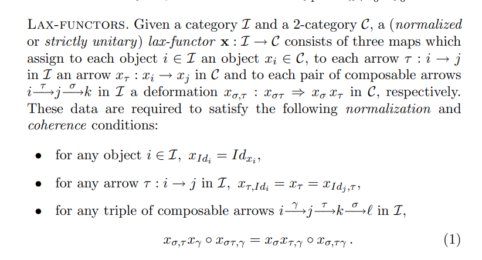

# 2021-09-16

## 20:04

- 2-Category: a category enriched in small categories, so hom sets are categories and compositions form bifunctors.
  - Arrows in $\cat C(x, y)(u\to v)$ are deformations of $u$ to $v$. 
  - 2-functors are enriched functors.
- Classifying space of a 2-cat: replace morphism cats $C(x, y)$ with $\B C(x, y)$ to get a topological 1-cat, then take $\B C \da \realize{\nerve{C}}$.
- For $F:\cat C\to \cat D$, fixing $p\in D$, can form a homotopy fiber 2-category $y//F$.
  Then $\B F: \B C\to \B D$ is a homotopy equivalence of spaces if $B(y//F) \homotopic \pt$ is contractible for all $y\in \cat D$.
- Homotopy fiber cat: $y//F$ is a lax comma category.
- Lax functors:

- Any monoidal category is a 2-category with one object.
