# 2021-10-03

- Perfect modules and complexes?
- See also [2021-10-02.md](2021-10-02.md).

## Spectra Stuff

Producing a LES:

- Take a map $A \mapsvia{f}  B$
- Extract cofibers to get $A \to B \to \hocofib(f) \to \cdots$
- Apply $[\Suspendpinf(\wait), E]_{-n}$

Integration pairing:
for $E \in \SHC(\Ring)$,
\[
E^*X &\too E_* X \\
\omega \in [\Suspendpinf X, E] &\too \alpha \in [\SS, E\smashprod X] \\ \\
\SS \mapsvia{\alpha} E \smashprod X \cong E\smashprod \SS \smashprod X &\cong E \smashprod \Suspendpinf X \mapsvia{1\smashprod \omega } E\smashpower{2} \mapsvia{\mu} E
.\]

- Cohomology operations: natural transformations $E^n(\wait)\to F^m(\wait)$.
- Classified by maps $E_n \to F_m$, i.e. $F^m(E_n)$.
- E.g. Steenrod squares $\Sq^i \in [K(C_2, n), K(C_2, n+i)]$.
- They're in fact stable, so live in $HC_2^*(HC_2)$.
- In general, algebras of stable operations for a cohomology theory $E$ are exactly $E^*(E)$.

## Categories

- Recall $\sset = [\Delta\op, \Set] = \Fun(\Delta\op, \Set) = \Set^{\Delta\op}$.

- For $x_0 \in \cat C$, a cone from $x_0$ to $F\in [J, C]$ for $J$ any diagram category is a family $\psi_x: x_0 \to F(x)$ making diagrams commute:

\begin{tikzcd}
	{x_1} && {F(x_1)} \\
	&&&& {x_0} \\
	{x_2} && {F(x_2)}
	\arrow["f"', from=1-1, to=3-1]
	\arrow[from=2-5, to=1-3]
	\arrow[from=2-5, to=3-3]
	\arrow["{F(f)}", from=1-3, to=3-3]
\end{tikzcd}

> [https://q.uiver.app/?q=WzAsNSxbMiwwLCJGKHhfMSkiXSxbMCwwLCJ4XzEiXSxbMCwyLCJ4XzIiXSxbMiwyLCJGKHhfMikiXSxbNCwxLCJ4XzAiXSxbMSwyLCJmIiwyXSxbNCwwXSxbNCwzXSxbMCwzLCJGKGYpIl1d](https://q.uiver.app/?q=WzAsNSxbMiwwLCJGKHhfMSkiXSxbMCwwLCJ4XzEiXSxbMCwyLCJ4XzIiXSxbMiwyLCJGKHhfMikiXSxbNCwxLCJ4XzAiXSxbMSwyLCJmIiwyXSxbNCwwXSxbNCwzXSxbMCwzLCJGKGYpIl1d)

- Extranatural transformations are given by a certain string calculus:

  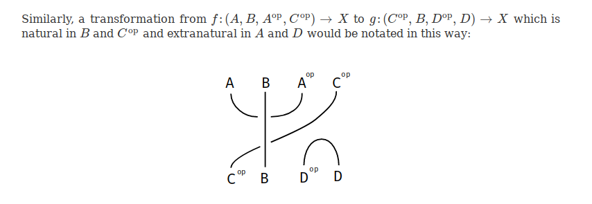

- Free cocompletion of a category: $\cat C \mapsto [\cat C, \Set ]$.

- Cauchy completeness for a category: closure under all colimits that are preserved by every functor.

- Subfunctor: $G\leq F$ iff $G(x) \subseteq F(x)$ and for all $x \mapsvia{f} y$, require $F(f)(G(x)) \subseteq G(y)$.

## Ends and Coends

[https://mathoverflow.net/questions/78471/intuition-for-coends](https://mathoverflow.net/questions/78471/intuition-for-coends)

:::{.definition title="Ends and Coends"}
Definitions:

- End of a functor $F: \cat{C}\op\times \cat{C} \to X$: an equalizer
\[
\int_{\cat C} F \da \int_{x} F(x, x) \rightarrow \prod_{x \in \cat C} F(x, x) \rightrightarrows \prod_{\cat C(x, y) } F\left(x, y\right)
.\]

- Coend: a coequalizer
\[
\int^{\cat C} F \da \int^{y} F(y, y) \leftarrow \coprod_{y \in \cat C} F(y, y) \leftleftarrows \coprod_{\cat C(x, y) } F\left(y, x \right)
.\]

:::

:::{.example title="?"}
Examples of (co)ends

- Can realize global sections:
\[
\globsec{X; \mcf} = \int_{U \in \Open(X)\op} \mcf(U)
.\]

- Can realize natural transformations as ends:
\[
\Mor_{\Fun}(F, G) = \int_c \cat{C}(F(c), G(c))
,\]
realizing them as a coherent family of morphisms.

:::

- Idea: given the singular set functor $S(\wait): \Top\to\sset$ where $S(\wait)([n]) = \Top(\Delta^n, \wait)$, construct a left adjoint $L$ (geometric realization).
This should give a bijection
\[
\Top(LX, Y) \iso \sset(X, S(Y))
,\]
where homs on the right-hand side are natural transformations.

- Do this by bending natural transformations:
\[
X([n]) \to \Top(\Delta^n, Y) \leadsto \Top(X[n] \times \Delta^n, R(X))
,\]
where for every map on the right-hand side there is a map $R(X)\to Y$ making a diagram commute.
The solution: a coend
\[
R(X) \da \int^n X([n]) \times \Delta^n
.\]

- Think of functors like modules and coends like tensor products.

- Think of ends as generalizations of limits to profunctors.

  - Need to replace cones of functors with *wedges* of profunctors.

- Alternative (co)end characterization:

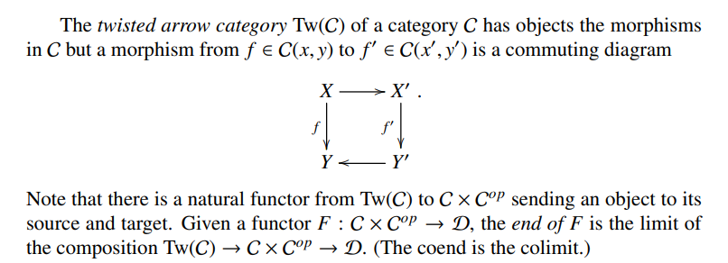

- Some spin stuff:

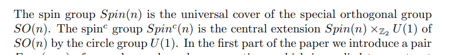

## Lie Algebras?

<https://arxiv.org/pdf/0801.3480.pdf>

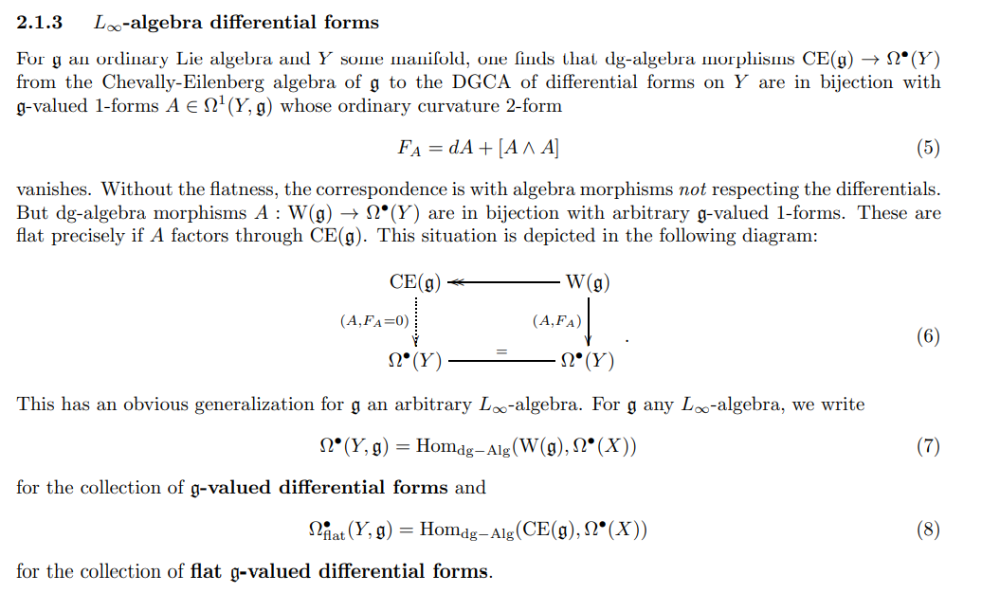

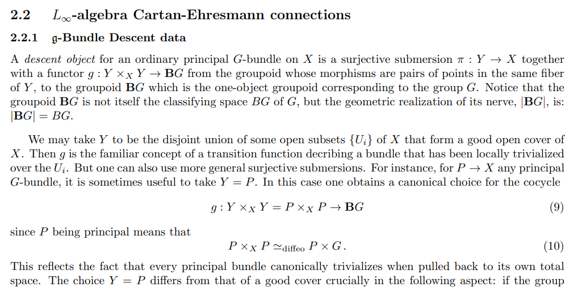

String structures on $X$: spin structures on $\Loop X$.

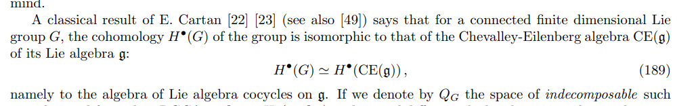

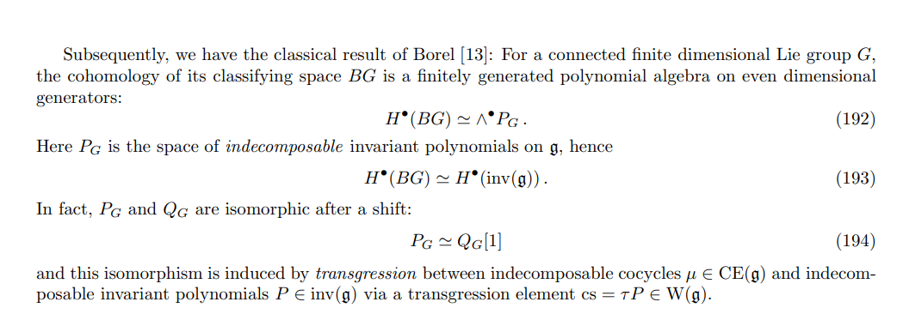

Defining algebra-valued forms when curvature doesn't vanish:

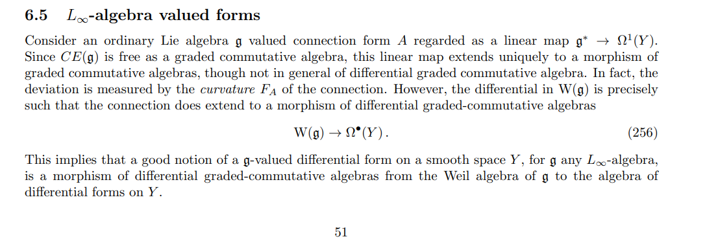

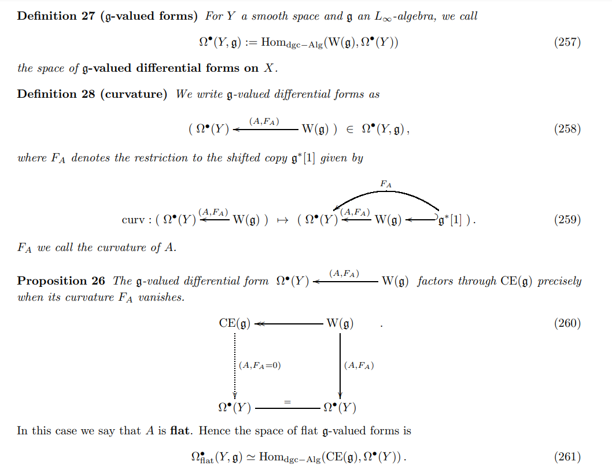

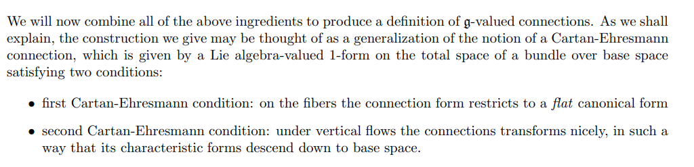

## More Lie Algebras

<https://people.math.umass.edu/~gwilliam/thesis.pdf>

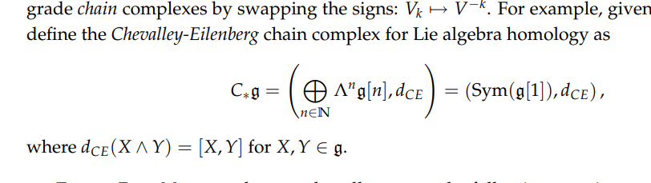

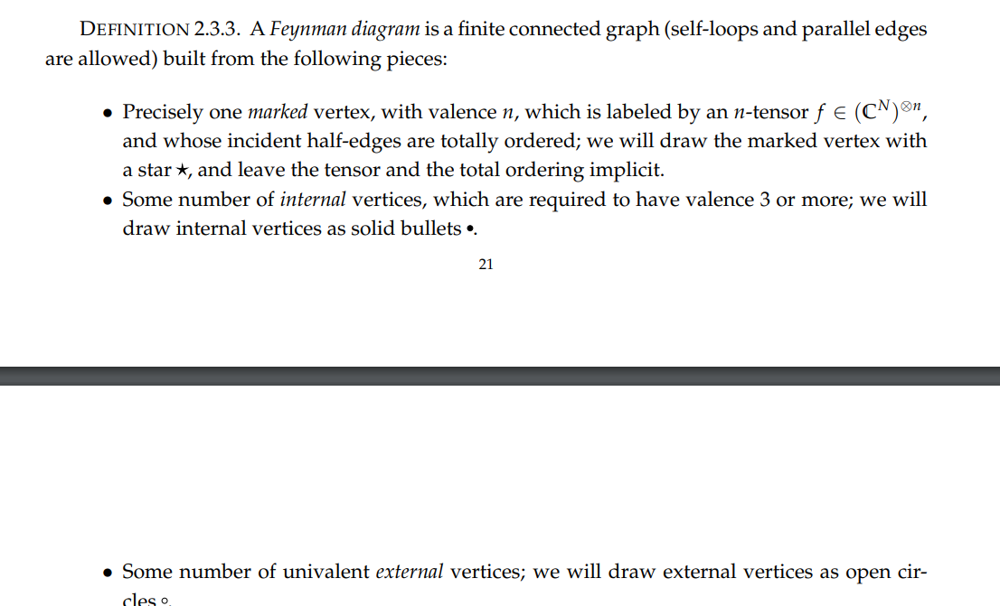

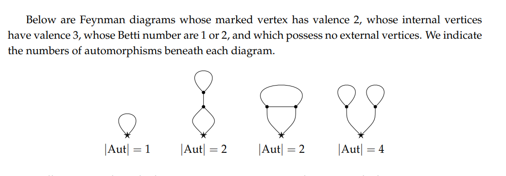

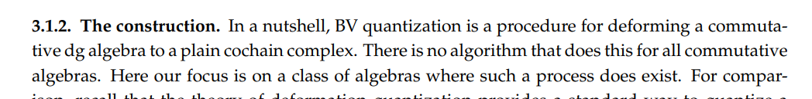

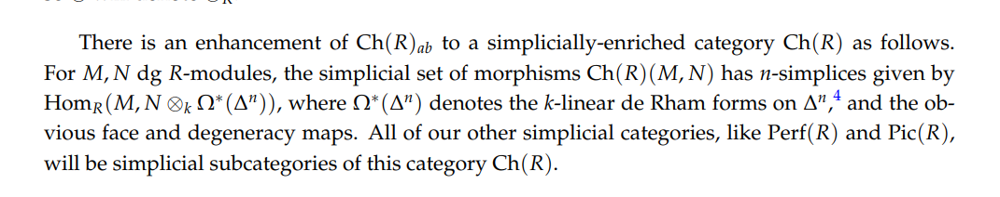

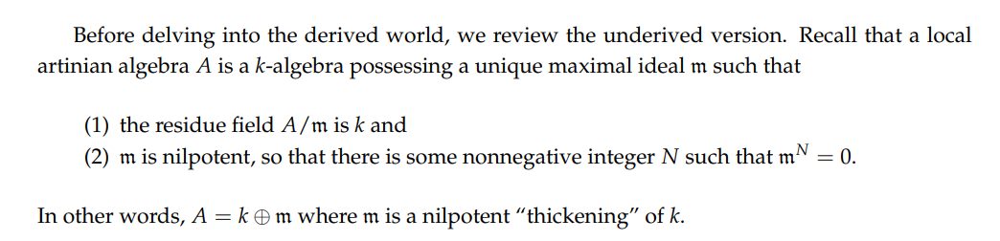

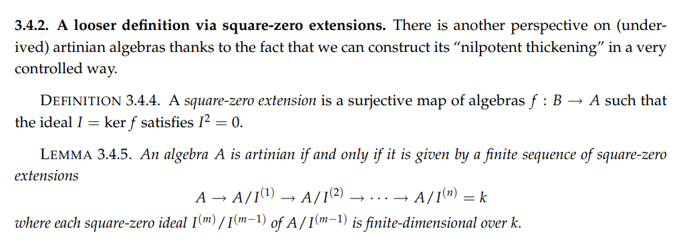

See [factorization algebra](../Factorization%20Algebra.md)

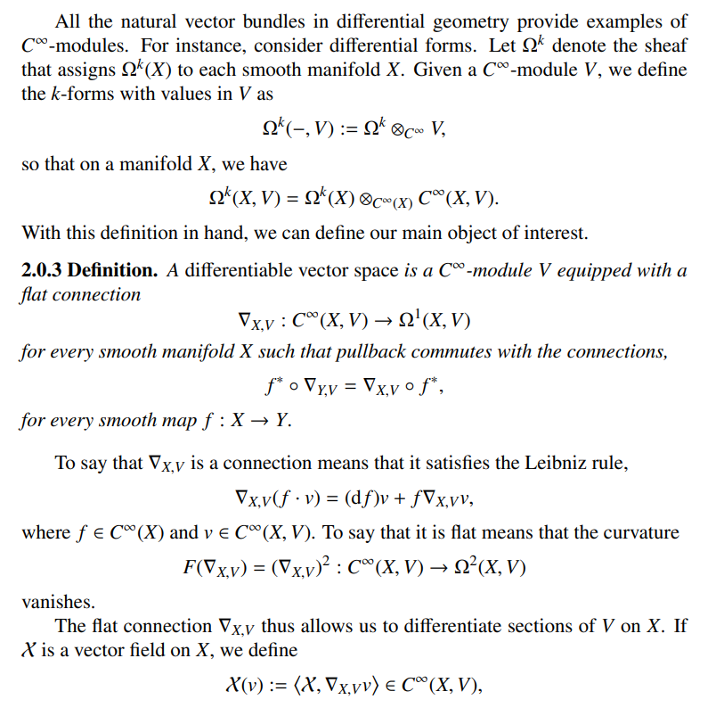

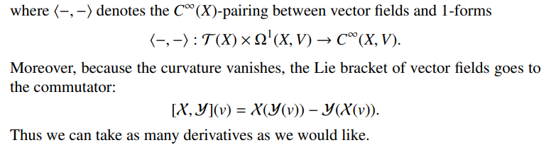

- Derived $\infty\dash$category: differential graded nerve of subcategory of fibrant objects.
  Always a stable $\infty\dash$category, and localizes at weak equivalences.

- Alternatively: take subcategory of fibrant objects, observe enrichment over chain complexes, apply Dold-Kan to get a simplicial enrichment, then take the homotopy coherent (or simplicial) nerve.

- Getting a chain complex from a simplicial set: take free \(\ZZ\dash\)modules levelwise, then apply Dold-Kan.

- How (I think?) Postnikov and Whitehead towers are related:

\begin{tikzcd}
	{\lim_n X_n \cong \pt} && X && {\lim_n X_n \cong X} \\
	\vdots && \vdots && \vdots \\
	{X^2 = \hofib(f_2)} && X && {X_2 = \tau_{\leq 2} X} \\
	{X^1 = \hofib(f_1)} && X && {X_1 = \tau_{\leq 1} X} \\
	{X^0 = \hofib(0)} && X && {X_0 = \pt}
	\arrow["{f_2}", from=3-3, to=3-5]
	\arrow["{f_1}", from=4-3, to=4-5]
	\arrow["0", from=5-3, to=5-5]
	\arrow[from=5-1, to=5-3]
	\arrow[Rightarrow, no head, from=5-3, to=4-3]
	\arrow[Rightarrow, from=4-3, to=3-3]
	\arrow[from=4-1, to=4-3]
	\arrow[from=3-1, to=3-3]
	\arrow["\cong", from=1-3, to=1-5]
	\arrow[from=1-1, to=1-3]
\end{tikzcd}

> [https://q.uiver.app/?q=WzAsMTUsWzIsNCwiWCJdLFs0LDQsIlhfMCA9IFxccHQiXSxbMCw0LCJYXjAgPSBcXGhvZmliKDApIl0sWzQsMywiWF8xID0gXFx0YXVfe1xcbGVxIDF9IFgiXSxbMiwzLCJYIl0sWzIsMiwiWCJdLFs0LDIsIlhfMiA9IFxcdGF1X3tcXGxlcSAyfSBYIl0sWzAsMywiWF4xID0gXFxob2ZpYihmXzEpIl0sWzAsMiwiWF4yID0gXFxob2ZpYihmXzIpIl0sWzAsMSwiXFx2ZG90cyJdLFsyLDEsIlxcdmRvdHMiXSxbNCwxLCJcXHZkb3RzIl0sWzQsMCwiXFxsaW1fbiBYX24gXFxjb25nIFgiXSxbMCwwLCJcXGxpbV9uIFhfbiBcXGNvbmcgXFxwdCJdLFsyLDAsIlgiXSxbNSw2LCJmXzIiXSxbNCwzLCJmXzEiXSxbMCwxLCIwIl0sWzIsMF0sWzAsNCwiIiwwLHsibGV2ZWwiOjIsInN0eWxlIjp7ImhlYWQiOnsibmFtZSI6Im5vbmUifX19XSxbNCw1LCIiLDAseyJsZXZlbCI6Mn1dLFs3LDRdLFs4LDVdLFsxNCwxMiwiXFxjb25nIl0sWzEzLDE0XV0=](https://q.uiver.app/?q=WzAsMTUsWzIsNCwiWCJdLFs0LDQsIlhfMCA9IFxccHQiXSxbMCw0LCJYXjAgPSBcXGhvZmliKDApIl0sWzQsMywiWF8xID0gXFx0YXVfe1xcbGVxIDF9IFgiXSxbMiwzLCJYIl0sWzIsMiwiWCJdLFs0LDIsIlhfMiA9IFxcdGF1X3tcXGxlcSAyfSBYIl0sWzAsMywiWF4xID0gXFxob2ZpYihmXzEpIl0sWzAsMiwiWF4yID0gXFxob2ZpYihmXzIpIl0sWzAsMSwiXFx2ZG90cyJdLFsyLDEsIlxcdmRvdHMiXSxbNCwxLCJcXHZkb3RzIl0sWzQsMCwiXFxsaW1fbiBYX24gXFxjb25nIFgiXSxbMCwwLCJcXGxpbV9uIFhfbiBcXGNvbmcgXFxwdCJdLFsyLDAsIlgiXSxbNSw2LCJmXzIiXSxbNCwzLCJmXzEiXSxbMCwxLCIwIl0sWzIsMF0sWzAsNCwiIiwwLHsibGV2ZWwiOjIsInN0eWxlIjp7ImhlYWQiOnsibmFtZSI6Im5vbmUifX19XSxbNCw1LCIiLDAseyJsZXZlbCI6Mn1dLFs3LDRdLFs4LDVdLFsxNCwxMiwiXFxjb25nIl0sWzEzLDE0XV0=)

- Defining factorization algebras:

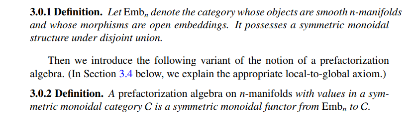

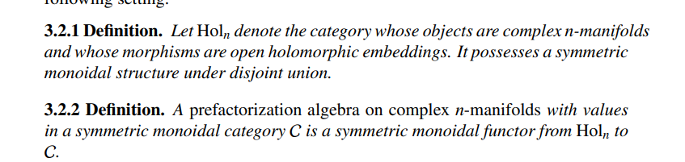
