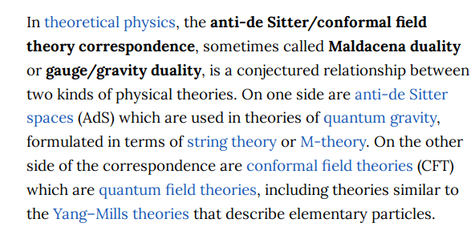

-   [2021-10-04](#section)
    -   [01:02](#section-1)
    -   [11:34](#section-2)

# 2021-10-04

## 01:02

-   <https://www.wikiwand.com/en/Vector-valued_differential_form>

-   <https://www.wikiwand.com/en/Lie_algebra-valued_differential_form>

-   <https://www.wikiwand.com/en/Adjoint_bundle>

-   Siegel modular forms arise as vector-valued differential forms on Siegel modular varieties? See the following paper for leads: <https://arxiv.org/abs/math/0605346>

## 11:34
