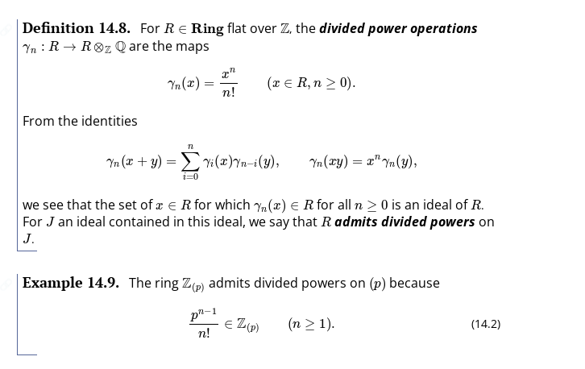
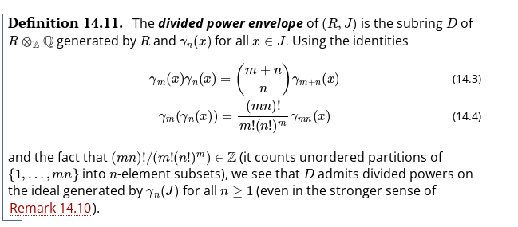
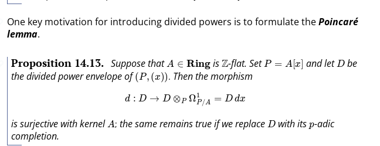
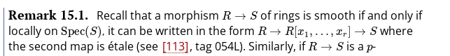
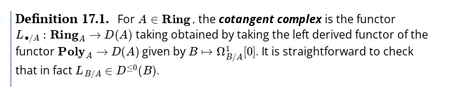
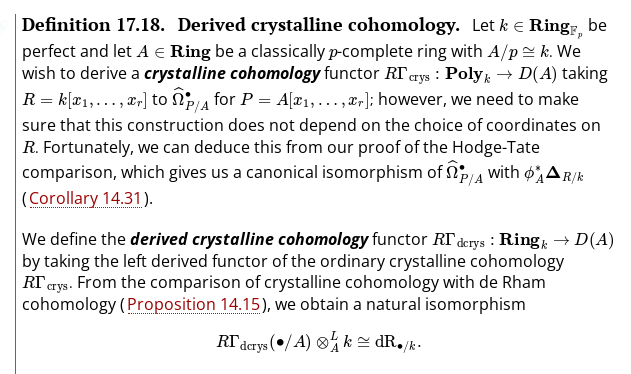
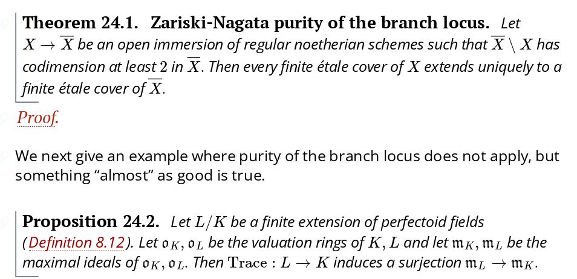
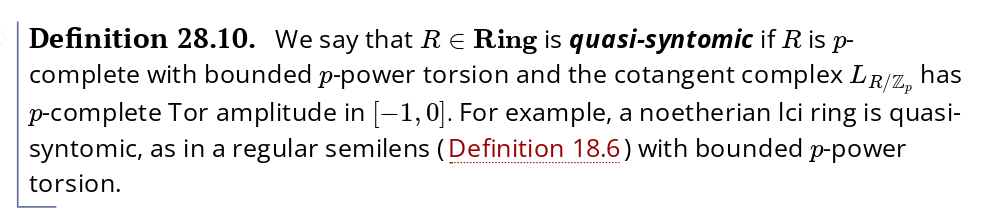

# 2021-10-09

## 15:22

> Reference: <https://kskedlaya.org/prismatic/sec_delta-rings.html>

Here $\Ring\slice{A} \da \Arrow(A)$ for $A\in \Ring$ is the arrow category of $A$.

- Frobenius lift
  - Needed to formalize a theory of "differentiating with respect to a prime number".
- $\delta\dash$rings: usual rings equipped with a $p\dash$derivation.
  Then a map $\phi:A\to A$ where $\phi(x) = x^p + p \delta(x)$ with $\delta \in \Der_p(A, A)$ induces $\Frob: A/pA \to A/pA$, hence *lifts* the Frobenius.

- Truncated Witt vectors: play the role of $k[\eps]/\gens{\eps^2}$.

- Taking the free $\delta\dash$ring is non-Noetherian -- similar to what happens for *difference algebras*.

- For $A\in\Ring^{\perf}$, $W(A)$ is $p\dash$torsionfree, $p\dash$adically complete, and $W(a)/p \cong A$.
  - $W(\FF_p) \cong \ZZpadic$ and for $\FF_q/\FF_p$ a finite extension, $W(\FF_q) = \ZZpadic[\zeta_{q-1}]$.
  - If $S$ is $p\dash$adically complete, any morphism $R \cong W(R)/p \to S/p$ lifts to a ring morphism $W(R) \to S$.

- The inclusions $\Ring_{\char = p}^{\perf} \embeds \Ring_{\char = p}$ admits adjoints: the left adjoint $A\mapsto \colim_{\phi} A$, the *coperfection*, and $A\mapsto \cocolim_{\phi} A$, the *perfection*.
  - Example: $\FF_p[x]$ perfects to $\FF_p$ and coperfects to $\FF_p[x^{p^{-\infty}}]$ (whatever this means!)
  
- Prism: a pair $(A, I)$ with $A\in\deltaring$ and $I\normal A$ where $I\in \mods{A}$ is invertible, $A$ is derived $(p, I)\dash$complete as an $A\dash$module, and some other conditions.
  These form a category where morphisms are $f(R, I) \to (S, J)$ with $f(I) \subseteq J$.

- Why care about *derived* completion: 
  - $I\dash$complete modules don't form an abelian subcategory of $\mods{A}$ (one can quotient $A$ by a principal ideal and get a non-complete module)
    - Note: even taking derived $I\dash$complete modules won't form a Grothendieck abelian category, since filtered colims won't be exact.
    But it will be closed under countably filtered colims, so the failure of completeness can be witnessed by only countably many module elements.
  - $M\to \lim_n M/I^nM$ isn't right or left exact, even when $M$ is finitely presented
  - The subcategory of flat $A\dash$modules/algebras aren't closed under classical completions.
- What actually is derived $I\dash$completeness? Homological vanishing: $M$ is derived $I\dash$complete iff for all $f\in I$, $\mods{A}(A\localize{f}, M), \Ext_A^1(A\localize{f}, M) = 0$.

- General nonsense: look for left adjoints to inclusions to define stuff for free.

- Embedding $\mods{A}\to \Ch{\mods{A}}$ as the degree zero part can recover $M$ by taking $H^0$.

- Should take derived completions at the level of chain complexes, since e.g. for $M \da \QQ/\ZZ \in \mods{\ZZ}$ and $I\da \gens{p}$ the completion of $M$ and the derived completion of $M$ in $\mods{\ZZ}$ vanishes, but is $\ZZpadic[-1]$ in complexes.

- Derived Nakayama: For $f: K\to L$ in complexes of $I\dash$complete modules, $f$ is a quasi-isomorphism iff the induced morphism $K\Ltensor_A A/I \to L\Ltensor_A A/I$ of complexes over $A/I$ modules is a quasi-isomorphism.

- For $(A, I) \in \Prism$, define $A\tilt$ as the perfection of $\bar{A}/p$ where $\bar{A} = A/I$.
  - Perfect prisms can be recovered from $\bar{A}$.

- If a sequence splits, its image under any functor is again split, regardless of exactness.

- $t\dash$structure: stands for truncation!
  A pair of endofunctors $\tau_{\geq n}, \tau_{\leq n}$, the heart is the intersection of their essential image.
  Turns a triangulated category into a derived category.

- Perfect complexes: bounded.
  Perfect modules: $M[0]$ is perfect as a complex.

- Global dimension for $A$: every $A\dash$module admits a projective resolution of length at most $n$.

- Generalizing global sections: form a functor $\Gamma\in [ \Presh(\cat{C}. \Ab), \Ab]$ where $F\mapsto \lim_{x\in \cat C} F(X)$, using a site on $\cat{C}$.
  - Can compute $\RR\Globsec{X; \wait}(F)$ for $F\in \Presh(\cat{C}, \Ab)$ by taking the Čech nerve of $X$ and applying $F$: simplicially resolve using $(\wait)\times X$ and apply $F$.

- Algebraic closures in $\Ring\slice{k}$ are *weakly final* but not final if $k$ is not separably closed.
  Here $X_{\infty}\in \cat{C}$ is final iff $\cat{A, X_{\infty}} = \ts{\pt}$ is a singleton, and weakly final iff $\cat{A, X_{\infty}} \neq \emptyset$.

- For $A\to B \in \Ring$, form the de Rham complex $B\to \Omega^{\bullet}_{B/A}$.
This satisfies a universal property: for $E^{\bullet}\in\gr\cdga^{\geq 0}\slice{A}$ and $\eta: B\to E^0 \in \Alg\slice{A}$ where $(d(\eta(x)))^2=0 \in E^1$, $\eta$ extends uniquely to $\Omega^\bullet_{B/A}\to E^\bullet\in \dga\slice{A}$.
  - Can $I\dash$complete to obtain $\hat{\Omega^1_{B/A}}$.
  - Hodge-Tate comparison: says there is an isomorphism in $\dga\slice{A}$:
  \[
  \hat{\Omega^\bullet_{B/\bar A}} \to H^\bullet( 
  \bar{\prism}_{RB/A}{\bullet} )
  ,\]
  where the LHS gets the de Rham differential and the right-hand side a "Bockstein".

- Free objects: essential image of the left adjoint of the forgetful functor to $\Set$.

- For $U, V$ simplicial objects of $\cat C$ and $f,g:U\to V$, a homotopy is a morphism $h:\U\times \Delta[1] \to V$ where $f = h \circ e_0$ and $g = h \circ e_1$, where $\Delta[n] \da \Hom_{\Delta}(\wait, [n])$.

  - Here $\Poly\slice{A} \leq \Ring\slice{A}$ is the full subcategory of polynomial rings over $A$ in finitely many variables (i.e. the free objects).

- Some properties of the cotangent complex:
  - $H^0(L_{B/A}) \cong \Omega^1_{B/A}$
  - $f: A\to B$ smooth implies $L_{B/A} \cong \Omega^1_{B/A}[0]$, and vanishes if $f$ is étale.

- Derived de Rham cohomology: for $S\in \Ring\slice{\FF_p}$, a functor
\[
\dR_{\wait/S}: \Ring\slice{S} &\to D(S) \\
,\]
given by $\RR F$ where
\[
F: \Poly\slice{S} &\to D(S) \\
R &\mapsto \Omega^\bullet_{R/S}
.\]

  - For a ring $R$: take a standard simplicial resolution $P^\bullet \to R$, form the double complex $\Omega^\bullet_{P^\bullet/k}$, and totalize.

- Generalizing filtrations and associated graded: for $M\in D(k)$, an increasing filtration is a sequence $\Fil_0 \to \Fil_1 \to \cdots$ in $D(k)$ where $\colim_i \Fil_i = M$.
  They don't have to be monos at all!
  The associated graded is $\gr_i(F^\bullet) \da \cone(\Fil_{i-1} \to \Fil_i)$.
    - For $k\in \Ring\slice{\FF_p}$ and $R\slice k$ a smooth ring, there is a canonical isomorphism $\dR_{R/k} \cong \Omega^\bullet_{R/k}$.
    This crucially relies on $k$ being characteristic $p$.
      If $R\to S$ is an étale morphism in $\Ring\slice k$, there is an isomorphism $\dR_{R/k}\Ltensor_R S \cong \dR_{S/k}$.

- Prismatic cohomology: given a perfect prism $(A, I)$, constructs a canonical coperfection of a $p\dash$complete $A/I$ algebra.

- See Hodge-Tate cohomology.

- For $R\in \Alg\slice{\FF_p}$ the perfection is $R_{\perf} = \colim(R \mapsvia{\phi} R \mapsvia{\phi} \cdots)$.

- Category of sheaves on a site: the associated topos.

- $\mu_n \in \Sh(X)$ for the flat topology is $\ker(\GG_{m, X} \mapsvia{\times n} \GG_{m, X})$.
  Tate twists: $\ZZpadic(1) = \lim_m \mu_{p^m}$, and $\ZZpadic(n) \da \ZZpadic(1)\tensorpower{\ZZpadic}{n}$.

  - There is another definition of Tate twists, which refine to a single construction on the quasisyntomic site.

- Purity and "almost" results:

- Idea for almost commutative algebra: treat "small" modules over a ring as zero, e.g. quotient by a thick subcategory.

- Important concept: *lenses*.

- Finite morphism: $R\to S$ of rings where $S$ regarded as $S\in\mods{R}$ is finitely generated.

- "Almost purity" is a highly nontrivial result.

- Every connected $X\in \Aff\Sch\slice{\FF_p}$ is a $K(\pi, 1)$ for the étale topology.

- See excellent and Cohen-Macaulay rings.
- See $q\dash$Pochhammer symbols: appear in generating functions of partitions, so Euler, Jacobi, Ramanujan, etc.

- Hypergeometric differential equations are examples of Picard-Fuchs equations, which describe variations of algebraic periods on a family of algebraic varieties.

- General program: describe $p\dash$divisible groups as objects of semilinear algebra.

- See Cartier-Witt stack.
  Actually forms a formal stack.

- Prelog structure: $(A\in \Ring, M \in \Monoid)$ a monoid morphism $M\to A$.
  Then "sheafify" to get a log structure.

- For a scheme $X$, can describe log structures locally as morphisms $X\to \AA^1/\GG_m$ (as a quotient stack).
