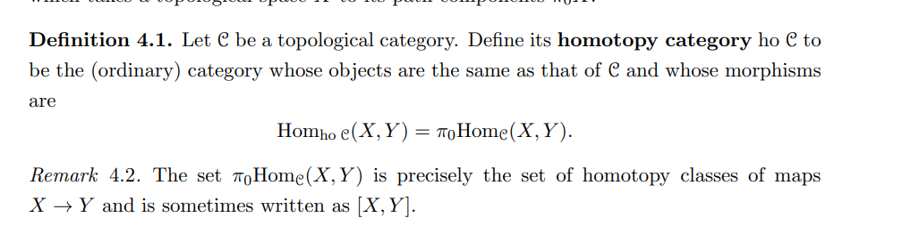

The [homotopy%20category.md): same objects, $\ho\cat{C}(x, y) := \pi_0 \cat{C}(x, y](homotopy%20category.md):%20same%20objects,%20$/ho/cat{C}(x,%20y)%20:=%20/pi_0%20/cat{C}(x,%20y)$

Define $\ho\cat C$ as the universal category equipped with a functor $\cat C \to \ho \cat C$ sending weak equivalences to isomorphisms.
Morphism
$$
\cat{C}(x, y) = \ho\cat{C}(RQx, RQy)
$$