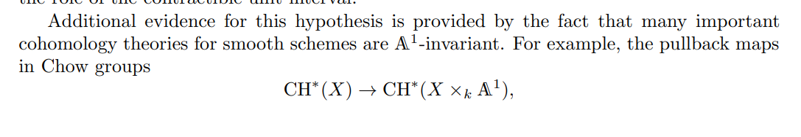
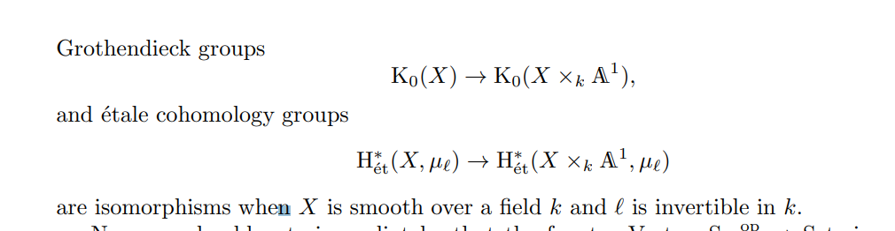

# References

- [https://arxiv.org/pdf/1605.00929.pdf](https://arxiv.org/pdf/1605.00929.pdf)
- <https://ams.org/journals/notices/202001/rnoti-p9.pdf>
- [https://etale.site/livetex/cisinski-at-motives-and-DAG.pdf](https://etale.site/livetex/cisinski-at-motives-and-DAG.pdf)

# Topics

- [mixed%20motives.md](mixed%20motives.md)
- [Nisnevich%20topology.md](Nisnevich%20topology.md)

# Motivation
- Goal: classify [affine%20scheme.md](affine%20scheme.md).

- Motives: fundamental building blocks of algebraic varieties
	- See [reciprocity%20conjecture.md](reciprocity%20conjecture.md)
	- See [Serre's%20conjecture%20on%20vector%20bundles.md](Serre's%20conjecture%20on%20vector%20bundles.md): 

- Analogy: want "stability" under crossing with "contractible" objects, e.g. $\Vect_r(X) \mapsvia{\sim} \Vect_r(X \cross I^n)$ for CW complexes.

Motivic cohomology has its roots going back to theories of algebraic cycles, including such basic topics as enumerative geometry, intersection theory and theories of adequate equivalence relations such as rational, algebraic and numerical equivalence. Algebraic _K_-theory, beginning with the study of algebraic vector bundles, is in contrast a more recent development. Through Grothendieck's introduction of the theory of Chern classes of algebraic vector bundles and his Riemann-Roch theorem, the two subjects quite quickly became closely intertwined. At the same time, Grothendieck's introduction of theories of motives of smooth projective varieties formalized the link between algebraic cycles and cohomology theories. The search for an extension of a theory of motives to understand cohomology of non-proper varieties, by Beilinson, Bloch, Deligne, Lichtenbaum and many others, eventually led to Voevodsky's development of a triangulated category of (mixed) motives in the 1990s, which made a crucial paradigm shift from cohomology to homology. Parallel to this, ideas for a corresponding homotopy theory were made precise by the work of Morel and Voevodsky, which opened the field of motivic homotopy theory. In this setting, motivic cohomology and algebraic _K_-theory (for regular schemes) become merely one of the universe of possible motivic cohomology theories represented by objects in the motivic stable homotopy category.  
  
Voevodsky used the triangulted category of motives and motivic homotopy theory in an essential way in his proof of the Milnor conjecture and his contribution to the proof of the Bloch-Kato conjecture. After these stunning successes, the field has had a remarkable further development, leading to a better understanding of the relation of algebraic _K_-theory with motivic cohomology via Voevodsky's slice tower, opening up new applications of the theory of quadratic forms through Morel's identification of the Grothendieck-Witt ring with the endomorphism ring of the motivic sphere spectrum and acquiring powerful new tools through Ayoub's construction of the Grothendieck six functor formalism for the motivic stable homotopy category. These and other technical advances have enabled computations of basic "structure constants" of motivic homotopy theory, such as the homotopy groups of motivic spheres in low degree, yielded new results on splitting of vector bundles on affine varieties, as well as giving striking applications to classical homotopy theory through motivic versions of the Adams and Adams-Novikov spectral sequences. Many new cohomology theories for algebraic varieties, such as algebraic cobordism and other flavors of cobordism, such as symplectic or special linear cobordism, have been analyzed and applied. The problem of recognizing when a space is an infinite loop space, a basic problem in classical homotopy theory, has found a remarkable solution in the motivic setting through the theory of framed cobordism.  
  
At the same time, the motivic approach has a serious, built-in limitation: it can only analyze "A1-homotopy invariant" phenomena. A generalization of motivic cohomology through the theory of higher Chow groups with modulus seeks to develop a theory that captures interesting non-A1-invariant phenomena. Parallel to this, the algebraic _K_-theory of non-regular schemes is rarely A1-homotopy invariant and theories which exploit this fact, such as topological Hochschild homology and topological cyclic homology, have seen major developments in the past few years. The _K_-theory of non-regular schemes occurs quite naturally in trying to understand the _K_-theory of regular scheme through deformation theory, which introduces nilpotent schemes in an essential way. Although the deformation theory at a finite level is difficult to capture, recent work has shown that in passing to the limit, one can acheive a quite well-behaved theory. This limit approach has also proved useful in many other settings and has led to the resolution of a number of long-standing conjectures on the _K_-theory of singular varieties.