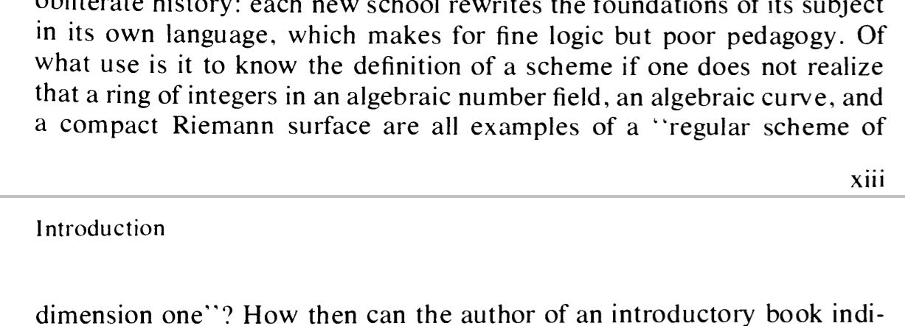

Tags: #algebraic_geometry 

# References

- Geometry of Schemes, Eisenbud and Harris
- Galois groups and Fundamental Groups, by Szamuely.
- Contemplating spec: <http://www.neverendingbooks.org/mumfords-treasure-map>

# Definitions
See [[variety]]

- A **scheme** $X\in \Sch$ is a [[affine scheme]].

# Basics From Commutative Algebra

- [[regular ring]]
- [[local ring]]
- [[Noetherian ring]]
- [[completion]]
- [[localization]]
- [[integral closure]]
- [[reduced ring]]
- [[Dedekind domain]]

# Topics

- [[smooth scheme]]
- [[finite type]]
- [[sheaf]]
- [[proper morphism]]
- [[separated]]
- Geometric points: ?
- Reduced scheme: ?
- Closed points: ?
- Regular: 
- [[geometric fiber]]
- [[group scheme]]
- [[geometrically connected scheme]]
- [[quasi-affine]]
- [[locally quasi-finite]]
- [[singular support]]
- [[characteristic cycle]]

# Notes

- Gabriel–Rosenberg reconstruction theorem: $X$ can be recovered from $\QCoh\Sh(X)$, the category of [[quasicoherent sheaf]].

- Link between [[Riemann surface]]. 
	