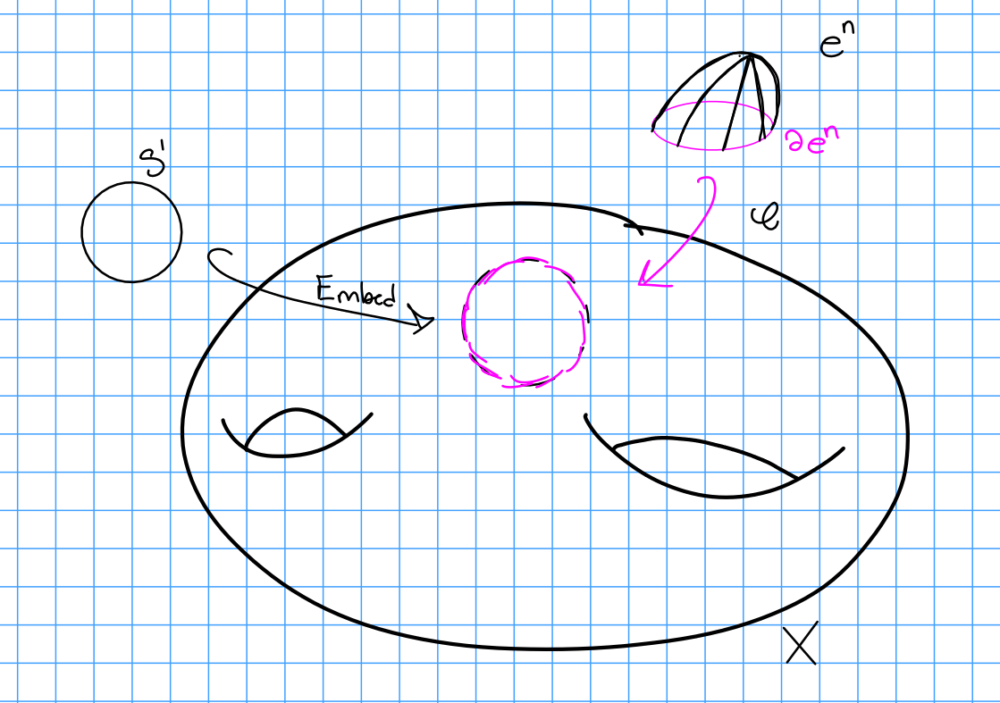
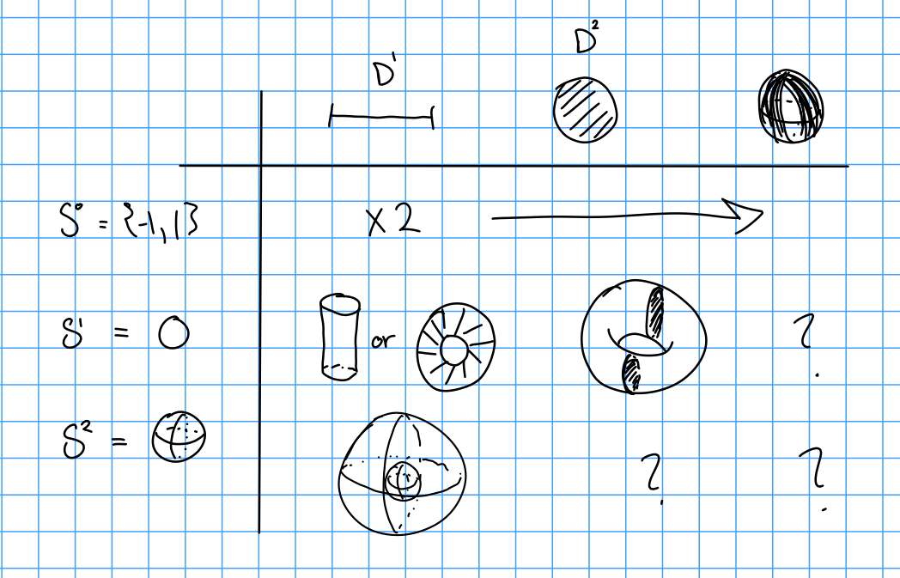
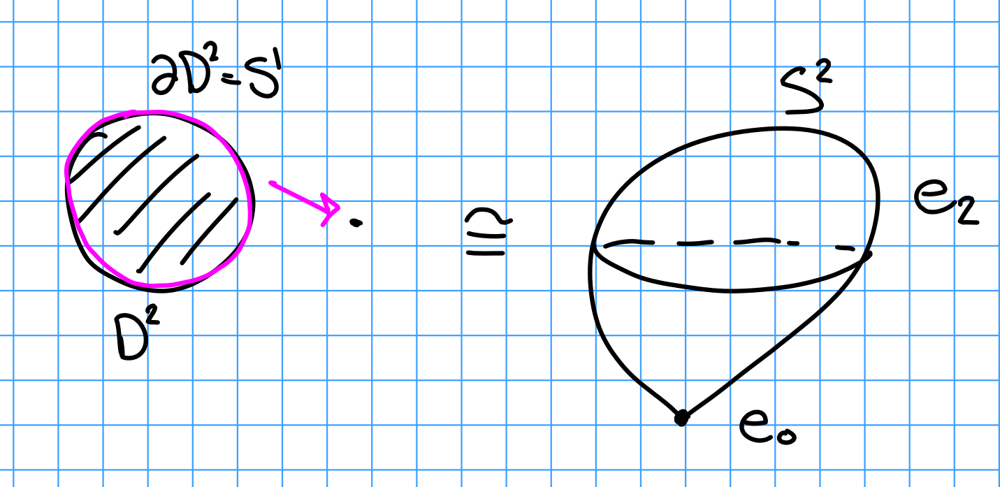

# References

- Lück's Basic introduction to surgery theory

- Recommended by Akram
	- Using surgery theory to study [[_attachments/1970128.pdf]] 
	#papers #recommendations
	- Killing homotopy smoothly: [https://www.maths.ed.ac.uk/~v1ranick/papers/milnorsurg.pdf](https://www.maths.ed.ac.uk/~v1ranick/papers/milnorsurg.pdf) 
	#papers #recommendations 

# Motivation: CW Cell Attachment

Given $X$, we can form $\tilde X = X^n \disjoint_\phi e^n$ where $e^n \cong \DD^n$ is an $n\dash$cell and $\phi: S^{n-1} \to X$ is the characteristic/attaching map.

> Remark: Why $S^{n-1}$? This just comes from the fact that $\bd e^n = \bd \DD^n = S^{n-1}$.

**Problem**:
This doesn't "see" the smooth structure, and CW complexes can have singular points, e.g. $S^2 = e^0 \disjoint e^2$.

**Solution**:
Use [[tubular neighborhood]], for each sphere, thicken with a disc of its codimension.

# Definitions

**Definition (Surgery):**
Given a manifold $M^n$ where $n=p+q$, then $p\dash$surgery on $M$, denoted $\mathcal{S}(M)$, result of cutting out $S^p \cross D^q$ and gluing back in $D^{p+1} \cross S^{q-1}$.

Let $\Gamma_{p, q} = S^p \cross D^q$, call this our "surgery cell".
As in the CW case, we want to attach this cell via an embedding of its boundary into $M$.

We can compute
$$
\bd(S^p\cross D^q) = S^p \cross S^{q-1} = \bd(\mathbf{D^{p+1} \cross S^{q-1}})
$$ 

then the above says
$$
\bd \Gamma_{p, q} = S^p \cross S^q = \bd \Gamma_{p+1, q-1}
$$

So fix any [[embedding]] 
$$\phi: \Gamma_{p, q} \to M$$

Note that this restricts to some map (abusing notation) 
$$\phi: \bd \Gamma_{p, q} \to M$$

So by the above observation, we can trade this in for a map
\begin{align*}
\phi: \bd\Gamma_{p+1, q-1} \to M
.\end{align*}

And so we can use this as an attaching map:
\begin{align*}
\mathcal{S}_p(M) \definedas M\setminus \phi(\Gamma_{p, q})^\circ \disjoint_\phi \Gamma_{p+1, q-1} 
.\end{align*}

**Definition (Handle Attachment)**
Given a manifold $(M^n, \bd M^n)$ with boundary, attaching a $p\dash$[handle) to $M$, denoted $H_p(M](handle)%20to%20$M$,%20denoted%20$H_p(M)$, is given by $p\dash$surgery on $\bd M$, i.e. 
\begin{align*}
H_p(M)^\circ    &= M \\
\bd H_p(M)      &= \mathcal{S}_k(\bd M)
.\end{align*}

Remark: we need conditions on the embedding of the [[normal bundle]] for this to work.

# Examples

**Examples of Handles :**
$S^1 \cross D^2 \cong \bar T$, a solid torus.

A useful table:

> See examples of surgery

# Results

- Every compact manifold is surgery on a [[contact structure]].