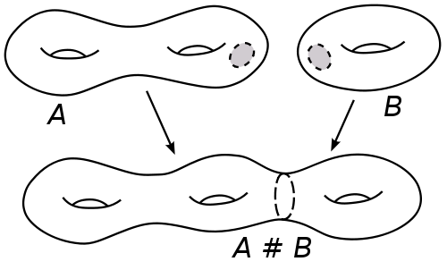

# Uniformization Theorem

The uniformization theorem says that every simply connected Riemann surface is conformally equivalent to one of the three Riemann surfaces: the open unit disk, the complex plane, or the Riemann sphere. In particular it implies that every Riemann surface admits a Riemannian metric of constant curvature.

For compact [Riemann%20surface.md](Riemann%20surface.md), 

- Those with universal cover the unit disk are precisely the hyperbolic surfaces of genus greater than 1, all with non-abelian fundamental group; 
- Those with universal cover the complex plane are the Riemann surfaces of genus 1, namely the complex tori or elliptic curves with fundamental group $\ZZ^{\ast 2}$; 
- Those with universal cover the Riemann sphere are those of genus 0, namely the Riemann sphere itself, with trivial fundamental group.

The [uniformization.md](uniformization.md) theorem is a generalization of the Riemann mapping theorem from proper simply connected open subsets of the plane to arbitrary simply connected Riemann surfaces.

Every Riemann surface is the quotient of a free, proper and holomorphic action of a discrete group on its universal covering and this universal covering is holomorphically isomorphic (one also says: "conformally equivalent" or "biholomorphic") to one of the following:

1. the Riemann sphere
2. the complex plane
3. the unit disk in the complex plane.

In 3 dimensions, there are 8 geometries, called the eight [geometrization%20conjecture](geometrization%20conjecture.md) proved by Grigori Perelman states that every 3-manifold can be cut into pieces that are geometrizable.

## Smooth Category: Uniformization

Generally expect things to split into more classes.

- Dimension 0: The point (terminal object)
- Dimension 1: $\SS^1, \RR^1$
- Dimension 2: $\gens{\SS^2, \TT^2, \RP^2 \suchthat \SS^2 = 0,\,\,3\RP^2 = \RP^2 + \TT^2 }$. 
  - Classified by $\pi_1$ (orientability and "genus"). 
    Riemann, Poincare, Klein.
  - Every surface admits a complex structure and a metric. 
    Thus always orientable.
  - Uniformization: Holomorphically equivalent to a quotient of one of three spaces/geometries:
    - $\CP^1$, positive curvature (spherical)   
    - $\CC$, zero curvature (flat, Euclidean)
    - $\HH$ (equiv. $\DD^\circ$), negative curvature (hyperbolic)
  - Stratified by genus:
    - Genus 0: Only $\CP^1$
    - Genus 1: All of the form $\CC/\Lambda$, with a distinguished point $[0]$, i.e. an elliptic curve.
      - Has a topological group structure!
    - Genus $\geq 2$: Complicated?

