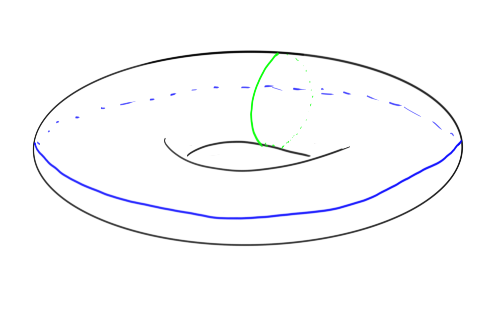
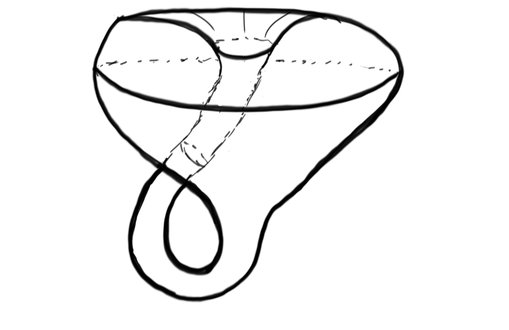

---
aliases:
- vector bundle
date: 2021-04-26
---

-   [Definitions](#definitions)
-   [Classification](#classification)
-   [Unsorted](#unsorted)

Tags: \#homotopy \#topology

Topics:

-   [[bundle.md | bundle.html]]
-   [[Chern%20class.md | Chern%20class.html]]
-   [Chern%20character](Chern%20character)
-   [Thom%20class](Thom%20class)
-   [[Thom%20space.md | Thom%20space.html]]
-   [Thom%20isomorphism](Thom%20isomorphism)
-   [Thom-Pontryagin%20construction](Thom-Pontryagin%20construction)
-   [[stable%20framing.md | stable%20framing.html]]
-   [[clutching%20function.md | clutching%20function.html]]
-   [[slope.md | slope.html]]

# Definitions

-   Notation: ${ \mathsf{Vect} }_r(X)$: isomorphism classes of rank $r$ vector bundles over $X$.

::: {.definition .proofenv title="Rank of a vector bundle"}
A **rank $n$ vector bundle** is a [[Reduction%20of%20structure%20group.md) of such a bundle is a subset of \$`\operatorname{GL}`{=tex}(n, k | Reduction%20of%20structure%20group.html]]%20of%20such%20a%20bundle%20is%20a%20subset%20of%20$/GL(n,%20k)$.
:::

> Note every rank 1 bundle is trivial: consider the [Möbius%20strip](Möbius%20strip).

::: {.remark .proofenv}
Note that a vector bundle always has one [[section%20of%20a%20bundle.md | section%20of%20a%20bundle.html]]: namely, since every fiber is a vector space, you can canonically choose the 0 element in every fiber. This yields [global section](global%20section), the [zero section](zero%20section).
:::

::: {.definition .proofenv title="Trivial bundle"}
A vector bundle $F\to E\to B$ is **trivial** if $E \cong F \times B$.
:::

See also [[framed.md | framed.html]] manifolds.

::: {.proposition .proofenv title="Trivial iff linearly independent sections"}
A rank $n$ vector bundle is trivial iff it admits $k$ linearly independent global sections.
:::

::: {.example .proofenv title="?"}
The tangent bundle of a manifold is a vector bundle. Let $M^n$ be an $n{\hbox{-}}$dimensional manifold. For any point $x\in M$, the [[tangent%20bundle.md | tangent%20bundle.html]] $T_xM$ exists, and so we can define `

\begin{align*}
TM = \coprod_{x\in M} T_xM = \left\{{(x, t) \mathrel{\Big|}x\in M, t \in T_xM}\right\}
\end{align*}
`{=html}

Then $TM$ is a manifold of dimension $2n$ and there is a corresponding fiber bundle `

\begin{align*}
{\mathbb{R}}^n \to TM \xrightarrow{\pi} M
\end{align*}
`{=html}

given by a natural projection $\pi:(x, t) \mapsto x$
:::

::: {.example .proofenv title="?"}
A circle bundle is a [[fiber%20bundle.md | fiber%20bundle.html]] in which the fiber is isomorphic to $S^1$ as a topological group. Consider circle bundles over a circle, which are of the form `

\begin{align*}
S^1 \to E \xrightarrow{\pi} S^1
\end{align*}
`{=html}

There is a trivial bundle, when $E = S^1 \times S^1 = T^2$, the torus: 

There is also a nontrivial bundle, $E = K$, the Klein bottle: 

As in the earlier example involving the [[orientable.md | orientable.html]], $T^2 \not\cong K$ and there are thus at least two distinct bundles of this type.
:::

# Classification

-   There is an equivalence of categories between [[../To%20Review/2021-04-25_vector_bundles_ug.md | ../To%20Review/2021-04-25_vector_bundles_ug.html]] and modules over continuous functionals: `
    
    \begin{align*}
    {\mathsf{Bun}}({\mathbb{R}}, X)_{{\operatorname{rank}}= n} \xrightarrow{\sim} \mathsf{{\mathsf{Top}}(X, {\mathbb{R}})}{\hbox{-}}\mathsf{Mod}^{{\mathrm{fg}}, \mathop{\mathrm{proj}}}_{{\operatorname{rank}}= n}
    .\end{align*}
    `{=html} See [projective%20modules](projective%20modules)

-   A vector bundle continuously assigns a vector space to every point of $X$.\

-   The $k{\hbox{-}}$dimensional vector bundles over $X$ are equivalent to the homotopy classes of maps from $X$ to a fixed space $[X, {\mathbf{B}}O_k]$.

    -   Dimension or rank???

-   As with many geometric problems, classification of isomorphism classes of $k{\hbox{-}}$dimensional vector bundles is reduced to the computation of homotopy classes of maps.

-   Studying ${\mathbf{B}}\O_k$ is very useful for this probkem, it comes about by a standard construction which builds a [[classifying%20space.md | classifying%20space.html]], ${\mathbf{B}}G$, for any group $G$.

-   Complex rank 1 bundles are classified by ${\mathbb{CP}}^\infty \simeq{\mathbf{B}}{\operatorname{U}}_1({\mathbb{C}}) \simeq K({\mathbb{Z}}, 2)$.

-   Universal complex vector bundle: $\xi_{n}: E_n \rightarrow {\mathbf{B}}{\operatorname{U}}_n({\mathbb{C}})$ where ${\mathbf{B}}{\operatorname{U}}_n \cong {\operatorname{Gr}}_n({\mathbb{C}}^\infty)$ is a [[Grassmannian.md | Grassmannian.html]].

Todo: clean up and make precise! \#todo Maybe add from [[../To%20Review/2021-04-25_vector_bundles_ug.md | ../To%20Review/2021-04-25_vector_bundles_ug.html]]

# Unsorted

 $.
-   ![[_attachments/Pasted%20image%2020210613122725.png]]
