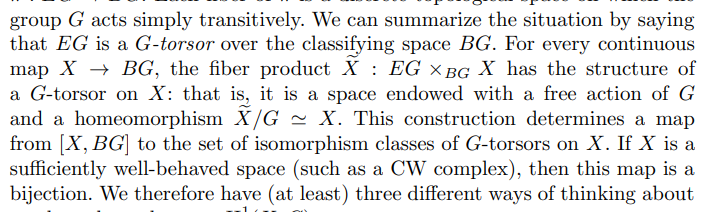

# Higher Topos Theory

[file:///home/zack/Dropbox/Library/Lurie/HTT%20%28942%29%2FHTT%20-%20Lurie.pdf](file:///home/zack/Dropbox/Library/Lurie/HTT%20%28942%29%2FHTT%20-%20Lurie.pdf)

## 2021 Oct 2

- 
- $K(G, 2)$ is a classifying space of $\BG$, which can be made a topological group.
	Then $K(G, 2) \cong E/\BG$ for some contractible space $E$.

- Each stalk equivalent to a classifying space $\BG$: gerbes.

- $n\dash$stacks of groupoids on $X$ are like sheaves of homotopy $n\dash$types on $X$.

- $(\infty, 1)\dash$cats: all $k\dash$morphisms are invertible.

- Replace $\Top(x, y)$ with $\Map(x, y)$ there the objects are maps $f:x\to y$ and morphisms are homotopies.
- Morphisms between morphisms are 2-morphisms.

- $n\dash$groupoid: every $k\dash$morphism has an inverse for $k\leq n$.
	- More generally, $(\infty, n)\dash$categories.
	- $\infty\dash$groupoids are $(\infty, 0)$ categories.

- There is an adjunction
\[
\adjunction{\realize{\wait} }{\Sing(\wait)}{\Top}{\sset}
,\]
and the counit $\realize{\Sing(X)}$ is weakly equivalent to $X$.

- 
