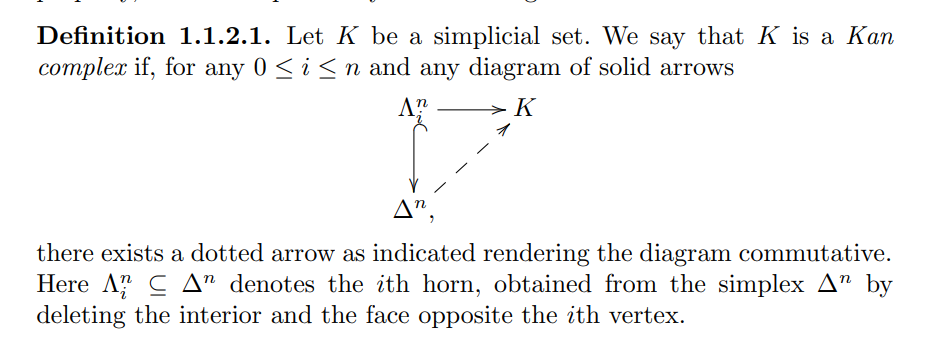

-   [Higher Topos Theory](#higher-topos-theory)
    -   [2021 Oct 2](#oct-2)

Higher Topos Theory
===================

2021 Oct 2
----------

-   ![[attachments/2021-10-03_02-44-29.png]]

-   $K(G, 2)$ is a classifying space of ${{\mathbf{B}}G}$, which can be made a topological group. Then $K(G, 2) \cong E/{{\mathbf{B}}G}$ for some contractible space $E$.

-   Each stalk equivalent to a classifying space ${{\mathbf{B}}G}$: gerbes.

-   $n{\hbox{-}}$stacks of groupoids on $X$ are like sheaves of homotopy $n{\hbox{-}}$types on $X$.

-   $(\infty, 1){\hbox{-}}$cats: all $k{\hbox{-}}$morphisms are invertible.

-   Replace ${\mathsf{Top}}(x, y)$ with $\mathop{\mathrm{Maps}}(x, y)$ there the objects are maps $f:x\to y$ and morphisms are homotopies.

-   Morphisms between morphisms are 2-morphisms.

-   $n{\hbox{-}}$groupoid: every $k{\hbox{-}}$morphism has an inverse for $k\leq n$.

    -   More generally, $(\infty, n){\hbox{-}}$categories.
    -   $\infty{\hbox{-}}$groupoids are $(\infty, 0)$ categories.

-   There is an adjunction `
    
    \begin{align*}
    \adjunction{{ {\left\lvert {{-}} \right\rvert} } }{{\operatorname{Sing}}({-})}{{\mathsf{Top}}}{{\mathsf{sSet}}}
    ,\end{align*}
    `{=html} and the counit ${ {\left\lvert {{\operatorname{Sing}}(X)} \right\rvert} }$ is weakly equivalent to $X$.

-   
